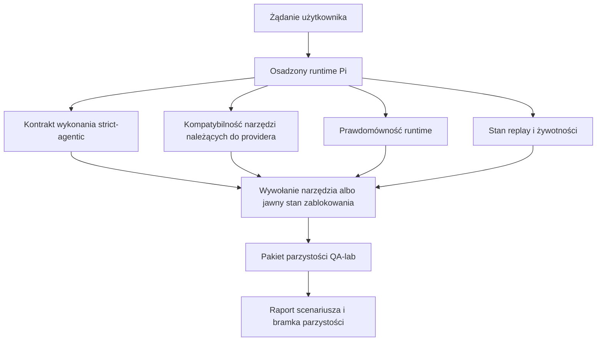
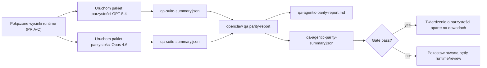

---
read_when:
    - Debugowanie zachowania agentowego GPT-5.4 lub Codex
    - Porównywanie zachowania agentowego OpenClaw między modelami frontier
    - Przegląd poprawek strict-agentic, schematu narzędzi, elevacji i replay
summary: Jak OpenClaw zamyka luki wykonywania agentowego dla modeli GPT-5.4 i w stylu Codex
title: Parzystość agentowa GPT-5.4 / Codex
x-i18n:
    generated_at: "2026-04-24T09:14:12Z"
    model: gpt-5.4
    provider: openai
    source_hash: 9f8c7dcf21583e6dbac80da9ddd75f2dc9af9b80801072ade8fa14b04258d4dc
    source_path: help/gpt54-codex-agentic-parity.md
    workflow: 15
---

# Parzystość agentowa GPT-5.4 / Codex w OpenClaw

OpenClaw już dobrze współpracował z modelami frontier używającymi narzędzi, ale modele GPT-5.4 i w stylu Codex nadal miały słabsze wyniki w kilku praktycznych aspektach:

- mogły zatrzymywać się po planowaniu zamiast wykonywać pracę
- mogły nieprawidłowo używać ścisłych schematów narzędzi OpenAI/Codex
- mogły prosić o `/elevated full`, nawet gdy pełny dostęp był niemożliwy
- mogły tracić stan długotrwałych zadań podczas replay lub compaction
- twierdzenia o parzystości względem Claude Opus 4.6 opierały się na anegdotach zamiast na powtarzalnych scenariuszach

Ten program parzystości naprawia te luki w czterech możliwych do przeglądu wycinkach.

## Co się zmieniło

### PR A: wykonanie strict-agentic

Ten wycinek dodaje opcjonalny kontrakt wykonania `strict-agentic` dla osadzonych uruchomień Pi GPT-5.

Po włączeniu OpenClaw przestaje uznawać tury zawierające tylko plan za „wystarczająco dobre” zakończenie. Jeśli model tylko opisuje, co zamierza zrobić, i faktycznie nie używa narzędzi ani nie robi postępu, OpenClaw ponawia próbę z kierowaniem act-now, a następnie kończy w trybie fail-closed z jawnym stanem zablokowania zamiast po cichu kończyć zadanie.

Najbardziej poprawia to doświadczenie GPT-5.4 przy:

- krótkich follow-upach typu „ok, zrób to”
- zadaniach programistycznych, gdzie pierwszy krok jest oczywisty
- przepływach, w których `update_plan` powinno śledzić postęp, a nie być tekstem-wypełniaczem

### PR B: prawdomówność runtime

Ten wycinek sprawia, że OpenClaw mówi prawdę o dwóch rzeczach:

- dlaczego wywołanie providera/runtime się nie powiodło
- czy `/elevated full` jest rzeczywiście dostępne

Oznacza to, że GPT-5.4 dostaje lepsze sygnały runtime dotyczące brakującego zakresu, błędów odświeżania auth, błędów auth HTML 403, problemów z proxy, błędów DNS lub timeout oraz zablokowanych trybów pełnego dostępu. Model rzadziej halucynuje niewłaściwe działania naprawcze albo nadal prosi o tryb uprawnień, którego runtime nie może zapewnić.

### PR C: poprawność wykonania

Ten wycinek poprawia dwa rodzaje poprawności:

- kompatybilność schematów narzędzi OpenAI/Codex należących do providera
- uwidacznianie replay i żywotności długich zadań

Prace nad kompatybilnością narzędzi zmniejszają tarcie schematów przy ścisłej rejestracji narzędzi OpenAI/Codex, zwłaszcza wokół narzędzi bez parametrów i ścisłych oczekiwań co do obiektu głównego. Prace nad replay/żywotnością sprawiają, że długotrwałe zadania są lepiej obserwowalne, dzięki czemu stany paused, blocked i abandoned są widoczne zamiast znikać w ogólnym tekście błędu.

### PR D: harness parzystości

Ten wycinek dodaje pierwszy pakiet parzystości QA-lab, dzięki któremu GPT-5.4 i Opus 4.6 można uruchamiać w tych samych scenariuszach i porównywać przy użyciu współdzielonych dowodów.

Pakiet parzystości jest warstwą dowodową. Sam z siebie nie zmienia zachowania runtime.

Gdy masz już dwa artefakty `qa-suite-summary.json`, wygeneruj porównanie bramki wydania przez:

```bash
pnpm openclaw qa parity-report \
  --repo-root . \
  --candidate-summary .artifacts/qa-e2e/gpt54/qa-suite-summary.json \
  --baseline-summary .artifacts/qa-e2e/opus46/qa-suite-summary.json \
  --output-dir .artifacts/qa-e2e/parity
```

To polecenie zapisuje:

- raport Markdown czytelny dla człowieka
- werdykt JSON czytelny maszynowo
- jawną bramkę wyniku `pass` / `fail`

## Dlaczego to w praktyce poprawia GPT-5.4

Przed tymi pracami GPT-5.4 w OpenClaw mogło sprawiać wrażenie mniej agentowego niż Opus w rzeczywistych sesjach programistycznych, ponieważ runtime tolerował zachowania szczególnie szkodliwe dla modeli w stylu GPT-5:

- tury zawierające wyłącznie komentarz
- tarcie schematu wokół narzędzi
- niejasny feedback o uprawnieniach
- ciche uszkodzenia replay lub compaction

Celem nie jest sprawienie, by GPT-5.4 naśladował Opus. Celem jest zapewnienie GPT-5.4 kontraktu runtime, który nagradza realny postęp, dostarcza czytelniejszą semantykę narzędzi i uprawnień oraz zamienia tryby awarii w jawne stany czytelne dla ludzi i maszyn.

To zmienia doświadczenie użytkownika z:

- „model miał dobry plan, ale się zatrzymał”

na:

- „model albo zadziałał, albo OpenClaw pokazał dokładny powód, dlaczego nie mógł”

## Przed i po dla użytkowników GPT-5.4

| Przed tym programem                                                                         | Po PR A-D                                                                               |
| ------------------------------------------------------------------------------------------- | --------------------------------------------------------------------------------------- |
| GPT-5.4 mogło zatrzymać się po sensownym planie bez wykonania następnego kroku narzędziem | PR A zamienia „tylko plan” na „działaj teraz albo pokaż stan zablokowania”             |
| Ścisłe schematy narzędzi mogły w mylący sposób odrzucać narzędzia bez parametrów albo w kształcie OpenAI/Codex | PR C sprawia, że rejestracja i wywoływanie narzędzi należących do providera są bardziej przewidywalne |
| Wskazówki `/elevated full` mogły być niejasne lub błędne w zablokowanych runtime           | PR B daje GPT-5.4 i użytkownikowi prawdziwe wskazówki runtime i uprawnień               |
| Błędy replay lub compaction mogły sprawiać wrażenie, że zadanie po cichu zniknęło         | PR C jawnie pokazuje wyniki paused, blocked, abandoned i replay-invalid                 |
| „GPT-5.4 wypada gorzej niż Opus” było głównie anegdotyczne                                 | PR D zamienia to w ten sam pakiet scenariuszy, te same metryki i twardą bramkę pass/fail |

## Architektura



## Przepływ wydania



## Pakiet scenariuszy

Pakiet parzystości pierwszej fali obecnie obejmuje pięć scenariuszy:

### `approval-turn-tool-followthrough`

Sprawdza, czy model nie zatrzymuje się na „zrobię to” po krótkim zatwierdzeniu. Powinien wykonać pierwsze konkretne działanie w tej samej turze.

### `model-switch-tool-continuity`

Sprawdza, czy praca z użyciem narzędzi pozostaje spójna na granicach przełączania modelu/runtime zamiast resetować się do komentarza albo tracić kontekst wykonania.

### `source-docs-discovery-report`

Sprawdza, czy model potrafi czytać źródła i dokumentację, syntetyzować ustalenia i kontynuować zadanie agentowo zamiast tworzyć cienkie podsumowanie i zatrzymywać się zbyt wcześnie.

### `image-understanding-attachment`

Sprawdza, czy zadania mieszane z załącznikami pozostają wykonalne i nie zapadają się w niejasną narrację.

### `compaction-retry-mutating-tool`

Sprawdza, czy zadanie z rzeczywistym mutującym zapisem zachowuje jawną niebezpieczność replay zamiast po cichu wyglądać na bezpieczne dla replay, jeśli uruchomienie przejdzie compaction, retry albo straci stan odpowiedzi pod presją.

## Macierz scenariuszy

| Scenariusz                         | Co testuje                              | Dobre zachowanie GPT-5.4                                                        | Sygnał awarii                                                                     |
| ---------------------------------- | --------------------------------------- | ------------------------------------------------------------------------------- | ---------------------------------------------------------------------------------- |
| `approval-turn-tool-followthrough` | Krótkie tury zatwierdzenia po planie    | Natychmiast rozpoczyna pierwsze konkretne działanie narzędziem zamiast powtarzać intencję | follow-up tylko z planem, brak aktywności narzędzi albo tura zablokowana bez realnej blokady |
| `model-switch-tool-continuity`     | Przełączanie runtime/model podczas użycia narzędzi | Zachowuje kontekst zadania i dalej działa spójnie                              | reset do komentarza, utrata kontekstu narzędzi albo zatrzymanie po przełączeniu   |
| `source-docs-discovery-report`     | Czytanie źródeł + synteza + działanie   | Znajduje źródła, używa narzędzi i tworzy użyteczny raport bez utknięcia         | cienkie podsumowanie, brak pracy narzędziami albo zatrzymanie w niepełnej turze    |
| `image-understanding-attachment`   | Agentowa praca sterowana załącznikiem   | Interpretuje załącznik, łączy go z narzędziami i kontynuuje zadanie             | niejasna narracja, zignorowany załącznik albo brak konkretnego następnego działania |
| `compaction-retry-mutating-tool`   | Mutująca praca pod presją compaction    | Wykonuje rzeczywisty zapis i zachowuje jawną niebezpieczność replay po skutku ubocznym | mutujący zapis występuje, ale bezpieczeństwo replay jest sugerowane, pominięte albo sprzeczne |

## Bramka wydania

GPT-5.4 można uznać za model na poziomie parzystości lub lepszy tylko wtedy, gdy połączony runtime przechodzi jednocześnie pakiet parzystości i regresje prawdomówności runtime.

Wymagane wyniki:

- brak zatrzymania po samym planie, gdy następne działanie narzędziem jest jasne
- brak fałszywego zakończenia bez rzeczywistego wykonania
- brak nieprawidłowych wskazówek `/elevated full`
- brak cichego porzucenia replay lub compaction
- metryki pakietu parzystości co najmniej tak dobre jak uzgodniona baza Opus 4.6

Dla harnessu pierwszej fali bramka porównuje:

- współczynnik ukończenia
- współczynnik niezamierzonego zatrzymania
- współczynnik prawidłowych wywołań narzędzi
- liczbę fałszywych sukcesów

Dowody parzystości są celowo podzielone na dwie warstwy:

- PR D dowodzi zachowania GPT-5.4 vs Opus 4.6 w tych samych scenariuszach przy użyciu QA-lab
- deterministyczne pakiety PR B dowodzą prawdomówności auth, proxy, DNS i `/elevated full` poza harness

## Macierz cel-do-dowód

| Element bramki ukończenia                            | Właściciel PR | Źródło dowodu                                                     | Sygnał zaliczenia                                                                       |
| ---------------------------------------------------- | ------------- | ----------------------------------------------------------------- | --------------------------------------------------------------------------------------- |
| GPT-5.4 już nie zatrzymuje się po planowaniu         | PR A          | `approval-turn-tool-followthrough` plus pakiety runtime PR A      | tury zatwierdzenia wywołują realną pracę albo jawny stan zablokowania                   |
| GPT-5.4 już nie udaje postępu ani fałszywego ukończenia narzędzi | PR A + PR D | wyniki scenariuszy raportu parzystości i liczba fałszywych sukcesów | brak podejrzanych wyników pass i brak zakończeń tylko-komentarzem                      |
| GPT-5.4 już nie podaje fałszywych wskazówek `/elevated full` | PR B        | deterministyczne pakiety prawdomówności                           | powody blokady i wskazówki pełnego dostępu pozostają zgodne z runtime                   |
| Błędy replay/żywotności pozostają jawne              | PR C + PR D   | pakiety lifecycle/replay PR C plus `compaction-retry-mutating-tool` | mutująca praca zachowuje jawną niebezpieczność replay zamiast po cichu znikać         |
| GPT-5.4 dorównuje lub przewyższa Opus 4.6 w uzgodnionych metrykach | PR D       | `qa-agentic-parity-report.md` i `qa-agentic-parity-summary.json`  | ten sam zakres scenariuszy i brak regresji w ukończeniu, zachowaniu zatrzymania lub prawidłowym użyciu narzędzi |

## Jak czytać werdykt parzystości

Użyj werdyktu w `qa-agentic-parity-summary.json` jako ostatecznej decyzji czytelnej maszynowo dla pakietu parzystości pierwszej fali.

- `pass` oznacza, że GPT-5.4 objął te same scenariusze co Opus 4.6 i nie zanotował regresji na uzgodnionych zagregowanych metrykach.
- `fail` oznacza, że została uruchomiona co najmniej jedna twarda bramka: słabsze ukończenie, gorsze niezamierzone zatrzymania, słabsze prawidłowe użycie narzędzi, dowolny przypadek fałszywego sukcesu albo niedopasowany zakres scenariuszy.
- „shared/base CI issue” samo w sobie nie jest wynikiem parzystości. Jeśli szum CI poza PR D blokuje uruchomienie, werdykt powinien poczekać na czyste wykonanie połączonego runtime, zamiast być wyciągany z logów z epoki branchy.
- Prawdomówność auth, proxy, DNS i `/elevated full` nadal pochodzi z deterministycznych pakietów PR B, więc końcowe twierdzenie wydania wymaga obu elementów: pozytywnego werdyktu parzystości PR D i zielonego pokrycia prawdomówności PR B.

## Kto powinien włączyć `strict-agentic`

Używaj `strict-agentic`, gdy:

- od agenta oczekuje się natychmiastowego działania, gdy następny krok jest oczywisty
- modele GPT-5.4 lub z rodziny Codex są podstawowym runtime
- wolisz jawne stany zablokowania zamiast „pomocnych” odpowiedzi zawierających tylko podsumowanie

Pozostaw domyślny kontrakt, gdy:

- chcesz zachować istniejące luźniejsze zachowanie
- nie używasz modeli z rodziny GPT-5
- testujesz prompty, a nie egzekwowanie runtime

## Powiązane

- [GPT-5.4 / Codex parity maintainer notes](/pl/help/gpt54-codex-agentic-parity-maintainers)
