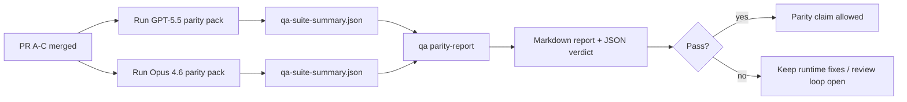

---
read_when:
    - Przegląd serii PR-ów dotyczących parytetu GPT-5.5 / Codex
    - Utrzymywanie sześciokontraktowej architektury agentowej stojącej za programem parytetu
summary: Jak przejrzeć program parytetu GPT-5.5 / Codex jako cztery jednostki scalania
title: Notatki dla opiekunów dotyczące parytetu GPT-5.5 / Codex
x-i18n:
    generated_at: "2026-05-06T09:15:32Z"
    model: gpt-5.5
    provider: openai
    source_hash: 5752b4610f8b0d70b80d880ea10df75478b5f85ca431cdb73d3b61d745b23356
    source_path: help/gpt55-codex-agentic-parity-maintainers.md
    workflow: 16
---

Ta notatka wyjaśnia, jak przeglądać program parytetu GPT-5.5 / Codex jako cztery jednostki scalania, nie tracąc pierwotnej architektury sześciu kontraktów.

## Jednostki scalania

### PR A: ścisłe wykonanie agentowe

Obejmuje:

- `executionContract`
- doprowadzanie działań GPT-5-first do końca w tej samej turze
- `update_plan` jako nieterminalne śledzenie postępu
- jawne stany zablokowania zamiast cichych zatrzymań wyłącznie na planie

Nie obejmuje:

- klasyfikacji błędów uwierzytelniania/środowiska uruchomieniowego
- prawdziwości uprawnień
- przeprojektowania replay/kontynuacji
- benchmarków parytetu

### PR B: prawdziwość środowiska uruchomieniowego

Obejmuje:

- poprawność zakresów OAuth Codex
- typowaną klasyfikację błędów providera/środowiska uruchomieniowego
- prawdziwą dostępność `/elevated full` i powody zablokowania

Nie obejmuje:

- normalizacji schematów narzędzi
- stanu replay/żywotności
- bramek benchmarków

### PR C: poprawność wykonania

Obejmuje:

- należącą do providera zgodność narzędzi OpenAI/Codex
- obsługę ścisłego schematu bez parametrów
- eksponowanie nieprawidłowego replay
- widoczność stanów wstrzymanych, zablokowanych i porzuconych długich zadań

Nie obejmuje:

- samodzielnie wybranej kontynuacji
- ogólnego zachowania dialektu Codex poza hookami providera
- bramek benchmarków

### PR D: zestaw parytetu

Obejmuje:

- pierwszy pakiet scenariuszy GPT-5.5 vs Opus 4.6
- dokumentację parytetu
- raport parytetu i mechanikę bramki wydania

Nie obejmuje:

- zmian zachowania środowiska uruchomieniowego poza QA-lab
- symulacji auth/proxy/DNS wewnątrz zestawu

## Mapowanie z powrotem na pierwotne sześć kontraktów

| Pierwotny kontrakt                       | Jednostka scalania |
| ---------------------------------------- | ------------------ |
| Poprawność transportu/uwierzytelniania providera | PR B       |
| Zgodność kontraktu/schematu narzędzi     | PR C       |
| Wykonanie w tej samej turze              | PR A       |
| Prawdziwość uprawnień                    | PR B       |
| Poprawność replay/kontynuacji/żywotności | PR C       |
| Benchmark/bramka wydania                 | PR D       |

## Kolejność przeglądu

1. PR A
2. PR B
3. PR C
4. PR D

PR D jest warstwą dowodową. Nie powinien być powodem opóźniania PR-ów dotyczących poprawności środowiska uruchomieniowego.

## Na co patrzeć

### PR A

- Uruchomienia GPT-5 działają albo kończą się bezpieczną blokadą zamiast zatrzymywać się na komentarzu
- `update_plan` nie wygląda już sam w sobie jak postęp
- zachowanie pozostaje GPT-5-first i ograniczone do osadzonego Pi

### PR B

- błędy auth/proxy/środowiska uruchomieniowego przestają zapadać się do ogólnej obsługi „model failed”
- `/elevated full` jest opisywane jako dostępne tylko wtedy, gdy faktycznie jest dostępne
- powody zablokowania są widoczne zarówno dla modelu, jak i dla środowiska uruchomieniowego widocznego dla użytkownika

### PR C

- ścisła rejestracja narzędzi OpenAI/Codex zachowuje się przewidywalnie
- narzędzia bez parametrów nie oblewają ścisłych kontroli schematu
- wyniki replay i Compaction zachowują prawdziwy stan żywotności

### PR D

- pakiet scenariuszy jest zrozumiały i odtwarzalny
- pakiet zawiera mutującą ścieżkę bezpieczeństwa replay, nie tylko przepływy tylko do odczytu
- raporty są czytelne dla ludzi i automatyzacji
- twierdzenia o parytecie są poparte dowodami, a nie anegdotyczne

Oczekiwane artefakty z PR D:

- `qa-suite-report.md` / `qa-suite-summary.json` dla każdego uruchomienia modelu
- `qa-agentic-parity-report.md` z porównaniem zbiorczym i na poziomie scenariuszy
- `qa-agentic-parity-summary.json` z werdyktem czytelnym maszynowo

## Bramka wydania

Nie deklaruj parytetu ani przewagi GPT-5.5 nad Opus 4.6, dopóki:

- PR A, PR B i PR C nie zostaną scalone
- PR D nie uruchomi czysto pierwszego pakietu parytetu
- zestawy regresyjne prawdziwości środowiska uruchomieniowego pozostaną zielone
- raport parytetu nie pokaże przypadków fałszywego sukcesu ani regresji zachowania zatrzymania

Zestaw parytetu nie jest jedynym źródłem dowodów. Zachowaj ten podział jawnie w przeglądzie:

- PR D obejmuje porównanie GPT-5.5 vs Opus 4.6 oparte na scenariuszach
- deterministyczne zestawy PR B nadal odpowiadają za dowody dotyczące auth/proxy/DNS oraz prawdziwości pełnego dostępu

## Szybki workflow scalania dla maintainerów

Użyj tego, gdy jesteś gotowy scalić PR parytetu i chcesz powtarzalnej sekwencji niskiego ryzyka.

1. Potwierdź przed scaleniem, że próg dowodowy jest spełniony:
   - odtwarzalny objaw lub nieprzechodzący test
   - zweryfikowana przyczyna źródłowa w dotkniętym kodzie
   - poprawka w powiązanej ścieżce
   - test regresyjny albo jawna notatka z ręcznej weryfikacji
2. Przeprowadź triage/etykietowanie przed scaleniem:
   - zastosuj etykiety automatycznego zamykania `r:*`, gdy PR nie powinien zostać scalony
   - utrzymuj kandydatów do scalenia bez nierozwiązanych wątków blokujących
3. Zweryfikuj lokalnie dotknięty obszar:
   - `pnpm check:changed`
   - `pnpm test:changed`, gdy zmieniły się testy albo pewność poprawki błędu zależy od pokrycia testami
4. Scal standardowym flow maintainera (proces `/landpr`), a następnie zweryfikuj:
   - zachowanie automatycznego zamykania powiązanych issues
   - CI i status po scaleniu na `main`
5. Po scaleniu uruchom wyszukiwanie duplikatów powiązanych otwartych PR-ów/issues i zamykaj je tylko z odniesieniem kanonicznym.

Jeśli brakuje któregokolwiek elementu progu dowodowego, poproś o zmiany zamiast scalać.

## Mapa celów do dowodów

| Element bramki ukończenia                 | Główny właściciel | Artefakt przeglądu                                                  |
| ---------------------------------------- | ----------------- | ------------------------------------------------------------------- |
| Brak zatrzymań wyłącznie na planie       | PR A              | testy środowiska strict-agentic i `approval-turn-tool-followthrough` |
| Brak fałszywego postępu lub fałszywego ukończenia narzędzia | PR A + PR D   | liczba fałszywych sukcesów parytetu plus szczegóły raportu na poziomie scenariuszy |
| Brak fałszywych wskazówek `/elevated full` | PR B            | deterministyczne zestawy prawdziwości środowiska uruchomieniowego   |
| Błędy replay/żywotności pozostają jawne  | PR C + PR D       | zestawy lifecycle/replay plus `compaction-retry-mutating-tool`       |
| GPT-5.5 dorównuje Opus 4.6 albo go przewyższa | PR D          | `qa-agentic-parity-report.md` i `qa-agentic-parity-summary.json`     |

## Skrót recenzenta: przed i po

| Problem widoczny dla użytkownika przed                    | Sygnał w przeglądzie po                                                             |
| --------------------------------------------------------- | ----------------------------------------------------------------------------------- |
| GPT-5.5 zatrzymywał się po planowaniu                     | PR A pokazuje zachowanie wykonaj-albo-zablokuj zamiast ukończenia tylko komentarzem |
| Użycie narzędzi było kruche przy ścisłych schematach OpenAI/Codex | PR C utrzymuje przewidywalność rejestracji narzędzi i wywołań bez parametrów |
| Podpowiedzi `/elevated full` bywały mylące                | PR B wiąże wskazówki z faktyczną możliwością środowiska uruchomieniowego i powodami zablokowania |
| Długie zadania mogły znikać w niejednoznaczności replay/Compaction | PR C emituje jawne stany wstrzymania, zablokowania, porzucenia i nieprawidłowego replay |
| Twierdzenia o parytecie były anegdotyczne                 | PR D tworzy raport oraz werdykt JSON z tym samym pokryciem scenariuszy na obu modelach |

## Powiązane

- [Parytet agentowy GPT-5.5 / Codex](/pl/help/gpt55-codex-agentic-parity)
