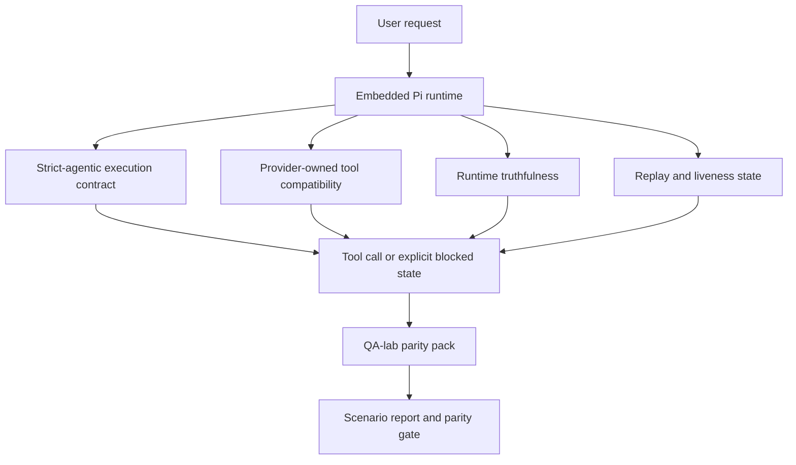
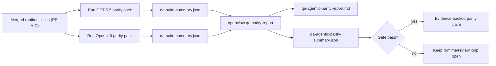

---
read_when:
    - Debugowanie zachowania agenta GPT-5.5 lub Codex
    - Porównywanie zachowania agentowego OpenClaw między najbardziej zaawansowanymi modelami
    - Przegląd poprawek dotyczących strict-agentic, schematu narzędzi, podnoszenia uprawnień i odtwarzania
summary: Jak OpenClaw eliminuje luki w agentowym wykonywaniu zadań dla GPT-5.5 i modeli w stylu Codex
title: Parytet agentowy GPT-5.5 / Codex
x-i18n:
    generated_at: "2026-05-06T09:15:47Z"
    model: gpt-5.5
    provider: openai
    source_hash: bbc32f418dfffe2786093fa6b42b19f92a2d382c9408dfc55dd0154d67959390
    source_path: help/gpt55-codex-agentic-parity.md
    workflow: 16
---

OpenClaw już dobrze współpracował z modelami frontier korzystającymi z narzędzi, ale GPT-5.5 i modele w stylu Codex nadal wypadały gorzej w kilku praktycznych aspektach:

- mogły zatrzymać się po zaplanowaniu zamiast wykonać pracę
- mogły nieprawidłowo używać ścisłych schematów narzędzi OpenAI/Codex
- mogły prosić o `/elevated full`, nawet gdy pełny dostęp był niemożliwy
- mogły tracić stan długotrwałego zadania podczas odtwarzania lub Compaction
- twierdzenia o parytecie względem Claude Opus 4.6 opierały się na anegdotach zamiast na powtarzalnych scenariuszach

Ten program parytetu naprawia te braki w czterech możliwych do przejrzenia częściach.

## Co się zmieniło

### PR A: ścisłe agentowe wykonywanie

Ta część dodaje opcjonalny kontrakt wykonywania `strict-agentic` dla osadzonych uruchomień Pi GPT-5.

Po włączeniu OpenClaw przestaje akceptować tury zawierające tylko plan jako „wystarczająco dobre” zakończenie. Jeśli model tylko mówi, co zamierza zrobić, ale faktycznie nie używa narzędzi ani nie robi postępów, OpenClaw ponawia próbę z instrukcją działania od razu, a następnie kończy w sposób zamknięty z jawnym stanem zablokowania zamiast po cichu kończyć zadanie.

Najbardziej poprawia to działanie GPT-5.5 w przypadku:

- krótkich odpowiedzi typu „ok, zrób to”
- zadań kodowania, w których pierwszy krok jest oczywisty
- przepływów, w których `update_plan` powinien śledzić postęp, a nie być tekstowym wypełniaczem

### PR B: zgodność runtime z prawdą

Ta część sprawia, że OpenClaw rzetelnie informuje o dwóch rzeczach:

- dlaczego wywołanie dostawcy/runtime się nie powiodło
- czy `/elevated full` jest faktycznie dostępne

Oznacza to, że GPT-5.5 otrzymuje lepsze sygnały runtime dotyczące brakującego zakresu, błędów odświeżania uwierzytelniania, błędów uwierzytelniania HTML 403, problemów z proxy, błędów DNS lub timeoutów oraz zablokowanych trybów pełnego dostępu. Model rzadziej halucynuje niewłaściwy sposób naprawy albo nadal prosi o tryb uprawnień, którego runtime nie może zapewnić.

### PR C: poprawność wykonywania

Ta część poprawia dwa rodzaje poprawności:

- zgodność schematów narzędzi OpenAI/Codex należących do dostawcy
- sygnalizowanie żywotności odtwarzania i długich zadań

Prace nad zgodnością narzędzi zmniejszają tarcia schematów przy ścisłej rejestracji narzędzi OpenAI/Codex, zwłaszcza wokół narzędzi bez parametrów i ścisłych oczekiwań dotyczących obiektowego korzenia. Prace nad odtwarzaniem i żywotnością sprawiają, że długotrwałe zadania są bardziej obserwowalne, więc stany wstrzymane, zablokowane i porzucone są widoczne zamiast znikać w ogólnym tekście błędu.

### PR D: uprząż parytetu

Ta część dodaje pierwszy pakiet parytetu QA-lab, aby GPT-5.5 i Opus 4.6 mogły być wykonywane w tych samych scenariuszach i porównywane na podstawie wspólnych dowodów.

Pakiet parytetu jest warstwą dowodową. Samodzielnie nie zmienia zachowania runtime.

Gdy masz już dwa artefakty `qa-suite-summary.json`, wygeneruj porównanie bramki wydania za pomocą:

```bash
pnpm openclaw qa parity-report \
  --repo-root . \
  --candidate-summary .artifacts/qa-e2e/gpt55/qa-suite-summary.json \
  --baseline-summary .artifacts/qa-e2e/opus46/qa-suite-summary.json \
  --output-dir .artifacts/qa-e2e/parity
```

To polecenie zapisuje:

- czytelny dla człowieka raport Markdown
- możliwy do odczytu maszynowego werdykt JSON
- jawny wynik bramki `pass` / `fail`

## Dlaczego to poprawia GPT-5.5 w praktyce

Przed tymi pracami GPT-5.5 w OpenClaw mógł sprawiać wrażenie mniej agentowego niż Opus w rzeczywistych sesjach kodowania, ponieważ runtime tolerował zachowania szczególnie szkodliwe dla modeli w stylu GPT-5:

- tury zawierające wyłącznie komentarz
- tarcia schematów wokół narzędzi
- niejasne informacje zwrotne o uprawnieniach
- ciche uszkodzenia odtwarzania lub Compaction

Celem nie jest sprawienie, by GPT-5.5 naśladował Opus. Celem jest danie GPT-5.5 kontraktu runtime, który nagradza rzeczywisty postęp, zapewnia czytelniejsze semantyki narzędzi i uprawnień oraz zamienia tryby awarii w jawne stany czytelne dla maszyn i ludzi.

Zmienia to doświadczenie użytkownika z:

- „model miał dobry plan, ale się zatrzymał”

na:

- „model albo zadziałał, albo OpenClaw pokazał dokładny powód, dla którego nie mógł”

## Przed i po dla użytkowników GPT-5.5

| Przed tym programem                                                                            | Po PR A-D                                                                                |
| ---------------------------------------------------------------------------------------------- | ---------------------------------------------------------------------------------------- |
| GPT-5.5 mógł zatrzymać się po rozsądnym planie bez wykonania następnego kroku narzędziowego    | PR A zamienia „tylko plan” w „działaj teraz albo pokaż stan zablokowania”                |
| Ścisłe schematy narzędzi mogły odrzucać narzędzia bez parametrów lub narzędzia w kształcie OpenAI/Codex w mylący sposób | PR C sprawia, że należące do dostawcy rejestrowanie i wywoływanie narzędzi jest bardziej przewidywalne |
| Wskazówki `/elevated full` mogły być niejasne lub błędne w zablokowanych runtime               | PR B daje GPT-5.5 i użytkownikowi prawdziwe wskazówki runtime i uprawnień                |
| Awarie odtwarzania lub Compaction mogły wyglądać tak, jakby zadanie po cichu zniknęło          | PR C jawnie pokazuje wyniki wstrzymane, zablokowane, porzucone i nieprawidłowe przy odtwarzaniu |
| „GPT-5.5 wydaje się gorszy niż Opus” było głównie anegdotyczne                                 | PR D zamienia to w ten sam pakiet scenariuszy, te same metryki i twardą bramkę pass/fail |

## Architektura



## Przepływ wydania



## Pakiet scenariuszy

Pierwszy pakiet parytetu obejmuje obecnie pięć scenariuszy:

### `approval-turn-tool-followthrough`

Sprawdza, że model nie zatrzymuje się na „Zrobię to” po krótkim zatwierdzeniu. Powinien podjąć pierwsze konkretne działanie w tej samej turze.

### `model-switch-tool-continuity`

Sprawdza, że praca z użyciem narzędzi pozostaje spójna ponad granicami przełączania modelu/runtime, zamiast resetować się do komentarza albo tracić kontekst wykonywania.

### `source-docs-discovery-report`

Sprawdza, że model potrafi czytać źródła i dokumentację, syntetyzować ustalenia oraz kontynuować zadanie agentowo zamiast tworzyć płytkie podsumowanie i wcześnie się zatrzymać.

### `image-understanding-attachment`

Sprawdza, że zadania mieszane obejmujące załączniki pozostają wykonalne i nie zapadają się w niejasną narrację.

### `compaction-retry-mutating-tool`

Sprawdza, że zadanie z rzeczywistym zapisem modyfikującym zachowuje jawną niebezpieczność odtwarzania zamiast po cichu wyglądać na bezpieczne do odtworzenia, jeśli uruchomienie przejdzie Compaction, ponowi próbę albo straci stan odpowiedzi pod presją.

## Macierz scenariuszy

| Scenariusz                        | Co testuje                              | Dobre zachowanie GPT-5.5                                                       | Sygnał awarii                                                                  |
| ---------------------------------- | --------------------------------------- | ------------------------------------------------------------------------------ | ------------------------------------------------------------------------------ |
| `approval-turn-tool-followthrough` | Krótkie tury zatwierdzenia po planie    | Natychmiast rozpoczyna pierwsze konkretne działanie narzędziowe zamiast powtarzać zamiar | odpowiedź tylko z planem, brak aktywności narzędzi albo zablokowana tura bez rzeczywistej blokady |
| `model-switch-tool-continuity`     | Przełączanie runtime/modelu podczas użycia narzędzi | Zachowuje kontekst zadania i nadal działa spójnie                              | resetuje się do komentarza, traci kontekst narzędzi albo zatrzymuje się po przełączeniu |
| `source-docs-discovery-report`     | Czytanie źródeł + synteza + działanie   | Znajduje źródła, używa narzędzi i tworzy użyteczny raport bez zacinania się     | płytkie podsumowanie, brak pracy narzędziowej albo zatrzymanie nieukończonej tury |
| `image-understanding-attachment`   | Praca agentowa sterowana załącznikiem   | Interpretuje załącznik, łączy go z narzędziami i kontynuuje zadanie            | niejasna narracja, zignorowany załącznik albo brak konkretnego następnego działania |
| `compaction-retry-mutating-tool`   | Praca modyfikująca pod presją Compaction | Wykonuje rzeczywisty zapis i zachowuje jawną niebezpieczność odtwarzania po efekcie ubocznym | zapis modyfikujący następuje, ale bezpieczeństwo odtwarzania jest sugerowane, brakujące albo sprzeczne |

## Bramka wydania

GPT-5.5 można uznać za osiągający parytet lub lepszy tylko wtedy, gdy scalony runtime jednocześnie przechodzi pakiet parytetu i regresje zgodności runtime z prawdą.

Wymagane wyniki:

- brak zastoju na samym planie, gdy następne działanie narzędziowe jest jasne
- brak fałszywego ukończenia bez rzeczywistego wykonania
- brak nieprawidłowych wskazówek `/elevated full`
- brak cichego porzucenia odtwarzania lub Compaction
- metryki pakietu parytetu co najmniej tak silne jak uzgodniona linia bazowa Opus 4.6

Dla pierwszej wersji uprzęży bramka porównuje:

- współczynnik ukończenia
- współczynnik niezamierzonego zatrzymania
- współczynnik prawidłowych wywołań narzędzi
- liczbę fałszywych sukcesów

Dowody parytetu są celowo podzielone na dwie warstwy:

- PR D dowodzi zachowania GPT-5.5 względem Opus 4.6 w tych samych scenariuszach za pomocą QA-lab
- deterministyczne zestawy PR B dowodzą rzetelności uwierzytelniania, proxy, DNS i `/elevated full` poza uprzężą

## Macierz celu i dowodów

| Element bramki ukończenia                              | Właściciel PR | Źródło dowodów                                                   | Sygnał zaliczenia                                                                        |
| -------------------------------------------------------- | ----------- | ------------------------------------------------------------------ | ---------------------------------------------------------------------------------------- |
| GPT-5.5 nie zatrzymuje się już po planowaniu             | PR A        | `approval-turn-tool-followthrough` plus zestawy runtime PR A       | tury zatwierdzenia wyzwalają rzeczywistą pracę albo jawny stan zablokowania              |
| GPT-5.5 nie udaje już postępu ani fałszywego ukończenia narzędzia | PR A + PR D | wyniki scenariuszy raportu parytetu i liczba fałszywych sukcesów   | brak podejrzanych wyników zaliczenia i brak ukończenia zawierającego wyłącznie komentarz |
| GPT-5.5 nie podaje już fałszywych wskazówek `/elevated full` | PR B        | deterministyczne zestawy rzetelności                               | powody zablokowania i wskazówki pełnego dostępu pozostają zgodne z runtime               |
| Awarie odtwarzania/żywotności pozostają jawne            | PR C + PR D | zestawy cyklu życia/odtwarzania PR C plus `compaction-retry-mutating-tool` | praca modyfikująca zachowuje jawną niebezpieczność odtwarzania zamiast po cichu znikać |
| GPT-5.5 dorównuje Opus 4.6 lub go przewyższa w uzgodnionych metrykach | PR D        | `qa-agentic-parity-report.md` i `qa-agentic-parity-summary.json`   | to samo pokrycie scenariuszy i brak regresji w ukończeniu, zachowaniu zatrzymania lub prawidłowym użyciu narzędzi |

## Jak czytać werdykt parytetu

Użyj werdyktu w `qa-agentic-parity-summary.json` jako ostatecznej, możliwej do odczytu maszynowego decyzji dla pierwszego pakietu parytetu.

- `pass` oznacza, że GPT-5.5 objął te same scenariusze co Opus 4.6 i nie pogorszył uzgodnionych metryk zbiorczych.
- `fail` oznacza, że uruchomiła się co najmniej jedna twarda bramka: słabsze ukończenie, gorsze niezamierzone zatrzymania, słabsze prawidłowe użycie narzędzi, dowolny przypadek fałszywego sukcesu albo niezgodne pokrycie scenariuszy.
- „wspólny/podstawowy problem CI” sam w sobie nie jest wynikiem parytetu. Jeśli szum CI poza PR D blokuje uruchomienie, werdykt powinien poczekać na czyste wykonanie w scalonym środowisku uruchomieniowym zamiast być wnioskowany z logów z okresu gałęzi.
- Uwierzytelnianie, proxy, DNS i prawdomówność `/elevated full` nadal pochodzą z deterministycznych zestawów PR B, więc końcowa deklaracja wydania wymaga obu elementów: zaliczonego werdyktu parytetu PR D oraz zielonego pokrycia prawdomówności PR B.

## Kto powinien włączyć `strict-agentic`

Używaj `strict-agentic`, gdy:

- oczekuje się, że agent zadziała natychmiast, gdy następny krok jest oczywisty
- GPT-5.5 lub modele z rodziny Codex są głównym środowiskiem uruchomieniowym
- wolisz jawne stany zablokowania niż „pomocne” odpowiedzi ograniczone do podsumowania

Zachowaj domyślny kontrakt, gdy:

- chcesz istniejącego luźniejszego zachowania
- nie używasz modeli z rodziny GPT-5
- testujesz prompty, a nie egzekwowanie w środowisku uruchomieniowym

## Powiązane

- [Notatki opiekunów parytetu GPT-5.5 / Codex](/pl/help/gpt55-codex-agentic-parity-maintainers)
