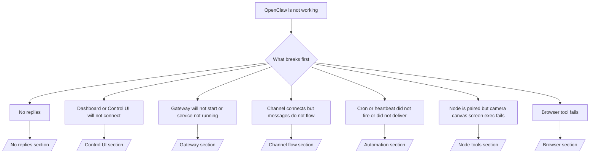

---
read_when:
    - OpenClaw nie działa i potrzebujesz najszybszej drogi do naprawy
    - Potrzebujesz procesu triage przed zagłębieniem się w szczegółowe procedury operacyjne
summary: Centrum rozwiązywania problemów OpenClaw zaczynające od objawu
title: Ogólne rozwiązywanie problemów
x-i18n:
    generated_at: "2026-06-27T17:41:23Z"
    model: gpt-5.5
    postprocess_version: locale-links-v1
    provider: openai
    source_hash: ae1236c73e3a5c9237bd81d603e8dca18c595a8bcbb71f5931bfbf2389b342cd
    source_path: help/troubleshooting.md
    workflow: 16
---

Jeśli masz tylko 2 minuty, użyj tej strony jako wejścia do triage.

## Pierwsze 60 sekund

Uruchom tę dokładną drabinę w podanej kolejności:

```bash
openclaw status
openclaw status --all
openclaw gateway probe
openclaw gateway status
openclaw doctor
openclaw channels status --probe
openclaw logs --follow
```

Dobry wynik w jednym wierszu:

- `openclaw status` → pokazuje skonfigurowane kanały i brak oczywistych błędów uwierzytelniania.
- `openclaw status --all` → pełny raport jest dostępny i gotowy do udostępnienia.
- `openclaw gateway probe` → oczekiwany cel Gateway jest osiągalny (`Reachable: yes`). `Capability: ...` mówi, jaki poziom uwierzytelnienia sonda mogła potwierdzić, a `Read probe: limited - missing scope: operator.read` oznacza zdegradowaną diagnostykę, nie błąd połączenia.
- `openclaw gateway status` → `Runtime: running`, `Connectivity probe: ok` oraz wiarygodny wiersz `Capability: ...`. Użyj `--require-rpc`, jeśli potrzebujesz także dowodu RPC z zakresem odczytu.
- `openclaw doctor` → brak blokujących błędów konfiguracji lub usługi.
- `openclaw channels status --probe` → osiągalny Gateway zwraca bieżący stan transportu dla poszczególnych kont oraz wyniki sondy/audytu, takie jak `works` lub `audit ok`; jeśli Gateway jest nieosiągalny, polecenie wraca do podsumowań wyłącznie z konfiguracji.
- `openclaw logs --follow` → stabilna aktywność, bez powtarzających się błędów krytycznych.

## Asystent wydaje się ograniczony lub brakuje mu narzędzi

Jeśli asystent nie może sprawdzać plików, uruchamiać poleceń, używać automatyzacji przeglądarki albo widzieć oczekiwanych narzędzi, najpierw sprawdź efektywny profil narzędzi:

```bash
openclaw status
openclaw status --all
openclaw doctor
```

Typowe przyczyny:

- `tools.profile: "messaging"` jest celowo wąski dla agentów działających tylko w czacie.
- `tools.profile: "coding"` to zwykły profil dla przepływów repozytorium, plików, powłoki i środowiska uruchomieniowego.
- `tools.profile: "full"` udostępnia najszerszy zestaw narzędzi i powinien być ograniczony do zaufanych agentów kontrolowanych przez operatora.
- Nadpisania `agents.list[].tools` dla poszczególnych agentów mogą zawęzić lub rozszerzyć profil główny dla jednego agenta.

Zmień główny profil narzędzi lub profil dla danego agenta, następnie zrestartuj albo przeładuj Gateway i ponownie uruchom `openclaw status --all`. Zobacz [Narzędzia](/pl/tools), aby poznać model profili oraz nadpisania allow/deny.

## Długi kontekst Anthropic 429

Jeśli widzisz:
`HTTP 429: rate_limit_error: Extra usage is required for long context requests`,
przejdź do [/gateway/troubleshooting#anthropic-429-extra-usage-required-for-long-context](/pl/gateway/troubleshooting#anthropic-429-extra-usage-required-for-long-context).

## Lokalny backend zgodny z OpenAI działa bezpośrednio, ale zawodzi w OpenClaw

Jeśli Twój lokalny lub samodzielnie hostowany backend `/v1` odpowiada na małe bezpośrednie sondy `/v1/chat/completions`, ale zawodzi przy `openclaw infer model run` albo zwykłych turach agenta:

1. Jeśli błąd wspomina, że `messages[].content` oczekuje ciągu znaków, ustaw `models.providers.<provider>.models[].compat.requiresStringContent: true`.
2. Jeśli backend nadal zawodzi tylko przy turach agenta OpenClaw, ustaw `models.providers.<provider>.models[].compat.supportsTools: false` i ponów próbę.
3. Jeśli bardzo małe bezpośrednie wywołania nadal działają, ale większe prompty OpenClaw powodują awarię backendu, potraktuj pozostały problem jako ograniczenie nadrzędnego modelu/serwera i kontynuuj w szczegółowym runbooku:
   [/gateway/troubleshooting#local-openai-compatible-backend-passes-direct-probes-but-agent-runs-fail](/pl/gateway/troubleshooting#local-openai-compatible-backend-passes-direct-probes-but-agent-runs-fail)

## Instalacja Plugin kończy się błędem brakujących rozszerzeń openclaw

Jeśli instalacja kończy się błędem `package.json missing openclaw.extensions`, pakiet Plugin używa starego kształtu, którego OpenClaw już nie akceptuje.

Napraw w pakiecie Plugin:

1. Dodaj `openclaw.extensions` do `package.json`.
2. Skieruj wpisy na zbudowane pliki środowiska uruchomieniowego, zwykle `./dist/index.js`.
3. Opublikuj Plugin ponownie i uruchom jeszcze raz `openclaw plugins install <package>`.

Przykład:

```json
{
  "name": "@openclaw/my-plugin",
  "version": "1.2.3",
  "openclaw": {
    "extensions": ["./dist/index.js"]
  }
}
```

Odniesienie: [Architektura Plugin](/pl/plugins/architecture)

## Zasady instalacji blokują instalacje lub aktualizacje Plugin

Jeśli aktualizacja się kończy, ale Plugins są przestarzałe, wyłączone albo pokazują komunikaty takie jak `blocked by install policy`, `install policy failed closed` lub `Disabled "<plugin>" after plugin update failure`, sprawdź `security.installPolicy`.

Zasady instalacji działają podczas instalacji i aktualizacji Plugin. Wersje Plugin należących do OpenClaw zwykle przesuwają się wraz z wydaniem OpenClaw, więc aktualizacja OpenClaw może też wymagać dopasowanych aktualizacji Plugin `@openclaw/*` podczas synchronizacji po aktualizacji.

Unikaj tych szerokich kształtów zasad, chyba że utrzymujesz także pasującą regułę aktualizacji:

- Zamrażanie Plugin należących do OpenClaw na jednej dokładnej starej wersji, na przykład zezwalanie tylko na `@openclaw/*@2026.5.3`.
- Blokowanie wyłącznie według rodzaju źródła, na przykład każdego żądania Plugin z npm, sieci albo `request.mode: "update"`.
- Traktowanie polecenia zasad jako opcjonalnego. Gdy `security.installPolicy` jest włączone, brakujący, wolny, nieczytelny albo zablokowany uprawnieniami plik wykonywalny zasad kończy się zamknięciem w trybie fail-closed.
- Zatwierdzanie wersji Plugin bez uwzględnienia `openclawVersion` z żądania zasad oraz metadanych kandydata Plugin.

Bezpieczniejsze reguły zasad zezwalają na zaufane aktualizacje Plugin należących do OpenClaw, gdy kandydat jest zgodny z bieżącym hostem OpenClaw, zamiast przypinać jedno wydanie na zawsze. Jeśli domyślnie blokujesz npm, zrób wąski wyjątek dla zaufanych pakietów Plugin `@openclaw/*` albo identyfikatorów Plugin, których używasz. Jeśli rozróżniasz żądania instalacji i aktualizacji, zastosuj tę samą regułę zaufania do `request.mode: "update"`.

Odzyskiwanie:

```bash
openclaw doctor --deep
openclaw plugins update --all
openclaw status --all
```

Jeśli zasady są celowo ścisłe, poluzuj je dla zaufanego okna aktualizacji OpenClaw, ponownie uruchom `openclaw plugins update --all`, a potem przywróć bardziej rygorystyczną regułę. Jeśli Plugin został wyłączony po błędzie aktualizacji, sprawdź go i włącz ponownie dopiero po powodzeniu aktualizacji:

```bash
openclaw plugins inspect <plugin-id> --runtime --json
openclaw plugins enable <plugin-id>
```

Odniesienie: [Zasady instalacji operatora](/pl/tools/skills-config#operator-install-policy-securityinstallpolicy)

## Plugin obecny, ale zablokowany przez podejrzane właścicielstwo

Jeśli `openclaw doctor`, konfiguracja albo ostrzeżenia startowe pokazują:

```text
blocked plugin candidate: suspicious ownership (... uid=1000, expected uid=0 or root)
plugin present but blocked
```

pliki Plugin należą do innego użytkownika Unix niż proces, który je ładuje. Nie usuwaj konfiguracji Plugin. Napraw właścicielstwo plików albo uruchom OpenClaw jako ten sam użytkownik, który jest właścicielem katalogu stanu.

Instalacje Docker zwykle działają jako `node` (uid `1000`). Dla domyślnej konfiguracji Docker napraw montowania bind hosta:

```bash
sudo chown -R 1000:1000 /path/to/openclaw-config /path/to/openclaw-workspace
openclaw doctor --fix
```

Jeśli celowo uruchamiasz OpenClaw jako root, zamiast tego napraw zarządzany katalog główny Plugin na właścicielstwo root:

```bash
sudo chown -R root:root /path/to/openclaw-config/npm
openclaw doctor --fix
```

Szczegółowe dokumenty:

- [Właścicielstwo ścieżki Plugin](/pl/tools/plugin#blocked-plugin-path-ownership)
- [Uprawnienia Docker](/pl/install/docker#permissions-and-eacces)

## Drzewo decyzyjne



<AccordionGroup>
  <Accordion title="No replies">
    ```bash
    openclaw status
    openclaw gateway status
    openclaw channels status --probe
    openclaw pairing list --channel <channel> [--account <id>]
    openclaw logs --follow
    ```

    Dobry wynik wygląda tak:

    - `Runtime: running`
    - `Connectivity probe: ok`
    - `Capability: read-only`, `write-capable` albo `admin-capable`
    - Twój kanał pokazuje połączony transport oraz, tam gdzie jest to obsługiwane, `works` lub `audit ok` w `channels status --probe`
    - Nadawca wygląda na zatwierdzonego albo zasady DM są otwarte/lista dozwolonych

    Typowe sygnatury w logach:

    - `drop guild message (mention required` → bramka wzmianek zablokowała wiadomość w Discord.
    - `pairing request` → nadawca nie jest zatwierdzony i czeka na zatwierdzenie parowania przez DM.
    - `blocked` / `allowlist` w logach kanału → nadawca, pokój albo grupa są filtrowane.

    Szczegółowe strony:

    - [/gateway/troubleshooting#no-replies](/pl/gateway/troubleshooting#no-replies)
    - [/channels/troubleshooting](/pl/channels/troubleshooting)
    - [/channels/pairing](/pl/channels/pairing)

  </Accordion>

  <Accordion title="Dashboard or Control UI will not connect">
    ```bash
    openclaw status
    openclaw gateway status
    openclaw logs --follow
    openclaw doctor
    openclaw channels status --probe
    ```

    Dobry wynik wygląda tak:

    - `Dashboard: http://...` jest pokazany w `openclaw gateway status`
    - `Connectivity probe: ok`
    - `Capability: read-only`, `write-capable` albo `admin-capable`
    - Brak pętli uwierzytelniania w logach

    Typowe sygnatury w logach:

    - `device identity required` → kontekst HTTP/niezabezpieczony nie może ukończyć uwierzytelniania urządzenia.
    - `origin not allowed` → przeglądarkowy `Origin` nie jest dozwolony dla celu Gateway interfejsu Control UI.
    - `AUTH_TOKEN_MISMATCH` ze wskazówkami ponowienia (`canRetryWithDeviceToken=true`) → jedna zaufana próba ponowienia z tokenem urządzenia może nastąpić automatycznie.
    - To ponowienie z buforowanym tokenem używa zestawu zakresów z pamięci podręcznej zapisanego z sparowanym tokenem urządzenia. Wywołujący z jawnym `deviceToken` / jawnymi `scopes` zachowują zamiast tego swój żądany zestaw zakresów.
    - Na asynchronicznej ścieżce Tailscale Serve Control UI nieudane próby dla tego samego `{scope, ip}` są serializowane, zanim limiter zapisze niepowodzenie, więc druga równoczesna nieudana próba może już pokazać `retry later`.
    - `too many failed authentication attempts (retry later)` z lokalnego źródła przeglądarki → powtarzające się niepowodzenia z tego samego `Origin` są tymczasowo blokowane; inne lokalne źródło używa osobnego kubełka.
    - powtarzające się `unauthorized` po tej próbie ponowienia → zły token/hasło, niezgodny tryb uwierzytelniania albo nieaktualny sparowany token urządzenia.
    - `gateway connect failed:` → UI celuje w zły URL/port albo nieosiągalny Gateway.

    Szczegółowe strony:

    - [/gateway/troubleshooting#dashboard-control-ui-connectivity](/pl/gateway/troubleshooting#dashboard-control-ui-connectivity)
    - [/web/control-ui](/pl/web/control-ui)
    - [/gateway/authentication](/pl/gateway/authentication)

  </Accordion>

  <Accordion title="Gateway will not start or service installed but not running">
    ```bash
    openclaw status
    openclaw gateway status
    openclaw logs --follow
    openclaw doctor
    openclaw channels status --probe
    ```

    Dobry wynik wygląda tak:

    - `Service: ... (loaded)`
    - `Runtime: running`
    - `Connectivity probe: ok`
    - `Capability: read-only`, `write-capable` albo `admin-capable`

    Typowe sygnatury w logach:

    - `Gateway start blocked: set gateway.mode=local` lub `existing config is missing gateway.mode` → tryb Gateway jest zdalny albo w pliku konfiguracji brakuje znacznika trybu lokalnego i należy go naprawić.
    - `refusing to bind gateway ... without auth` → powiązanie poza local loopback bez prawidłowej ścieżki uwierzytelniania Gateway (token/hasło albo trusted-proxy, gdy skonfigurowano).
    - `another gateway instance is already listening` lub `EADDRINUSE` → port jest już zajęty.

    Szczegółowe strony:

    - [/gateway/troubleshooting#gateway-service-not-running](/pl/gateway/troubleshooting#gateway-service-not-running)
    - [/gateway/background-process](/pl/gateway/background-process)
    - [/gateway/configuration](/pl/gateway/configuration)

  </Accordion>

  <Accordion title="Kanał łączy się, ale wiadomości nie przepływają">
    ```bash
    openclaw status
    openclaw gateway status
    openclaw logs --follow
    openclaw doctor
    openclaw channels status --probe
    ```

    Prawidłowe dane wyjściowe wyglądają tak:

    - Transport kanału jest połączony.
    - Kontrole parowania/listy dozwolonych przechodzą pomyślnie.
    - Wzmianki są wykrywane tam, gdzie są wymagane.

    Typowe sygnatury logów:

    - `mention required` → bramka wzmianki w grupie zablokowała przetwarzanie.
    - `pairing` / `pending` → nadawca DM nie został jeszcze zatwierdzony.
    - `not_in_channel`, `missing_scope`, `Forbidden`, `401/403` → problem z tokenem uprawnień kanału.

    Szczegółowe strony:

    - [/gateway/troubleshooting#channel-connected-messages-not-flowing](/pl/gateway/troubleshooting#channel-connected-messages-not-flowing)
    - [/channels/troubleshooting](/pl/channels/troubleshooting)

  </Accordion>

  <Accordion title="Cron lub Heartbeat nie uruchomił się albo nie dostarczył">
    ```bash
    openclaw status
    openclaw gateway status
    openclaw cron status
    openclaw cron list
    openclaw cron runs --id <jobId> --limit 20
    openclaw logs --follow
    ```

    Prawidłowe dane wyjściowe wyglądają tak:

    - `cron.status` pokazuje stan włączony z następnym wybudzeniem.
    - `cron runs` pokazuje ostatnie wpisy `ok`.
    - Heartbeat jest włączony i nie znajduje się poza godzinami aktywności.

    Typowe sygnatury logów:

    - `cron: scheduler disabled; jobs will not run automatically` → cron jest wyłączony.
    - `heartbeat skipped` z `reason=quiet-hours` → poza skonfigurowanymi godzinami aktywności.
    - `heartbeat skipped` z `reason=empty-heartbeat-file` → `HEARTBEAT.md` istnieje, ale zawiera tylko puste wiersze, komentarz, nagłówek, ogrodzenie albo pusty szkielet listy kontrolnej.
    - `heartbeat skipped` z `reason=no-tasks-due` → tryb zadań `HEARTBEAT.md` jest aktywny, ale żaden z interwałów zadań nie jest jeszcze wymagalny.
    - `heartbeat skipped` z `reason=alerts-disabled` → cała widoczność Heartbeat jest wyłączona (`showOk`, `showAlerts` i `useIndicator` są wyłączone).
    - `requests-in-flight` → główna ścieżka jest zajęta; wybudzenie Heartbeat zostało odroczone.
    - `unknown accountId` → docelowe konto dostarczania Heartbeat nie istnieje.

    Szczegółowe strony:

    - [/gateway/troubleshooting#cron-and-heartbeat-delivery](/pl/gateway/troubleshooting#cron-and-heartbeat-delivery)
    - [/automation/cron-jobs#troubleshooting](/pl/automation/cron-jobs#troubleshooting)
    - [/gateway/heartbeat](/pl/gateway/heartbeat)

  </Accordion>

  <Accordion title="Node jest sparowany, ale narzędzie camera canvas screen exec zawodzi">
    ```bash
    openclaw status
    openclaw gateway status
    openclaw nodes status
    openclaw nodes describe --node <idOrNameOrIp>
    openclaw logs --follow
    ```

    Prawidłowe dane wyjściowe wyglądają tak:

    - Node jest wymieniony jako połączony i sparowany dla roli `node`.
    - Istnieje capability dla wywoływanego polecenia.
    - Stan uprawnień dla narzędzia to granted.

    Typowe sygnatury logów:

    - `NODE_BACKGROUND_UNAVAILABLE` → przenieś aplikację node na pierwszy plan.
    - `*_PERMISSION_REQUIRED` → odmówiono uprawnienia systemu operacyjnego albo go brakuje.
    - `SYSTEM_RUN_DENIED: approval required` → zatwierdzenie exec oczekuje.
    - `SYSTEM_RUN_DENIED: allowlist miss` → polecenia nie ma na liście dozwolonych exec.

    Szczegółowe strony:

    - [/gateway/troubleshooting#node-paired-tool-fails](/pl/gateway/troubleshooting#node-paired-tool-fails)
    - [/nodes/troubleshooting](/pl/nodes/troubleshooting)
    - [/tools/exec-approvals](/pl/tools/exec-approvals)

  </Accordion>

  <Accordion title="Exec nagle prosi o zatwierdzenie">
    ```bash
    openclaw config get tools.exec.host
    openclaw config get tools.exec.security
    openclaw config get tools.exec.ask
    openclaw gateway restart
    ```

    Co się zmieniło:

    - Jeśli `tools.exec.host` nie jest ustawione, wartością domyślną jest `auto`.
    - `host=auto` rozwiązuje się do `sandbox`, gdy aktywne jest środowisko uruchomieniowe sandbox, w przeciwnym razie do `gateway`.
    - `host=auto` dotyczy tylko routingu; zachowanie "YOLO" bez monitów wynika z `security=full` oraz `ask=off` na gateway/node.
    - Na `gateway` i `node` nieustawione `tools.exec.security` domyślnie przyjmuje `full`.
    - Nieustawione `tools.exec.ask` domyślnie przyjmuje `off`.
    - Wynik: jeśli widzisz zatwierdzenia, jakaś lokalna dla hosta albo sesji polityka zaostrzyła exec względem bieżących wartości domyślnych.

    Przywróć bieżące domyślne zachowanie bez zatwierdzeń:

    ```bash
    openclaw config set tools.exec.host gateway
    openclaw config set tools.exec.security full
    openclaw config set tools.exec.ask off
    openclaw gateway restart
    ```

    Bezpieczniejsze alternatywy:

    - Ustaw tylko `tools.exec.host=gateway`, jeśli chcesz jedynie stabilnego routingu hosta.
    - Użyj `security=allowlist` z `ask=on-miss`, jeśli chcesz exec na hoście, ale nadal chcesz przeglądu przy brakach na liście dozwolonych.
    - Włącz tryb sandbox, jeśli chcesz, aby `host=auto` ponownie rozwiązywał się do `sandbox`.

    Typowe sygnatury logów:

    - `Approval required.` → polecenie czeka na `/approve ...`.
    - `SYSTEM_RUN_DENIED: approval required` → zatwierdzenie exec na hoście node oczekuje.
    - `exec host=sandbox requires a sandbox runtime for this session` → niejawny/jawny wybór sandbox, ale tryb sandbox jest wyłączony.

    Szczegółowe strony:

    - [/tools/exec](/pl/tools/exec)
    - [/tools/exec-approvals](/pl/tools/exec-approvals)
    - [/gateway/security#what-the-audit-checks-high-level](/pl/gateway/security#what-the-audit-checks-high-level)

  </Accordion>

  <Accordion title="Narzędzie przeglądarki zawodzi">
    ```bash
    openclaw status
    openclaw gateway status
    openclaw browser status
    openclaw logs --follow
    openclaw doctor
    ```

    Prawidłowe dane wyjściowe wyglądają tak:

    - Stan przeglądarki pokazuje `running: true` oraz wybraną przeglądarkę/profil.
    - `openclaw` uruchamia się albo `user` widzi lokalne karty Chrome.

    Typowe sygnatury logów:

    - `unknown command "browser"` lub `unknown command 'browser'` → ustawiono `plugins.allow`, ale nie zawiera `browser`.
    - `Failed to start Chrome CDP on port` → lokalne uruchomienie przeglądarki nie powiodło się.
    - `browser.executablePath not found` → skonfigurowana ścieżka pliku binarnego jest błędna.
    - `browser.cdpUrl must be http(s) or ws(s)` → skonfigurowany URL CDP używa nieobsługiwanego schematu.
    - `browser.cdpUrl has invalid port` → skonfigurowany URL CDP ma nieprawidłowy albo spoza zakresu port.
    - `No Chrome tabs found for profile="user"` → profil dołączania Chrome MCP nie ma otwartych lokalnych kart Chrome.
    - `Remote CDP for profile "<name>" is not reachable` → skonfigurowany zdalny punkt końcowy CDP jest nieosiągalny z tego hosta.
    - `Browser attachOnly is enabled ... not reachable` lub `Browser attachOnly is enabled and CDP websocket ... is not reachable` → profil tylko dołączania nie ma aktywnego celu CDP.
    - nieaktualne nadpisania viewportu / trybu ciemnego / locale / offline w profilach tylko dołączania lub zdalnego CDP → uruchom `openclaw browser stop --browser-profile <name>`, aby zamknąć aktywną sesję sterowania i zwolnić stan emulacji bez restartowania Gateway.

    Szczegółowe strony:

    - [/gateway/troubleshooting#browser-tool-fails](/pl/gateway/troubleshooting#browser-tool-fails)
    - [/tools/browser#missing-browser-command-or-tool](/pl/tools/browser#missing-browser-command-or-tool)
    - [/tools/browser-linux-troubleshooting](/pl/tools/browser-linux-troubleshooting)
    - [/tools/browser-wsl2-windows-remote-cdp-troubleshooting](/pl/tools/browser-wsl2-windows-remote-cdp-troubleshooting)

  </Accordion>

</AccordionGroup>

## Powiązane

- [FAQ](/pl/help/faq) — często zadawane pytania
- [Rozwiązywanie problemów z Gateway](/pl/gateway/troubleshooting) — problemy specyficzne dla gateway
- [Doctor](/pl/gateway/doctor) — zautomatyzowane kontrole kondycji i naprawy
- [Rozwiązywanie problemów z kanałami](/pl/channels/troubleshooting) — problemy z łącznością kanałów
- [Rozwiązywanie problemów z automatyzacją](/pl/automation/cron-jobs#troubleshooting) — problemy z cron i Heartbeat
