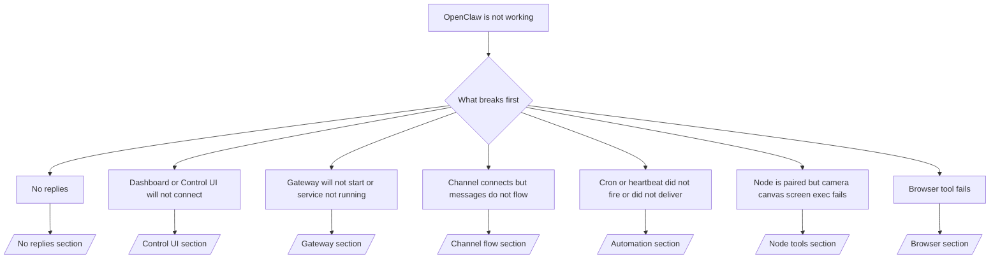

---
read_when:
    - OpenClaw nie działa i potrzebujesz najszybszej drogi do naprawy
    - Potrzebujesz ścieżki wstępnej oceny przed zagłębianiem się w szczegółowe procedury operacyjne
summary: Centrum rozwiązywania problemów OpenClaw według objawów
title: Ogólne rozwiązywanie problemów
x-i18n:
    generated_at: "2026-05-06T09:16:48Z"
    model: gpt-5.5
    provider: openai
    source_hash: 624fa34cda3b440fa9cc636beb3fe6e3608a77a332933fa593097ebc556ac745
    source_path: help/troubleshooting.md
    workflow: 16
---

Jeśli masz tylko 2 minuty, użyj tej strony jako punktu wejścia do triage.

## Pierwsze 60 sekund

Uruchom tę dokładną drabinkę w podanej kolejności:

```bash
openclaw status
openclaw status --all
openclaw gateway probe
openclaw gateway status
openclaw doctor
openclaw channels status --probe
openclaw logs --follow
```

Dobry wynik w jednym wierszu:

- `openclaw status` → pokazuje skonfigurowane kanały i brak oczywistych błędów uwierzytelniania.
- `openclaw status --all` → pełny raport jest dostępny i gotowy do udostępnienia.
- `openclaw gateway probe` → oczekiwany cel Gateway jest osiągalny (`Reachable: yes`). `Capability: ...` mówi, jaki poziom uwierzytelnienia udało się potwierdzić sondzie, a `Read probe: limited - missing scope: operator.read` oznacza ograniczoną diagnostykę, nie błąd połączenia.
- `openclaw gateway status` → `Runtime: running`, `Connectivity probe: ok` i wiarygodny wiersz `Capability: ...`. Użyj `--require-rpc`, jeśli potrzebujesz także potwierdzenia RPC z zakresem odczytu.
- `openclaw doctor` → brak blokujących błędów konfiguracji/usługi.
- `openclaw channels status --probe` → osiągalny Gateway zwraca bieżący stan transportu dla poszczególnych kont oraz wyniki sond/audytu, takie jak `works` lub `audit ok`; jeśli Gateway jest nieosiągalny, polecenie wraca do podsumowań wyłącznie z konfiguracji.
- `openclaw logs --follow` → stabilna aktywność, brak powtarzających się błędów krytycznych.

## Długi kontekst Anthropic 429

Jeśli widzisz:
`HTTP 429: rate_limit_error: Extra usage is required for long context requests`,
przejdź do [/gateway/troubleshooting#anthropic-429-extra-usage-required-for-long-context](/pl/gateway/troubleshooting#anthropic-429-extra-usage-required-for-long-context).

## Lokalny backend zgodny z OpenAI działa bezpośrednio, ale zawodzi w OpenClaw

Jeśli lokalny lub samodzielnie hostowany backend `/v1` odpowiada na małe bezpośrednie sondy `/v1/chat/completions`, ale zawodzi przy `openclaw infer model run` albo zwykłych turach agenta:

1. Jeśli błąd wspomina, że `messages[].content` oczekuje ciągu znaków, ustaw `models.providers.<provider>.models[].compat.requiresStringContent: true`.
2. Jeśli backend nadal zawodzi tylko w turach agenta OpenClaw, ustaw `models.providers.<provider>.models[].compat.supportsTools: false` i spróbuj ponownie.
3. Jeśli bardzo małe bezpośrednie wywołania nadal działają, ale większe prompty OpenClaw powodują awarię backendu, potraktuj pozostały problem jako ograniczenie modelu/serwera upstream i kontynuuj w szczegółowym runbooku:
   [/gateway/troubleshooting#local-openai-compatible-backend-passes-direct-probes-but-agent-runs-fail](/pl/gateway/troubleshooting#local-openai-compatible-backend-passes-direct-probes-but-agent-runs-fail)

## Instalacja Plugin kończy się niepowodzeniem z powodu brakujących rozszerzeń openclaw

Jeśli instalacja kończy się błędem `package.json missing openclaw.extensions`, pakiet Plugin używa starego kształtu, którego OpenClaw już nie akceptuje.

Napraw w pakiecie Plugin:

1. Dodaj `openclaw.extensions` do `package.json`.
2. Skieruj wpisy na zbudowane pliki runtime, zwykle `./dist/index.js`.
3. Opublikuj Plugin ponownie i jeszcze raz uruchom `openclaw plugins install <package>`.

Przykład:

```json
{
  "name": "@openclaw/my-plugin",
  "version": "1.2.3",
  "openclaw": {
    "extensions": ["./dist/index.js"]
  }
}
```

Odwołanie: [Architektura Plugin](/pl/plugins/architecture)

## Plugin jest obecny, ale zablokowany przez podejrzaną własność

Jeśli `openclaw doctor`, konfiguracja albo ostrzeżenia przy uruchamianiu pokazują:

```text
blocked plugin candidate: suspicious ownership (... uid=1000, expected uid=0 or root)
plugin present but blocked
```

pliki Plugin należą do innego użytkownika Unix niż proces, który je ładuje. Nie usuwaj konfiguracji Plugin. Napraw własność plików albo uruchom OpenClaw jako ten sam użytkownik, który jest właścicielem katalogu stanu.

Instalacje Docker zwykle działają jako `node` (uid `1000`). Dla domyślnej konfiguracji Docker napraw montowania bind hosta:

```bash
sudo chown -R 1000:1000 /path/to/openclaw-config /path/to/openclaw-workspace
openclaw doctor --fix
```

Jeśli celowo uruchamiasz OpenClaw jako root, zamiast tego napraw własność zarządzanego katalogu głównego Plugin na root:

```bash
sudo chown -R root:root /path/to/openclaw-config/npm
openclaw doctor --fix
```

Bardziej szczegółowa dokumentacja:

- [Własność ścieżki Plugin](/pl/tools/plugin#blocked-plugin-path-ownership)
- [Uprawnienia Docker](/pl/install/docker#permissions-and-eacces)

## Drzewo decyzyjne



<AccordionGroup>
  <Accordion title="No replies">
    ```bash
    openclaw status
    openclaw gateway status
    openclaw channels status --probe
    openclaw pairing list --channel <channel> [--account <id>]
    openclaw logs --follow
    ```

    Dobry wynik wygląda tak:

    - `Runtime: running`
    - `Connectivity probe: ok`
    - `Capability: read-only`, `write-capable` albo `admin-capable`
    - Twój kanał pokazuje, że transport jest połączony, a tam, gdzie jest to obsługiwane, `works` albo `audit ok` w `channels status --probe`
    - Nadawca wygląda na zatwierdzonego albo polityka DM jest otwarta/oparta na allowlist

    Typowe sygnatury w logach:

    - `drop guild message (mention required` → bramka wzmianek zablokowała wiadomość w Discord.
    - `pairing request` → nadawca nie jest zatwierdzony i czeka na zatwierdzenie parowania przez DM.
    - `blocked` / `allowlist` w logach kanału → nadawca, pokój albo grupa są filtrowane.

    Strony szczegółowe:

    - [/gateway/troubleshooting#no-replies](/pl/gateway/troubleshooting#no-replies)
    - [/channels/troubleshooting](/pl/channels/troubleshooting)
    - [/channels/pairing](/pl/channels/pairing)

  </Accordion>

  <Accordion title="Dashboard or Control UI will not connect">
    ```bash
    openclaw status
    openclaw gateway status
    openclaw logs --follow
    openclaw doctor
    openclaw channels status --probe
    ```

    Dobry wynik wygląda tak:

    - `Dashboard: http://...` jest widoczny w `openclaw gateway status`
    - `Connectivity probe: ok`
    - `Capability: read-only`, `write-capable` albo `admin-capable`
    - Brak pętli uwierzytelniania w logach

    Typowe sygnatury w logach:

    - `device identity required` → kontekst HTTP/niezabezpieczony nie może ukończyć uwierzytelniania urządzenia.
    - `origin not allowed` → przeglądarkowy `Origin` nie jest dozwolony dla celu Gateway Control UI.
    - `AUTH_TOKEN_MISMATCH` z podpowiedziami ponownej próby (`canRetryWithDeviceToken=true`) → jedna zaufana ponowna próba z tokenem urządzenia może nastąpić automatycznie.
    - Ta ponowna próba z użyciem tokenu z pamięci podręcznej ponownie wykorzystuje zestaw zakresów z pamięci podręcznej zapisany z sparowanym tokenem urządzenia. Wywołujący z jawnym `deviceToken` / jawnymi `scopes` zachowują zamiast tego żądany zestaw zakresów.
    - Na asynchronicznej ścieżce Tailscale Serve Control UI nieudane próby dla tego samego `{scope, ip}` są serializowane, zanim limiter zapisze niepowodzenie, więc druga równoległa błędna ponowna próba może już pokazać `retry later`.
    - `too many failed authentication attempts (retry later)` z przeglądarkowego źródła localhost → powtarzające się niepowodzenia z tego samego `Origin` są tymczasowo blokowane; inne źródło localhost używa osobnego koszyka.
    - powtarzające się `unauthorized` po tej ponownej próbie → zły token/hasło, niezgodność trybu uwierzytelniania albo nieaktualny sparowany token urządzenia.
    - `gateway connect failed:` → UI celuje w zły URL/port albo nieosiągalny Gateway.

    Strony szczegółowe:

    - [/gateway/troubleshooting#dashboard-control-ui-connectivity](/pl/gateway/troubleshooting#dashboard-control-ui-connectivity)
    - [/web/control-ui](/pl/web/control-ui)
    - [/gateway/authentication](/pl/gateway/authentication)

  </Accordion>

  <Accordion title="Gateway will not start or service installed but not running">
    ```bash
    openclaw status
    openclaw gateway status
    openclaw logs --follow
    openclaw doctor
    openclaw channels status --probe
    ```

    Dobry wynik wygląda tak:

    - `Service: ... (loaded)`
    - `Runtime: running`
    - `Connectivity probe: ok`
    - `Capability: read-only`, `write-capable` albo `admin-capable`

    Typowe sygnatury w logach:

    - `Gateway start blocked: set gateway.mode=local` albo `existing config is missing gateway.mode` → tryb Gateway jest zdalny albo w pliku konfiguracji brakuje znacznika trybu lokalnego i należy go naprawić.
    - `refusing to bind gateway ... without auth` → bindowanie poza local loopback bez poprawnej ścieżki uwierzytelniania Gateway (token/hasło albo trusted-proxy, jeśli skonfigurowano).
    - `another gateway instance is already listening` albo `EADDRINUSE` → port jest już zajęty.

    Strony szczegółowe:

    - [/gateway/troubleshooting#gateway-service-not-running](/pl/gateway/troubleshooting#gateway-service-not-running)
    - [/gateway/background-process](/pl/gateway/background-process)
    - [/gateway/configuration](/pl/gateway/configuration)

  </Accordion>

  <Accordion title="Channel connects but messages do not flow">
    ```bash
    openclaw status
    openclaw gateway status
    openclaw logs --follow
    openclaw doctor
    openclaw channels status --probe
    ```

    Dobry wynik wygląda tak:

    - Transport kanału jest połączony.
    - Kontrole parowania/allowlist przechodzą.
    - Wzmianki są wykrywane tam, gdzie są wymagane.

    Typowe sygnatury w logach:

    - `mention required` → bramka wzmianek w grupie zablokowała przetwarzanie.
    - `pairing` / `pending` → nadawca DM nie został jeszcze zatwierdzony.
    - `not_in_channel`, `missing_scope`, `Forbidden`, `401/403` → problem z tokenem uprawnień kanału.

    Strony szczegółowe:

    - [/gateway/troubleshooting#channel-connected-messages-not-flowing](/pl/gateway/troubleshooting#channel-connected-messages-not-flowing)
    - [/channels/troubleshooting](/pl/channels/troubleshooting)

  </Accordion>

  <Accordion title="Cron or heartbeat did not fire or did not deliver">
    ```bash
    openclaw status
    openclaw gateway status
    openclaw cron status
    openclaw cron list
    openclaw cron runs --id <jobId> --limit 20
    openclaw logs --follow
    ```

    Dobry wynik wygląda tak:

    - `cron.status` pokazuje, że jest włączony, z następnym wybudzeniem.
    - `cron runs` pokazuje ostatnie wpisy `ok`.
    - Heartbeat jest włączony i nie jest poza aktywnymi godzinami.

    Typowe sygnatury w logach:

    - `cron: scheduler disabled; jobs will not run automatically` → Cron jest wyłączony.
    - `heartbeat skipped` z `reason=quiet-hours` → poza skonfigurowanymi aktywnymi godzinami.
    - `heartbeat skipped` z `reason=empty-heartbeat-file` → `HEARTBEAT.md` istnieje, ale zawiera tylko pusty/sam nagłówkowy szkielet.
    - `heartbeat skipped` z `reason=no-tasks-due` → tryb zadań `HEARTBEAT.md` jest aktywny, ale żaden z interwałów zadań nie jest jeszcze wymagalny.
    - `heartbeat skipped` z `reason=alerts-disabled` → cała widoczność Heartbeat jest wyłączona (`showOk`, `showAlerts` i `useIndicator` są wyłączone).
    - `requests-in-flight` → główny tor jest zajęty; wybudzenie Heartbeat zostało odroczone.
    - `unknown accountId` → konto docelowe dostarczenia Heartbeat nie istnieje.

    Strony szczegółowe:

    - [/gateway/troubleshooting#cron-and-heartbeat-delivery](/pl/gateway/troubleshooting#cron-and-heartbeat-delivery)
    - [/automation/cron-jobs#troubleshooting](/pl/automation/cron-jobs#troubleshooting)
    - [/gateway/heartbeat](/pl/gateway/heartbeat)

  </Accordion>

  <Accordion title="Node is paired but tool fails camera canvas screen exec">
    ```bash
    openclaw status
    openclaw gateway status
    openclaw nodes status
    openclaw nodes describe --node <idOrNameOrIp>
    openclaw logs --follow
    ```

    Dobry wynik wygląda tak:

    - Node jest wymieniony jako połączony i sparowany dla roli `node`.
    - Istnieje zdolność dla polecenia, które wywołujesz.
    - Stan uprawnień dla narzędzia to przyznane.

    Typowe sygnatury w logach:

    - `NODE_BACKGROUND_UNAVAILABLE` → przenieś aplikację Node na pierwszy plan.
    - `*_PERMISSION_REQUIRED` → uprawnienie systemu operacyjnego zostało odrzucone albo go brakuje.
    - `SYSTEM_RUN_DENIED: approval required` → zatwierdzenie wykonania oczekuje.
    - `SYSTEM_RUN_DENIED: allowlist miss` → polecenia nie ma na liście dozwolonych dla wykonywania.

    Szczegółowe strony:

    - [/gateway/troubleshooting#node-paired-tool-fails](/pl/gateway/troubleshooting#node-paired-tool-fails)
    - [/nodes/troubleshooting](/pl/nodes/troubleshooting)
    - [/tools/exec-approvals](/pl/tools/exec-approvals)

  </Accordion>

  <Accordion title="Exec nagle prosi o zatwierdzenie">
    ```bash
    openclaw config get tools.exec.host
    openclaw config get tools.exec.security
    openclaw config get tools.exec.ask
    openclaw gateway restart
    ```

    Co się zmieniło:

    - Jeśli `tools.exec.host` nie jest ustawione, wartością domyślną jest `auto`.
    - `host=auto` rozwiązuje się do `sandbox`, gdy aktywne jest środowisko uruchomieniowe sandbox, w przeciwnym razie do `gateway`.
    - `host=auto` dotyczy tylko routingu; zachowanie „YOLO” bez monitów wynika z `security=full` plus `ask=off` na Gateway/Node.
    - Na `gateway` i `node` nieustawione `tools.exec.security` domyślnie przyjmuje `full`.
    - Nieustawione `tools.exec.ask` domyślnie przyjmuje `off`.
    - Wynik: jeśli widzisz zatwierdzenia, jakaś lokalna dla hosta lub sesji polityka zaostrzyła wykonywanie względem bieżących wartości domyślnych.

    Przywróć bieżące domyślne zachowanie bez zatwierdzeń:

    ```bash
    openclaw config set tools.exec.host gateway
    openclaw config set tools.exec.security full
    openclaw config set tools.exec.ask off
    openclaw gateway restart
    ```

    Bezpieczniejsze alternatywy:

    - Ustaw tylko `tools.exec.host=gateway`, jeśli chcesz jedynie stabilnego routingu hosta.
    - Użyj `security=allowlist` z `ask=on-miss`, jeśli chcesz wykonywania na hoście, ale nadal chcesz przeglądu przy brakach na liście dozwolonych.
    - Włącz tryb sandbox, jeśli chcesz, aby `host=auto` ponownie rozwiązywało się do `sandbox`.

    Typowe sygnatury logów:

    - `Approval required.` → polecenie czeka na `/approve ...`.
    - `SYSTEM_RUN_DENIED: approval required` → zatwierdzenie wykonywania na hoście Node oczekuje.
    - `exec host=sandbox requires a sandbox runtime for this session` → niejawnie lub jawnie wybrano sandbox, ale tryb sandbox jest wyłączony.

    Szczegółowe strony:

    - [/tools/exec](/pl/tools/exec)
    - [/tools/exec-approvals](/pl/tools/exec-approvals)
    - [/gateway/security#what-the-audit-checks-high-level](/pl/gateway/security#what-the-audit-checks-high-level)

  </Accordion>

  <Accordion title="Narzędzie przeglądarki zawodzi">
    ```bash
    openclaw status
    openclaw gateway status
    openclaw browser status
    openclaw logs --follow
    openclaw doctor
    ```

    Prawidłowe wyjście wygląda tak:

    - Status przeglądarki pokazuje `running: true` oraz wybraną przeglądarkę/profil.
    - `openclaw` uruchamia się albo `user` widzi lokalne karty Chrome.

    Typowe sygnatury logów:

    - `unknown command "browser"` albo `unknown command 'browser'` → `plugins.allow` jest ustawione i nie zawiera `browser`.
    - `Failed to start Chrome CDP on port` → uruchomienie lokalnej przeglądarki nie powiodło się.
    - `browser.executablePath not found` → skonfigurowana ścieżka pliku binarnego jest nieprawidłowa.
    - `browser.cdpUrl must be http(s) or ws(s)` → skonfigurowany URL CDP używa nieobsługiwanego schematu.
    - `browser.cdpUrl has invalid port` → skonfigurowany URL CDP ma nieprawidłowy albo spoza zakresu port.
    - `No Chrome tabs found for profile="user"` → profil dołączania Chrome MCP nie ma otwartych lokalnych kart Chrome.
    - `Remote CDP for profile "<name>" is not reachable` → skonfigurowany zdalny punkt końcowy CDP nie jest osiągalny z tego hosta.
    - `Browser attachOnly is enabled ... not reachable` albo `Browser attachOnly is enabled and CDP websocket ... is not reachable` → profil tylko do dołączania nie ma aktywnego celu CDP.
    - nieaktualne nadpisania widoku / trybu ciemnego / ustawień regionalnych / trybu offline w profilach tylko do dołączania albo zdalnych profilach CDP → uruchom `openclaw browser stop --browser-profile <name>`, aby zamknąć aktywną sesję sterowania i zwolnić stan emulacji bez ponownego uruchamiania Gateway.

    Szczegółowe strony:

    - [/gateway/troubleshooting#browser-tool-fails](/pl/gateway/troubleshooting#browser-tool-fails)
    - [/tools/browser#missing-browser-command-or-tool](/pl/tools/browser#missing-browser-command-or-tool)
    - [/tools/browser-linux-troubleshooting](/pl/tools/browser-linux-troubleshooting)
    - [/tools/browser-wsl2-windows-remote-cdp-troubleshooting](/pl/tools/browser-wsl2-windows-remote-cdp-troubleshooting)

  </Accordion>

</AccordionGroup>

## Powiązane

- [FAQ](/pl/help/faq) — często zadawane pytania
- [Rozwiązywanie problemów z Gateway](/pl/gateway/troubleshooting) — problemy specyficzne dla Gateway
- [Doctor](/pl/gateway/doctor) — automatyczne kontrole stanu i naprawy
- [Rozwiązywanie problemów z kanałami](/pl/channels/troubleshooting) — problemy z łącznością kanałów
- [Rozwiązywanie problemów z automatyzacją](/pl/automation/cron-jobs#troubleshooting) — problemy z Cron i Heartbeat
