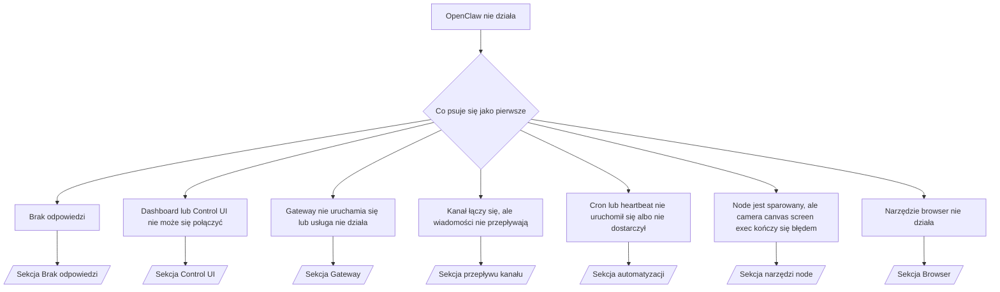

---
read_when:
    - OpenClaw nie działa i potrzebujesz najszybszej drogi do naprawy
    - Chcesz przejść przez proces triage, zanim zagłębisz się w szczegółowe runbooki
summary: Hub rozwiązywania problemów OpenClaw z podejściem opartym najpierw na objawach
title: Ogólne rozwiązywanie problemów
x-i18n:
    generated_at: "2026-04-05T13:56:11Z"
    model: gpt-5.4
    provider: openai
    source_hash: 23ae9638af5edf5a5e0584ccb15ba404223ac3b16c2d62eb93b2c9dac171c252
    source_path: help/troubleshooting.md
    workflow: 15
---

# Rozwiązywanie problemów

Jeśli masz tylko 2 minuty, użyj tej strony jako punktu wejścia do triage.

## Pierwsze 60 sekund

Uruchom dokładnie tę sekwencję po kolei:

```bash
openclaw status
openclaw status --all
openclaw gateway probe
openclaw gateway status
openclaw doctor
openclaw channels status --probe
openclaw logs --follow
```

Prawidłowy wynik w jednym wierszu:

- `openclaw status` → pokazuje skonfigurowane kanały i brak oczywistych błędów auth.
- `openclaw status --all` → pełny raport jest dostępny i można go udostępnić.
- `openclaw gateway probe` → oczekiwany cel gateway jest osiągalny (`Reachable: yes`). `RPC: limited - missing scope: operator.read` oznacza zdegradowaną diagnostykę, a nie błąd połączenia.
- `openclaw gateway status` → `Runtime: running` oraz `RPC probe: ok`.
- `openclaw doctor` → brak blokujących błędów config/usługi.
- `openclaw channels status --probe` → osiągalna gateway zwraca aktywny stan transportu dla każdego konta oraz wyniki probe/audytu, takie jak `works` lub `audit ok`; jeśli gateway jest nieosiągalna, polecenie wraca do podsumowań opartych tylko na config.
- `openclaw logs --follow` → stabilna aktywność, brak powtarzających się błędów krytycznych.

## Anthropic long context 429

Jeśli widzisz:
`HTTP 429: rate_limit_error: Extra usage is required for long context requests`,
przejdź do [/gateway/troubleshooting#anthropic-429-extra-usage-required-for-long-context](/gateway/troubleshooting#anthropic-429-extra-usage-required-for-long-context).

## Instalacja pluginu kończy się błędem z brakującymi rozszerzeniami openclaw

Jeśli instalacja kończy się błędem `package.json missing openclaw.extensions`, pakiet pluginu
używa starego formatu, którego OpenClaw już nie akceptuje.

Napraw w pakiecie pluginu:

1. Dodaj `openclaw.extensions` do `package.json`.
2. Skieruj wpisy do zbudowanych plików runtime (zwykle `./dist/index.js`).
3. Opublikuj plugin ponownie i jeszcze raz uruchom `openclaw plugins install <package>`.

Przykład:

```json
{
  "name": "@openclaw/my-plugin",
  "version": "1.2.3",
  "openclaw": {
    "extensions": ["./dist/index.js"]
  }
}
```

Informacje referencyjne: [Plugin architecture](/plugins/architecture)

## Drzewo decyzji



<AccordionGroup>
  <Accordion title="Brak odpowiedzi">
    ```bash
    openclaw status
    openclaw gateway status
    openclaw channels status --probe
    openclaw pairing list --channel <channel> [--account <id>]
    openclaw logs --follow
    ```

    Prawidłowy wynik wygląda tak:

    - `Runtime: running`
    - `RPC probe: ok`
    - Twój kanał pokazuje połączony transport i, tam gdzie jest to obsługiwane, `works` lub `audit ok` w `channels status --probe`
    - Nadawca widnieje jako zatwierdzony (lub polityka DM jest otwarta/allowlist)

    Typowe sygnatury w logach:

    - `drop guild message (mention required` → bramka mention zablokowała wiadomość w Discord.
    - `pairing request` → nadawca nie jest zatwierdzony i czeka na zatwierdzenie parowania DM.
    - `blocked` / `allowlist` w logach kanału → nadawca, pokój lub grupa są filtrowane.

    Szczegółowe strony:

    - [/gateway/troubleshooting#no-replies](/gateway/troubleshooting#no-replies)
    - [/channels/troubleshooting](/pl/channels/troubleshooting)
    - [/channels/pairing](/pl/channels/pairing)

  </Accordion>

  <Accordion title="Dashboard lub Control UI nie może się połączyć">
    ```bash
    openclaw status
    openclaw gateway status
    openclaw logs --follow
    openclaw doctor
    openclaw channels status --probe
    ```

    Prawidłowy wynik wygląda tak:

    - `Dashboard: http://...` jest pokazywane w `openclaw gateway status`
    - `RPC probe: ok`
    - Brak pętli auth w logach

    Typowe sygnatury w logach:

    - `device identity required` → kontekst HTTP/niebezpieczny nie może zakończyć auth urządzenia.
    - `origin not allowed` → `Origin` przeglądarki nie jest dozwolony dla celu gateway w Control UI.
    - `AUTH_TOKEN_MISMATCH` ze wskazówkami ponowienia (`canRetryWithDeviceToken=true`) → może automatycznie wystąpić jedna zaufana próba ponowienia z tokenem urządzenia.
    - To ponowienie z tokenem z cache używa ponownie zestawu zakresów z cache zapisanego wraz z tokenem sparowanego urządzenia. Wywołujący z jawnym `deviceToken` / jawnymi `scopes` zachowują zamiast tego żądany zestaw zakresów.
    - W asynchronicznej ścieżce Tailscale Serve Control UI nieudane próby dla tego samego
      `{scope, ip}` są serializowane, zanim limiter zapisze porażkę, więc
      druga równoległa zła próba może już pokazać `retry later`.
    - `too many failed authentication attempts (retry later)` z originu przeglądarki localhost → powtarzane błędy z tego samego `Origin` są tymczasowo blokowane; inny origin localhost używa osobnego bucketu.
    - powtarzające się `unauthorized` po tym ponowieniu → zły token/hasło, niedopasowanie trybu auth albo nieaktualny token sparowanego urządzenia.
    - `gateway connect failed:` → UI celuje w zły URL/port albo nieosiągalną gateway.

    Szczegółowe strony:

    - [/gateway/troubleshooting#dashboard-control-ui-connectivity](/gateway/troubleshooting#dashboard-control-ui-connectivity)
    - [/web/control-ui](/web/control-ui)
    - [/gateway/authentication](/gateway/authentication)

  </Accordion>

  <Accordion title="Gateway nie uruchamia się lub usługa jest zainstalowana, ale nie działa">
    ```bash
    openclaw status
    openclaw gateway status
    openclaw logs --follow
    openclaw doctor
    openclaw channels status --probe
    ```

    Prawidłowy wynik wygląda tak:

    - `Service: ... (loaded)`
    - `Runtime: running`
    - `RPC probe: ok`

    Typowe sygnatury w logach:

    - `Gateway start blocked: set gateway.mode=local` lub `existing config is missing gateway.mode` → tryb gateway to remote albo w pliku config brakuje stempla trybu lokalnego i należy go naprawić.
    - `refusing to bind gateway ... without auth` → powiązanie inne niż loopback bez prawidłowej ścieżki auth gateway (token/hasło lub trusted-proxy, jeśli skonfigurowano).
    - `another gateway instance is already listening` lub `EADDRINUSE` → port jest już zajęty.

    Szczegółowe strony:

    - [/gateway/troubleshooting#gateway-service-not-running](/gateway/troubleshooting#gateway-service-not-running)
    - [/gateway/background-process](/gateway/background-process)
    - [/gateway/configuration](/gateway/configuration)

  </Accordion>

  <Accordion title="Kanał łączy się, ale wiadomości nie przepływają">
    ```bash
    openclaw status
    openclaw gateway status
    openclaw logs --follow
    openclaw doctor
    openclaw channels status --probe
    ```

    Prawidłowy wynik wygląda tak:

    - Transport kanału jest połączony.
    - Kontrole pairing/allowlist przechodzą pomyślnie.
    - Wymagane mentions są wykrywane.

    Typowe sygnatury w logach:

    - `mention required` → bramka mention w grupie zablokowała przetwarzanie.
    - `pairing` / `pending` → nadawca DM nie został jeszcze zatwierdzony.
    - `not_in_channel`, `missing_scope`, `Forbidden`, `401/403` → problem z tokenem uprawnień kanału.

    Szczegółowe strony:

    - [/gateway/troubleshooting#channel-connected-messages-not-flowing](/gateway/troubleshooting#channel-connected-messages-not-flowing)
    - [/channels/troubleshooting](/pl/channels/troubleshooting)

  </Accordion>

  <Accordion title="Cron lub heartbeat nie uruchomił się albo nie dostarczył">
    ```bash
    openclaw status
    openclaw gateway status
    openclaw cron status
    openclaw cron list
    openclaw cron runs --id <jobId> --limit 20
    openclaw logs --follow
    ```

    Prawidłowy wynik wygląda tak:

    - `cron.status` pokazuje włączony stan i następne wybudzenie.
    - `cron runs` pokazuje ostatnie wpisy `ok`.
    - Heartbeat jest włączony i nie znajduje się poza godzinami aktywności.

    Typowe sygnatury w logach:

- `cron: scheduler disabled; jobs will not run automatically` → cron jest wyłączony.
- `heartbeat skipped` z `reason=quiet-hours` → poza skonfigurowanymi godzinami aktywności.
- `heartbeat skipped` z `reason=empty-heartbeat-file` → `HEARTBEAT.md` istnieje, ale zawiera tylko pusty/szablonowy nagłówek.
- `heartbeat skipped` z `reason=no-tasks-due` → aktywny jest tryb zadań `HEARTBEAT.md`, ale żaden z interwałów zadań nie jest jeszcze należny.
- `heartbeat skipped` z `reason=alerts-disabled` → cała widoczność heartbeat jest wyłączona (`showOk`, `showAlerts` i `useIndicator` są wszystkie wyłączone).
- `requests-in-flight` → pas main jest zajęty; wybudzenie heartbeat zostało odroczone. - `unknown accountId` → docelowe konto dostarczania heartbeat nie istnieje.

      Szczegółowe strony:

      - [/gateway/troubleshooting#cron-and-heartbeat-delivery](/gateway/troubleshooting#cron-and-heartbeat-delivery)
      - [/automation/cron-jobs#troubleshooting](/pl/automation/cron-jobs#troubleshooting)
      - [/gateway/heartbeat](/gateway/heartbeat)

    </Accordion>

    <Accordion title="Node jest sparowany, ale narzędzie camera canvas screen exec kończy się błędem">
      ```bash
      openclaw status
      openclaw gateway status
      openclaw nodes status
      openclaw nodes describe --node <idOrNameOrIp>
      openclaw logs --follow
      ```

      Prawidłowy wynik wygląda tak:

      - Node jest pokazany jako połączony i sparowany dla roli `node`.
      - Możliwość istnieje dla polecenia, które wywołujesz.
      - Stan uprawnień jest przyznany dla narzędzia.

      Typowe sygnatury w logach:

      - `NODE_BACKGROUND_UNAVAILABLE` → przenieś aplikację node na pierwszy plan.
      - `*_PERMISSION_REQUIRED` → uprawnienie systemowe zostało odrzucone lub go brakuje.
      - `SYSTEM_RUN_DENIED: approval required` → zatwierdzenie exec oczekuje.
      - `SYSTEM_RUN_DENIED: allowlist miss` → polecenia nie ma na allowlist exec.

      Szczegółowe strony:

      - [/gateway/troubleshooting#node-paired-tool-fails](/gateway/troubleshooting#node-paired-tool-fails)
      - [/nodes/troubleshooting](/nodes/troubleshooting)
      - [/tools/exec-approvals](/tools/exec-approvals)

    </Accordion>

    <Accordion title="Exec nagle prosi o zatwierdzenie">
      ```bash
      openclaw config get tools.exec.host
      openclaw config get tools.exec.security
      openclaw config get tools.exec.ask
      openclaw gateway restart
      ```

      Co się zmieniło:

      - Jeśli `tools.exec.host` nie jest ustawione, domyślna wartość to `auto`.
      - `host=auto` rozwiązuje się do `sandbox`, gdy aktywny jest runtime sandboxa, a w przeciwnym razie do `gateway`.
      - `host=auto` dotyczy tylko routingu; zachowanie „YOLO” bez pytań wynika z `security=full` plus `ask=off` na gateway/node.
      - Dla `gateway` i `node` nieustawione `tools.exec.security` domyślnie przyjmuje `full`.
      - Nieustawione `tools.exec.ask` domyślnie przyjmuje `off`.
      - Wynik: jeśli widzisz zatwierdzenia, jakaś lokalna dla hosta lub sesji polityka zaostrzyła exec w stosunku do bieżących ustawień domyślnych.

      Przywróć bieżące domyślne zachowanie bez zatwierdzeń:

      ```bash
      openclaw config set tools.exec.host gateway
      openclaw config set tools.exec.security full
      openclaw config set tools.exec.ask off
      openclaw gateway restart
      ```

      Bezpieczniejsze alternatywy:

      - Ustaw tylko `tools.exec.host=gateway`, jeśli chcesz po prostu stabilnego routingu hosta.
      - Użyj `security=allowlist` z `ask=on-miss`, jeśli chcesz exec na hoście, ale nadal chcesz przeglądu przy trafieniu poza allowlist.
      - Włącz tryb sandbox, jeśli chcesz, aby `host=auto` znów rozwiązywał się do `sandbox`.

      Typowe sygnatury w logach:

      - `Approval required.` → polecenie czeka na `/approve ...`.
      - `SYSTEM_RUN_DENIED: approval required` → zatwierdzenie exec dla hosta node oczekuje.
      - `exec host=sandbox requires a sandbox runtime for this session` → niejawny/jawny wybór sandboxa, ale tryb sandbox jest wyłączony.

      Szczegółowe strony:

      - [/tools/exec](/tools/exec)
      - [/tools/exec-approvals](/tools/exec-approvals)
      - [/gateway/security#runtime-expectation-drift](/gateway/security#runtime-expectation-drift)

    </Accordion>

    <Accordion title="Narzędzie browser nie działa">
      ```bash
      openclaw status
      openclaw gateway status
      openclaw browser status
      openclaw logs --follow
      openclaw doctor
      ```

      Prawidłowy wynik wygląda tak:

      - Status browser pokazuje `running: true` oraz wybraną przeglądarkę/profil.
      - `openclaw` uruchamia się, albo `user` widzi lokalne karty Chrome.

      Typowe sygnatury w logach:

      - `unknown command "browser"` lub `unknown command 'browser'` → ustawiono `plugins.allow` i nie zawiera ono `browser`.
      - `Failed to start Chrome CDP on port` → nie udało się uruchomić lokalnej przeglądarki.
      - `browser.executablePath not found` → skonfigurowana ścieżka binarki jest błędna.
      - `browser.cdpUrl must be http(s) or ws(s)` → skonfigurowany URL CDP używa nieobsługiwanego schematu.
      - `browser.cdpUrl has invalid port` → skonfigurowany URL CDP ma błędny lub spoza zakresu port.
      - `No Chrome tabs found for profile="user"` → profil attach Chrome MCP nie ma otwartych lokalnych kart Chrome.
      - `Remote CDP for profile "<name>" is not reachable` → skonfigurowany zdalny endpoint CDP jest nieosiągalny z tego hosta.
      - `Browser attachOnly is enabled ... not reachable` lub `Browser attachOnly is enabled and CDP websocket ... is not reachable` → profil tylko dołączania nie ma aktywnego celu CDP.
      - nieaktualne nadpisania viewport / dark-mode / locale / offline na profilach attach-only lub remote CDP → uruchom `openclaw browser stop --browser-profile <name>`, aby zamknąć aktywną sesję sterowania i zwolnić stan emulacji bez restartu gateway.

      Szczegółowe strony:

      - [/gateway/troubleshooting#browser-tool-fails](/gateway/troubleshooting#browser-tool-fails)
      - [/tools/browser#missing-browser-command-or-tool](/tools/browser#missing-browser-command-or-tool)
      - [/tools/browser-linux-troubleshooting](/tools/browser-linux-troubleshooting)
      - [/tools/browser-wsl2-windows-remote-cdp-troubleshooting](/tools/browser-wsl2-windows-remote-cdp-troubleshooting)

    </Accordion>
  </AccordionGroup>

## Powiązane

- [FAQ](/help/faq) — często zadawane pytania
- [Gateway Troubleshooting](/gateway/troubleshooting) — problemy specyficzne dla gateway
- [Doctor](/gateway/doctor) — automatyczne kontrole kondycji i naprawy
- [Channel Troubleshooting](/pl/channels/troubleshooting) — problemy z łącznością kanałów
- [Automation Troubleshooting](/pl/automation/cron-jobs#troubleshooting) — problemy z cron i heartbeat
