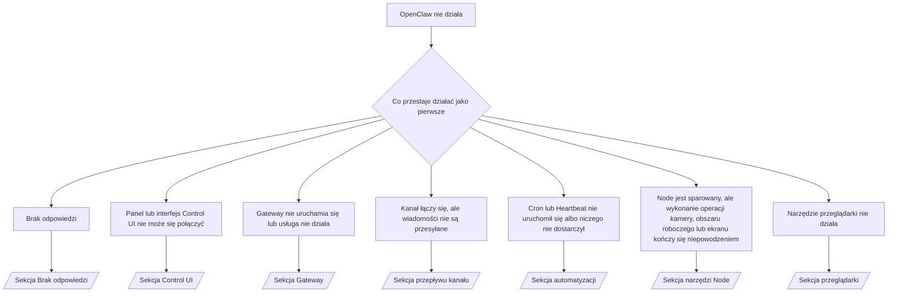

---
read_when:
    - OpenClaw nie działa i potrzebujesz najszybszego sposobu rozwiązania problemu
    - Potrzebujesz procesu segregacji przed zagłębieniem się w szczegółowe procedury operacyjne
summary: Centrum rozwiązywania problemów z OpenClaw zorientowane na objawy
title: Ogólne rozwiązywanie problemów
x-i18n:
    generated_at: "2026-07-12T15:13:12Z"
    model: gpt-5.6
    postprocess_version: locale-links-v1
    provider: openai
    source_hash: db50e0cdf4d11f3aa6196be445358d904a2b9c40c89243f1b124c77167f6dd85
    source_path: help/troubleshooting.md
    workflow: 16
---

Punkt wejścia do diagnostyki. 2 minuty do rozpoznania problemu, a następnie przejście do szczegółowej strony.

## Pierwsze 60 sekund

Wykonaj kolejno następujące polecenia:

```bash
openclaw status
openclaw status --all
openclaw gateway probe
openclaw gateway status
openclaw doctor
openclaw channels status --probe
openclaw logs --follow
```

Prawidłowe wyniki, po jednym wierszu dla każdego polecenia:

- `openclaw status` pokazuje skonfigurowane kanały bez błędów uwierzytelniania.
- `openclaw status --all` generuje pełny raport, który można udostępnić.
- `openclaw gateway probe` pokazuje `Reachable: yes`. `Capability: ...` to
  poziom uwierzytelnienia potwierdzony przez sondę; `Read probe: limited - missing scope:
operator.read` oznacza ograniczoną diagnostykę, a nie błąd połączenia.
- `openclaw gateway status` pokazuje `Runtime: running`, `Connectivity probe:
ok` oraz wiarygodną wartość `Capability: ...`. Dodaj `--require-rpc`, aby wymagać również
  potwierdzenia RPC z zakresem odczytu.
- `openclaw doctor` nie zgłasza blokujących błędów konfiguracji ani usługi.
- `openclaw channels status --probe` zwraca bieżący stan transportu dla każdego konta
  (`works` / `audit ok`), gdy Gateway jest osiągalny; w przeciwnym razie
  używa podsumowań opartych wyłącznie na konfiguracji.
- `openclaw logs --follow` pokazuje stabilną aktywność bez powtarzających się błędów krytycznych.

## Asystent wydaje się ograniczony lub brakuje mu narzędzi

Sprawdź obowiązujący profil narzędzi:

```bash
openclaw status
openclaw status --all
openclaw doctor
```

Typowe przyczyny:

- `tools.profile: "minimal"` zezwala tylko na `session_status`.
- `tools.profile: "messaging"` ma ograniczony zakres i jest przeznaczony dla agentów obsługujących wyłącznie czat.
- `tools.profile: "coding"` jest profilem domyślnym dla nowych konfiguracji lokalnych (praca
  z repozytorium, plikami, powłoką i środowiskiem uruchomieniowym).
- `tools.profile: "full"` usuwa ograniczenia profilu; używaj go wyłącznie dla zaufanych
  agentów kontrolowanych przez operatora.
- Ustawienie `agents.list[].tools` dla konkretnego agenta zawęża lub rozszerza profil główny
  dla tego agenta.

Zmień profil, uruchom ponownie lub przeładuj Gateway, a następnie ponownie sprawdź go za pomocą
`openclaw status --all`. Pełna tabela profili i grup: [Profile narzędzi](/pl/gateway/config-tools#tool-profiles).

## Długi kontekst Anthropic — błąd 429

`HTTP 429: rate_limit_error: Extra usage is required for long context requests`
→ [Błąd Anthropic 429 — długi kontekst wymaga dodatkowego użycia](/pl/gateway/troubleshooting#anthropic-429-extra-usage-required-for-long-context).

## Lokalny backend zgodny z OpenAI działa bezpośrednio, ale nie działa w OpenClaw

Lokalny/samodzielnie hostowany backend `/v1` odpowiada na bezpośrednie sondy
`/v1/chat/completions`, ale nie działa z poleceniem `openclaw infer model run` ani podczas zwykłych tur agenta:

1. Jeśli błąd wskazuje, że `messages[].content` oczekuje ciągu znaków, ustaw
   `models.providers.<provider>.models[].compat.requiresStringContent: true`.
2. Jeśli nadal nie działają wyłącznie tury agenta OpenClaw, ustaw
   `models.providers.<provider>.models[].compat.supportsTools: false` i spróbuj ponownie.
3. Jeśli małe wywołania bezpośrednie działają, ale większe prompty OpenClaw powodują awarię backendu,
   jest to ograniczenie nadrzędnego modelu lub serwera, a nie błąd OpenClaw. Kontynuuj na stronie
   [Lokalny backend zgodny z OpenAI przechodzi bezpośrednie sondy, ale uruchomienia agenta kończą się niepowodzeniem](/pl/gateway/troubleshooting#local-openai-compatible-backend-passes-direct-probes-but-agent-runs-fail).

## Instalacja Pluginu kończy się niepowodzeniem z powodu braku rozszerzeń OpenClaw

`package.json missing openclaw.extensions` oznacza, że pakiet Pluginu używa
struktury, której OpenClaw już nie akceptuje.

Napraw pakiet Pluginu:

1. Dodaj `openclaw.extensions` do pliku `package.json`, wskazując zbudowane pliki
   środowiska uruchomieniowego (zwykle `./dist/index.js`).
2. Opublikuj pakiet ponownie, a następnie jeszcze raz uruchom `openclaw plugins install <package>`.

```json
{
  "name": "@openclaw/my-plugin",
  "version": "1.2.3",
  "openclaw": {
    "extensions": ["./dist/index.js"]
  }
}
```

Materiały referencyjne: [Architektura Pluginów](/pl/plugins/architecture)

## Zasady instalacji blokują instalowanie lub aktualizowanie Pluginów

Aktualizacja kończy się, ale Pluginy są nieaktualne, wyłączone albo wyświetlają komunikat `blocked by install
policy`, `install policy failed closed` lub `Disabled "<plugin>" after plugin
update failure`: sprawdź `security.installPolicy`.

Zasady instalacji są stosowane podczas instalowania i aktualizowania Pluginów. Wersje Pluginów
`@openclaw/*` zwykle zmieniają się wraz z wydaniem OpenClaw, dlatego aktualizacja OpenClaw może
wymagać odpowiedniej aktualizacji Pluginów podczas synchronizacji po aktualizacji.

Unikaj następujących postaci zasad, chyba że utrzymujesz również odpowiednią regułę aktualizacji:

- Blokowanie Pluginów należących do OpenClaw na jednej, dokładnie określonej starej wersji (na przykład tylko
  `@openclaw/*@2026.5.3`).
- Blokowanie wyłącznie według rodzaju źródła (każde żądanie npm, sieciowe lub `request.mode:
"update"`).
- Traktowanie polecenia zasad jako opcjonalnego: gdy `security.installPolicy` jest
  włączone, brak pliku wykonywalnego zasad, jego powolne działanie, brak możliwości odczytu lub blokada uprawnień
  powodują bezpieczne odrzucenie operacji.
- Zatwierdzanie wersji bez sprawdzenia wartości `openclawVersion` z żądania
  względem metadanych kandydata na Plugin.

Preferuj reguły zezwalające na zaufane aktualizacje `@openclaw/*` zgodne z
bieżącym hostem zamiast trwałego przypinania jednej wersji. Jeśli domyślnie blokujesz npm,
dodaj wąski wyjątek dla używanych identyfikatorów Pluginów i zastosuj tę samą
regułę zaufania do `request.mode: "update"` co do instalacji.

Odzyskiwanie:

```bash
openclaw doctor --deep
openclaw plugins update --all
openclaw status --all
```

Jeśli zasady są celowo restrykcyjne, poluzuj je na czas zaufanej
aktualizacji, ponownie uruchom `openclaw plugins update --all`, a następnie przywróć bardziej restrykcyjną regułę.
Jeśli niepowodzenie aktualizacji spowodowało wyłączenie Pluginu, sprawdź go przed ponownym włączeniem:

```bash
openclaw plugins inspect <plugin-id> --runtime --json
openclaw plugins enable <plugin-id>
```

Materiały referencyjne: [Zasady instalacji operatora](/pl/tools/skills-config#operator-install-policy-securityinstallpolicy)

## Plugin jest obecny, ale zablokowany z powodu podejrzanego właściciela

Polecenie `openclaw doctor`, konfiguracja lub ostrzeżenia podczas uruchamiania pokazują:

```text
blocked plugin candidate: suspicious ownership (... uid=1000, expected uid=0 or root)
plugin present but blocked
```

Pliki Pluginu należą do innego użytkownika systemu Unix niż proces, który je ładuje.
Nie usuwaj konfiguracji Pluginu; popraw właściciela plików albo uruchom
OpenClaw jako użytkownik będący właścicielem katalogu stanu.

Instalacje Docker działają jako `node` (uid `1000`). Napraw montowania powiązane z hosta:

```bash
sudo chown -R 1000:1000 /path/to/openclaw-config /path/to/openclaw-workspace
openclaw doctor --fix
```

Jeśli celowo uruchamiasz OpenClaw jako użytkownik root, napraw zamiast tego zarządzany katalog główny Pluginów:

```bash
sudo chown -R root:root /path/to/openclaw-config/npm
openclaw doctor --fix
```

Szczegółowa dokumentacja: [Zablokowany właściciel ścieżki Pluginu](/pl/tools/plugin#blocked-plugin-path-ownership), [Docker: uprawnienia i EACCES](/pl/install/docker#shell-helpers-optional)

## Drzewo decyzyjne



<AccordionGroup>
  <Accordion title="Brak odpowiedzi">
    ```bash
    openclaw status
    openclaw gateway status
    openclaw channels status --probe
    openclaw pairing list --channel <channel> [--account <id>]
    openclaw logs --follow
    ```

    Prawidłowy wynik:

    - `Runtime: running`
    - `Connectivity probe: ok`
    - `Capability: read-only`, `write-capable` lub `admin-capable`
    - Kanał pokazuje połączenie transportu oraz, jeśli jest to obsługiwane, `works` lub
      `audit ok` w wyniku `channels status --probe`
    - Nadawca jest zatwierdzony (lub zasady wiadomości bezpośrednich są otwarte albo korzystają z listy dozwolonych)

    Sygnatury dziennika:

    - `drop guild message (mention required` → wymóg wzmianki w Discord zablokował wiadomość.
    - `pairing request` → nadawca nie został zatwierdzony; oczekiwanie na zatwierdzenie parowania wiadomości bezpośrednich.
    - `blocked` / `allowlist` w dziennikach kanału → nadawca, pokój lub grupa zostały odfiltrowane.

    Szczegółowe strony: [Brak odpowiedzi](/pl/gateway/troubleshooting#no-replies), [Rozwiązywanie problemów z kanałami](/pl/channels/troubleshooting), [Parowanie](/pl/channels/pairing)

  </Accordion>

  <Accordion title="Panel lub interfejs Control UI nie może się połączyć">
    ```bash
    openclaw status
    openclaw gateway status
    openclaw logs --follow
    openclaw doctor
    openclaw channels status --probe
    ```

    Prawidłowy wynik:

    - `Dashboard: http://...` jest widoczny w wyniku `openclaw gateway status`
    - `Connectivity probe: ok`
    - `Capability: read-only`, `write-capable` lub `admin-capable`
    - Brak pętli uwierzytelniania w dziennikach

    Sygnatury dziennika:

    - `device identity required` → kontekst HTTP/niezabezpieczony nie może ukończyć uwierzytelniania urządzenia.
    - `origin not allowed` → wartość `Origin` przeglądarki nie jest dozwolona dla docelowego Gateway interfejsu Control UI.
    - `AUTH_TOKEN_MISMATCH` z `canRetryWithDeviceToken=true` → może automatycznie nastąpić jedna próba z zaufanym tokenem urządzenia, wykorzystująca zakresy zapisane w pamięci podręcznej sparowanego tokenu.
    - powtarzające się `unauthorized` po tej próbie → nieprawidłowy token lub hasło, niezgodny tryb uwierzytelniania albo nieaktualny token sparowanego urządzenia.
    - `too many failed authentication attempts (retry later)` → powtarzające się niepowodzenia z tej wartości `Origin` przeglądarki są tymczasowo blokowane; inne źródła localhost korzystają z oddzielnych limitów. Informacje o niuansach równoczesnych ponownych prób Tailscale Serve znajdziesz w sekcji [Łączność panelu/interfejsu Control UI](/pl/gateway/troubleshooting#dashboard-control-ui-connectivity).
    - `gateway connect failed:` → interfejs użytkownika wskazuje nieprawidłowy adres URL lub port albo Gateway jest nieosiągalny.

    Szczegółowe strony: [Łączność panelu/interfejsu Control UI](/pl/gateway/troubleshooting#dashboard-control-ui-connectivity), [Control UI](/pl/web/control-ui), [Uwierzytelnianie](/pl/gateway/authentication)

  </Accordion>

  <Accordion title="Gateway nie uruchamia się lub zainstalowana usługa nie działa">
    ```bash
    openclaw status
    openclaw gateway status
    openclaw logs --follow
    openclaw doctor
    openclaw channels status --probe
    ```

    Prawidłowy wynik:

    - `Service: ... (loaded)`
    - `Runtime: running`
    - `Connectivity probe: ok`
    - `Capability: read-only`, `write-capable` lub `admin-capable`

    Sygnatury dziennika:

    - `Gateway start blocked: set gateway.mode=local` lub `existing config is missing gateway.mode` → tryb Gateway jest zdalny albo w konfiguracji brakuje oznaczenia trybu lokalnego i wymaga ona naprawy.
    - `refusing to bind gateway ... without auth` → powiązanie z adresem innym niż lokalna pętla zwrotna bez prawidłowej ścieżki uwierzytelniania (token/hasło lub skonfigurowane zaufane proxy).
    - `another gateway instance is already listening` lub `EADDRINUSE` → port jest już zajęty.

    Szczegółowe strony: [Usługa Gateway nie działa](/pl/gateway/troubleshooting#gateway-service-not-running), [Proces w tle](/pl/gateway/background-process), [Konfiguracja](/pl/gateway/configuration)

  </Accordion>

  <Accordion title="Kanał łączy się, ale wiadomości nie są przesyłane">
    ```bash
    openclaw status
    openclaw gateway status
    openclaw logs --follow
    openclaw doctor
    openclaw channels status --probe
    ```

    Prawidłowy wynik:

    - Transport kanału jest połączony.
    - Kontrole parowania/listy dozwolonych kończą się pomyślnie.
    - Wzmianki są wykrywane tam, gdzie są wymagane.

    Sygnatury dziennika:

    - `mention required` → wymóg wzmianki w grupie zablokował przetwarzanie.
    - `pairing` / `pending` → nadawca wiadomości bezpośredniej nie został jeszcze zatwierdzony.
    - `not_in_channel`, `missing_scope`, `Forbidden`, `401/403` → problem z tokenem uprawnień kanału.

    Szczegółowe strony: [Kanał jest połączony, ale wiadomości nie są przesyłane](/pl/gateway/troubleshooting#channel-connected-messages-not-flowing), [Rozwiązywanie problemów z kanałami](/pl/channels/troubleshooting)

  </Accordion>

  <Accordion title="Cron lub Heartbeat nie uruchomił się albo niczego nie dostarczył">
    ```bash
    openclaw status
    openclaw gateway status
    openclaw cron status
    openclaw cron list
    openclaw cron runs --id <jobId> --limit 20
    openclaw logs --follow
    ```

    Prawidłowy wynik:

    - `cron status` pokazuje włączony harmonogram oraz czas następnego wybudzenia.
    - `cron runs` pokazuje ostatnie wpisy `ok`.
    - Heartbeat jest włączony i mieści się w aktywnych godzinach.

    Sygnatury dziennika:

    - `cron: scheduler disabled; jobs will not run automatically` → Cron jest wyłączony.
    - `heartbeat skipped` z powodem `quiet-hours` → poza skonfigurowanymi godzinami aktywności.
    - `heartbeat skipped` z powodem `empty-heartbeat-file` → plik `HEARTBEAT.md` istnieje, ale zawiera wyłącznie puste wiersze, komentarze, nagłówki, ograniczniki bloków kodu lub szkielet pustej listy kontrolnej.
    - `heartbeat skipped` z powodem `no-tasks-due` → tryb zadań jest aktywny, ale nie nadszedł jeszcze termin wykonania żadnego zadania.
    - `heartbeat skipped` z powodem `alerts-disabled` → opcje `showOk`, `showAlerts` i `useIndicator` są wyłączone.
    - `requests-in-flight` → główna ścieżka jest zajęta; wybudzenie Heartbeat zostało odroczone.
    - `unknown accountId` → konto docelowe dostarczania Heartbeat nie istnieje.

    Szczegółowe strony: [Dostarczanie Cron i Heartbeat](/pl/gateway/troubleshooting#cron-and-heartbeat-delivery), [Zaplanowane zadania: rozwiązywanie problemów](/pl/automation/cron-jobs#troubleshooting), [Heartbeat](/pl/gateway/heartbeat)

  </Accordion>

  <Accordion title="Node jest sparowany, ale narzędzie kamery, obszaru roboczego, ekranu lub wykonywania poleceń nie działa">
    ```bash
    openclaw status
    openclaw gateway status
    openclaw nodes status
    openclaw nodes describe --node <idOrNameOrIp>
    openclaw logs --follow
    ```

    Prawidłowe dane wyjściowe:

    - Node jest wymieniony jako połączony i sparowany dla roli `node`.
    - Funkcja wymagana przez wywoływane polecenie jest dostępna.
    - Narzędzie ma przyznane wymagane uprawnienia.

    Charakterystyczne wpisy w dzienniku:

    - `NODE_BACKGROUND_UNAVAILABLE` → przenieś aplikację Node na pierwszy plan.
    - `*_PERMISSION_REQUIRED` → brakuje uprawnienia systemu operacyjnego lub odmówiono jego przyznania.
    - `SYSTEM_RUN_DENIED: approval required` → oczekuje zatwierdzenie wykonania polecenia.
    - `SYSTEM_RUN_DENIED: allowlist miss` → polecenia nie ma na liście dozwolonych poleceń wykonywania.

    Szczegółowe strony: [Node sparowany, narzędzie nie działa](/pl/gateway/troubleshooting#node-paired-tool-fails), [Rozwiązywanie problemów z Node](/pl/nodes/troubleshooting), [Zatwierdzanie wykonywania poleceń](/pl/tools/exec-approvals)

  </Accordion>

  <Accordion title="Wykonywanie poleceń nagle wymaga zatwierdzenia">
    ```bash
    openclaw config get tools.exec.host
    openclaw config get tools.exec.security
    openclaw config get tools.exec.ask
    openclaw gateway restart
    ```

    Co się zmieniło:

    - Nieustawiona opcja `tools.exec.host` ma domyślną wartość `auto`, która wskazuje `sandbox`,
      gdy środowisko uruchomieniowe piaskownicy jest aktywne, a w przeciwnym razie `gateway`.
    - `host=auto` odpowiada tylko za trasowanie; działanie bez monitów wynika z ustawień
      `security=full` oraz `ask=off` w Gateway lub Node.
    - Nieustawiona opcja `tools.exec.security` ma domyślną wartość `full` w `gateway`/`node`.
    - Nieustawiona opcja `tools.exec.ask` ma domyślną wartość `off`.
    - Jeśli pojawiają się prośby o zatwierdzenie, zasady lokalne hosta lub danej sesji
      zaostrzyły wykonywanie poleceń względem tych wartości domyślnych.

    Przywróć bieżące ustawienia domyślne niewymagające zatwierdzenia:

    ```bash
    openclaw config set tools.exec.host gateway
    openclaw config set tools.exec.security full
    openclaw config set tools.exec.ask off
    openclaw gateway restart
    ```

    Bezpieczniejsze rozwiązania alternatywne:

    - Ustaw tylko `tools.exec.host=gateway`, aby zapewnić stabilne trasowanie do hosta.
    - Użyj `security=allowlist` z `ask=on-miss`, aby wykonywać polecenia na hoście z weryfikacją
      poleceń nieobecnych na liście dozwolonych.
    - Włącz tryb piaskownicy, aby `host=auto` ponownie wskazywało `sandbox`.

    Charakterystyczne wpisy w dzienniku:

    - `Approval required.` → polecenie oczekuje na `/approve ...`.
    - `SYSTEM_RUN_DENIED: approval required` → oczekuje zatwierdzenie wykonania polecenia na hoście Node.
    - `exec host=sandbox requires a sandbox runtime for this session` → wybrano piaskownicę niejawnie lub jawnie, ale tryb piaskownicy jest wyłączony.

    Szczegółowe strony: [Wykonywanie poleceń](/pl/tools/exec), [Zatwierdzanie wykonywania poleceń](/pl/tools/exec-approvals), [Bezpieczeństwo: co sprawdza audyt](/pl/gateway/security#what-the-audit-checks-high-level)

  </Accordion>

  <Accordion title="Narzędzie przeglądarki nie działa">
    ```bash
    openclaw status
    openclaw gateway status
    openclaw browser status
    openclaw logs --follow
    openclaw doctor
    ```

    Prawidłowe dane wyjściowe:

    - Stan przeglądarki wskazuje `running: true` oraz wybraną przeglądarkę i profil.
    - Profil `openclaw` uruchamia się albo profil `user` widzi lokalne karty Chrome.

    Charakterystyczne wpisy w dzienniku:

    - `unknown command "browser"` → ustawiono `plugins.allow`, które nie zawiera `browser`.
    - `Failed to start Chrome CDP on port` → nie udało się uruchomić lokalnej przeglądarki.
    - `browser.executablePath not found` → skonfigurowana ścieżka do pliku wykonywalnego jest nieprawidłowa.
    - `browser.cdpUrl must be http(s) or ws(s)` → skonfigurowany adres URL CDP używa nieobsługiwanego schematu.
    - `browser.cdpUrl has invalid port` → skonfigurowany adres URL CDP zawiera nieprawidłowy port lub port spoza dozwolonego zakresu.
    - `No Chrome tabs found for profile="user"` → profil dołączania Chrome MCP nie ma otwartych lokalnych kart Chrome.
    - `Remote CDP for profile "<name>" is not reachable` → skonfigurowany zdalny punkt końcowy CDP jest nieosiągalny z tego hosta.
    - `Browser attachOnly is enabled ... not reachable` → profil służący wyłącznie do dołączania nie ma aktywnego celu CDP.
    - Nieaktualne ustawienia widoku, trybu ciemnego, języka lub trybu offline w profilach służących wyłącznie do dołączania albo zdalnych profilach CDP → uruchom `openclaw browser stop --browser-profile <name>`, aby zamknąć sesję sterowania i zwolnić stan emulacji bez ponownego uruchamiania Gateway.

    Szczegółowe strony: [Narzędzie przeglądarki nie działa](/pl/gateway/troubleshooting#browser-tool-fails), [Brak polecenia lub narzędzia przeglądarki](/pl/tools/browser#missing-browser-command-or-tool), [Przeglądarka: rozwiązywanie problemów w systemie Linux](/pl/tools/browser-linux-troubleshooting), [Przeglądarka: rozwiązywanie problemów ze zdalnym CDP w WSL2/Windows](/pl/tools/browser-wsl2-windows-remote-cdp-troubleshooting)

  </Accordion>

</AccordionGroup>

## Powiązane

- [Często zadawane pytania](/pl/help/faq) — często zadawane pytania
- [Rozwiązywanie problemów z Gateway](/pl/gateway/troubleshooting) — problemy dotyczące Gateway
- [Doctor](/pl/gateway/doctor) — automatyczne kontrole stanu i naprawy
- [Rozwiązywanie problemów z kanałami](/pl/channels/troubleshooting) — problemy z łącznością kanałów
- [Zaplanowane zadania: rozwiązywanie problemów](/pl/automation/cron-jobs#troubleshooting) — problemy z Cron i Heartbeat
