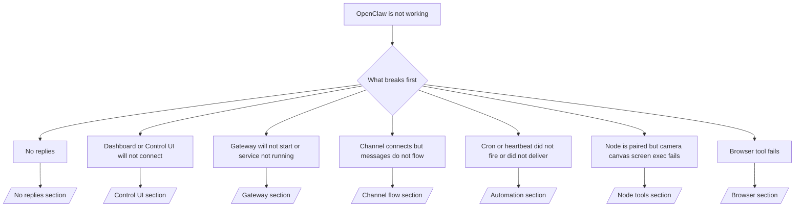

---
read_when:
    - OpenClaw nie działa i potrzebujesz najszybszej drogi do rozwiązania խնդիրը
    - Chcesz przejść przez proces triage, zanim zagłębisz się w szczegółowe runbooki
summary: Centrum rozwiązywania problemów OpenClaw z podejściem opartym najpierw na objawach
title: Ogólne rozwiązywanie problemów
x-i18n:
    generated_at: "2026-04-24T09:15:08Z"
    model: gpt-5.4
    provider: openai
    source_hash: c832c3f7609c56a5461515ed0f693d2255310bf2d3958f69f57c482bcbef97f0
    source_path: help/troubleshooting.md
    workflow: 15
---

Jeśli masz tylko 2 minuty, użyj tej strony jako punktu wejścia do triage.

## Pierwsze 60 sekund

Uruchom dokładnie tę drabinę poleceń w tej kolejności:

```bash
openclaw status
openclaw status --all
openclaw gateway probe
openclaw gateway status
openclaw doctor
openclaw channels status --probe
openclaw logs --follow
```

Dobre wyjście w jednym wierszu:

- `openclaw status` → pokazuje skonfigurowane kanały i brak oczywistych błędów uwierzytelniania.
- `openclaw status --all` → pełny raport jest dostępny i można go udostępnić.
- `openclaw gateway probe` → oczekiwany cel Gateway jest osiągalny (`Reachable: yes`). `Capability: ...` mówi, jaki poziom uwierzytelniania udało się sondzie potwierdzić, a `Read probe: limited - missing scope: operator.read` oznacza ograniczoną diagnostykę, a nie błąd połączenia.
- `openclaw gateway status` → `Runtime: running`, `Connectivity probe: ok` i wiarygodny wiersz `Capability: ...`. Użyj `--require-rpc`, jeśli potrzebujesz także potwierdzenia RPC z zakresem odczytu.
- `openclaw doctor` → brak blokujących błędów konfiguracji/usługi.
- `openclaw channels status --probe` → osiągalna Gateway zwraca aktywny stan transportu per konto oraz wyniki probe/audytu takie jak `works` albo `audit ok`; jeśli Gateway jest nieosiągalna, polecenie wraca do podsumowań opartych tylko na konfiguracji.
- `openclaw logs --follow` → stabilna aktywność, brak powtarzających się błędów krytycznych.

## Anthropic long context 429

Jeśli widzisz:
`HTTP 429: rate_limit_error: Extra usage is required for long context requests`,
przejdź do [/gateway/troubleshooting#anthropic-429-extra-usage-required-for-long-context](/pl/gateway/troubleshooting#anthropic-429-extra-usage-required-for-long-context).

## Lokalny backend zgodny z OpenAI działa bezpośrednio, ale nie działa w OpenClaw

Jeśli twój lokalny albo self-hosted backend `/v1` odpowiada na małe bezpośrednie
sondy `/v1/chat/completions`, ale nie działa przy `openclaw infer model run` albo zwykłych
turach agenta:

1. Jeśli błąd wspomina o `messages[].content` oczekującym ciągu, ustaw
   `models.providers.<provider>.models[].compat.requiresStringContent: true`.
2. Jeśli backend nadal nie działa tylko przy turach agenta OpenClaw, ustaw
   `models.providers.<provider>.models[].compat.supportsTools: false` i spróbuj ponownie.
3. Jeśli małe bezpośrednie wywołania nadal działają, ale większe prompty OpenClaw powodują awarię
   backendu, traktuj pozostały problem jako ograniczenie modelu/serwera upstream i
   przejdź do szczegółowego runbooka:
   [/gateway/troubleshooting#local-openai-compatible-backend-passes-direct-probes-but-agent-runs-fail](/pl/gateway/troubleshooting#local-openai-compatible-backend-passes-direct-probes-but-agent-runs-fail)

## Instalacja Pluginu kończy się błędem z powodu braku openclaw extensions

Jeśli instalacja kończy się błędem `package.json missing openclaw.extensions`, pakiet Pluginu
używa starego kształtu, którego OpenClaw już nie akceptuje.

Napraw to w pakiecie Pluginu:

1. Dodaj `openclaw.extensions` do `package.json`.
2. Wskaż wpisy na zbudowane pliki runtime (zwykle `./dist/index.js`).
3. Opublikuj Plugin ponownie i uruchom `openclaw plugins install <package>` jeszcze raz.

Przykład:

```json
{
  "name": "@openclaw/my-plugin",
  "version": "1.2.3",
  "openclaw": {
    "extensions": ["./dist/index.js"]
  }
}
```

Dokumentacja: [Architektura Pluginów](/pl/plugins/architecture)

## Drzewo decyzyjne



<AccordionGroup>
  <Accordion title="Brak odpowiedzi">
    ```bash
    openclaw status
    openclaw gateway status
    openclaw channels status --probe
    openclaw pairing list --channel <channel> [--account <id>]
    openclaw logs --follow
    ```

    Dobre wyjście wygląda tak:

    - `Runtime: running`
    - `Connectivity probe: ok`
    - `Capability: read-only`, `write-capable` albo `admin-capable`
    - Twój kanał pokazuje połączony transport i, tam gdzie jest to obsługiwane, `works` albo `audit ok` w `channels status --probe`
    - Nadawca jest zatwierdzony (albo zasady DM są open/allowlist)

    Typowe sygnatury logów:

    - `drop guild message (mention required` → blokada wzmianek zatrzymała wiadomość w Discord.
    - `pairing request` → nadawca nie jest zatwierdzony i czeka na zatwierdzenie parowania DM.
    - `blocked` / `allowlist` w logach kanału → nadawca, pokój albo grupa są filtrowane.

    Szczegółowe strony:

    - [/gateway/troubleshooting#no-replies](/pl/gateway/troubleshooting#no-replies)
    - [/channels/troubleshooting](/pl/channels/troubleshooting)
    - [/channels/pairing](/pl/channels/pairing)

  </Accordion>

  <Accordion title="Dashboard albo Control UI nie mogą się połączyć">
    ```bash
    openclaw status
    openclaw gateway status
    openclaw logs --follow
    openclaw doctor
    openclaw channels status --probe
    ```

    Dobre wyjście wygląda tak:

    - `Dashboard: http://...` jest widoczne w `openclaw gateway status`
    - `Connectivity probe: ok`
    - `Capability: read-only`, `write-capable` albo `admin-capable`
    - Brak pętli uwierzytelniania w logach

    Typowe sygnatury logów:

    - `device identity required` → HTTP/niebezpieczny kontekst nie może ukończyć uwierzytelniania urządzenia.
    - `origin not allowed` → `Origin` przeglądarki nie jest dozwolony dla celu Gateway Control UI
    - `AUTH_TOKEN_MISMATCH` z podpowiedziami ponowienia (`canRetryWithDeviceToken=true`) → jedno ponowienie z użyciem zaufanego tokena urządzenia może zostać wykonane automatycznie.
    - To ponowienie z użyciem tokena z cache wykorzystuje zestaw zakresów zapisany razem ze sparowanym tokenem urządzenia. Wywołania z jawnym `deviceToken` / jawnym `scopes` zachowują żądany zestaw zakresów.
    - W asynchronicznej ścieżce Tailscale Serve Control UI nieudane próby dla tego samego
      `{scope, ip}` są serializowane, zanim limiter zapisze błąd, więc drugie równoczesne błędne ponowienie może już pokazać `retry later`.
    - `too many failed authentication attempts (retry later)` z localhostowego originu przeglądarki → powtarzające się błędy z tego samego `Origin` są tymczasowo blokowane; inny localhostowy origin używa osobnego zasobnika.
    - powtarzające się `unauthorized` po tym ponowieniu → zły token/hasło, niedopasowanie trybu auth albo nieaktualny sparowany token urządzenia.
    - `gateway connect failed:` → interfejs celuje w zły URL/port albo nieosiągalną Gateway.

    Szczegółowe strony:

    - [/gateway/troubleshooting#dashboard-control-ui-connectivity](/pl/gateway/troubleshooting#dashboard-control-ui-connectivity)
    - [/web/control-ui](/pl/web/control-ui)
    - [/gateway/authentication](/pl/gateway/authentication)

  </Accordion>

  <Accordion title="Gateway nie uruchamia się albo usługa jest zainstalowana, ale nie działa">
    ```bash
    openclaw status
    openclaw gateway status
    openclaw logs --follow
    openclaw doctor
    openclaw channels status --probe
    ```

    Dobre wyjście wygląda tak:

    - `Service: ... (loaded)`
    - `Runtime: running`
    - `Connectivity probe: ok`
    - `Capability: read-only`, `write-capable` albo `admin-capable`

    Typowe sygnatury logów:

    - `Gateway start blocked: set gateway.mode=local` albo `existing config is missing gateway.mode` → tryb Gateway jest zdalny albo w pliku konfiguracji brakuje oznaczenia trybu lokalnego i należy go naprawić.
    - `refusing to bind gateway ... without auth` → bind poza loopback bez prawidłowej ścieżki uwierzytelniania Gateway (token/hasło albo trusted-proxy tam, gdzie skonfigurowano).
    - `another gateway instance is already listening` albo `EADDRINUSE` → port jest już zajęty.

    Szczegółowe strony:

    - [/gateway/troubleshooting#gateway-service-not-running](/pl/gateway/troubleshooting#gateway-service-not-running)
    - [/gateway/background-process](/pl/gateway/background-process)
    - [/gateway/configuration](/pl/gateway/configuration)

  </Accordion>

  <Accordion title="Kanał łączy się, ale wiadomości nie przepływają">
    ```bash
    openclaw status
    openclaw gateway status
    openclaw logs --follow
    openclaw doctor
    openclaw channels status --probe
    ```

    Dobre wyjście wygląda tak:

    - Transport kanału jest połączony.
    - Kontrole pairing/allowlist przechodzą pomyślnie.
    - Wymagane wzmianki są wykrywane.

    Typowe sygnatury logów:

    - `mention required` → bramkowanie wzmianką zablokowało przetwarzanie grupowe.
    - `pairing` / `pending` → nadawca DM nie jest jeszcze zatwierdzony.
    - `not_in_channel`, `missing_scope`, `Forbidden`, `401/403` → problem z tokenem uprawnień kanału.

    Szczegółowe strony:

    - [/gateway/troubleshooting#channel-connected-messages-not-flowing](/pl/gateway/troubleshooting#channel-connected-messages-not-flowing)
    - [/channels/troubleshooting](/pl/channels/troubleshooting)

  </Accordion>

  <Accordion title="Cron albo Heartbeat nie uruchomiły się albo nie dostarczyły wyniku">
    ```bash
    openclaw status
    openclaw gateway status
    openclaw cron status
    openclaw cron list
    openclaw cron runs --id <jobId> --limit 20
    openclaw logs --follow
    ```

    Dobre wyjście wygląda tak:

    - `cron.status` pokazuje, że funkcja jest włączona i ma następne wybudzenie.
    - `cron runs` pokazuje ostatnie wpisy `ok`.
    - Heartbeat jest włączony i nie znajduje się poza aktywnymi godzinami.

    Typowe sygnatury logów:

    - `cron: scheduler disabled; jobs will not run automatically` → Cron jest wyłączony.
    - `heartbeat skipped` z `reason=quiet-hours` → poza skonfigurowanymi aktywnymi godzinami.
    - `heartbeat skipped` z `reason=empty-heartbeat-file` → `HEARTBEAT.md` istnieje, ale zawiera tylko pustą treść/szkielet nagłówków.
    - `heartbeat skipped` z `reason=no-tasks-due` → tryb zadań `HEARTBEAT.md` jest aktywny, ale żaden z interwałów zadań nie jest jeszcze wymagalny.
    - `heartbeat skipped` z `reason=alerts-disabled` → cała widoczność Heartbeat jest wyłączona (`showOk`, `showAlerts` i `useIndicator` są wyłączone).
    - `requests-in-flight` → główna ścieżka jest zajęta; wybudzenie Heartbeat zostało odroczone.
    - `unknown accountId` → konto docelowe dostarczania Heartbeat nie istnieje.

    Szczegółowe strony:

    - [/gateway/troubleshooting#cron-and-heartbeat-delivery](/pl/gateway/troubleshooting#cron-and-heartbeat-delivery)
    - [/automation/cron-jobs#troubleshooting](/pl/automation/cron-jobs#troubleshooting)
    - [/gateway/heartbeat](/pl/gateway/heartbeat)

  </Accordion>

  <Accordion title="Node jest sparowany, ale narzędzie camera/canvas/screen/exec nie działa">
    ```bash
    openclaw status
    openclaw gateway status
    openclaw nodes status
    openclaw nodes describe --node <idOrNameOrIp>
    openclaw logs --follow
    ```

    Dobre wyjście wygląda tak:

    - Node jest wymieniony jako połączony i sparowany dla roli `node`.
    - Dla wywoływanego polecenia istnieje możliwość.
    - Stan uprawnień dla narzędzia jest nadany.

    Typowe sygnatury logów:

    - `NODE_BACKGROUND_UNAVAILABLE` → przenieś aplikację node na pierwszy plan.
    - `*_PERMISSION_REQUIRED` → uprawnienie systemowe zostało odrzucone lub go brakuje.
    - `SYSTEM_RUN_DENIED: approval required` → zatwierdzenie exec oczekuje.
    - `SYSTEM_RUN_DENIED: allowlist miss` → polecenia nie ma na allowlist exec.

    Szczegółowe strony:

    - [/gateway/troubleshooting#node-paired-tool-fails](/pl/gateway/troubleshooting#node-paired-tool-fails)
    - [/nodes/troubleshooting](/pl/nodes/troubleshooting)
    - [/tools/exec-approvals](/pl/tools/exec-approvals)

  </Accordion>

  <Accordion title="Exec nagle prosi o zatwierdzenie">
    ```bash
    openclaw config get tools.exec.host
    openclaw config get tools.exec.security
    openclaw config get tools.exec.ask
    openclaw gateway restart
    ```

    Co się zmieniło:

    - Jeśli `tools.exec.host` nie jest ustawione, wartością domyślną jest `auto`.
    - `host=auto` rozwiązuje się do `sandbox`, gdy aktywny jest runtime sandbox, a w przeciwnym razie do `gateway`.
    - `host=auto` dotyczy tylko routowania; zachowanie YOLO bez promptu wynika z `security=full` oraz `ask=off` na gateway/node.
    - Dla `gateway` i `node` nieustawione `tools.exec.security` ma domyślnie wartość `full`.
    - Nieustawione `tools.exec.ask` ma domyślnie wartość `off`.
    - Wynik: jeśli widzisz zatwierdzenia, jakaś lokalna dla hosta albo per sesja polityka zaostrzyła exec względem bieżących wartości domyślnych.

    Przywróć obecne domyślne zachowanie bez zatwierdzania:

    ```bash
    openclaw config set tools.exec.host gateway
    openclaw config set tools.exec.security full
    openclaw config set tools.exec.ask off
    openclaw gateway restart
    ```

    Bezpieczniejsze alternatywy:

    - Ustaw tylko `tools.exec.host=gateway`, jeśli chcesz po prostu stabilnego routowania hosta.
    - Użyj `security=allowlist` z `ask=on-miss`, jeśli chcesz exec na hoście, ale nadal oczekujesz przeglądu przy braku dopasowania do allowlist.
    - Włącz tryb sandbox, jeśli chcesz, aby `host=auto` znów rozwiązywało się do `sandbox`.

    Typowe sygnatury logów:

    - `Approval required.` → polecenie czeka na `/approve ...`.
    - `SYSTEM_RUN_DENIED: approval required` → zatwierdzenie exec na hoście node oczekuje.
    - `exec host=sandbox requires a sandbox runtime for this session` → niejawny/jawny wybór sandbox, ale tryb sandbox jest wyłączony.

    Szczegółowe strony:

    - [/tools/exec](/pl/tools/exec)
    - [/tools/exec-approvals](/pl/tools/exec-approvals)
    - [/gateway/security#what-the-audit-checks-high-level](/pl/gateway/security#what-the-audit-checks-high-level)

  </Accordion>

  <Accordion title="Narzędzie browser nie działa">
    ```bash
    openclaw status
    openclaw gateway status
    openclaw browser status
    openclaw logs --follow
    openclaw doctor
    ```

    Dobre wyjście wygląda tak:

    - Status przeglądarki pokazuje `running: true` oraz wybraną przeglądarkę/profil.
    - `openclaw` uruchamia się albo `user` widzi lokalne karty Chrome.

    Typowe sygnatury logów:

    - `unknown command "browser"` albo `unknown command 'browser'` → ustawiono `plugins.allow`, ale nie zawiera ono `browser`.
    - `Failed to start Chrome CDP on port` → nie udało się uruchomić lokalnej przeglądarki.
    - `browser.executablePath not found` → skonfigurowana ścieżka do pliku binarnego jest błędna.
    - `browser.cdpUrl must be http(s) or ws(s)` → skonfigurowany URL CDP używa nieobsługiwanego schematu.
    - `browser.cdpUrl has invalid port` → skonfigurowany URL CDP ma nieprawidłowy albo spoza zakresu port.
    - `No Chrome tabs found for profile="user"` → profil dołączenia Chrome MCP nie ma otwartych lokalnych kart Chrome.
    - `Remote CDP for profile "<name>" is not reachable` → skonfigurowany zdalny endpoint CDP nie jest osiągalny z tego hosta.
    - `Browser attachOnly is enabled ... not reachable` albo `Browser attachOnly is enabled and CDP websocket ... is not reachable` → profil tylko-dołączania nie ma aktywnego celu CDP.
    - nieaktualne nadpisania viewport / dark-mode / locale / offline w profilach attach-only albo zdalnego CDP → uruchom `openclaw browser stop --browser-profile <name>`, aby zamknąć aktywną sesję sterowania i zwolnić stan emulacji bez restartowania gateway.

    Szczegółowe strony:

    - [/gateway/troubleshooting#browser-tool-fails](/pl/gateway/troubleshooting#browser-tool-fails)
    - [/tools/browser#missing-browser-command-or-tool](/pl/tools/browser#missing-browser-command-or-tool)
    - [/tools/browser-linux-troubleshooting](/pl/tools/browser-linux-troubleshooting)
    - [/tools/browser-wsl2-windows-remote-cdp-troubleshooting](/pl/tools/browser-wsl2-windows-remote-cdp-troubleshooting)

  </Accordion>

</AccordionGroup>

## Powiązane

- [FAQ](/pl/help/faq) — często zadawane pytania
- [Rozwiązywanie problemów z Gateway](/pl/gateway/troubleshooting) — problemy specyficzne dla Gateway
- [Doctor](/pl/gateway/doctor) — zautomatyzowane kontrole kondycji i naprawy
- [Rozwiązywanie problemów z kanałami](/pl/channels/troubleshooting) — problemy z łącznością kanałów
- [Rozwiązywanie problemów z automatyzacją](/pl/automation/cron-jobs#troubleshooting) — problemy z Cron i Heartbeat
