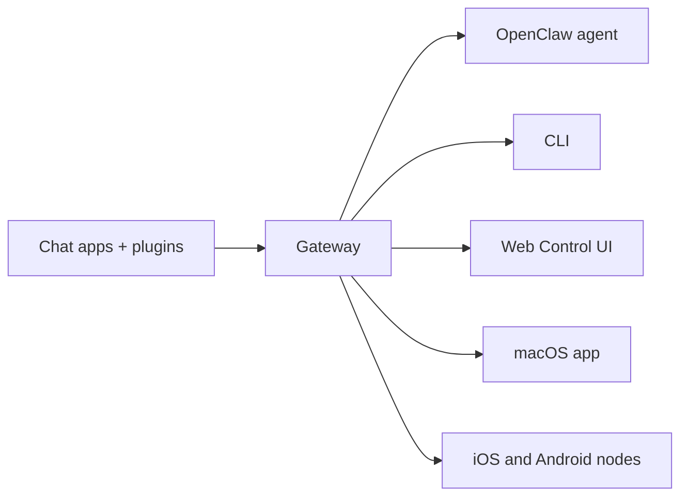

---
read_when:
    - Przedstawianie OpenClaw nowym użytkownikom
summary: OpenClaw to wielokanałowy Gateway dla agentów AI, który działa na każdym systemie operacyjnym.
title: OpenClaw
x-i18n:
    generated_at: "2026-06-27T17:41:19Z"
    model: gpt-5.5
    postprocess_version: locale-links-v1
    provider: openai
    source_hash: fcaa54a0a6d7aa62193fd9f03428bbcbfdcb2c00a184bcd6f49e4e093fefc473
    source_path: index.md
    workflow: 16
---

# OpenClaw 🦞

<p align="center">
    
    
</p>

> _"ZŁUSZCZAJ! ZŁUSZCZAJ!"_ — Kosmiczny homar, prawdopodobnie

<p align="center">
  <strong>Gateway dla dowolnego systemu operacyjnego, umożliwiający agentom AI działanie w Discord, Google Chat, iMessage, Matrix, Microsoft Teams, Signal, Slack, Telegram, WhatsApp, Zalo i innych.</strong><br />
  Wyślij wiadomość i otrzymaj odpowiedź agenta prosto z kieszeni. Uruchom jeden Gateway dla wbudowanych kanałów, dołączonych Plugin kanałów, WebChat i węzłów mobilnych.
</p>

<Columns>
  <Card title="Rozpocznij" href="/pl/start/getting-started" icon="rocket">
    Zainstaluj OpenClaw i uruchom Gateway w kilka minut.
  </Card>
  <Card title="Uruchom wdrażanie" href="/pl/start/wizard" icon="list-checks">
    Konfiguracja z przewodnikiem za pomocą `openclaw onboard` i przepływów parowania.
  </Card>
  <Card title="Otwórz Control UI" href="/pl/web/control-ui" icon="layout-dashboard">
    Uruchom panel w przeglądarce do czatu, konfiguracji i sesji.
  </Card>
</Columns>

## Czym jest OpenClaw?

OpenClaw to **samodzielnie hostowany gateway**, który łączy Twoje ulubione aplikacje czatu i powierzchnie kanałów — wbudowane kanały oraz dołączone lub zewnętrzne Plugin kanałów, takie jak Discord, Google Chat, iMessage, Matrix, Microsoft Teams, Signal, Slack, Telegram, WhatsApp, Zalo i inne — z agentami kodowania AI. Uruchamiasz pojedynczy proces Gateway na własnej maszynie (lub serwerze), a on staje się mostem między aplikacjami do komunikacji a zawsze dostępnym asystentem AI.

**Dla kogo to jest?** Dla deweloperów i zaawansowanych użytkowników, którzy chcą osobistego asystenta AI, do którego mogą pisać z dowolnego miejsca — bez oddawania kontroli nad swoimi danymi ani polegania na usłudze hostowanej.

**Co go wyróżnia?**

- **Samodzielnie hostowany**: działa na Twoim sprzęcie, na Twoich zasadach
- **Wielokanałowy**: jeden Gateway obsługuje jednocześnie wbudowane kanały oraz dołączone lub zewnętrzne Plugin kanałów
- **Natywny dla agentów**: zbudowany dla agentów kodowania z użyciem narzędzi, sesjami, pamięcią i trasowaniem wielu agentów
- **Open source**: licencja MIT, rozwijany przez społeczność

**Czego potrzebujesz?** Node 24 (zalecane) albo Node 22 LTS (`22.19+`) dla zgodności, klucza API od wybranego dostawcy i 5 minut. Dla najlepszej jakości i bezpieczeństwa użyj najsilniejszego dostępnego modelu najnowszej generacji.

## Jak to działa



Gateway jest pojedynczym źródłem prawdy dla sesji, trasowania i połączeń kanałów.

## Kluczowe możliwości

<Columns>
  <Card title="Wielokanałowy gateway" icon="network" href="/pl/channels">
    Discord, iMessage, Signal, Slack, Telegram, WhatsApp, WebChat i inne z jednym procesem Gateway.
  </Card>
  <Card title="Kanały Plugin" icon="plug" href="/pl/tools/plugin">
    Dołączone plugins dodają Matrix, Nostr, Twitch, Zalo i inne w zwykłych bieżących wydaniach.
  </Card>
  <Card title="Trasowanie wielu agentów" icon="route" href="/pl/concepts/multi-agent">
    Izolowane sesje dla każdego agenta, obszaru roboczego lub nadawcy.
  </Card>
  <Card title="Obsługa multimediów" icon="image" href="/pl/nodes/images">
    Wysyłaj i odbieraj obrazy, dźwięk i dokumenty.
  </Card>
  <Card title="Web Control UI" icon="monitor" href="/pl/web/control-ui">
    Panel w przeglądarce do czatu, konfiguracji, sesji i węzłów.
  </Card>
  <Card title="Węzły mobilne" icon="smartphone" href="/pl/nodes">
    Sparuj węzły iOS i Android dla przepływów pracy z Canvas, kamerą i głosem.
  </Card>
</Columns>

## Szybki start

<Steps>
  <Step title="Zainstaluj OpenClaw">
    ```bash
    npm install -g openclaw@latest
    ```
  </Step>
  <Step title="Przeprowadź wdrażanie i zainstaluj usługę">
    ```bash
    openclaw onboard --install-daemon
    ```
  </Step>
  <Step title="Czat">
    Otwórz Control UI w przeglądarce i wyślij wiadomość:

    ```bash
    openclaw dashboard
    ```

    Albo połącz kanał ([Telegram](/pl/channels/telegram) jest najszybszy) i czatuj z telefonu.

  </Step>
</Steps>

Potrzebujesz pełnej instalacji i konfiguracji deweloperskiej? Zobacz [Pierwsze kroki](/pl/start/getting-started).

## Panel

Otwórz przeglądarkowy Control UI po uruchomieniu Gateway.

- Domyślnie lokalnie: [http://127.0.0.1:18789/](http://127.0.0.1:18789/)
- Dostęp zdalny: [Powierzchnie webowe](/pl/web) i [Tailscale](/pl/gateway/tailscale)

<p align="center">
  
</p>

## Konfiguracja (opcjonalnie)

Konfiguracja znajduje się w `~/.openclaw/openclaw.json`.

- Jeśli **nic nie zrobisz**, OpenClaw użyje dołączonego środowiska uruchomieniowego agenta OpenClaw z sesjami dla każdego nadawcy.
- Jeśli chcesz ograniczyć dostęp, zacznij od `channels.whatsapp.allowFrom` oraz (dla grup) reguł wzmianek.

Przykład:

```json5
{
  channels: {
    whatsapp: {
      allowFrom: ["+15555550123"],
      groups: { "*": { requireMention: true } },
    },
  },
  messages: { groupChat: { mentionPatterns: ["@openclaw"] } },
}
```

## Zacznij tutaj

<Columns>
  <Card title="Centra dokumentacji" href="/pl/start/hubs" icon="book-open">
    Cała dokumentacja i przewodniki uporządkowane według zastosowań.
  </Card>
  <Card title="Konfiguracja" href="/pl/gateway/configuration" icon="settings">
    Podstawowe ustawienia Gateway, tokeny i konfiguracja dostawcy.
  </Card>
  <Card title="Dostęp zdalny" href="/pl/gateway/remote" icon="globe">
    Wzorce dostępu przez SSH i tailnet.
  </Card>
  <Card title="Kanały" href="/pl/channels/telegram" icon="message-square">
    Konfiguracja specyficzna dla kanałów Feishu, Microsoft Teams, WhatsApp, Telegram, Discord i innych.
  </Card>
  <Card title="Węzły" href="/pl/nodes" icon="smartphone">
    Węzły iOS i Android z parowaniem, Canvas, kamerą i akcjami urządzenia.
  </Card>
  <Card title="Pomoc" href="/pl/help" icon="life-buoy">
    Typowe poprawki i punkt wejścia do rozwiązywania problemów.
  </Card>
</Columns>

## Dowiedz się więcej

<Columns>
  <Card title="Pełna lista funkcji" href="/pl/concepts/features" icon="list">
    Pełne możliwości kanałów, trasowania i multimediów.
  </Card>
  <Card title="Trasowanie wielu agentów" href="/pl/concepts/multi-agent" icon="route">
    Izolacja obszarów roboczych i sesje dla każdego agenta.
  </Card>
  <Card title="Bezpieczeństwo" href="/pl/gateway/security" icon="shield">
    Tokeny, listy dozwolonych i mechanizmy bezpieczeństwa.
  </Card>
  <Card title="Rozwiązywanie problemów" href="/pl/gateway/troubleshooting" icon="wrench">
    Diagnostyka Gateway i typowe błędy.
  </Card>
  <Card title="O projekcie i podziękowania" href="/pl/reference/credits" icon="info">
    Początki projektu, współtwórcy i licencja.
  </Card>
</Columns>
