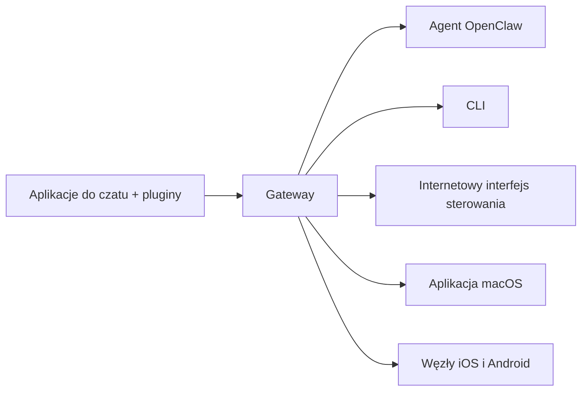

---
read_when:
    - Przedstawianie OpenClaw nowym użytkownikom
summary: OpenClaw to wielokanałowy Gateway dla agentów AI, który działa w każdym systemie operacyjnym.
title: OpenClaw
x-i18n:
    generated_at: "2026-07-16T18:32:38Z"
    model: gpt-5.6
    postprocess_version: locale-links-v1
    prompt_version: 32
    provider: openai
    source_hash: fe97e7299be4855fd9af21838e0626b5a5c8aafe46d982859e9033f0efec2443
    source_path: index.md
    workflow: 16
---

# OpenClaw 🦞

<p align="center">
    
    
</p>

> _„ZŁUSZCZAĆ! ZŁUSZCZAĆ!”_ — Prawdopodobnie kosmiczny homar

<p align="center">
  <strong>Gateway dla agentów AI działający w dowolnym systemie operacyjnym, obsługujący Discord, Google Chat, iMessage, Matrix, Microsoft Teams, Signal, Slack, Telegram, WhatsApp, Zalo i inne usługi.</strong><br />
  Wyślij wiadomość i otrzymaj odpowiedź agenta na urządzeniu mobilnym. Uruchom jeden Gateway dla pluginów kanałów, WebChat i węzłów mobilnych.
</p>

<Columns>
  <Card title="Rozpocznij" href="/pl/start/getting-started" icon="rocket">
    Zainstaluj OpenClaw i uruchom Gateway w kilka minut.
  </Card>
  <Card title="Uruchom wdrażanie" href="/pl/start/wizard" icon="list-checks">
    Konfiguracja z przewodnikiem za pomocą `openclaw onboard` i procesów parowania.
  </Card>
  <Card title="Połącz kanał" href="/pl/channels" icon="message-circle">
    Połącz Discord, Signal, Telegram, WhatsApp i inne usługi, aby rozmawiać z dowolnego miejsca.
  </Card>
  <Card title="Otwórz interfejs sterowania" href="/pl/web/control-ui" icon="layout-dashboard">
    Uruchom panel przeglądarkowy do obsługi czatu, konfiguracji i sesji.
  </Card>
</Columns>

## Przeglądaj dokumentację

Przeglądarki mobilne mogą wyświetlać menu sekcji bez pełnego paska kart dostępnego na komputerze. Użyj
poniższych odnośników do centrów, aby z treści strony przejść do tych samych głównych obszarów dokumentacji.

<Columns>
  <Card title="Rozpocznij" href="/pl" icon="rocket">
    Omówienie, prezentacja, pierwsze kroki i przewodniki konfiguracji.
  </Card>
  <Card title="Instalacja" href="/pl/install" icon="download">
    Sposoby instalacji, aktualizacje, kontenery, hosting i konfiguracja zaawansowana.
  </Card>
  <Card title="Kanały" href="/pl/channels" icon="messages-square">
    Kanały komunikacyjne, parowanie, routing, grupy dostępu i kontrola jakości kanałów.
  </Card>
  <Card title="Agenci" href="/pl/concepts/architecture" icon="bot">
    Architektura, sesje, kontekst, pamięć i routing wielu agentów.
  </Card>
  <Card title="Możliwości" href="/pl/tools" icon="wand-sparkles">
    Narzędzia, Skills, Cron, webhooki i możliwości automatyzacji.
  </Card>
  <Card title="ClawHub" href="/pl/clawhub" icon="store">
    Rynek pluginów, publikowanie, selekcja i wskazówki dotyczące zaufania.
  </Card>
  <Card title="Modele" href="/pl/providers" icon="brain">
    Dostawcy, konfiguracja modeli, przełączanie awaryjne i lokalne usługi modeli.
  </Card>
  <Card title="Platformy" href="/pl/platforms" icon="monitor-smartphone">
    macOS, Windows, iOS, Android, węzły i interfejsy internetowe.
  </Card>
  <Card title="Gateway i operacje" href="/pl/gateway" icon="server">
    Konfiguracja, bezpieczeństwo, diagnostyka i obsługa Gateway.
  </Card>
  <Card title="Dokumentacja referencyjna" href="/pl/cli" icon="terminal">
    Dokumentacja CLI, schematy, RPC, informacje o wydaniach i szablony.
  </Card>
  <Card title="Pomoc" href="/pl/help" icon="life-buoy">
    Rozwiązywanie problemów, często zadawane pytania, testowanie, diagnostyka i sprawdzanie środowiska.
  </Card>
</Columns>

## Czym jest OpenClaw?

OpenClaw to **samodzielnie hostowany Gateway**, który łączy ulubione aplikacje do czatu — Discord, Google Chat, iMessage, Matrix, Microsoft Teams, Signal, Slack, Telegram, WhatsApp, Zalo i inne za pośrednictwem pluginów kanałów — z agentami AI do programowania. Jeden proces Gateway działa na własnym komputerze (lub serwerze) i staje się pomostem między aplikacjami do komunikacji a zawsze dostępnym asystentem AI.

**Dla kogo jest przeznaczony?** Dla programistów i zaawansowanych użytkowników, którzy chcą korzystać z osobistego asystenta AI z dowolnego miejsca — bez rezygnowania z kontroli nad swoimi danymi ani polegania na usłudze hostowanej.

**Co go wyróżnia?**

- **Samodzielne hostowanie**: działa na własnym sprzęcie i według własnych zasad
- **Wielokanałowość**: jeden Gateway obsługuje jednocześnie każdy skonfigurowany plugin kanału
- **Natywna obsługa agentów**: rozwiązanie stworzone dla agentów programistycznych, z obsługą narzędzi, sesji, pamięci i routingu wielu agentów
- **Otwarte oprogramowanie**: licencja MIT, rozwój kierowany przez społeczność

**Co jest potrzebne?** Node 24.15+ (zalecany), Node 22 LTS (`22.22.3+`) w celu zapewnienia zgodności albo Node 25.9+, klucz API wybranego dostawcy oraz 5 minut. Aby uzyskać najlepszą jakość i bezpieczeństwo, użyj najsilniejszego dostępnego modelu najnowszej generacji.

## Jak to działa



Gateway jest jedynym źródłem prawdy dla sesji, routingu i połączeń kanałów.

## Najważniejsze możliwości

<Columns>
  <Card title="Wielokanałowy Gateway" icon="network" href="/pl/channels">
    Discord, iMessage, Signal, Slack, Telegram, WhatsApp, WebChat i inne usługi obsługiwane przez jeden proces Gateway.
  </Card>
  <Card title="Kanały pluginów" icon="plug" href="/pl/tools/plugin">
    Pluginy kanałów dodają Matrix, Nostr, Twitch, Zalo i inne usługi; oficjalne pluginy są instalowane na żądanie.
  </Card>
  <Card title="Routing wielu agentów" icon="route" href="/pl/concepts/multi-agent">
    Odizolowane sesje dla każdego agenta, obszaru roboczego lub nadawcy.
  </Card>
  <Card title="Obsługa multimediów" icon="image" href="/pl/nodes/images">
    Wysyłanie i odbieranie obrazów, dźwięku oraz dokumentów.
  </Card>
  <Card title="Internetowy interfejs sterowania" icon="monitor" href="/pl/web/control-ui">
    Panel przeglądarkowy do obsługi czatu, konfiguracji, sesji i węzłów.
  </Card>
  <Card title="Węzły mobilne" icon="smartphone" href="/pl/nodes">
    Paruj węzły iOS i Android na potrzeby procesów roboczych korzystających z Canvas, aparatu i obsługi głosowej.
  </Card>
</Columns>

## Szybki start

<Steps>
  <Step title="Zainstaluj OpenClaw">
    ```bash
    npm install -g openclaw@latest
    ```
  </Step>
  <Step title="Przeprowadź wdrażanie i zainstaluj usługę">
    ```bash
    openclaw onboard --install-daemon
    ```
  </Step>
  <Step title="Rozpocznij czat">
    Otwórz interfejs sterowania w przeglądarce i wyślij wiadomość:

    ```bash
    openclaw dashboard
    ```

    Można też połączyć kanał ([Telegram](/pl/channels/telegram) jest najszybszy) i rozmawiać przez telefon.

  </Step>
</Steps>

Potrzebna jest pełna konfiguracja instalacji i środowiska programistycznego? Zobacz [Pierwsze kroki](/pl/start/getting-started).

## Panel

Po uruchomieniu Gateway otwórz interfejs sterowania w przeglądarce.

- Domyślny adres lokalny: [http://127.0.0.1:18789/](http://127.0.0.1:18789/)
- Dostęp zdalny: [Interfejsy internetowe](/pl/web) i [Tailscale](/pl/gateway/tailscale)

<p align="center">
  
</p>

## Konfiguracja (opcjonalna)

Konfiguracja znajduje się w `~/.openclaw/openclaw.json`.

- Jeśli **nic nie zostanie zrobione**, OpenClaw użyje dołączonego środowiska uruchomieniowego agenta OpenClaw; wiadomości prywatne współdzielą główną sesję agenta, a każdy czat grupowy otrzymuje własną sesję.
- Aby ograniczyć dostęp, zacznij od `channels.whatsapp.allowFrom` oraz — w przypadku grup — reguł wzmianek.

Przykład:

```json5
{
  channels: {
    whatsapp: {
      allowFrom: ["+15555550123"],
      groups: { "*": { requireMention: true } },
    },
  },
  messages: { groupChat: { mentionPatterns: ["@openclaw"] } },
}
```

## Zacznij tutaj

<Columns>
  <Card title="Centra dokumentacji" href="/pl/start/hubs" icon="book-open">
    Cała dokumentacja i wszystkie przewodniki uporządkowane według zastosowań.
  </Card>
  <Card title="Konfiguracja" href="/pl/gateway/configuration" icon="settings">
    Podstawowe ustawienia Gateway, tokeny i konfiguracja dostawcy.
  </Card>
  <Card title="Dostęp zdalny" href="/pl/gateway/remote" icon="globe">
    Wzorce dostępu przez SSH i tailnet.
  </Card>
  <Card title="Kanały" href="/pl/channels/telegram" icon="message-square">
    Konfiguracja poszczególnych kanałów dla Discord, Feishu, Microsoft Teams, Telegram, WhatsApp i innych usług.
  </Card>
  <Card title="Węzły" href="/pl/nodes" icon="smartphone">
    Węzły iOS i Android z parowaniem, Canvas, aparatem i działaniami na urządzeniu.
  </Card>
  <Card title="Pomoc" href="/pl/help" icon="life-buoy">
    Typowe rozwiązania i punkt wyjścia do rozwiązywania problemów.
  </Card>
</Columns>

## Dowiedz się więcej

<Columns>
  <Card title="Pełna lista funkcji" href="/pl/concepts/features" icon="list">
    Pełne możliwości kanałów, routingu i multimediów.
  </Card>
  <Card title="Routing wielu agentów" href="/pl/concepts/multi-agent" icon="route">
    Izolacja obszarów roboczych i oddzielne sesje dla poszczególnych agentów.
  </Card>
  <Card title="Bezpieczeństwo" href="/pl/gateway/security" icon="shield">
    Tokeny, listy dozwolonych elementów i mechanizmy bezpieczeństwa.
  </Card>
  <Card title="Rozwiązywanie problemów" href="/pl/gateway/troubleshooting" icon="wrench">
    Diagnostyka Gateway i typowe błędy.
  </Card>
  <Card title="Informacje i podziękowania" href="/pl/reference/credits" icon="info">
    Początki projektu, współtwórcy i licencja.
  </Card>
</Columns>
