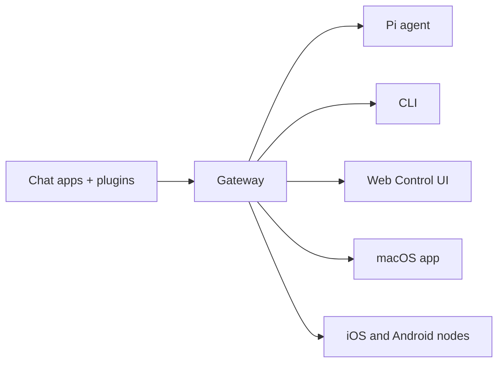

---
read_when:
    - Wprowadzenie do OpenClaw dla nowych użytkowników
summary: OpenClaw to wielokanałowy Gateway dla agentów AI, który działa na dowolnym systemie operacyjnym.
title: OpenClaw
x-i18n:
    generated_at: "2026-05-07T13:19:53Z"
    model: gpt-5.5
    provider: openai
    source_hash: 7bf82c8551703257e55289d2b82f6436c9900a8afae7ab9b6a655332716ff37b
    source_path: index.md
    workflow: 16
---

# OpenClaw 🦞

<p align="center">
    
    
</p>

> _"ZŁUSZCZAĆ! ZŁUSZCZAĆ!"_ — Kosmiczny homar, prawdopodobnie

<p align="center">
  <strong>Gateway dla agentów AI na dowolny system operacyjny, obsługujący Discord, Google Chat, iMessage, Matrix, Microsoft Teams, Signal, Slack, Telegram, WhatsApp, Zalo i więcej.</strong><br />
  Wyślij wiadomość i otrzymaj odpowiedź agenta z kieszeni. Uruchom jeden Gateway dla wbudowanych kanałów, dołączonych pluginów kanałów, WebChat i węzłów mobilnych.
</p>

<Columns>
  <Card title="Rozpocznij" href="/pl/start/getting-started" icon="rocket">
    Zainstaluj OpenClaw i uruchom Gateway w kilka minut.
  </Card>
  <Card title="Uruchom onboarding" href="/pl/start/wizard" icon="sparkles">
    Konfiguracja z przewodnikiem za pomocą `openclaw onboard` i przepływów parowania.
  </Card>
  <Card title="Otwórz Control UI" href="/pl/web/control-ui" icon="layout-dashboard">
    Uruchom panel przeglądarkowy do czatu, konfiguracji i sesji.
  </Card>
</Columns>

## Czym jest OpenClaw?

OpenClaw to **samodzielnie hostowany gateway**, który łączy Twoje ulubione aplikacje czatu i powierzchnie kanałów — wbudowane kanały oraz dołączone lub zewnętrzne pluginy kanałów, takie jak Discord, Google Chat, iMessage, Matrix, Microsoft Teams, Signal, Slack, Telegram, WhatsApp, Zalo i inne — z agentami AI do programowania, takimi jak Pi. Uruchamiasz jeden proces Gateway na własnym komputerze (lub serwerze), a on staje się mostem między Twoimi aplikacjami do wiadomości i zawsze dostępnym asystentem AI.

**Dla kogo to jest?** Dla programistów i zaawansowanych użytkowników, którzy chcą osobistego asystenta AI, do którego mogą pisać z dowolnego miejsca — bez rezygnowania z kontroli nad swoimi danymi ani polegania na usłudze hostowanej.

**Co go wyróżnia?**

- **Samodzielne hostowanie**: działa na Twoim sprzęcie, według Twoich zasad
- **Wielokanałowość**: jeden Gateway obsługuje jednocześnie wbudowane kanały oraz dołączone lub zewnętrzne pluginy kanałów
- **Natywność dla agentów**: zaprojektowany dla agentów programistycznych z użyciem narzędzi, sesjami, pamięcią i routingiem wielu agentów
- **Open source**: licencja MIT, projekt rozwijany przez społeczność

**Czego potrzebujesz?** Node 24 (zalecane) lub Node 22 LTS (`22.16+`) dla zgodności, klucza API od wybranego dostawcy oraz 5 minut. Aby uzyskać najlepszą jakość i bezpieczeństwo, użyj najmocniejszego dostępnego modelu najnowszej generacji.

## Jak to działa



Gateway jest pojedynczym źródłem prawdy dla sesji, routingu i połączeń kanałów.

## Kluczowe możliwości

<Columns>
  <Card title="Wielokanałowy gateway" icon="network" href="/pl/channels">
    Discord, iMessage, Signal, Slack, Telegram, WhatsApp, WebChat i więcej w jednym procesie Gateway.
  </Card>
  <Card title="Kanały Plugin" icon="plug" href="/pl/tools/plugin">
    Dołączone pluginy dodają Matrix, Nostr, Twitch, Zalo i więcej w zwykłych bieżących wydaniach.
  </Card>
  <Card title="Routing wielu agentów" icon="route" href="/pl/concepts/multi-agent">
    Izolowane sesje dla każdego agenta, obszaru roboczego lub nadawcy.
  </Card>
  <Card title="Obsługa multimediów" icon="image" href="/pl/nodes/images">
    Wysyłaj i odbieraj obrazy, audio i dokumenty.
  </Card>
  <Card title="Web Control UI" icon="monitor" href="/pl/web/control-ui">
    Panel przeglądarkowy do czatu, konfiguracji, sesji i węzłów.
  </Card>
  <Card title="Węzły mobilne" icon="smartphone" href="/pl/nodes">
    Sparuj węzły iOS i Android dla przepływów pracy z Canvas, kamerą i głosem.
  </Card>
</Columns>

## Szybki start

<Steps>
  <Step title="Zainstaluj OpenClaw">
    ```bash
    npm install -g openclaw@latest
    ```
  </Step>
  <Step title="Przeprowadź onboarding i zainstaluj usługę">
    ```bash
    openclaw onboard --install-daemon
    ```
  </Step>
  <Step title="Czat">
    Otwórz Control UI w przeglądarce i wyślij wiadomość:

    ```bash
    openclaw dashboard
    ```

    Albo połącz kanał ([Telegram](/pl/channels/telegram) jest najszybszy) i rozmawiaj z telefonu.

  </Step>
</Steps>

Potrzebujesz pełnej instalacji i konfiguracji deweloperskiej? Zobacz [Pierwsze kroki](/pl/start/getting-started).

## Panel

Otwórz przeglądarkowy Control UI po uruchomieniu Gateway.

- Domyślnie lokalnie: [http://127.0.0.1:18789/](http://127.0.0.1:18789/)
- Dostęp zdalny: [Powierzchnie webowe](/pl/web) i [Tailscale](/pl/gateway/tailscale)

<p align="center">
  
</p>

## Konfiguracja (opcjonalnie)

Konfiguracja znajduje się w `~/.openclaw/openclaw.json`.

- Jeśli **nic nie zrobisz**, OpenClaw użyje dołączonego pliku binarnego Pi w trybie RPC z sesjami dla każdego nadawcy.
- Jeśli chcesz go ograniczyć, zacznij od `channels.whatsapp.allowFrom` oraz (dla grup) reguł wzmianek.

Przykład:

```json5
{
  channels: {
    whatsapp: {
      allowFrom: ["+15555550123"],
      groups: { "*": { requireMention: true } },
    },
  },
  messages: { groupChat: { mentionPatterns: ["@openclaw"] } },
}
```

## Zacznij tutaj

<Columns>
  <Card title="Centra dokumentacji" href="/pl/start/hubs" icon="book-open">
    Cała dokumentacja i przewodniki, uporządkowane według przypadków użycia.
  </Card>
  <Card title="Konfiguracja" href="/pl/gateway/configuration" icon="settings">
    Podstawowe ustawienia Gateway, tokeny i konfiguracja dostawcy.
  </Card>
  <Card title="Dostęp zdalny" href="/pl/gateway/remote" icon="globe">
    Wzorce dostępu przez SSH i tailnet.
  </Card>
  <Card title="Kanały" href="/pl/channels/telegram" icon="message-square">
    Konfiguracja specyficzna dla kanału dla Feishu, Microsoft Teams, WhatsApp, Telegram, Discord i innych.
  </Card>
  <Card title="Węzły" href="/pl/nodes" icon="smartphone">
    Węzły iOS i Android z parowaniem, Canvas, kamerą i akcjami urządzenia.
  </Card>
  <Card title="Pomoc" href="/pl/help" icon="life-buoy">
    Punkt wejścia do typowych poprawek i rozwiązywania problemów.
  </Card>
</Columns>

## Dowiedz się więcej

<Columns>
  <Card title="Pełna lista funkcji" href="/pl/concepts/features" icon="list">
    Pełne możliwości kanałów, routingu i multimediów.
  </Card>
  <Card title="Routing wielu agentów" href="/pl/concepts/multi-agent" icon="route">
    Izolacja obszaru roboczego i sesje dla każdego agenta.
  </Card>
  <Card title="Bezpieczeństwo" href="/pl/gateway/security" icon="shield">
    Tokeny, listy dozwolonych i kontrolki bezpieczeństwa.
  </Card>
  <Card title="Rozwiązywanie problemów" href="/pl/gateway/troubleshooting" icon="wrench">
    Diagnostyka Gateway i typowe błędy.
  </Card>
  <Card title="O projekcie i autorzy" href="/pl/reference/credits" icon="info">
    Początki projektu, współtwórcy i licencja.
  </Card>
</Columns>
