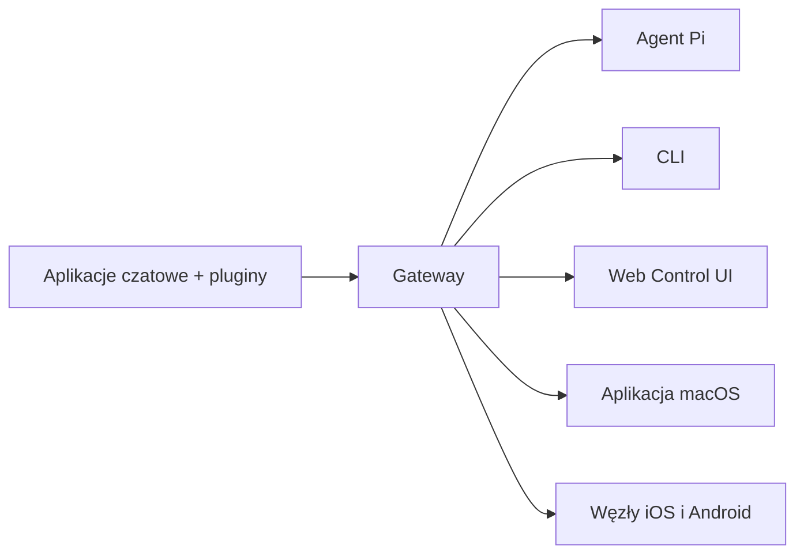

---
read_when:
    - Przedstawianie OpenClaw nowym użytkownikom
summary: OpenClaw to wielokanałowa brama dla agentów AI, która działa na każdym systemie operacyjnym.
title: OpenClaw
x-i18n:
    generated_at: "2026-04-22T04:23:46Z"
    model: gpt-5.4
    provider: openai
    source_hash: 923d34fa604051d502e4bc902802d6921a4b89a9447f76123aa8d2ff085f0b99
    source_path: index.md
    workflow: 15
---

# OpenClaw 🦞

<p align="center">
    
    
</p>

> _"EXFOLIATE! EXFOLIATE!"_ — Kosmiczny homar, prawdopodobnie

<p align="center">
  <strong>Brama dla agentów AI działająca na każdym systemie operacyjnym w Discord, Google Chat, iMessage, Matrix, Microsoft Teams, Signal, Slack, Telegram, WhatsApp, Zalo i innych kanałach.</strong><br />
  Wyślij wiadomość i otrzymaj odpowiedź agenta z kieszeni. Uruchom jedną Gateway dla wbudowanych kanałów, dołączonych pluginów kanałów, WebChat i mobilnych węzłów.
</p>

<Columns>
  <Card title="Pierwsze kroki" href="/pl/start/getting-started" icon="rocket">
    Zainstaluj OpenClaw i uruchom Gateway w kilka minut.
  </Card>
  <Card title="Uruchom onboarding" href="/pl/start/wizard" icon="sparkles">
    Konfiguracja krok po kroku z `openclaw onboard` i przepływami parowania.
  </Card>
  <Card title="Otwórz interfejs sterowania" href="/web/control-ui" icon="layout-dashboard">
    Uruchom panel w przeglądarce do czatu, konfiguracji i sesji.
  </Card>
</Columns>

## Czym jest OpenClaw?

OpenClaw to **samohostowana Gateway**, która łączy Twoje ulubione aplikacje czatowe i powierzchnie kanałów — wbudowane kanały oraz dołączone lub zewnętrzne pluginy kanałów, takie jak Discord, Google Chat, iMessage, Matrix, Microsoft Teams, Signal, Slack, Telegram, WhatsApp, Zalo i inne — z agentami AI do kodowania, takimi jak Pi. Uruchamiasz pojedynczy proces Gateway na własnym komputerze (lub serwerze), a staje się on pomostem między Twoimi komunikatorami a zawsze dostępnym asystentem AI.

**Dla kogo to jest?** Dla programistów i zaawansowanych użytkowników, którzy chcą mieć osobistego asystenta AI, do którego można pisać z dowolnego miejsca — bez utraty kontroli nad danymi i bez polegania na usłudze hostowanej.

**Co go wyróżnia?**

- **Samohostowany**: działa na Twoim sprzęcie, według Twoich zasad
- **Wielokanałowy**: jedna Gateway jednocześnie obsługuje wbudowane kanały oraz dołączone lub zewnętrzne pluginy kanałów
- **Natywny dla agentów**: zaprojektowany dla agentów kodujących z użyciem narzędzi, sesji, pamięci i routowania wielu agentów
- **Open source**: licencja MIT, rozwijany przez społeczność

**Czego potrzebujesz?** Node 24 (zalecane) albo Node 22 LTS (`22.14+`) dla zgodności, klucz API od wybranego dostawcy i 5 minut. Dla najlepszej jakości i bezpieczeństwa używaj najmocniejszego dostępnego modelu najnowszej generacji.

## Jak to działa



Gateway jest pojedynczym źródłem prawdy dla sesji, routingu i połączeń kanałów.

## Kluczowe możliwości

<Columns>
  <Card title="Wielokanałowa Gateway" icon="network" href="/pl/channels">
    Discord, iMessage, Signal, Slack, Telegram, WhatsApp, WebChat i inne w jednym procesie Gateway.
  </Card>
  <Card title="Pluginy kanałów" icon="plug" href="/pl/tools/plugin">
    Dołączone pluginy dodają Matrix, Nostr, Twitch, Zalo i inne w zwykłych bieżących wydaniach.
  </Card>
  <Card title="Routowanie wielu agentów" icon="route" href="/pl/concepts/multi-agent">
    Izolowane sesje dla każdego agenta, obszaru roboczego lub nadawcy.
  </Card>
  <Card title="Obsługa multimediów" icon="image" href="/pl/nodes/images">
    Wysyłaj i odbieraj obrazy, audio i dokumenty.
  </Card>
  <Card title="Web Control UI" icon="monitor" href="/web/control-ui">
    Panel przeglądarkowy do czatu, konfiguracji, sesji i węzłów.
  </Card>
  <Card title="Węzły mobilne" icon="smartphone" href="/pl/nodes">
    Paruj węzły iOS i Android do przepływów pracy z Canvas, aparatem i obsługą głosu.
  </Card>
</Columns>

## Szybki start

<Steps>
  <Step title="Zainstaluj OpenClaw">
    ```bash
    npm install -g openclaw@latest
    ```
  </Step>
  <Step title="Przejdź onboarding i zainstaluj usługę">
    ```bash
    openclaw onboard --install-daemon
    ```
  </Step>
  <Step title="Czat">
    Otwórz interfejs sterowania w przeglądarce i wyślij wiadomość:

    ```bash
    openclaw dashboard
    ```

    Albo podłącz kanał ([Telegram](/pl/channels/telegram) jest najszybszy) i rozmawiaj z telefonu.

  </Step>
</Steps>

Potrzebujesz pełnej instalacji i konfiguracji środowiska deweloperskiego? Zobacz [Pierwsze kroki](/pl/start/getting-started).

## Dashboard

Otwórz przeglądarkowy interfejs sterowania po uruchomieniu Gateway.

- Domyślnie lokalnie: [http://127.0.0.1:18789/](http://127.0.0.1:18789/)
- Dostęp zdalny: [Powierzchnie webowe](/web) i [Tailscale](/pl/gateway/tailscale)

<p align="center">
  
</p>

## Konfiguracja (opcjonalnie)

Konfiguracja znajduje się w `~/.openclaw/openclaw.json`.

- Jeśli **nic nie zrobisz**, OpenClaw użyje dołączonego binarium Pi w trybie RPC z sesjami per nadawca.
- Jeśli chcesz go zablokować, zacznij od `channels.whatsapp.allowFrom` i (dla grup) zasad wzmianek.

Przykład:

```json5
{
  channels: {
    whatsapp: {
      allowFrom: ["+15555550123"],
      groups: { "*": { requireMention: true } },
    },
  },
  messages: { groupChat: { mentionPatterns: ["@openclaw"] } },
}
```

## Zacznij tutaj

<Columns>
  <Card title="Centra dokumentacji" href="/pl/start/hubs" icon="book-open">
    Cała dokumentacja i przewodniki, uporządkowane według zastosowań.
  </Card>
  <Card title="Konfiguracja" href="/pl/gateway/configuration" icon="settings">
    Podstawowe ustawienia Gateway, tokeny i konfiguracja dostawcy.
  </Card>
  <Card title="Dostęp zdalny" href="/pl/gateway/remote" icon="globe">
    Wzorce dostępu przez SSH i tailnet.
  </Card>
  <Card title="Kanały" href="/pl/channels/telegram" icon="message-square">
    Konfiguracja specyficzna dla kanałów Feishu, Microsoft Teams, WhatsApp, Telegram, Discord i innych.
  </Card>
  <Card title="Węzły" href="/pl/nodes" icon="smartphone">
    Węzły iOS i Android z parowaniem, Canvas, aparatem i akcjami urządzenia.
  </Card>
  <Card title="Pomoc" href="/pl/help" icon="life-buoy">
    Typowe poprawki i punkt wejścia do rozwiązywania problemów.
  </Card>
</Columns>

## Dowiedz się więcej

<Columns>
  <Card title="Pełna lista funkcji" href="/pl/concepts/features" icon="list">
    Pełne możliwości kanałów, routingu i obsługi multimediów.
  </Card>
  <Card title="Routowanie wielu agentów" href="/pl/concepts/multi-agent" icon="route">
    Izolacja obszarów roboczych i sesje per agent.
  </Card>
  <Card title="Bezpieczeństwo" href="/pl/gateway/security" icon="shield">
    Tokeny, listy dozwolonych i mechanizmy bezpieczeństwa.
  </Card>
  <Card title="Rozwiązywanie problemów" href="/pl/gateway/troubleshooting" icon="wrench">
    Diagnostyka Gateway i typowe błędy.
  </Card>
  <Card title="Informacje i autorzy" href="/pl/reference/credits" icon="info">
    Geneza projektu, autorzy i licencja.
  </Card>
</Columns>
