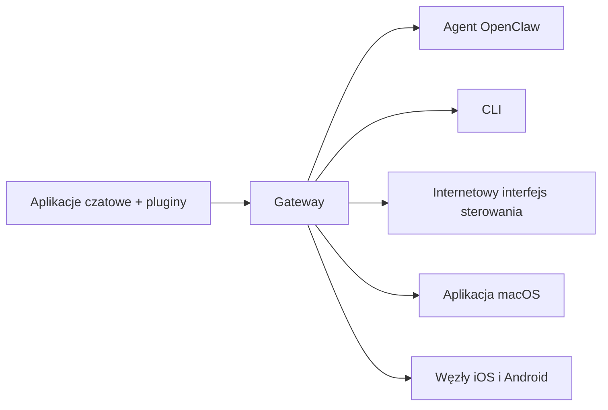

---
read_when:
    - Przedstawianie OpenClaw nowym użytkownikom
summary: OpenClaw to wielokanałowy Gateway dla agentów AI, działający w dowolnym systemie operacyjnym.
title: OpenClaw
x-i18n:
    generated_at: "2026-07-12T15:15:02Z"
    model: gpt-5.6
    postprocess_version: locale-links-v1
    provider: openai
    source_hash: 2b87c2a9ce06f110bda45709fb6055ed8000f73993793ea7386db2a47a782828
    source_path: index.md
    workflow: 16
---

# OpenClaw 🦞

<p align="center">
    
    
</p>

> _„ZŁUSZCZAĆ! ZŁUSZCZAĆ!”_ — Prawdopodobnie kosmiczny homar

<p align="center">
  <strong>Gateway dla agentów AI działający w dowolnym systemie operacyjnym, obsługujący Discord, Google Chat, iMessage, Matrix, Microsoft Teams, Signal, Slack, Telegram, WhatsApp, Zalo i inne platformy.</strong><br />
  Wyślij wiadomość i otrzymaj odpowiedź agenta prosto na telefon. Uruchom jeden Gateway obsługujący pluginy kanałów, WebChat i mobilne węzły.
</p>

<Columns>
  <Card title="Rozpocznij" href="/pl/start/getting-started" icon="rocket">
    Zainstaluj OpenClaw i uruchom Gateway w kilka minut.
  </Card>
  <Card title="Przeprowadź wdrożenie" href="/pl/start/wizard" icon="list-checks">
    Konfiguracja z przewodnikiem za pomocą `openclaw onboard` i procesów parowania.
  </Card>
  <Card title="Połącz kanał" href="/pl/channels" icon="message-circle">
    Połącz Discord, Signal, Telegram, WhatsApp i inne platformy, aby rozmawiać z dowolnego miejsca.
  </Card>
  <Card title="Otwórz interfejs sterowania" href="/pl/web/control-ui" icon="layout-dashboard">
    Uruchom panel przeglądarkowy do obsługi czatu, konfiguracji i sesji.
  </Card>
</Columns>

## Przeglądaj dokumentację

Przeglądarki mobilne mogą wyświetlać menu sekcji bez pełnego paska kart znanego z wersji komputerowej. Użyj
poniższych odnośników do głównych obszarów, aby przejść z treści strony do tych samych sekcji dokumentacji najwyższego poziomu.

<Columns>
  <Card title="Rozpocznij" href="/pl" icon="rocket">
    Omówienie, prezentacja możliwości, pierwsze kroki i przewodniki po konfiguracji.
  </Card>
  <Card title="Instalacja" href="/pl/install" icon="download">
    Sposoby instalacji, aktualizacje, kontenery, hosting i konfiguracja zaawansowana.
  </Card>
  <Card title="Kanały" href="/pl/channels" icon="messages-square">
    Kanały komunikacyjne, parowanie, trasowanie, grupy dostępu i kontrola jakości kanałów.
  </Card>
  <Card title="Agenci" href="/pl/concepts/architecture" icon="bot">
    Architektura, sesje, kontekst, pamięć i trasowanie między wieloma agentami.
  </Card>
  <Card title="Możliwości" href="/pl/tools" icon="wand-sparkles">
    Narzędzia, Skills, Cron, Webhooki i możliwości automatyzacji.
  </Card>
  <Card title="ClawHub" href="/pl/clawhub" icon="store">
    Rynek pluginów, publikowanie, selekcja i wskazówki dotyczące zaufania.
  </Card>
  <Card title="Modele" href="/pl/providers" icon="brain">
    Dostawcy, konfiguracja modeli, przełączanie awaryjne i lokalne usługi modeli.
  </Card>
  <Card title="Platformy" href="/pl/platforms" icon="monitor-smartphone">
    macOS, Windows, iOS, Android, węzły i interfejsy internetowe.
  </Card>
  <Card title="Gateway i eksploatacja" href="/pl/gateway" icon="server">
    Konfiguracja Gateway, bezpieczeństwo, diagnostyka i eksploatacja.
  </Card>
  <Card title="Materiały referencyjne" href="/pl/cli" icon="terminal">
    Dokumentacja CLI, schematy, RPC, informacje o wydaniach i szablony.
  </Card>
  <Card title="Pomoc" href="/pl/help" icon="life-buoy">
    Rozwiązywanie problemów, często zadawane pytania, testowanie, diagnostyka i sprawdzanie środowiska.
  </Card>
</Columns>

## Czym jest OpenClaw?

OpenClaw to **samodzielnie hostowany Gateway**, który za pośrednictwem pluginów kanałów łączy Twoje ulubione aplikacje do komunikacji — Discord, Google Chat, iMessage, Matrix, Microsoft Teams, Signal, Slack, Telegram, WhatsApp, Zalo i inne — z agentami AI do programowania. Uruchamiasz pojedynczy proces Gateway na własnym komputerze lub serwerze, a on staje się pomostem między aplikacjami do komunikacji a zawsze dostępnym asystentem AI.

**Dla kogo jest przeznaczony?** Dla programistów i zaawansowanych użytkowników, którzy chcą korzystać z osobistego asystenta AI z dowolnego miejsca — bez utraty kontroli nad swoimi danymi i bez polegania na usłudze hostowanej przez zewnętrznego dostawcę.

**Co go wyróżnia?**

- **Samodzielny hosting**: działa na Twoim sprzęcie i według Twoich zasad
- **Wielokanałowość**: jeden Gateway obsługuje jednocześnie wszystkie skonfigurowane pluginy kanałów
- **Natywna obsługa agentów**: zaprojektowany dla agentów programistycznych korzystających z narzędzi, sesji, pamięci i trasowania między wieloma agentami
- **Otwarte źródła**: licencja MIT i rozwój kierowany przez społeczność

**Czego potrzebujesz?** Node 24 (zalecany) lub zgodnego Node 22 LTS (`22.19+`), klucza API wybranego dostawcy i 5 minut. Aby uzyskać najlepszą jakość i bezpieczeństwo, użyj najwydajniejszego dostępnego modelu najnowszej generacji.

## Jak to działa



Gateway jest jedynym źródłem prawdy o sesjach, trasowaniu i połączeniach kanałów.

## Najważniejsze możliwości

<Columns>
  <Card title="Wielokanałowy Gateway" icon="network" href="/pl/channels">
    Discord, iMessage, Signal, Slack, Telegram, WhatsApp, WebChat i inne platformy obsługiwane przez jeden proces Gateway.
  </Card>
  <Card title="Kanały pluginów" icon="plug" href="/pl/tools/plugin">
    Pluginy kanałów dodają Matrix, Nostr, Twitch, Zalo i inne platformy; oficjalne pluginy są instalowane na żądanie.
  </Card>
  <Card title="Trasowanie między wieloma agentami" icon="route" href="/pl/concepts/multi-agent">
    Oddzielne sesje dla każdego agenta, obszaru roboczego lub nadawcy.
  </Card>
  <Card title="Obsługa multimediów" icon="image" href="/pl/nodes/images">
    Wysyłaj i odbieraj obrazy, dźwięk oraz dokumenty.
  </Card>
  <Card title="Internetowy interfejs sterowania" icon="monitor" href="/pl/web/control-ui">
    Panel przeglądarkowy do obsługi czatu, konfiguracji, sesji i węzłów.
  </Card>
  <Card title="Węzły mobilne" icon="smartphone" href="/pl/nodes">
    Paruj węzły iOS i Android, aby korzystać z procesów wykorzystujących Canvas, aparat i obsługę głosową.
  </Card>
</Columns>

## Szybki start

<Steps>
  <Step title="Zainstaluj OpenClaw">
    ```bash
    npm install -g openclaw@latest
    ```
  </Step>
  <Step title="Przeprowadź wdrożenie i zainstaluj usługę">
    ```bash
    openclaw onboard --install-daemon
    ```
  </Step>
  <Step title="Rozpocznij rozmowę">
    Otwórz interfejs sterowania w przeglądarce i wyślij wiadomość:

    ```bash
    openclaw dashboard
    ```

    Możesz też połączyć kanał ([Telegram](/pl/channels/telegram) jest najszybszy) i rozmawiać przez telefon.

  </Step>
</Steps>

Potrzebujesz pełnej instrukcji instalacji i konfiguracji środowiska programistycznego? Zobacz [Pierwsze kroki](/pl/start/getting-started).

## Panel

Po uruchomieniu Gateway otwórz przeglądarkowy interfejs sterowania.

- Domyślny adres lokalny: [http://127.0.0.1:18789/](http://127.0.0.1:18789/)
- Dostęp zdalny: [Interfejsy internetowe](/pl/web) i [Tailscale](/pl/gateway/tailscale)

<p align="center">
  
</p>

## Konfiguracja (opcjonalna)

Konfiguracja znajduje się w pliku `~/.openclaw/openclaw.json`.

- Jeśli **nic nie zrobisz**, OpenClaw użyje dołączonego środowiska wykonawczego agenta OpenClaw; wiadomości prywatne będą współdzielić główną sesję agenta, a każdy czat grupowy otrzyma własną sesję.
- Jeśli chcesz ograniczyć dostęp, zacznij od `channels.whatsapp.allowFrom` oraz — w przypadku grup — reguł wzmianek.

Przykład:

```json5
{
  channels: {
    whatsapp: {
      allowFrom: ["+15555550123"],
      groups: { "*": { requireMention: true } },
    },
  },
  messages: { groupChat: { mentionPatterns: ["@openclaw"] } },
}
```

## Zacznij tutaj

<Columns>
  <Card title="Centra dokumentacji" href="/pl/start/hubs" icon="book-open">
    Cała dokumentacja i wszystkie przewodniki uporządkowane według zastosowań.
  </Card>
  <Card title="Konfiguracja" href="/pl/gateway/configuration" icon="settings">
    Podstawowe ustawienia Gateway, tokeny i konfiguracja dostawców.
  </Card>
  <Card title="Dostęp zdalny" href="/pl/gateway/remote" icon="globe">
    Wzorce dostępu przez SSH i sieć tailnet.
  </Card>
  <Card title="Kanały" href="/pl/channels/telegram" icon="message-square">
    Konfiguracja kanałów dla Discord, Feishu, Microsoft Teams, Telegram, WhatsApp i innych platform.
  </Card>
  <Card title="Węzły" href="/pl/nodes" icon="smartphone">
    Węzły iOS i Android z parowaniem, Canvas, aparatem i operacjami na urządzeniu.
  </Card>
  <Card title="Pomoc" href="/pl/help" icon="life-buoy">
    Typowe rozwiązania i punkt wyjścia do rozwiązywania problemów.
  </Card>
</Columns>

## Dowiedz się więcej

<Columns>
  <Card title="Pełna lista funkcji" href="/pl/concepts/features" icon="list">
    Pełny zestaw możliwości dotyczących kanałów, trasowania i multimediów.
  </Card>
  <Card title="Trasowanie między wieloma agentami" href="/pl/concepts/multi-agent" icon="route">
    Izolacja obszarów roboczych i oddzielne sesje dla poszczególnych agentów.
  </Card>
  <Card title="Bezpieczeństwo" href="/pl/gateway/security" icon="shield">
    Tokeny, listy dozwolonych elementów i mechanizmy bezpieczeństwa.
  </Card>
  <Card title="Rozwiązywanie problemów" href="/pl/gateway/troubleshooting" icon="wrench">
    Diagnostyka Gateway i typowe błędy.
  </Card>
  <Card title="Informacje i podziękowania" href="/pl/reference/credits" icon="info">
    Historia projektu, współtwórcy i licencja.
  </Card>
</Columns>
