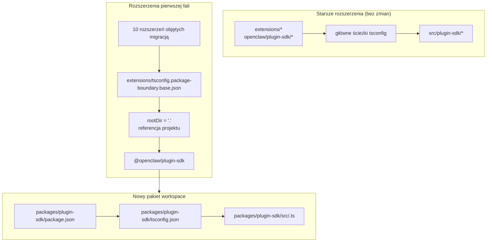

# refactor: Stopniowe przekształcenie plugin-sdk w rzeczywisty pakiet workspace

## Przegląd

Ten plan wprowadza rzeczywisty pakiet workspace dla SDK wtyczek w
`packages/plugin-sdk` i używa go do objęcia małej pierwszej fali rozszerzeń
wymuszanymi przez kompilator granicami pakietów. Celem jest sprawienie, aby
niedozwolone importy względne kończyły się błędem przy zwykłym `tsc` dla
wybranego zestawu dołączonych rozszerzeń dostawców, bez wymuszania migracji w
całym repozytorium ani tworzenia ogromnej powierzchni konfliktów merge.

Kluczowym ruchem przyrostowym jest przez pewien czas równoległe uruchamianie dwóch trybów:

| Tryb        | Kształt importu          | Kto go używa                          | Wymuszanie                                   |
| ----------- | ------------------------ | ------------------------------------- | -------------------------------------------- |
| Tryb starszy | `openclaw/plugin-sdk/*`  | wszystkie istniejące rozszerzenia nieobjęte migracją | obecne permisywne zachowanie pozostaje       |
| Tryb opt-in | `@openclaw/plugin-sdk/*` | tylko rozszerzenia z pierwszej fali   | lokalny dla pakietu `rootDir` + referencje projektów |

## Ramy problemu

Obecne repozytorium eksportuje dużą publiczną powierzchnię SDK wtyczek, ale nie jest to rzeczywisty
pakiet workspace. Zamiast tego:

- główny `tsconfig.json` mapuje `openclaw/plugin-sdk/*` bezpośrednio na
  `src/plugin-sdk/*.ts`
- rozszerzenia, które nie zostały objęte poprzednim eksperymentem, nadal współdzielą
  to globalne zachowanie aliasów źródła
- dodanie `rootDir` działa tylko wtedy, gdy dozwolone importy SDK przestają rozwiązywać się do surowego
  źródła repozytorium

To oznacza, że repozytorium może opisywać pożądaną politykę granic, ale TypeScript
nie wymusza jej w czysty sposób dla większości rozszerzeń.

Potrzebujesz ścieżki przyrostowej, która:

- uczyni `plugin-sdk` rzeczywistym
- przeniesie SDK w kierunku pakietu workspace o nazwie `@openclaw/plugin-sdk`
- zmieni tylko około 10 rozszerzeń w pierwszym PR
- pozostawi resztę drzewa rozszerzeń przy starym schemacie do czasu późniejszego porządkowania
- uniknie przepływu pracy `tsconfig.plugin-sdk.dts.json` + deklaracji generowanych po instalacji jako podstawowego mechanizmu dla wdrożenia pierwszej fali

## Ślad wymagań

- R1. Utworzyć rzeczywisty pakiet workspace dla SDK wtyczek w `packages/`.
- R2. Nazwać nowy pakiet `@openclaw/plugin-sdk`.
- R3. Nadać nowemu pakietowi SDK własne `package.json` i `tsconfig.json`.
- R4. Zachować działanie starszych importów `openclaw/plugin-sdk/*` dla rozszerzeń nieobjętych migracją
  w czasie okna migracyjnego.
- R5. W pierwszym PR objąć tylko małą pierwszą falę rozszerzeń.
- R6. Rozszerzenia z pierwszej fali muszą być fail-closed dla importów względnych, które wychodzą
  poza katalog główny ich pakietu.
- R7. Rozszerzenia z pierwszej fali muszą korzystać z SDK przez zależność pakietu
  i referencję projektu TS, a nie przez główne aliasy `paths`.
- R8. Plan musi unikać obowiązkowego, ogólnorepozytoryjnego kroku generowania po instalacji dla
  poprawności w edytorze.
- R9. Wdrożenie pierwszej fali musi nadawać się do przeglądu i scalenia jako umiarkowany PR,
  a nie refaktor obejmujący ponad 300 plików w całym repozytorium.

## Granice zakresu

- Brak pełnej migracji wszystkich dołączonych rozszerzeń w pierwszym PR.
- Brak wymogu usunięcia `src/plugin-sdk` w pierwszym PR.
- Brak wymogu natychmiastowego przełączenia każdej głównej ścieżki build/test na użycie nowego pakietu.
- Brak próby wymuszenia podkreśleń błędów w VS Code dla każdego rozszerzenia nieobjętego migracją.
- Brak szerokiego porządkowania lint dla reszty drzewa rozszerzeń.
- Brak dużych zmian zachowania w czasie wykonywania poza rozwiązywaniem importów, własnością pakietów
  i wymuszaniem granic dla rozszerzeń objętych migracją.

## Kontekst i badania

### Istotny kod i wzorce

- `pnpm-workspace.yaml` już zawiera `packages/*` i `extensions/*`, więc nowy
  pakiet workspace w `packages/plugin-sdk` pasuje do istniejącego układu
  repozytorium.
- Istniejące pakiety workspace, takie jak `packages/memory-host-sdk/package.json`
  i `packages/plugin-package-contract/package.json`, już używają lokalnych dla pakietu
  map `exports` zakorzenionych w `src/*.ts`.
- Główny `package.json` obecnie publikuje powierzchnię SDK przez `./plugin-sdk`
  i eksporty `./plugin-sdk/*` oparte na `dist/plugin-sdk/*.js` oraz
  `dist/plugin-sdk/*.d.ts`.
- `src/plugin-sdk/entrypoints.ts` i `scripts/lib/plugin-sdk-entrypoints.json`
  już działają jako kanoniczny spis punktów wejścia dla powierzchni SDK.
- Główny `tsconfig.json` obecnie mapuje:
  - `openclaw/plugin-sdk` -> `src/plugin-sdk/index.ts`
  - `openclaw/plugin-sdk/*` -> `src/plugin-sdk/*.ts`
- Poprzedni eksperyment z granicami pokazał, że lokalny dla pakietu `rootDir` działa w przypadku
  niedozwolonych importów względnych dopiero wtedy, gdy dozwolone importy SDK przestają rozwiązywać się do surowego
  źródła spoza pakietu rozszerzenia.

### Zestaw rozszerzeń pierwszej fali

Ten plan zakłada, że pierwszą falą jest zestaw cięższych od strony dostawców, który z najmniejszym prawdopodobieństwem
wciągnie złożone przypadki brzegowe związane z runtime kanałów:

- `extensions/anthropic`
- `extensions/exa`
- `extensions/firecrawl`
- `extensions/groq`
- `extensions/mistral`
- `extensions/openai`
- `extensions/perplexity`
- `extensions/tavily`
- `extensions/together`
- `extensions/xai`

### Spis powierzchni SDK dla pierwszej fali

Rozszerzenia z pierwszej fali obecnie importują możliwy do opanowania podzbiór ścieżek podrzędnych SDK.
Początkowy pakiet `@openclaw/plugin-sdk` musi pokrywać tylko te:

- `agent-runtime`
- `cli-runtime`
- `config-runtime`
- `core`
- `image-generation`
- `media-runtime`
- `media-understanding`
- `plugin-entry`
- `plugin-runtime`
- `provider-auth`
- `provider-auth-api-key`
- `provider-auth-login`
- `provider-auth-runtime`
- `provider-catalog-shared`
- `provider-entry`
- `provider-http`
- `provider-model-shared`
- `provider-onboard`
- `provider-stream-family`
- `provider-stream-shared`
- `provider-tools`
- `provider-usage`
- `provider-web-fetch`
- `provider-web-search`
- `realtime-transcription`
- `realtime-voice`
- `runtime-env`
- `secret-input`
- `security-runtime`
- `speech`
- `testing`

### Wnioski instytucjonalne

- W tym drzewie roboczym nie było istotnych wpisów `docs/solutions/`.

### Referencje zewnętrzne

- Do tego planu nie były potrzebne badania zewnętrzne. Repozytorium już zawiera
  odpowiednie wzorce pakietów workspace i eksportów SDK.

## Kluczowe decyzje techniczne

- Wprowadzić `@openclaw/plugin-sdk` jako nowy pakiet workspace przy jednoczesnym zachowaniu
  starszej powierzchni głównej `openclaw/plugin-sdk/*` podczas migracji.
  Uzasadnienie: pozwala to przenieść zestaw rozszerzeń z pierwszej fali na rzeczywiste
  rozwiązywanie pakietów bez wymuszania jednoczesnych zmian we wszystkich rozszerzeniach i wszystkich głównych ścieżkach budowania.

- Użyć dedykowanej bazowej konfiguracji granic opt-in, takiej jak
  `extensions/tsconfig.package-boundary.base.json`, zamiast zastępować
  istniejącą bazę rozszerzeń dla wszystkich.
  Uzasadnienie: repozytorium musi jednocześnie wspierać starszy i opt-in tryb rozszerzeń podczas migracji.

- Użyć referencji projektów TS z rozszerzeń pierwszej fali do
  `packages/plugin-sdk/tsconfig.json` i ustawić
  `disableSourceOfProjectReferenceRedirect` dla trybu granic opt-in.
  Uzasadnienie: daje to `tsc` rzeczywisty graf pakietów, jednocześnie zniechęcając edytor i kompilator
  do przechodzenia z powrotem do surowego źródła.

- Zachować `@openclaw/plugin-sdk` jako prywatny w pierwszej fali.
  Uzasadnienie: bezpośrednim celem jest wewnętrzne wymuszanie granic i bezpieczeństwo migracji,
  a nie publikowanie drugiego zewnętrznego kontraktu SDK, zanim powierzchnia stanie się stabilna.

- Przenieść w pierwszym wycinku implementacji tylko ścieżki podrzędne SDK z pierwszej fali i
  zachować mosty zgodności dla reszty.
  Uzasadnienie: fizyczne przeniesienie wszystkich 315 plików `src/plugin-sdk/*.ts` w jednym PR to
  dokładnie ta powierzchnia konfliktów merge, której ten plan próbuje uniknąć.

- Nie polegać na `scripts/postinstall-bundled-plugins.mjs` przy budowaniu deklaracji SDK
  dla pierwszej fali.
  Uzasadnienie: jawne przepływy build/reference są łatwiejsze do zrozumienia i sprawiają, że zachowanie repozytorium jest bardziej przewidywalne.

## Otwarte pytania

### Rozstrzygnięte podczas planowania

- Które rozszerzenia powinny wejść do pierwszej fali?
  Użyć wymienionych wyżej 10 rozszerzeń dostawców/wyszukiwania w sieci, ponieważ są
  strukturalnie bardziej odizolowane niż cięższe pakiety kanałów.

- Czy pierwszy PR powinien zastąpić całe drzewo rozszerzeń?
  Nie. Pierwszy PR powinien wspierać dwa tryby równolegle i objąć migracją tylko
  pierwszą falę.

- Czy pierwsza fala powinna wymagać budowania deklaracji po instalacji?
  Nie. Graf pakietów/referencji powinien być jawny, a CI powinno celowo uruchamiać
  odpowiednie lokalne dla pakietu sprawdzanie typów.

### Odłożone do implementacji

- Czy pakiet pierwszej fali może wskazywać bezpośrednio na lokalne dla pakietu `src/*.ts`
  wyłącznie przez referencje projektów, czy też nadal potrzebny jest mały krok emisji deklaracji
  dla pakietu `@openclaw/plugin-sdk`.
  To należące do implementacji pytanie dotyczące walidacji grafu TS.

- Czy główny pakiet `openclaw` powinien natychmiast pośredniczyć w ścieżkach podrzędnych SDK pierwszej fali do
  wyników `packages/plugin-sdk`, czy nadal używać generowanych
  shimów zgodności w `src/plugin-sdk`.
  To szczegół zgodności i kształtu builda zależny od minimalnej
  ścieżki implementacji, która utrzyma zielony stan CI.

## Projekt techniczny wysokiego poziomu

> To ilustruje zamierzone podejście i stanowi wskazówki kierunkowe do przeglądu, a nie specyfikację implementacji. Agent implementujący powinien traktować to jako kontekst, a nie kod do odtworzenia.

## Jednostki implementacyjne

- [ ] **Jednostka 1: Wprowadzenie rzeczywistego pakietu workspace `@openclaw/plugin-sdk`**

**Cel:** Utworzyć rzeczywisty pakiet workspace dla SDK, który może być właścicielem
powierzchni ścieżek podrzędnych pierwszej fali bez wymuszania migracji całego repozytorium.

**Wymagania:** R1, R2, R3, R8, R9

**Zależności:** Brak

**Pliki:**

- Utwórz: `packages/plugin-sdk/package.json`
- Utwórz: `packages/plugin-sdk/tsconfig.json`
- Utwórz: `packages/plugin-sdk/src/index.ts`
- Utwórz: `packages/plugin-sdk/src/*.ts` dla ścieżek podrzędnych SDK z pierwszej fali
- Zmodyfikuj: `pnpm-workspace.yaml` tylko jeśli potrzebne są korekty globów pakietów
- Zmodyfikuj: `package.json`
- Zmodyfikuj: `src/plugin-sdk/entrypoints.ts`
- Zmodyfikuj: `scripts/lib/plugin-sdk-entrypoints.json`
- Test: `src/plugins/contracts/plugin-sdk-workspace-package.contract.test.ts`

**Podejście:**

- Dodaj nowy pakiet workspace o nazwie `@openclaw/plugin-sdk`.
- Zacznij tylko od ścieżek podrzędnych SDK z pierwszej fali, a nie od całego drzewa 315 plików.
- Jeśli bezpośrednie przeniesienie punktu wejścia z pierwszej fali stworzyłoby zbyt duży diff,
  pierwszy PR może najpierw wprowadzić tę ścieżkę podrzędną w `packages/plugin-sdk/src` jako cienki
  wrapper pakietu, a następnie przełączyć źródło prawdy na pakiet w kolejnym PR dla tego klastra ścieżek podrzędnych.
- Użyj ponownie istniejącej mechaniki spisu punktów wejścia, aby powierzchnia pakietu pierwszej fali
  była zadeklarowana w jednym kanonicznym miejscu.
- Zachowaj eksporty głównego pakietu dla starszych użytkowników, podczas gdy pakiet workspace
  stanie się nowym kontraktem opt-in.

**Wzorce do naśladowania:**

- `packages/memory-host-sdk/package.json`
- `packages/plugin-package-contract/package.json`
- `src/plugin-sdk/entrypoints.ts`

**Scenariusze testowe:**

- Ścieżka szczęśliwa: pakiet workspace eksportuje każdą ścieżkę podrzędną pierwszej fali wymienioną
  w planie i nie brakuje żadnego wymaganego eksportu pierwszej fali.
- Przypadek brzegowy: metadane eksportu pakietu pozostają stabilne, gdy lista wpisów pierwszej fali
  jest ponownie generowana lub porównywana z kanonicznym spisem.
- Integracja: starsze eksporty SDK głównego pakietu pozostają obecne po wprowadzeniu nowego
  pakietu workspace.

**Weryfikacja:**

- Repozytorium zawiera prawidłowy pakiet workspace `@openclaw/plugin-sdk` z
  stabilną mapą eksportów pierwszej fali i bez regresji starszych eksportów w głównym
  `package.json`.

- [ ] **Jednostka 2: Dodanie trybu granic TS opt-in dla rozszerzeń z wymuszaniem pakietowym**

**Cel:** Zdefiniować tryb konfiguracji TS, którego będą używać rozszerzenia objęte migracją,
przy pozostawieniu istniejącego zachowania TS dla rozszerzeń bez zmian dla wszystkich pozostałych.

**Wymagania:** R4, R6, R7, R8, R9

**Zależności:** Jednostka 1

**Pliki:**

- Utwórz: `extensions/tsconfig.package-boundary.base.json`
- Utwórz: `tsconfig.boundary-optin.json`
- Zmodyfikuj: `extensions/xai/tsconfig.json`
- Zmodyfikuj: `extensions/openai/tsconfig.json`
- Zmodyfikuj: `extensions/anthropic/tsconfig.json`
- Zmodyfikuj: `extensions/mistral/tsconfig.json`
- Zmodyfikuj: `extensions/groq/tsconfig.json`
- Zmodyfikuj: `extensions/together/tsconfig.json`
- Zmodyfikuj: `extensions/perplexity/tsconfig.json`
- Zmodyfikuj: `extensions/tavily/tsconfig.json`
- Zmodyfikuj: `extensions/exa/tsconfig.json`
- Zmodyfikuj: `extensions/firecrawl/tsconfig.json`
- Test: `src/plugins/contracts/extension-package-project-boundaries.test.ts`
- Test: `test/extension-package-tsc-boundary.test.ts`

**Podejście:**

- Pozostaw `extensions/tsconfig.base.json` dla starszych rozszerzeń.
- Dodaj nową bazową konfigurację opt-in, która:
  - ustawia `rootDir: "."`
  - referuje `packages/plugin-sdk`
  - włącza `composite`
  - wyłącza przekierowanie źródła referencji projektu, gdy to potrzebne
- Dodaj dedykowaną konfigurację rozwiązania dla grafu sprawdzania typów pierwszej fali zamiast
  przebudowywania głównego projektu TS repozytorium w tym samym PR.

**Uwaga wykonawcza:** Zacznij od nieprzechodzącego lokalnego dla pakietu kontrolnego sprawdzania typów dla jednego
rozszerzenia objętego migracją, zanim zastosujesz wzorzec do wszystkich 10.

**Wzorce do naśladowania:**

- Istniejący wzorzec lokalnego dla pakietu `tsconfig.json` dla rozszerzeń z wcześniejszych
  prac nad granicami
- Wzorzec pakietu workspace z `packages/memory-host-sdk`

**Scenariusze testowe:**

- Ścieżka szczęśliwa: każde rozszerzenie objęte migracją pomyślnie przechodzi sprawdzanie typów przez
  konfigurację TS granic pakietu.
- Ścieżka błędu: kontrolny import względny z `../../src/cli/acp-cli.ts` kończy się
  `TS6059` dla rozszerzenia objętego migracją.
- Integracja: rozszerzenia nieobjęte migracją pozostają nietknięte i nie muszą
  uczestniczyć w nowej konfiguracji rozwiązania.

**Weryfikacja:**

- Istnieje dedykowany graf sprawdzania typów dla 10 rozszerzeń objętych migracją i błędne
  importy względne z jednego z nich kończą się błędem przez zwykłe `tsc`.

- [ ] **Jednostka 3: Migracja rozszerzeń pierwszej fali do `@openclaw/plugin-sdk`**

**Cel:** Przestawić rozszerzenia pierwszej fali na korzystanie z rzeczywistego pakietu SDK
przez metadane zależności, referencje projektów i importy po nazwie pakietu.

**Wymagania:** R5, R6, R7, R9

**Zależności:** Jednostka 2

**Pliki:**

- Zmodyfikuj: `extensions/anthropic/package.json`
- Zmodyfikuj: `extensions/exa/package.json`
- Zmodyfikuj: `extensions/firecrawl/package.json`
- Zmodyfikuj: `extensions/groq/package.json`
- Zmodyfikuj: `extensions/mistral/package.json`
- Zmodyfikuj: `extensions/openai/package.json`
- Zmodyfikuj: `extensions/perplexity/package.json`
- Zmodyfikuj: `extensions/tavily/package.json`
- Zmodyfikuj: `extensions/together/package.json`
- Zmodyfikuj: `extensions/xai/package.json`
- Zmodyfikuj: importy produkcyjne i testowe w każdym z 10 katalogów głównych rozszerzeń, które
  obecnie odwołują się do `openclaw/plugin-sdk/*`

**Podejście:**

- Dodaj `@openclaw/plugin-sdk: workspace:*` do `devDependencies` rozszerzeń
  z pierwszej fali.
- Zamień w tych pakietach importy `openclaw/plugin-sdk/*` na
  `@openclaw/plugin-sdk/*`.
- Zachowaj lokalne importy wewnętrzne rozszerzeń przy lokalnych barrelach, takich jak `./api.ts` i
  `./runtime-api.ts`.
- Nie zmieniaj rozszerzeń nieobjętych migracją w tym PR.

**Wzorce do naśladowania:**

- Istniejące lokalne barrele importów rozszerzeń (`api.ts`, `runtime-api.ts`)
- Kształt zależności pakietów używany przez inne pakiety workspace `@openclaw/*`

**Scenariusze testowe:**

- Ścieżka szczęśliwa: każde zmigrowane rozszerzenie nadal rejestruje się/ładuje przez swoje istniejące
  testy wtyczek po przepisaniu importów.
- Przypadek brzegowy: importy SDK tylko testowe w zestawie rozszerzeń objętych migracją nadal rozwiązują się
  poprawnie przez nowy pakiet.
- Integracja: zmigrowane rozszerzenia nie wymagają głównych aliasów `openclaw/plugin-sdk/*`
  do sprawdzania typów.

**Weryfikacja:**

- Rozszerzenia z pierwszej fali budują się i testują względem `@openclaw/plugin-sdk`
  bez potrzeby używania starszej ścieżki aliasu głównego SDK.

- [ ] **Jednostka 4: Zachowanie starszej zgodności podczas częściowej migracji**

**Cel:** Utrzymać działanie reszty repozytorium, gdy SDK istnieje równocześnie w postaci starszej
i nowego pakietu podczas migracji.

**Wymagania:** R4, R8, R9

**Zależności:** Jednostki 1-3

**Pliki:**

- Zmodyfikuj: `src/plugin-sdk/*.ts` pod kątem shimów zgodności pierwszej fali w razie potrzeby
- Zmodyfikuj: `package.json`
- Zmodyfikuj: elementy builda lub eksportu składające artefakty SDK
- Test: `src/plugins/contracts/plugin-sdk-runtime-api-guardrails.test.ts`
- Test: `src/plugins/contracts/plugin-sdk-index.bundle.test.ts`

**Podejście:**

- Zachowaj główne `openclaw/plugin-sdk/*` jako powierzchnię zgodności dla starszych
  rozszerzeń i dla zewnętrznych użytkowników, którzy jeszcze nie przechodzą migracji.
- Użyj albo generowanych shimów, albo pośredniczącego routingu eksportów głównych dla
  ścieżek podrzędnych pierwszej fali, które zostały przeniesione do `packages/plugin-sdk`.
- Nie próbuj wycofywać głównej powierzchni SDK na tym etapie.

**Wzorce do naśladowania:**

- Istniejące generowanie eksportów głównego SDK przez `src/plugin-sdk/entrypoints.ts`
- Istniejąca zgodność eksportów pakietu w głównym `package.json`

**Scenariusze testowe:**

- Ścieżka szczęśliwa: starszy import głównego SDK nadal rozwiązuje się dla rozszerzenia
  nieobjętego migracją po wprowadzeniu nowego pakietu.
- Przypadek brzegowy: ścieżka podrzędna pierwszej fali działa zarówno przez starszą powierzchnię główną, jak i
  przez nową powierzchnię pakietu podczas okna migracyjnego.
- Integracja: testy kontraktowe indeksu/bundle plugin-sdk nadal widzą spójną
  publiczną powierzchnię.

**Weryfikacja:**

- Repozytorium wspiera zarówno starszy, jak i opt-in tryb korzystania z SDK bez
  psucia niezmienionych rozszerzeń.

- [ ] **Jednostka 5: Dodanie ograniczonego wymuszania i udokumentowanie kontraktu migracji**

**Cel:** Wdrożyć w CI i wskazówkach dla współtwórców nowe zachowanie dla
pierwszej fali, bez udawania, że całe drzewo rozszerzeń zostało zmigrowane.

**Wymagania:** R5, R6, R8, R9

**Zależności:** Jednostki 1-4

**Pliki:**

- Zmodyfikuj: `package.json`
- Zmodyfikuj: pliki workflow CI, które powinny uruchamiać sprawdzanie typów granic opt-in
- Zmodyfikuj: `AGENTS.md`
- Zmodyfikuj: `docs/plugins/sdk-overview.md`
- Zmodyfikuj: `docs/plugins/sdk-entrypoints.md`
- Zmodyfikuj: `docs/plans/2026-04-05-001-refactor-extension-package-resolution-boundary-plan.md`

**Podejście:**

- Dodaj jawny gate pierwszej fali, taki jak dedykowane uruchomienie `tsc -b` dla rozwiązania
  `packages/plugin-sdk` plus 10 rozszerzeń objętych migracją.
- Udokumentuj, że repozytorium wspiera teraz zarówno starszy, jak i opt-in tryb rozszerzeń,
  oraz że nowe prace nad granicami rozszerzeń powinny preferować nową ścieżkę pakietową.
- Zapisz regułę migracji kolejnych fal, aby późniejsze PR-y mogły dodawać więcej rozszerzeń
  bez ponownego rozstrzygania kwestii architektury.

**Wzorce do naśladowania:**

- Istniejące testy kontraktowe w `src/plugins/contracts/`
- Istniejące aktualizacje dokumentacji wyjaśniające etapowe migracje

**Scenariusze testowe:**

- Ścieżka szczęśliwa: nowy gate sprawdzania typów dla pierwszej fali przechodzi dla pakietu workspace
  i rozszerzeń objętych migracją.
- Ścieżka błędu: wprowadzenie nowego niedozwolonego importu względnego w rozszerzeniu objętym migracją
  powoduje błąd w ograniczonym gate sprawdzania typów.
- Integracja: CI nie wymaga jeszcze od rozszerzeń nieobjętych migracją spełniania nowego
  trybu granic pakietu.

**Weryfikacja:**

- Ścieżka wymuszania dla pierwszej fali jest udokumentowana, przetestowana i możliwa do uruchomienia bez
  wymuszania migracji całego drzewa rozszerzeń.

## Wpływ na cały system

- **Graf interakcji:** ta praca dotyka źródła prawdy SDK, eksportów głównego pakietu,
  metadanych pakietów rozszerzeń, układu grafu TS i weryfikacji CI.
- **Propagacja błędów:** głównym zamierzonym trybem błędu stają się błędy TS czasu kompilacji
  (`TS6059`) w rozszerzeniach objętych migracją zamiast niestandardowych błędów tylko skryptowych.
- **Ryzyka cyklu życia stanu:** migracja z dwiema powierzchniami wprowadza ryzyko dryfu między
  eksportami zgodności w głównym pakiecie a nowym pakietem workspace.
- **Parzystość powierzchni API:** ścieżki podrzędne pierwszej fali muszą pozostać semantycznie identyczne
  zarówno przez `openclaw/plugin-sdk/*`, jak i `@openclaw/plugin-sdk/*` podczas
  przejścia.
- **Pokrycie integracyjne:** testy jednostkowe nie wystarczą; potrzebne są ograniczone
  sprawdzania typów grafu pakietów, aby udowodnić granicę.
- **Niezmienione niezmienniki:** rozszerzenia nieobjęte migracją zachowują swoje obecne zachowanie
  w PR 1. Ten plan nie twierdzi, że zapewnia wymuszanie granic importu w całym repozytorium.

## Ryzyka i zależności

| Ryzyko                                                                                                   | Ograniczenie                                                                                                              |
| -------------------------------------------------------------------------------------------------------- | ------------------------------------------------------------------------------------------------------------------------- |
| Pakiet pierwszej fali nadal rozwiązuje się z powrotem do surowego źródła i `rootDir` faktycznie nie działa fail-closed | Uczyń pierwszym krokiem implementacji kontrolę referencji pakietu na jednym rozszerzeniu objętym migracją przed rozszerzeniem na cały zestaw |
| Przeniesienie zbyt dużej części źródła SDK naraz odtwarza pierwotny problem konfliktów merge            | Przenieś tylko ścieżki podrzędne pierwszej fali w pierwszym PR i zachowaj mosty zgodności głównego pakietu              |
| Starsza i nowa powierzchnia SDK dryfują semantycznie                                                     | Zachowaj jeden spis punktów wejścia, dodaj testy kontraktu zgodności i jawnie wymagaj parzystości dwóch powierzchni     |
| Główne ścieżki build/test repozytorium przypadkowo zaczynają zależeć od nowego pakietu w niekontrolowany sposób | Użyj dedykowanej konfiguracji rozwiązania opt-in i nie wprowadzaj zmian w ogólnym grafie TS repozytorium w pierwszym PR |

## Dostarczanie etapowe

### Faza 1

- Wprowadzić `@openclaw/plugin-sdk`
- Zdefiniować powierzchnię ścieżek podrzędnych pierwszej fali
- Udowodnić, że jedno rozszerzenie objęte migracją może działać fail-closed przez `rootDir`

### Faza 2

- Objąć migracją 10 rozszerzeń z pierwszej fali
- Zachować główną zgodność dla wszystkich pozostałych

### Faza 3

- Dodawać kolejne rozszerzenia w późniejszych PR-ach
- Przenosić więcej ścieżek podrzędnych SDK do pakietu workspace
- Wycofać główną zgodność dopiero po zniknięciu zestawu starszych rozszerzeń

## Uwagi dokumentacyjne / operacyjne

- Pierwszy PR powinien wyraźnie opisywać siebie jako migrację w dwóch trybach, a nie
  jako ukończenie wymuszania w całym repozytorium.
- Przewodnik migracji powinien ułatwiać późniejszym PR-om dodawanie kolejnych rozszerzeń
  według tego samego wzorca pakiet/zależność/referencja.

## Źródła i referencje

- Poprzedni plan: `docs/plans/2026-04-05-001-refactor-extension-package-resolution-boundary-plan.md`
- Konfiguracja workspace: `pnpm-workspace.yaml`
- Istniejący spis punktów wejścia SDK: `src/plugin-sdk/entrypoints.ts`
- Istniejące eksporty głównego SDK: `package.json`
- Istniejące wzorce pakietów workspace:
  - `packages/memory-host-sdk/package.json`
  - `packages/plugin-package-contract/package.json`
