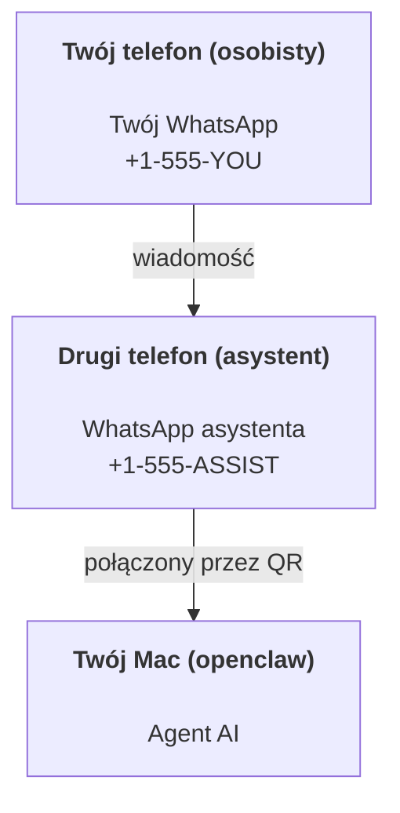

---
read_when:
    - Wdrażanie nowej instancji asystenta
    - Przegląd implikacji dotyczących bezpieczeństwa/uprawnień
summary: Kompleksowy przewodnik po uruchamianiu OpenClaw jako osobistego asystenta z uwzględnieniem środków ostrożności dotyczących bezpieczeństwa
title: Konfiguracja osobistego asystenta
x-i18n:
    generated_at: "2026-04-24T09:33:42Z"
    model: gpt-5.4
    provider: openai
    source_hash: 3048f2faae826fc33d962f1fac92da3c0ce464d2de803fee381c897eb6c76436
    source_path: start/openclaw.md
    workflow: 15
---

# Budowanie osobistego asystenta z OpenClaw

OpenClaw to self-hostowany Gateway, który łączy Discord, Google Chat, iMessage, Matrix, Microsoft Teams, Signal, Slack, Telegram, WhatsApp, Zalo i inne z agentami AI. Ten przewodnik opisuje konfigurację „osobistego asystenta”: dedykowany numer WhatsApp, który działa jak Twój zawsze dostępny asystent AI.

## ⚠️ Najpierw bezpieczeństwo

Umieszczasz agenta w pozycji, w której może:

- uruchamiać polecenia na Twojej maszynie (zależnie od polityki narzędzi)
- odczytywać/zapisywać pliki w Twoim obszarze roboczym
- wysyłać wiadomości z powrotem przez WhatsApp/Telegram/Discord/Mattermost i inne wbudowane kanały

Zacznij zachowawczo:

- Zawsze ustawiaj `channels.whatsapp.allowFrom` (nigdy nie uruchamiaj tego otwartego dla całego świata na swoim osobistym Macu).
- Używaj dedykowanego numeru WhatsApp dla asystenta.
- Heartbeat domyślnie uruchamia się teraz co 30 minut. Wyłącz go, dopóki nie zaufasz konfiguracji, ustawiając `agents.defaults.heartbeat.every: "0m"`.

## Wymagania wstępne

- OpenClaw zainstalowany i wdrożony — zobacz [Pierwsze kroki](/pl/start/getting-started), jeśli jeszcze tego nie zrobiono
- Drugi numer telefonu (SIM/eSIM/prepaid) dla asystenta

## Konfiguracja z dwoma telefonami (zalecana)

Tego właśnie chcesz:



Jeśli połączysz swój osobisty WhatsApp z OpenClaw, każda wiadomość do Ciebie stanie się „wejściem agenta”. Rzadko jest to pożądane.

## 5-minutowy szybki start

1. Sparuj WhatsApp Web (wyświetli kod QR; zeskanuj go telefonem asystenta):

```bash
openclaw channels login
```

2. Uruchom Gateway (pozostaw go uruchomionego):

```bash
openclaw gateway --port 18789
```

3. Umieść minimalną konfigurację w `~/.openclaw/openclaw.json`:

```json5
{
  gateway: { mode: "local" },
  channels: { whatsapp: { allowFrom: ["+15555550123"] } },
}
```

Teraz wyślij wiadomość na numer asystenta z telefonu znajdującego się na liście dozwolonych.

Po zakończeniu wdrażania OpenClaw automatycznie otworzy panel i wypisze czysty link (bez tokena). Jeśli panel poprosi o uwierzytelnienie, wklej skonfigurowany współdzielony sekret w ustawieniach Control UI. Wdrażanie domyślnie używa tokena (`gateway.auth.token`), ale działa także uwierzytelnianie hasłem, jeśli przełączono `gateway.auth.mode` na `password`. Aby otworzyć ponownie później: `openclaw dashboard`.

## Daj agentowi obszar roboczy (AGENTS)

OpenClaw odczytuje instrukcje operacyjne i „pamięć” z katalogu obszaru roboczego.

Domyślnie OpenClaw używa `~/.openclaw/workspace` jako obszaru roboczego agenta i utworzy go automatycznie (wraz ze startowymi plikami `AGENTS.md`, `SOUL.md`, `TOOLS.md`, `IDENTITY.md`, `USER.md`, `HEARTBEAT.md`) podczas konfiguracji/pierwszego uruchomienia agenta. `BOOTSTRAP.md` jest tworzony tylko wtedy, gdy obszar roboczy jest zupełnie nowy (nie powinien wracać po usunięciu). `MEMORY.md` jest opcjonalny (nie jest tworzony automatycznie); jeśli istnieje, jest wczytywany dla normalnych sesji. Sesje subagentów wstrzykują tylko `AGENTS.md` i `TOOLS.md`.

Wskazówka: traktuj ten folder jak „pamięć” OpenClaw i zrób z niego repozytorium git (najlepiej prywatne), aby Twoje pliki `AGENTS.md` i pamięci miały kopię zapasową. Jeśli git jest zainstalowany, zupełnie nowe obszary robocze są inicjalizowane automatycznie.

```bash
openclaw setup
```

Pełny układ obszaru roboczego + przewodnik po kopiach zapasowych: [Obszar roboczy agenta](/pl/concepts/agent-workspace)
Przepływ pracy pamięci: [Pamięć](/pl/concepts/memory)

Opcjonalnie: wybierz inny obszar roboczy za pomocą `agents.defaults.workspace` (obsługuje `~`).

```json5
{
  agent: {
    workspace: "~/.openclaw/workspace",
  },
}
```

Jeśli już dostarczasz własne pliki obszaru roboczego z repozytorium, możesz całkowicie wyłączyć tworzenie plików bootstrap:

```json5
{
  agent: {
    skipBootstrap: true,
  },
}
```

## Konfiguracja, która zmienia to w „asystenta”

OpenClaw domyślnie zapewnia dobrą konfigurację asystenta, ale zwykle warto dostroić:

- personę/instrukcje w [`SOUL.md`](/pl/concepts/soul)
- domyślne ustawienia myślenia (jeśli są pożądane)
- Heartbeat (gdy już mu zaufasz)

Przykład:

```json5
{
  logging: { level: "info" },
  agent: {
    model: "anthropic/claude-opus-4-6",
    workspace: "~/.openclaw/workspace",
    thinkingDefault: "high",
    timeoutSeconds: 1800,
    // Zacznij od 0; włącz później.
    heartbeat: { every: "0m" },
  },
  channels: {
    whatsapp: {
      allowFrom: ["+15555550123"],
      groups: {
        "*": { requireMention: true },
      },
    },
  },
  routing: {
    groupChat: {
      mentionPatterns: ["@openclaw", "openclaw"],
    },
  },
  session: {
    scope: "per-sender",
    resetTriggers: ["/new", "/reset"],
    reset: {
      mode: "daily",
      atHour: 4,
      idleMinutes: 10080,
    },
  },
}
```

## Sesje i pamięć

- Pliki sesji: `~/.openclaw/agents/<agentId>/sessions/{{SessionId}}.jsonl`
- Metadane sesji (użycie tokenów, ostatnia trasa itp.): `~/.openclaw/agents/<agentId>/sessions/sessions.json` (starsza lokalizacja: `~/.openclaw/sessions/sessions.json`)
- `/new` lub `/reset` rozpoczyna nową sesję dla tego czatu (konfigurowalne przez `resetTriggers`). Jeśli zostanie wysłane samodzielnie, agent odpowie krótkim przywitaniem, aby potwierdzić reset.
- `/compact [instructions]` wykonuje Compaction kontekstu sesji i zgłasza pozostały budżet kontekstu.

## Heartbeats (tryb proaktywny)

Domyślnie OpenClaw uruchamia Heartbeat co 30 minut z promptem:
`Read HEARTBEAT.md if it exists (workspace context). Follow it strictly. Do not infer or repeat old tasks from prior chats. If nothing needs attention, reply HEARTBEAT_OK.`
Aby wyłączyć, ustaw `agents.defaults.heartbeat.every: "0m"`.

- Jeśli `HEARTBEAT.md` istnieje, ale jest w praktyce pusty (tylko puste linie i nagłówki markdown, takie jak `# Heading`), OpenClaw pomija uruchomienie Heartbeat, aby oszczędzić wywołania API.
- Jeśli pliku brakuje, Heartbeat nadal się uruchamia, a model decyduje, co zrobić.
- Jeśli agent odpowie `HEARTBEAT_OK` (opcjonalnie z krótkim wypełnieniem; zobacz `agents.defaults.heartbeat.ackMaxChars`), OpenClaw wstrzyma dostarczenie wychodzące dla tego Heartbeat.
- Domyślnie dostarczanie Heartbeat do celów typu DM `user:<id>` jest dozwolone. Ustaw `agents.defaults.heartbeat.directPolicy: "block"`, aby zablokować dostarczanie do celu bezpośredniego przy zachowaniu aktywnych uruchomień Heartbeat.
- Heartbeats uruchamiają pełne tury agenta — krótsze interwały zużywają więcej tokenów.

```json5
{
  agent: {
    heartbeat: { every: "30m" },
  },
}
```

## Multimedia przychodzące i wychodzące

Załączniki przychodzące (obrazy/audio/dokumenty) mogą być przekazane do Twojego polecenia przez szablony:

- `{{MediaPath}}` (lokalna ścieżka do pliku tymczasowego)
- `{{MediaUrl}}` (pseudo-URL)
- `{{Transcript}}` (jeśli transkrypcja audio jest włączona)

Załączniki wychodzące od agenta: umieść `MEDIA:<path-or-url>` w osobnym wierszu (bez spacji). Przykład:

```
Oto zrzut ekranu.
MEDIA:https://example.com/screenshot.png
```

OpenClaw wyodrębnia je i wysyła jako multimedia razem z tekstem.

Zachowanie lokalnych ścieżek podlega temu samemu modelowi zaufania odczytu plików co agent:

- Jeśli `tools.fs.workspaceOnly` ma wartość `true`, lokalne ścieżki wychodzące `MEDIA:` pozostają ograniczone do głównego katalogu tymczasowego OpenClaw, pamięci podręcznej multimediów, ścieżek obszaru roboczego agenta i plików wygenerowanych w sandboxie.
- Jeśli `tools.fs.workspaceOnly` ma wartość `false`, wychodzące `MEDIA:` mogą używać lokalnych plików hosta, które agent ma już prawo odczytywać.
- Wysyłka lokalna z hosta nadal dopuszcza tylko multimedia i bezpieczne typy dokumentów (obrazy, audio, wideo, PDF i dokumenty pakietu Office). Zwykły tekst i pliki przypominające sekrety nie są traktowane jako multimedia możliwe do wysłania.

To oznacza, że wygenerowane obrazy/pliki poza obszarem roboczym mogą być teraz wysyłane, jeśli Twoja polityka fs już zezwala na ich odczyt, bez ponownego otwierania możliwości arbitralnej eksfiltracji załączników tekstowych z hosta.

## Lista kontrolna operacji

```bash
openclaw status          # stan lokalny (poświadczenia, sesje, zdarzenia w kolejce)
openclaw status --all    # pełna diagnoza (tylko do odczytu, gotowa do wklejenia)
openclaw status --deep   # prosi Gateway o aktywną sondę stanu z sondami kanałów, gdy są obsługiwane
openclaw health --json   # migawka stanu Gateway (WS; domyślnie może zwrócić świeżą migawkę z pamięci podręcznej)
```

Logi znajdują się w `/tmp/openclaw/` (domyślnie: `openclaw-YYYY-MM-DD.log`).

## Następne kroki

- WebChat: [WebChat](/pl/web/webchat)
- Operacje Gateway: [Runbook Gateway](/pl/gateway)
- Cron + wybudzenia: [Zadania Cron](/pl/automation/cron-jobs)
- Towarzysząca aplikacja paska menu macOS: [Aplikacja OpenClaw dla macOS](/pl/platforms/macos)
- Aplikacja Node dla iOS: [Aplikacja iOS](/pl/platforms/ios)
- Aplikacja Node dla Androida: [Aplikacja Android](/pl/platforms/android)
- Stan Windows: [Windows (WSL2)](/pl/platforms/windows)
- Stan Linux: [Aplikacja Linux](/pl/platforms/linux)
- Bezpieczeństwo: [Bezpieczeństwo](/pl/gateway/security)

## Powiązane

- [Pierwsze kroki](/pl/start/getting-started)
- [Konfiguracja](/pl/start/setup)
- [Przegląd kanałów](/pl/channels)
