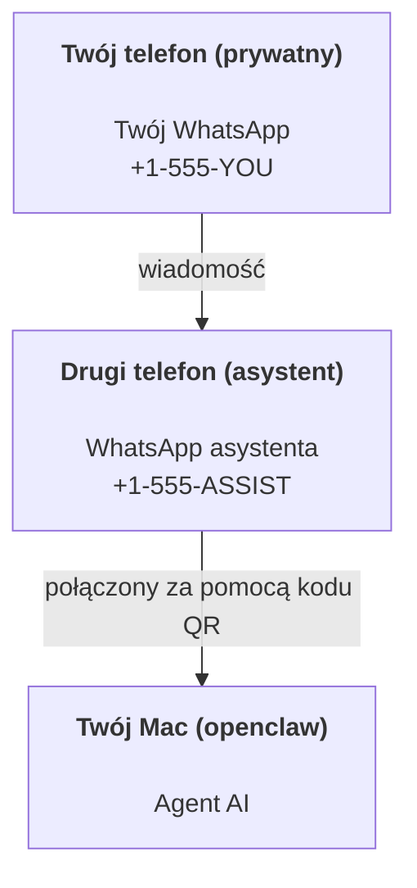

---
read_when:
    - Wdrażanie nowej instancji asystenta
    - Analizowanie konsekwencji dotyczących bezpieczeństwa i uprawnień
summary: Kompletny przewodnik po korzystaniu z OpenClaw jako osobistego asystenta, z uwzględnieniem środków ostrożności
title: Konfiguracja osobistego asystenta
x-i18n:
    generated_at: "2026-07-16T19:03:23Z"
    model: gpt-5.6
    postprocess_version: locale-links-v1
    prompt_version: 32
    provider: openai
    source_hash: e8c34e31314f55647059fd600935330110add27b338a675bc0ce1529bebb207d
    source_path: start/openclaw.md
    workflow: 16
---

OpenClaw to samodzielnie hostowany Gateway, który łączy Discord, Google Chat, iMessage, Matrix, Microsoft Teams, Signal, Slack, Telegram, WhatsApp, Zalo i inne usługi z agentami AI. Ten przewodnik opisuje konfigurację „osobistego asystenta”: dedykowany numer WhatsApp, który działa jak stale dostępny asystent AI.

## Najpierw bezpieczeństwo

Udostępnienie agentowi kanału umożliwia mu wykonywanie poleceń na komputerze (zależnie od zasad dotyczących narzędzi), odczytywanie i zapisywanie plików w przestrzeni roboczej oraz wysyłanie wiadomości przez dowolny połączony kanał. Na początek należy zastosować restrykcyjne ustawienia:

- Zawsze ustawiaj `channels.whatsapp.allowFrom` (nigdy nie uruchamiaj publicznie dostępnej usługi na prywatnym Macu).
- Używaj dedykowanego numeru WhatsApp dla asystenta.
- Domyślnie Heartbeat jest uruchamiany co 30 minut. Do czasu uzyskania zaufania do konfiguracji wyłącz go, ustawiając `agents.defaults.heartbeat.every: "0m"`.

## Wymagania wstępne

- Zainstalowany i skonfigurowany OpenClaw — jeśli nie zostało to jeszcze zrobione, zobacz [Pierwsze kroki](/pl/start/getting-started)
- Drugi numer telefonu (SIM/eSIM/karta przedpłacona) dla asystenta

## Konfiguracja z dwoma telefonami (zalecana)

Docelowa konfiguracja:



Jeśli prywatne konto WhatsApp zostanie połączone z OpenClaw, każda otrzymana wiadomość stanie się „danymi wejściowymi agenta”. Zwykle nie jest to pożądane.

## Szybki start w 5 minut

1. Sparuj WhatsApp Web (zostanie wyświetlony kod QR; zeskanuj go telefonem asystenta):

```bash
openclaw channels login
```

2. Uruchom Gateway (pozostaw go uruchomionego):

```bash
openclaw gateway --port 18789
```

3. Umieść minimalną konfigurację w `~/.openclaw/openclaw.json`:

```json5
{
  gateway: { mode: "local" },
  channels: { whatsapp: { allowFrom: ["+15555550123"] } },
}
```

Teraz wyślij wiadomość na numer asystenta z telefonu znajdującego się na liście dozwolonych numerów.

Po zakończeniu wdrażania OpenClaw automatycznie otwiera panel i wyświetla zwykły link (bez tokenu). Jeśli panel poprosi o uwierzytelnienie, wklej skonfigurowany współdzielony sekret w ustawieniach interfejsu Control UI. Wdrażanie domyślnie używa tokenu (`gateway.auth.token`), ale uwierzytelnianie hasłem również działa, jeśli zmieniono `gateway.auth.mode` na `password`. Aby otworzyć panel ponownie później: `openclaw dashboard`.

## Udostępnianie agentowi przestrzeni roboczej (AGENTS)

OpenClaw odczytuje instrukcje działania i „pamięć” z katalogu przestrzeni roboczej.

Domyślnie OpenClaw używa `~/.openclaw/workspace` jako przestrzeni roboczej agenta i tworzy ją (wraz z początkowymi plikami `AGENTS.md`, `SOUL.md`, `TOOLS.md`, `IDENTITY.md`, `USER.md`, `HEARTBEAT.md`) automatycznie podczas wdrażania lub pierwszego uruchomienia agenta. Plik `BOOTSTRAP.md` jest tworzony tylko dla zupełnie nowej przestrzeni roboczej i nie powinien pojawić się ponownie po usunięciu. Plik `MEMORY.md` jest opcjonalny i nigdy nie jest tworzony automatycznie; jeśli istnieje, jest wczytywany podczas zwykłych sesji. W sesjach podagentów wstrzykiwane są tylko `AGENTS.md` i `TOOLS.md`.

<Tip>
Ten folder należy traktować jak pamięć OpenClaw i utworzyć w nim repozytorium git (najlepiej prywatne), aby pliki `AGENTS.md` oraz pliki pamięci miały kopię zapasową. Jeśli git jest zainstalowany, zupełnie nowe przestrzenie robocze są automatycznie inicjowane z plikiem `git init`.
</Tip>

Aby utworzyć foldery przestrzeni roboczej i konfiguracji bez uruchamiania pełnego kreatora wdrażania:

```bash
openclaw setup --baseline
```

(Samo `openclaw setup` jest aliasem `openclaw onboard` i uruchamia pełny interaktywny kreator).

Pełny układ przestrzeni roboczej i przewodnik tworzenia kopii zapasowych: [Przestrzeń robocza agenta](/pl/concepts/agent-workspace)
Przepływ pracy z pamięcią: [Pamięć](/pl/concepts/memory)

Opcjonalnie: wybierz inną przestrzeń roboczą za pomocą `agents.defaults.workspace` (obsługuje `~`).

```json5
{
  agents: {
    defaults: {
      workspace: "~/.openclaw/workspace",
    },
  },
}
```

Jeśli własne pliki przestrzeni roboczej są już dostarczane z repozytorium, można całkowicie wyłączyć tworzenie plików początkowych:

```json5
{
  agents: {
    defaults: {
      skipBootstrap: true,
    },
  },
}
```

## Konfiguracja zmieniająca go w „asystenta”

Domyślna konfiguracja OpenClaw dobrze sprawdza się jako asystent, ale zwykle warto dostosować:

- osobowość/instrukcje w [`SOUL.md`](/pl/concepts/soul)
- domyślne ustawienia rozumowania (w razie potrzeby)
- Heartbeat (po uzyskaniu zaufania do konfiguracji)

Przykład:

```json5
{
  logging: { level: "info" },
  agents: {
    defaults: {
      model: { primary: "anthropic/claude-opus-4-8" },
      workspace: "~/.openclaw/workspace",
      thinkingDefault: "high",
      timeoutSeconds: 1800,
      // Zacznij od 0; włącz później.
      heartbeat: { every: "0m" },
    },
    list: [
      {
        id: "main",
        default: true,
        groupChat: {
          mentionPatterns: ["@openclaw", "openclaw"],
        },
      },
    ],
  },
  channels: {
    whatsapp: {
      allowFrom: ["+15555550123"],
      groups: {
        "*": { requireMention: true },
      },
    },
  },
  session: {
    scope: "per-sender",
    resetTriggers: ["/new", "/reset"],
    reset: {
      mode: "daily",
      atHour: 4,
      idleMinutes: 10080,
    },
  },
}
```

## Sesje i pamięć

- Wiersze sesji, wiersze transkrypcji i metadane (użycie tokenów, ostatnia trasa itp.): `~/.openclaw/agents/<agentId>/agent/openclaw-agent.sqlite`
- Starsze/archiwalne artefakty transkrypcji: `~/.openclaw/agents/<agentId>/sessions/`
- Źródło migracji starszych wierszy: `~/.openclaw/agents/<agentId>/sessions/sessions.json`
- `/new` lub `/reset` rozpoczyna nową sesję dla danego czatu (można to skonfigurować za pomocą `session.resetTriggers`). Jeśli polecenie zostanie wysłane samodzielnie, OpenClaw potwierdzi zresetowanie bez wywoływania modelu.
- `/compact [instructions]` wykonuje Compaction kontekstu sesji i podaje pozostały budżet kontekstu.

## Heartbeat (tryb proaktywny)

Domyślnie OpenClaw uruchamia Heartbeat co 30 minut z monitem:
`Read HEARTBEAT.md if it exists (workspace context). Follow it strictly. Do not infer or repeat old tasks from prior chats. If nothing needs attention, reply HEARTBEAT_OK.`
Aby go wyłączyć, ustaw `agents.defaults.heartbeat.every: "0m"`.

- Jeśli plik `HEARTBEAT.md` istnieje, ale jest faktycznie pusty (zawiera tylko puste wiersze, komentarze Markdown/HTML, nagłówki Markdown takie jak `# Heading`, znaczniki ogrodzeń lub puste elementy listy kontrolnej), OpenClaw pomija uruchomienie Heartbeat, aby ograniczyć liczbę wywołań API.
- Jeśli plik nie istnieje, Heartbeat nadal jest uruchamiany, a model decyduje, co zrobić.
- Jeśli agent odpowie `HEARTBEAT_OK` (opcjonalnie z krótkim dopełnieniem; zobacz `agents.defaults.heartbeat.ackMaxChars`), OpenClaw wstrzymuje dostarczenie wychodzące dla tego Heartbeat.
- Domyślnie dozwolone jest dostarczanie Heartbeat do celów `user:<id>` typu wiadomości bezpośredniej. Ustaw `agents.defaults.heartbeat.directPolicy: "block"`, aby wstrzymać dostarczanie do celów bezpośrednich bez wyłączania uruchomień Heartbeat.
- Heartbeat uruchamia pełne tury agenta — krótsze odstępy zużywają więcej tokenów.

```json5
{
  agents: {
    defaults: {
      heartbeat: { every: "30m" },
    },
  },
}
```

## Multimedia przychodzące i wychodzące

Załączniki przychodzące (obrazy/dźwięk/dokumenty) można udostępniać poleceniu za pomocą szablonów:

- `{{MediaPath}}` (ścieżka lokalnego pliku tymczasowego)
- `{{MediaUrl}}` (pseudo-URL)
- `{{Transcript}}` (jeśli transkrypcja dźwięku jest włączona)

Załączniki wychodzące od agenta używają ustrukturyzowanych pól multimediów w narzędziu wiadomości lub ładunku odpowiedzi, takich jak `media`, `mediaUrl`, `mediaUrls`, `path` lub `filePath`. Przykładowe argumenty narzędzia wiadomości:

```json
{
  "message": "Oto zrzut ekranu.",
  "mediaUrl": "https://example.com/screenshot.png"
}
```

OpenClaw wysyła ustrukturyzowane multimedia wraz z tekstem. Starsze końcowe odpowiedzi asystenta mogą nadal być normalizowane w celu zachowania zgodności, ale dane wyjściowe narzędzi i przeglądarki, bloki przesyłane strumieniowo oraz działania na wiadomościach nie interpretują tekstu jako poleceń załączników.

Obsługa ścieżek lokalnych korzysta z tego samego modelu zaufania dotyczącego odczytu plików co agent:

- Jeśli `tools.fs.workspaceOnly` ma wartość `true`, wychodzące ścieżki lokalnych multimediów pozostają ograniczone do katalogu tymczasowego OpenClaw, pamięci podręcznej multimediów, ścieżek przestrzeni roboczej agenta oraz plików wygenerowanych w piaskownicy.
- Jeśli `tools.fs.workspaceOnly` ma wartość `false`, wychodzące lokalne multimedia mogą korzystać z lokalnych plików hosta, które agent ma już prawo odczytywać.
- Ścieżki lokalne mogą być bezwzględne, względne wobec przestrzeni roboczej lub względne wobec katalogu domowego przy użyciu `~/`.
- Wysyłanie plików lokalnych hosta nadal dopuszcza wyłącznie multimedia i bezpieczne typy dokumentów (obrazy, dźwięk, wideo, PDF, dokumenty pakietów biurowych oraz zweryfikowane dokumenty tekstowe, takie jak Markdown/MD, TXT, JSON, YAML i YML). Jest to rozszerzenie istniejącej granicy zaufania dotyczącej odczytu z hosta, a nie skaner sekretów: jeśli agent może odczytać lokalny plik hosta `secret.txt` lub `config.json`, może go załączyć, gdy rozszerzenie i weryfikacja zawartości są zgodne.

Pliki poufne należy przechowywać poza systemem plików dostępnym dla agenta albo zachować `tools.fs.workspaceOnly: true`, aby bardziej rygorystycznie ograniczyć wysyłanie plików ze ścieżek lokalnych.

## Lista kontrolna operacji

```bash
openclaw status          # stan lokalny (dane uwierzytelniające, sesje, zdarzenia w kolejce)
openclaw status --all    # pełna diagnostyka (tylko do odczytu, możliwa do wklejenia)
openclaw status --deep   # sprawdzanie kanałów (WhatsApp Web + Telegram + Discord + Slack + Signal)
openclaw health --json   # migawka kondycji Gateway przez połączenie WS
```

Dzienniki znajdują się w `/tmp/openclaw/` (domyślnie: `openclaw-YYYY-MM-DD.log`).

## Następne kroki

- WebChat: [WebChat](/pl/web/webchat)
- Obsługa Gateway: [Podręcznik operacyjny Gateway](/pl/gateway)
- Cron i wybudzenia: [Zadania Cron](/pl/automation/cron-jobs)
- Narzędzie towarzyszące na pasku menu macOS: [Aplikacja OpenClaw dla macOS](/pl/platforms/macos)
- Aplikacja Node dla systemu iOS: [Aplikacja dla systemu iOS](/pl/platforms/ios)
- Aplikacja Node dla systemu Android: [Aplikacja dla systemu Android](/pl/platforms/android)
- Centrum systemu Windows: [Windows](/pl/platforms/windows)
- Stan systemu Linux: [Aplikacja dla systemu Linux](/pl/platforms/linux)
- Bezpieczeństwo: [Bezpieczeństwo](/pl/gateway/security)

## Powiązane

- [Pierwsze kroki](/pl/start/getting-started)
- [Konfiguracja](/pl/start/setup)
- [Przegląd kanałów](/pl/channels)
