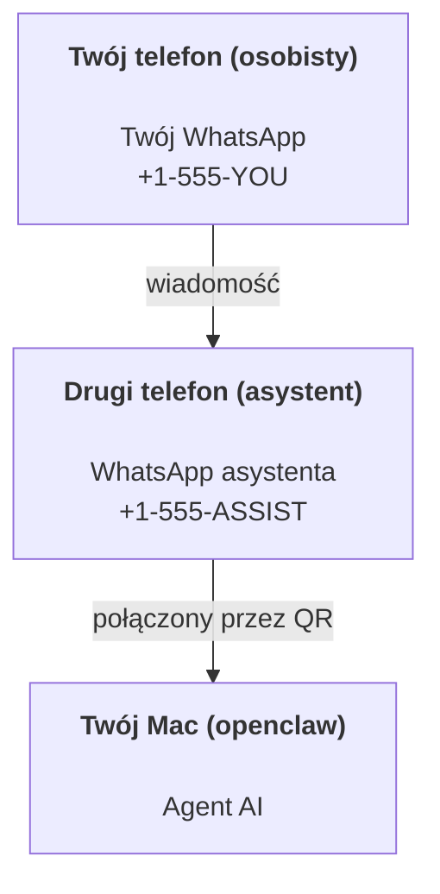

---
read_when:
    - Onboarding nowej instancji asystenta
    - Przegląd implikacji bezpieczeństwa/uprawnień
summary: Kompleksowy przewodnik po uruchamianiu OpenClaw jako osobistego asystenta z uwzględnieniem ostrzeżeń bezpieczeństwa
title: Konfiguracja osobistego asystenta
x-i18n:
    generated_at: "2026-04-05T14:06:39Z"
    model: gpt-5.4
    provider: openai
    source_hash: 02f10a9f7ec08f71143cbae996d91cbdaa19897a40f725d8ef524def41cf2759
    source_path: start/openclaw.md
    workflow: 15
---

# Tworzenie osobistego asystenta z OpenClaw

OpenClaw to hostowana samodzielnie brama, która łączy Discord, Google Chat, iMessage, Matrix, Microsoft Teams, Signal, Slack, Telegram, WhatsApp, Zalo i inne z agentami AI. Ten przewodnik opisuje konfigurację „osobistego asystenta”: dedykowany numer WhatsApp, który działa jak zawsze aktywny asystent AI.

## ⚠️ Najpierw bezpieczeństwo

Umieszczasz agenta w pozycji, w której może:

- uruchamiać polecenia na twoim komputerze (w zależności od polityki narzędzi)
- odczytywać/zapisywać pliki w twoim workspace
- wysyłać wiadomości z powrotem przez WhatsApp/Telegram/Discord/Mattermost i inne dołączone kanały

Zacznij ostrożnie:

- Zawsze ustawiaj `channels.whatsapp.allowFrom` (nigdy nie uruchamiaj tego otwartego dla wszystkich na swoim prywatnym Macu).
- Używaj dedykowanego numeru WhatsApp dla asystenta.
- Heartbeat domyślnie działa teraz co 30 minut. Wyłącz go, dopóki nie zaufasz tej konfiguracji, ustawiając `agents.defaults.heartbeat.every: "0m"`.

## Wymagania wstępne

- OpenClaw zainstalowany i po onboardingu — jeśli jeszcze tego nie zrobiłeś, zobacz [Pierwsze kroki](/start/getting-started)
- Drugi numer telefonu (SIM/eSIM/prepaid) dla asystenta

## Konfiguracja z dwoma telefonami (zalecana)

Powinno to wyglądać tak:



Jeśli połączysz swój osobisty WhatsApp z OpenClaw, każda wiadomość do ciebie stanie się „wejściem agenta”. To rzadko jest tym, czego chcesz.

## 5-minutowy szybki start

1. Sparuj WhatsApp Web (wyświetli kod QR; zeskanuj go telefonem asystenta):

```bash
openclaw channels login
```

2. Uruchom Gateway (pozostaw go uruchomionego):

```bash
openclaw gateway --port 18789
```

3. Umieść minimalną konfigurację w `~/.openclaw/openclaw.json`:

```json5
{
  gateway: { mode: "local" },
  channels: { whatsapp: { allowFrom: ["+15555550123"] } },
}
```

Teraz wyślij wiadomość na numer asystenta z telefonu znajdującego się na allowlist.

Po zakończeniu onboardingu automatycznie otwieramy dashboard i wyświetlamy czysty link (bez tokena). Jeśli pojawi się monit o uwierzytelnienie, wklej skonfigurowany współdzielony sekret w ustawieniach Control UI. Onboarding domyślnie używa tokenu (`gateway.auth.token`), ale uwierzytelnianie hasłem również działa, jeśli przełączyłeś `gateway.auth.mode` na `password`. Aby otworzyć ponownie później: `openclaw dashboard`.

## Daj agentowi workspace (AGENTS)

OpenClaw odczytuje instrukcje operacyjne i „pamięć” z katalogu workspace.

Domyślnie OpenClaw używa `~/.openclaw/workspace` jako workspace agenta i automatycznie utworzy go (wraz z początkowymi plikami `AGENTS.md`, `SOUL.md`, `TOOLS.md`, `IDENTITY.md`, `USER.md`, `HEARTBEAT.md`) podczas konfiguracji/pierwszego uruchomienia agenta. `BOOTSTRAP.md` jest tworzony tylko wtedy, gdy workspace jest całkiem nowy (nie powinien wracać po usunięciu). `MEMORY.md` jest opcjonalny (nie jest tworzony automatycznie); jeśli istnieje, jest ładowany dla zwykłych sesji. Sesje podagentów wstrzykują tylko `AGENTS.md` i `TOOLS.md`.

Wskazówka: traktuj ten folder jak „pamięć” OpenClaw i zrób z niego repozytorium git (najlepiej prywatne), aby `AGENTS.md` i pliki pamięci miały kopię zapasową. Jeśli git jest zainstalowany, całkiem nowe workspace są inicjalizowane automatycznie.

```bash
openclaw setup
```

Pełny układ workspace + przewodnik po kopiach zapasowych: [Workspace agenta](/pl/concepts/agent-workspace)
Przepływ pracy z pamięcią: [Pamięć](/pl/concepts/memory)

Opcjonalnie: wybierz inny workspace przez `agents.defaults.workspace` (obsługuje `~`).

```json5
{
  agent: {
    workspace: "~/.openclaw/workspace",
  },
}
```

Jeśli już dostarczasz własne pliki workspace z repozytorium, możesz całkowicie wyłączyć tworzenie plików bootstrap:

```json5
{
  agent: {
    skipBootstrap: true,
  },
}
```

## Konfiguracja, która zmienia to w „asystenta”

OpenClaw domyślnie zapewnia dobrą konfigurację asystenta, ale zwykle warto dostroić:

- personę/instrukcje w [`SOUL.md`](/pl/concepts/soul)
- domyślne ustawienia myślenia (jeśli chcesz)
- heartbeat (gdy już mu zaufasz)

Przykład:

```json5
{
  logging: { level: "info" },
  agent: {
    model: "anthropic/claude-opus-4-6",
    workspace: "~/.openclaw/workspace",
    thinkingDefault: "high",
    timeoutSeconds: 1800,
    // Zacznij od 0; włącz później.
    heartbeat: { every: "0m" },
  },
  channels: {
    whatsapp: {
      allowFrom: ["+15555550123"],
      groups: {
        "*": { requireMention: true },
      },
    },
  },
  routing: {
    groupChat: {
      mentionPatterns: ["@openclaw", "openclaw"],
    },
  },
  session: {
    scope: "per-sender",
    resetTriggers: ["/new", "/reset"],
    reset: {
      mode: "daily",
      atHour: 4,
      idleMinutes: 10080,
    },
  },
}
```

## Sesje i pamięć

- Pliki sesji: `~/.openclaw/agents/<agentId>/sessions/{{SessionId}}.jsonl`
- Metadane sesji (użycie tokenów, ostatnia trasa itd.): `~/.openclaw/agents/<agentId>/sessions/sessions.json` (starsza ścieżka: `~/.openclaw/sessions/sessions.json`)
- `/new` lub `/reset` rozpoczyna nową sesję dla tego czatu (konfigurowalne przez `resetTriggers`). Jeśli zostanie wysłane samodzielnie, agent odpowie krótkim powitaniem potwierdzającym reset.
- `/compact [instructions]` kompaktuje kontekst sesji i zgłasza pozostały budżet kontekstu.

## Heartbeat (tryb proaktywny)

Domyślnie OpenClaw uruchamia heartbeat co 30 minut z promptem:
`Read HEARTBEAT.md if it exists (workspace context). Follow it strictly. Do not infer or repeat old tasks from prior chats. If nothing needs attention, reply HEARTBEAT_OK.`
Aby wyłączyć, ustaw `agents.defaults.heartbeat.every: "0m"`.

- Jeśli `HEARTBEAT.md` istnieje, ale jest faktycznie pusty (zawiera tylko puste linie i nagłówki Markdown, takie jak `# Heading`), OpenClaw pomija uruchomienie heartbeat, aby oszczędzać wywołania API.
- Jeśli pliku brakuje, heartbeat nadal się uruchamia, a model sam decyduje, co zrobić.
- Jeśli agent odpowie `HEARTBEAT_OK` (opcjonalnie z krótkim dopełnieniem; zobacz `agents.defaults.heartbeat.ackMaxChars`), OpenClaw tłumi dostarczenie wychodzące dla tego heartbeat.
- Domyślnie dostarczanie heartbeat do celów w stylu DM `user:<id>` jest dozwolone. Ustaw `agents.defaults.heartbeat.directPolicy: "block"`, aby tłumić dostarczanie do bezpośrednich celów przy zachowaniu aktywnych uruchomień heartbeat.
- Heartbeat uruchamia pełne tury agenta — krótsze interwały spalają więcej tokenów.

```json5
{
  agent: {
    heartbeat: { every: "30m" },
  },
}
```

## Media przychodzące i wychodzące

Przychodzące załączniki (obrazy/audio/dokumenty) mogą być przekazywane do twojego polecenia przez szablony:

- `{{MediaPath}}` (lokalna ścieżka pliku tymczasowego)
- `{{MediaUrl}}` (pseudo-URL)
- `{{Transcript}}` (jeśli włączona jest transkrypcja audio)

Załączniki wychodzące od agenta: dodaj `MEDIA:<path-or-url>` w osobnym wierszu (bez spacji). Przykład:

```
Here’s the screenshot.
MEDIA:https://example.com/screenshot.png
```

OpenClaw wyodrębnia to i wysyła jako media razem z tekstem.

Zachowanie dla lokalnych ścieżek podlega temu samemu modelowi zaufania odczytu plików co agent:

- Jeśli `tools.fs.workspaceOnly` ma wartość `true`, wychodzące lokalne ścieżki `MEDIA:` pozostają ograniczone do katalogu głównego plików tymczasowych OpenClaw, pamięci podręcznej mediów, ścieżek workspace agenta i plików wygenerowanych przez sandbox.
- Jeśli `tools.fs.workspaceOnly` ma wartość `false`, wychodzące `MEDIA:` może używać lokalnych plików hosta, które agent i tak może odczytywać.
- Wysyłanie plików lokalnych hosta nadal dopuszcza tylko media i bezpieczne typy dokumentów (obrazy, audio, wideo, PDF i dokumenty Office). Zwykły tekst i pliki przypominające sekrety nie są traktowane jako media możliwe do wysłania.

Oznacza to, że wygenerowane obrazy/pliki poza workspace mogą być teraz wysyłane, gdy polityka fs już dopuszcza te odczyty, bez ponownego otwierania możliwości eksfiltracji dowolnych tekstowych załączników z hosta.

## Lista kontrolna operacji

```bash
openclaw status          # stan lokalny (poświadczenia, sesje, zdarzenia w kolejce)
openclaw status --all    # pełna diagnoza (tylko do odczytu, gotowa do wklejenia)
openclaw status --deep   # prosi gateway o sondę stanu na żywo z sondami kanałów, gdy są obsługiwane
openclaw health --json   # migawka stanu gateway (WS; domyślnie może zwrócić świeżą migawkę z pamięci podręcznej)
```

Logi znajdują się w `/tmp/openclaw/` (domyślnie: `openclaw-YYYY-MM-DD.log`).

## Następne kroki

- WebChat: [WebChat](/web/webchat)
- Operacje Gateway: [Instrukcja Gateway](/pl/gateway)
- Cron + wybudzenia: [Zadania cron](/pl/automation/cron-jobs)
- Towarzysz paska menu macOS: [Aplikacja OpenClaw na macOS](/platforms/macos)
- Aplikacja węzła iOS: [Aplikacja iOS](/pl/platforms/ios)
- Aplikacja węzła Android: [Aplikacja Android](/pl/platforms/android)
- Stan Windows: [Windows (WSL2)](/platforms/windows)
- Stan Linux: [Aplikacja Linux](/pl/platforms/linux)
- Bezpieczeństwo: [Bezpieczeństwo](/pl/gateway/security)
