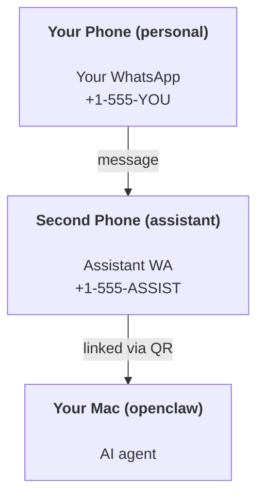

---
read_when:
    - Wdrażanie nowej instancji asystenta
    - Analizowanie konsekwencji dotyczących bezpieczeństwa i uprawnień
summary: Kompletny przewodnik po uruchamianiu OpenClaw jako osobistego asystenta z ostrzeżeniami dotyczącymi bezpieczeństwa
title: Konfiguracja osobistego asystenta
x-i18n:
    generated_at: "2026-05-02T22:23:15Z"
    model: gpt-5.5
    provider: openai
    source_hash: 9f6087d0756c98741166135df8b915eb5a0803b23e68e486d2d25ec98d4dca79
    source_path: start/openclaw.md
    workflow: 16
---

# Budowanie osobistego asystenta z OpenClaw

OpenClaw to samodzielnie hostowany Gateway, który łączy Discord, Google Chat, iMessage, Matrix, Microsoft Teams, Signal, Slack, Telegram, WhatsApp, Zalo i inne kanały z agentami AI. Ten przewodnik opisuje konfigurację „osobistego asystenta”: dedykowany numer WhatsApp, który działa jak Twój zawsze dostępny asystent AI.

## ⚠️ Najpierw bezpieczeństwo

Umieszczasz agenta w pozycji, w której może:

- uruchamiać polecenia na Twojej maszynie (zależnie od polityki narzędzi)
- odczytywać/zapisywać pliki w Twoim workspace
- wysyłać wiadomości przez WhatsApp/Telegram/Discord/Mattermost i inne dołączone kanały

Zacznij zachowawczo:

- Zawsze ustawiaj `channels.whatsapp.allowFrom` (nigdy nie uruchamiaj otwartego dla świata dostępu na swoim osobistym Macu).
- Używaj dedykowanego numeru WhatsApp dla asystenta.
- Heartbeat domyślnie działa teraz co 30 minut. Wyłącz go, dopóki nie zaufasz konfiguracji, ustawiając `agents.defaults.heartbeat.every: "0m"`.

## Wymagania wstępne

- OpenClaw zainstalowany i skonfigurowany w onboardingu — zobacz [Pierwsze kroki](/pl/start/getting-started), jeśli jeszcze tego nie zrobiono
- Drugi numer telefonu (SIM/eSIM/prepaid) dla asystenta

## Konfiguracja z dwoma telefonami (zalecana)

Chcesz uzyskać taki układ:



Jeśli połączysz swój osobisty WhatsApp z OpenClaw, każda wiadomość do Ciebie stanie się „wejściem agenta”. Rzadko jest to pożądane.

## Szybki start w 5 minut

1. Sparuj WhatsApp Web (pokaże kod QR; zeskanuj go telefonem asystenta):

```bash
openclaw channels login
```

2. Uruchom Gateway (zostaw go włączonego):

```bash
openclaw gateway --port 18789
```

3. Umieść minimalną konfigurację w `~/.openclaw/openclaw.json`:

```json5
{
  gateway: { mode: "local" },
  channels: { whatsapp: { allowFrom: ["+15555550123"] } },
}
```

Teraz wyślij wiadomość na numer asystenta z telefonu znajdującego się na liście dozwolonych.

Po zakończeniu onboardingu OpenClaw automatycznie otwiera dashboard i wypisuje czysty link (bez tokenu). Jeśli dashboard poprosi o uwierzytelnienie, wklej skonfigurowany współdzielony sekret w ustawieniach Control UI. Onboarding domyślnie używa tokenu (`gateway.auth.token`), ale uwierzytelnianie hasłem też działa, jeśli przełączono `gateway.auth.mode` na `password`. Aby otworzyć ponownie później: `openclaw dashboard`.

## Daj agentowi workspace (AGENTS)

OpenClaw odczytuje instrukcje operacyjne i „pamięć” ze swojego katalogu workspace.

Domyślnie OpenClaw używa `~/.openclaw/workspace` jako workspace agenta i utworzy go (wraz ze startowymi plikami `AGENTS.md`, `SOUL.md`, `TOOLS.md`, `IDENTITY.md`, `USER.md`, `HEARTBEAT.md`) automatycznie podczas konfiguracji/pierwszego uruchomienia agenta. `BOOTSTRAP.md` jest tworzony tylko wtedy, gdy workspace jest zupełnie nowy (nie powinien wrócić po usunięciu). `MEMORY.md` jest opcjonalny (nie jest tworzony automatycznie); gdy istnieje, jest ładowany dla zwykłych sesji. Sesje subagentów wstrzykują tylko `AGENTS.md` i `TOOLS.md`.

<Tip>
Traktuj ten folder jak pamięć OpenClaw i uczyń go repozytorium git (najlepiej prywatnym), aby Twoje `AGENTS.md` i pliki pamięci miały kopię zapasową. Jeśli git jest zainstalowany, zupełnie nowe workspace są inicjalizowane automatycznie.
</Tip>

```bash
openclaw setup
```

Pełny układ workspace + przewodnik po kopiach zapasowych: [Workspace agenta](/pl/concepts/agent-workspace)
Przepływ pracy z pamięcią: [Pamięć](/pl/concepts/memory)

Opcjonalnie: wybierz inny workspace za pomocą `agents.defaults.workspace` (obsługuje `~`).

```json5
{
  agents: {
    defaults: {
      workspace: "~/.openclaw/workspace",
    },
  },
}
```

Jeśli już dostarczasz własne pliki workspace z repozytorium, możesz całkowicie wyłączyć tworzenie plików bootstrap:

```json5
{
  agents: {
    defaults: {
      skipBootstrap: true,
    },
  },
}
```

## Konfiguracja, która zmienia to w „asystenta”

OpenClaw domyślnie ma dobrą konfigurację asystenta, ale zwykle warto dostroić:

- personę/instrukcje w [`SOUL.md`](/pl/concepts/soul)
- domyślne ustawienia myślenia (jeśli chcesz)
- Heartbeat (gdy już zaufasz konfiguracji)

Przykład:

```json5
{
  logging: { level: "info" },
  agent: {
    model: "anthropic/claude-opus-4-6",
    workspace: "~/.openclaw/workspace",
    thinkingDefault: "high",
    timeoutSeconds: 1800,
    // Start with 0; enable later.
    heartbeat: { every: "0m" },
  },
  channels: {
    whatsapp: {
      allowFrom: ["+15555550123"],
      groups: {
        "*": { requireMention: true },
      },
    },
  },
  routing: {
    groupChat: {
      mentionPatterns: ["@openclaw", "openclaw"],
    },
  },
  session: {
    scope: "per-sender",
    resetTriggers: ["/new", "/reset"],
    reset: {
      mode: "daily",
      atHour: 4,
      idleMinutes: 10080,
    },
  },
}
```

## Sesje i pamięć

- Pliki sesji: `~/.openclaw/agents/<agentId>/sessions/{{SessionId}}.jsonl`
- Metadane sesji (użycie tokenów, ostatnia trasa itd.): `~/.openclaw/agents/<agentId>/sessions/sessions.json` (starsza ścieżka: `~/.openclaw/sessions/sessions.json`)
- `/new` lub `/reset` rozpoczyna świeżą sesję dla tego czatu (konfigurowalne przez `resetTriggers`). Jeśli zostanie wysłane samodzielnie, OpenClaw potwierdza reset bez wywoływania modelu.
- `/compact [instructions]` kompresuje kontekst sesji i raportuje pozostały budżet kontekstu.

## Heartbeat (tryb proaktywny)

Domyślnie OpenClaw uruchamia Heartbeat co 30 minut z promptem:
`Read HEARTBEAT.md if it exists (workspace context). Follow it strictly. Do not infer or repeat old tasks from prior chats. If nothing needs attention, reply HEARTBEAT_OK.`
Ustaw `agents.defaults.heartbeat.every: "0m"`, aby wyłączyć.

- Jeśli `HEARTBEAT.md` istnieje, ale jest praktycznie pusty (tylko puste wiersze i nagłówki markdown, takie jak `# Heading`), OpenClaw pomija uruchomienie Heartbeat, aby oszczędzać wywołania API.
- Jeśli pliku brakuje, Heartbeat nadal działa, a model decyduje, co zrobić.
- Jeśli agent odpowie `HEARTBEAT_OK` (opcjonalnie z krótkim dopełnieniem; zobacz `agents.defaults.heartbeat.ackMaxChars`), OpenClaw wstrzymuje dostarczenie wychodzące dla tego Heartbeat.
- Domyślnie dostarczanie Heartbeat do celów w stylu DM `user:<id>` jest dozwolone. Ustaw `agents.defaults.heartbeat.directPolicy: "block"`, aby wstrzymać dostarczanie do celów bezpośrednich, pozostawiając aktywne uruchomienia Heartbeat.
- Heartbeat uruchamia pełne tury agenta — krótsze interwały zużywają więcej tokenów.

```json5
{
  agent: {
    heartbeat: { every: "30m" },
  },
}
```

## Media wejściowe i wyjściowe

Załączniki przychodzące (obrazy/audio/dokumenty) mogą być udostępniane Twojemu poleceniu przez szablony:

- `{{MediaPath}}` (lokalna ścieżka pliku tymczasowego)
- `{{MediaUrl}}` (pseudo-URL)
- `{{Transcript}}` (jeśli transkrypcja audio jest włączona)

Załączniki wychodzące od agenta: umieść `MEDIA:<path-or-url>` w osobnym wierszu (bez spacji). Przykład:

```
Here’s the screenshot.
MEDIA:https://example.com/screenshot.png
```

OpenClaw wyodrębnia je i wysyła jako media obok tekstu.

Zachowanie ścieżek lokalnych jest zgodne z tym samym modelem zaufania odczytu plików co agent:

- Jeśli `tools.fs.workspaceOnly` ma wartość `true`, wychodzące lokalne ścieżki `MEDIA:` pozostają ograniczone do tymczasowego katalogu głównego OpenClaw, pamięci podręcznej mediów, ścieżek workspace agenta i plików wygenerowanych przez sandbox.
- Jeśli `tools.fs.workspaceOnly` ma wartość `false`, wychodzące `MEDIA:` może używać lokalnych plików hosta, które agent już może odczytać.
- Ścieżki lokalne mogą być bezwzględne, względne względem workspace albo względne względem katalogu domowego z `~/`.
- Wysyłanie lokalnych plików hosta nadal dopuszcza tylko media i bezpieczne typy dokumentów (obrazy, audio, wideo, PDF oraz dokumenty Office). Zwykły tekst i pliki przypominające sekrety nie są traktowane jako media nadające się do wysłania.

Oznacza to, że wygenerowane obrazy/pliki poza workspace mogą teraz zostać wysłane, gdy Twoja polityka fs już zezwala na takie odczyty, bez ponownego otwierania możliwości eksfiltracji dowolnych załączników tekstowych hosta.

## Lista kontrolna operacji

```bash
openclaw status          # local status (creds, sessions, queued events)
openclaw status --all    # full diagnosis (read-only, pasteable)
openclaw status --deep   # asks the gateway for a live health probe with channel probes when supported
openclaw health --json   # gateway health snapshot (WS; default can return a fresh cached snapshot)
```

Logi znajdują się w `/tmp/openclaw/` (domyślnie: `openclaw-YYYY-MM-DD.log`).

## Następne kroki

- WebChat: [WebChat](/pl/web/webchat)
- Operacje Gateway: [Runbook Gateway](/pl/gateway)
- Cron + wybudzenia: [Zadania Cron](/pl/automation/cron-jobs)
- Towarzysz paska menu macOS: [Aplikacja OpenClaw na macOS](/pl/platforms/macos)
- Aplikacja iOS node: [Aplikacja iOS](/pl/platforms/ios)
- Aplikacja Android node: [Aplikacja Android](/pl/platforms/android)
- Status Windows: [Windows (WSL2)](/pl/platforms/windows)
- Status Linux: [Aplikacja Linux](/pl/platforms/linux)
- Bezpieczeństwo: [Bezpieczeństwo](/pl/gateway/security)

## Powiązane

- [Pierwsze kroki](/pl/start/getting-started)
- [Konfiguracja](/pl/start/setup)
- [Przegląd kanałów](/pl/channels)
