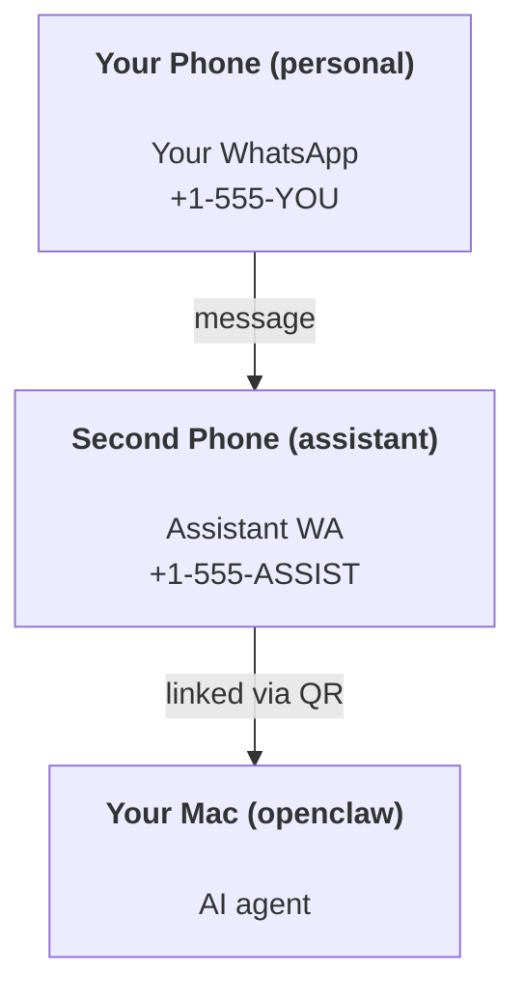

---
read_when:
    - Wdrażanie nowej instancji asystenta
    - Analizowanie konsekwencji dla bezpieczeństwa/uprawnień
summary: Kompletny przewodnik po uruchamianiu OpenClaw jako osobistego asystenta z przestrogami dotyczącymi bezpieczeństwa
title: Konfiguracja osobistego asystenta
x-i18n:
    generated_at: "2026-06-27T18:22:54Z"
    model: gpt-5.5
    postprocess_version: locale-links-v1
    provider: openai
    source_hash: b0cd640872a2a60fd88d2dc3df6d038ef8574163430d8683ef9b67921b0c87f4
    source_path: start/openclaw.md
    workflow: 16
---

OpenClaw to samohostowany Gateway, który łączy Discord, Google Chat, iMessage, Matrix, Microsoft Teams, Signal, Slack, Telegram, WhatsApp, Zalo i inne kanały z agentami AI. Ten przewodnik opisuje konfigurację „osobistego asystenta”: dedykowany numer WhatsApp, który działa jak Twój zawsze dostępny asystent AI.

## ⚠️ Najpierw bezpieczeństwo

Umieszczasz agenta w pozycji, w której może:

- uruchamiać polecenia na Twojej maszynie (zależnie od polityki narzędzi)
- odczytywać/zapisywać pliki w Twoim obszarze roboczym
- wysyłać wiadomości zwrotne przez WhatsApp/Telegram/Discord/Mattermost i inne dołączone kanały

Zacznij zachowawczo:

- Zawsze ustawiaj `channels.whatsapp.allowFrom` (nigdy nie uruchamiaj trybu otwartego na cały świat na swoim prywatnym Macu).
- Użyj dedykowanego numeru WhatsApp dla asystenta.
- Heartbeat domyślnie działa teraz co 30 minut. Wyłącz go, dopóki nie zaufasz konfiguracji, ustawiając `agents.defaults.heartbeat.every: "0m"`.

## Wymagania wstępne

- Zainstalowany i skonfigurowany OpenClaw - zobacz [Pierwsze kroki](/pl/start/getting-started), jeśli jeszcze tego nie zrobiono
- Drugi numer telefonu (SIM/eSIM/prepaid) dla asystenta

## Konfiguracja z dwoma telefonami (zalecana)

Docelowo chcesz mieć taki układ:



Jeśli połączysz swój prywatny WhatsApp z OpenClaw, każda wiadomość do Ciebie stanie się „wejściem agenta”. Rzadko jest to pożądane.

## Szybki start w 5 minut

1. Sparuj WhatsApp Web (pokaże kod QR; zeskanuj go telefonem asystenta):

```bash
openclaw channels login
```

2. Uruchom Gateway (zostaw go włączonego):

```bash
openclaw gateway --port 18789
```

3. Umieść minimalną konfigurację w `~/.openclaw/openclaw.json`:

```json5
{
  gateway: { mode: "local" },
  channels: { whatsapp: { allowFrom: ["+15555550123"] } },
}
```

Teraz wyślij wiadomość na numer asystenta z telefonu znajdującego się na liście dozwolonych.

Po zakończeniu onboardingu OpenClaw automatycznie otwiera panel i wypisuje czysty link (bez tokenu). Jeśli panel poprosi o uwierzytelnienie, wklej skonfigurowany wspólny sekret w ustawieniach Control UI. Onboarding domyślnie używa tokenu (`gateway.auth.token`), ale uwierzytelnianie hasłem też działa, jeśli przełączono `gateway.auth.mode` na `password`. Aby otworzyć ponownie później: `openclaw dashboard`.

## Daj agentowi obszar roboczy (AGENTS)

OpenClaw odczytuje instrukcje operacyjne i „pamięć” z katalogu obszaru roboczego.

Domyślnie OpenClaw używa `~/.openclaw/workspace` jako obszaru roboczego agenta i utworzy go (wraz ze startowymi plikami `AGENTS.md`, `SOUL.md`, `TOOLS.md`, `IDENTITY.md`, `USER.md`, `HEARTBEAT.md`) automatycznie podczas konfiguracji/pierwszego uruchomienia agenta. `BOOTSTRAP.md` jest tworzony tylko wtedy, gdy obszar roboczy jest zupełnie nowy (nie powinien wrócić po usunięciu). `MEMORY.md` jest opcjonalny (nie jest tworzony automatycznie); jeśli istnieje, jest ładowany dla normalnych sesji. Sesje podagentów wstrzykują tylko `AGENTS.md` i `TOOLS.md`.

<Tip>
Traktuj ten folder jak pamięć OpenClaw i zrób z niego repozytorium git (najlepiej prywatne), aby Twoje pliki `AGENTS.md` i pliki pamięci miały kopię zapasową. Jeśli git jest zainstalowany, zupełnie nowe obszary robocze są inicjalizowane automatycznie.
</Tip>

```bash
openclaw setup
```

Pełny układ obszaru roboczego + przewodnik kopii zapasowych: [Obszar roboczy agenta](/pl/concepts/agent-workspace)
Przepływ pracy pamięci: [Pamięć](/pl/concepts/memory)

Opcjonalnie: wybierz inny obszar roboczy przez `agents.defaults.workspace` (obsługuje `~`).

```json5
{
  agents: {
    defaults: {
      workspace: "~/.openclaw/workspace",
    },
  },
}
```

Jeśli już dostarczasz własne pliki obszaru roboczego z repozytorium, możesz całkowicie wyłączyć tworzenie plików bootstrap:

```json5
{
  agents: {
    defaults: {
      skipBootstrap: true,
    },
  },
}
```

## Konfiguracja, która zmienia go w „asystenta”

OpenClaw domyślnie ma dobrą konfigurację asystenta, ale zwykle warto dostroić:

- personę/instrukcje w [`SOUL.md`](/pl/concepts/soul)
- domyślne ustawienia myślenia (jeśli potrzebne)
- Heartbeat (gdy już zaufasz konfiguracji)

Przykład:

```json5
{
  logging: { level: "info" },
  agents: {
    defaults: {
      model: { primary: "anthropic/claude-opus-4-6" },
      workspace: "~/.openclaw/workspace",
      thinkingDefault: "high",
      timeoutSeconds: 1800,
      // Start with 0; enable later.
      heartbeat: { every: "0m" },
    },
    list: [
      {
        id: "main",
        default: true,
        groupChat: {
          mentionPatterns: ["@openclaw", "openclaw"],
        },
      },
    ],
  },
  channels: {
    whatsapp: {
      allowFrom: ["+15555550123"],
      groups: {
        "*": { requireMention: true },
      },
    },
  },
  session: {
    scope: "per-sender",
    resetTriggers: ["/new", "/reset"],
    reset: {
      mode: "daily",
      atHour: 4,
      idleMinutes: 10080,
    },
  },
}
```

## Sesje i pamięć

- Pliki sesji: `~/.openclaw/agents/<agentId>/sessions/{{SessionId}}.jsonl`
- Metadane sesji (użycie tokenów, ostatnia trasa itd.): `~/.openclaw/agents/<agentId>/sessions/sessions.json` (starsze: `~/.openclaw/sessions/sessions.json`)
- `/new` lub `/reset` rozpoczyna świeżą sesję dla danego czatu (konfigurowalne przez `resetTriggers`). Jeśli zostanie wysłane samodzielnie, OpenClaw potwierdza reset bez wywoływania modelu.
- `/compact [instructions]` kompaktuje kontekst sesji i raportuje pozostały budżet kontekstu.

## Heartbeat (tryb proaktywny)

Domyślnie OpenClaw uruchamia Heartbeat co 30 minut z promptem:
`Read HEARTBEAT.md if it exists (workspace context). Follow it strictly. Do not infer or repeat old tasks from prior chats. If nothing needs attention, reply HEARTBEAT_OK.`
Ustaw `agents.defaults.heartbeat.every: "0m"`, aby wyłączyć.

- Jeśli `HEARTBEAT.md` istnieje, ale jest w praktyce pusty (tylko puste wiersze, komentarze Markdown/HTML, nagłówki Markdown takie jak `# Heading`, znaczniki bloków kodu albo puste szkielety list kontrolnych), OpenClaw pomija uruchomienie Heartbeat, aby oszczędzać wywołania API.
- Jeśli pliku brakuje, Heartbeat nadal działa, a model decyduje, co zrobić.
- Jeśli agent odpowie `HEARTBEAT_OK` (opcjonalnie z krótkim dopełnieniem; zobacz `agents.defaults.heartbeat.ackMaxChars`), OpenClaw blokuje dostarczenie wiadomości wychodzącej dla tego Heartbeat.
- Domyślnie dostarczanie Heartbeat do celów `user:<id>` w stylu DM jest dozwolone. Ustaw `agents.defaults.heartbeat.directPolicy: "block"`, aby zablokować dostarczanie do celów bezpośrednich przy zachowaniu aktywnych uruchomień Heartbeat.
- Heartbeat uruchamia pełne tury agenta - krótsze interwały zużywają więcej tokenów.

```json5
{
  agents: {
    defaults: {
      heartbeat: { every: "30m" },
    },
  },
}
```

## Media przychodzące i wychodzące

Załączniki przychodzące (obrazy/audio/dokumenty) mogą być udostępniane Twojemu poleceniu przez szablony:

- `{{MediaPath}}` (lokalna ścieżka pliku tymczasowego)
- `{{MediaUrl}}` (pseudo-URL)
- `{{Transcript}}` (jeśli transkrypcja audio jest włączona)

Załączniki wychodzące od agenta używają strukturalnych pól mediów w narzędziu wiadomości albo ładunku odpowiedzi, takich jak `media`, `mediaUrl`, `mediaUrls`, `path` lub `filePath`. Przykładowe argumenty narzędzia wiadomości:

```json
{
  "message": "Here's the screenshot.",
  "mediaUrl": "https://example.com/screenshot.png"
}
```

OpenClaw wysyła media strukturalne razem z tekstem. Starsze końcowe odpowiedzi asystenta mogą nadal być normalizowane dla zgodności, ale wyjście narzędzia, wyjście przeglądarki, bloki streamingu i akcje wiadomości nie parsują tekstu jako poleceń załączników.

Zachowanie ścieżek lokalnych podąża za tym samym modelem zaufania odczytu plików co agent:

- Jeśli `tools.fs.workspaceOnly` ma wartość `true`, wychodzące lokalne ścieżki mediów pozostają ograniczone do tymczasowego katalogu głównego OpenClaw, pamięci podręcznej mediów, ścieżek obszaru roboczego agenta i plików wygenerowanych w sandboxie.
- Jeśli `tools.fs.workspaceOnly` ma wartość `false`, wychodzące media lokalne mogą używać plików lokalnych hosta, które agent już ma prawo odczytywać.
- Ścieżki lokalne mogą być bezwzględne, względne względem obszaru roboczego albo względne względem katalogu domowego z `~/`.
- Wysyłki lokalne hosta nadal dopuszczają tylko media i bezpieczne typy dokumentów (obrazy, audio, wideo, PDF, dokumenty Office oraz zweryfikowane dokumenty tekstowe, takie jak Markdown/MD, TXT, JSON, YAML i YML). To rozszerzenie istniejącej granicy zaufania odczytu z hosta, a nie skaner sekretów: jeśli agent może odczytać lokalny plik hosta `secret.txt` lub `config.json`, może dołączyć ten plik, gdy rozszerzenie i walidacja zawartości pasują.

Oznacza to, że wygenerowane obrazy/pliki poza obszarem roboczym mogą teraz zostać wysłane, gdy Twoja polityka fs już zezwala na takie odczyty, natomiast dowolne lokalne rozszerzenia tekstowe hosta pozostają zablokowane. Trzymaj wrażliwe pliki poza systemem plików dostępnym do odczytu dla agenta albo pozostaw `tools.fs.workspaceOnly=true`, aby zaostrzyć wysyłanie ścieżek lokalnych.

## Lista kontrolna operacji

```bash
openclaw status          # local status (creds, sessions, queued events)
openclaw status --all    # full diagnosis (read-only, pasteable)
openclaw status --deep   # asks the gateway for a live health probe with channel probes when supported
openclaw health --json   # gateway health snapshot (WS; default can return a fresh cached snapshot)
```

Logi znajdują się w `/tmp/openclaw/` (domyślnie: `openclaw-YYYY-MM-DD.log`).

## Następne kroki

- WebChat: [WebChat](/pl/web/webchat)
- Operacje Gateway: [Runbook Gateway](/pl/gateway)
- Cron + wybudzanie: [Zadania Cron](/pl/automation/cron-jobs)
- Towarzysz paska menu macOS: [Aplikacja OpenClaw na macOS](/pl/platforms/macos)
- Aplikacja węzła iOS: [Aplikacja iOS](/pl/platforms/ios)
- Aplikacja węzła Android: [Aplikacja Android](/pl/platforms/android)
- Windows Hub: [Windows](/pl/platforms/windows)
- Status Linux: [Aplikacja Linux](/pl/platforms/linux)
- Bezpieczeństwo: [Bezpieczeństwo](/pl/gateway/security)

## Powiązane

- [Pierwsze kroki](/pl/start/getting-started)
- [Konfiguracja](/pl/start/setup)
- [Omówienie kanałów](/pl/channels)
