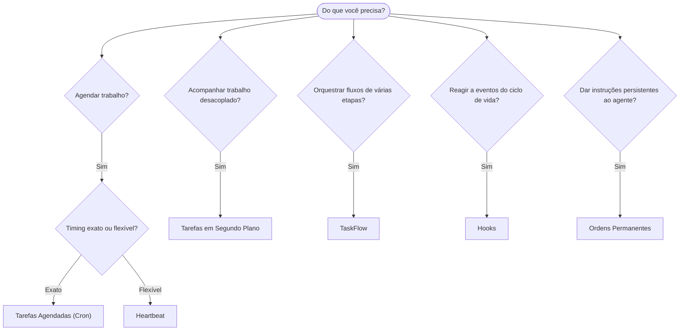

---
read_when:
    - Decidindo como automatizar o trabalho com o OpenClaw
    - Escolhendo entre Heartbeat, Cron, hooks e ordens permanentes
    - Buscando o ponto de entrada de automação certo
summary: 'Visão geral dos mecanismos de automação: tarefas, cron, hooks, ordens permanentes e TaskFlow'
title: Automação e tarefas
x-i18n:
    generated_at: "2026-04-24T05:40:28Z"
    model: gpt-5.4
    provider: openai
    source_hash: 1b4615cc05a6d0ef7c92f44072d11a2541bc5e17b7acb88dc27ddf0c36b2dcab
    source_path: automation/index.md
    workflow: 15
---

O OpenClaw executa trabalho em segundo plano por meio de tarefas, trabalhos agendados, hooks de eventos e instruções permanentes. Esta página ajuda você a escolher o mecanismo certo e entender como eles se encaixam.

## Guia rápido de decisão

| Caso de uso                              | Recomendado           | Motivo                                           |
| ---------------------------------------- | --------------------- | ------------------------------------------------ |
| Enviar relatório diário às 9h em ponto   | Tarefas Agendadas (Cron) | Timing exato, execução isolada                |
| Lembrar-me em 20 minutos                 | Tarefas Agendadas (Cron) | Execução única com timing preciso (`--at`)   |
| Executar análise profunda semanalmente   | Tarefas Agendadas (Cron) | Tarefa independente, pode usar modelo diferente |
| Verificar caixa de entrada a cada 30 min | Heartbeat             | Agrupa com outras verificações, sensível ao contexto |
| Monitorar o calendário para eventos próximos | Heartbeat         | Encaixe natural para percepção periódica         |
| Inspecionar o status de um subagente ou execução ACP | Tarefas em Segundo Plano | O registro de tarefas acompanha todo o trabalho desacoplado |
| Auditar o que foi executado e quando     | Tarefas em Segundo Plano | `openclaw tasks list` e `openclaw tasks audit` |
| Pesquisa em várias etapas e depois resumir | TaskFlow            | Orquestração durável com rastreamento de revisões |
| Executar um script ao redefinir a sessão | Hooks                 | Orientado a eventos, dispara em eventos do ciclo de vida |
| Executar código em toda chamada de ferramenta | Hooks             | Hooks podem filtrar por tipo de evento           |
| Sempre verificar conformidade antes de responder | Ordens Permanentes | Injetadas automaticamente em toda sessão        |

### Tarefas Agendadas (Cron) vs Heartbeat

| Dimensão       | Tarefas Agendadas (Cron)            | Heartbeat                            |
| -------------- | ----------------------------------- | ------------------------------------ |
| Timing         | Exato (expressões cron, execução única) | Aproximado (por padrão, a cada 30 min) |
| Contexto da sessão | Novo (isolado) ou compartilhado  | Contexto completo da sessão principal |
| Registros de tarefas | Sempre criados                 | Nunca criados                        |
| Entrega        | Canal, Webhook ou silenciosa        | Inline na sessão principal           |
| Melhor para    | Relatórios, lembretes, trabalhos em segundo plano | Verificações de caixa de entrada, calendário, notificações |

Use Tarefas Agendadas (Cron) quando você precisar de timing preciso ou execução isolada. Use Heartbeat quando o trabalho se beneficiar do contexto completo da sessão e um timing aproximado for suficiente.

## Conceitos principais

### Tarefas agendadas (cron)

Cron é o agendador integrado do Gateway para timing preciso. Ele persiste trabalhos, desperta o agente no momento certo e pode entregar a saída a um canal de chat ou endpoint de Webhook. Suporta lembretes de execução única, expressões recorrentes e gatilhos de Webhook de entrada.

Consulte [Tarefas Agendadas](/pt-BR/automation/cron-jobs).

### Tarefas

O registro de tarefas em segundo plano acompanha todo o trabalho desacoplado: execuções ACP, inicialização de subagentes, execuções cron isoladas e operações da CLI. Tarefas são registros, não agendadores. Use `openclaw tasks list` e `openclaw tasks audit` para inspecioná-las.

Consulte [Tarefas em Segundo Plano](/pt-BR/automation/tasks).

### TaskFlow

TaskFlow é a camada de orquestração de fluxos acima das tarefas em segundo plano. Ela gerencia fluxos duráveis de várias etapas com modos de sincronização gerenciado e espelhado, rastreamento de revisões e `openclaw tasks flow list|show|cancel` para inspeção.

Consulte [TaskFlow](/pt-BR/automation/taskflow).

### Ordens permanentes

Ordens permanentes concedem ao agente autoridade operacional permanente para programas definidos. Elas ficam em arquivos do workspace (normalmente `AGENTS.md`) e são injetadas em toda sessão. Combine com cron para aplicação baseada em tempo.

Consulte [Ordens Permanentes](/pt-BR/automation/standing-orders).

### Hooks

Hooks são scripts orientados a eventos acionados por eventos do ciclo de vida do agente (`/new`, `/reset`, `/stop`), Compaction de sessão, inicialização do gateway, fluxo de mensagens e chamadas de ferramentas. Os hooks são descobertos automaticamente em diretórios e podem ser gerenciados com `openclaw hooks`.

Consulte [Hooks](/pt-BR/automation/hooks).

### Heartbeat

Heartbeat é um turno periódico da sessão principal (por padrão, a cada 30 minutos). Ele agrupa várias verificações (caixa de entrada, calendário, notificações) em um único turno do agente com o contexto completo da sessão. Turnos de Heartbeat não criam registros de tarefas. Use `HEARTBEAT.md` para uma pequena checklist, ou um bloco `tasks:` quando quiser verificações periódicas somente quando devidas dentro do próprio heartbeat. Arquivos de heartbeat vazios são ignorados como `empty-heartbeat-file`; o modo de tarefas somente quando devidas é ignorado como `no-tasks-due`.

Consulte [Heartbeat](/pt-BR/gateway/heartbeat).

## Como eles funcionam juntos

- **Cron** lida com agendas precisas (relatórios diários, revisões semanais) e lembretes de execução única. Todas as execuções do cron criam registros de tarefas.
- **Heartbeat** lida com monitoramento rotineiro (caixa de entrada, calendário, notificações) em um único turno agrupado a cada 30 minutos.
- **Hooks** reagem a eventos específicos (chamadas de ferramentas, redefinições de sessão, Compaction) com scripts personalizados.
- **Ordens permanentes** dão ao agente contexto persistente e limites de autoridade.
- **TaskFlow** coordena fluxos de várias etapas acima de tarefas individuais.
- **Tarefas** acompanham automaticamente todo o trabalho desacoplado para que você possa inspecionar e auditar.

## Relacionado

- [Tarefas Agendadas](/pt-BR/automation/cron-jobs) — agendamento preciso e lembretes de execução única
- [Tarefas em Segundo Plano](/pt-BR/automation/tasks) — registro de tarefas para todo trabalho desacoplado
- [TaskFlow](/pt-BR/automation/taskflow) — orquestração durável de fluxos de várias etapas
- [Hooks](/pt-BR/automation/hooks) — scripts de ciclo de vida orientados a eventos
- [Ordens Permanentes](/pt-BR/automation/standing-orders) — instruções persistentes do agente
- [Heartbeat](/pt-BR/gateway/heartbeat) — turnos periódicos da sessão principal
- [Referência de Configuração](/pt-BR/gateway/configuration-reference) — todas as chaves de configuração
