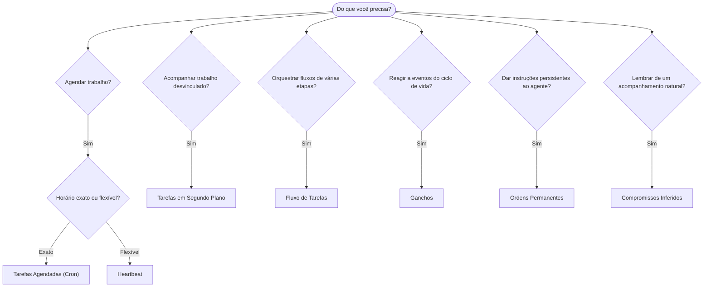

O OpenClaw executa trabalhos em segundo plano por meio de tarefas, trabalhos agendados, compromissos
inferidos, ganchos de eventos e ordens permanentes. Use esta página para escolher o
mecanismo adequado.

## Guia rápido de decisão

| Caso de uso                                      | Recomendado                  | Motivo                                                        |
| ------------------------------------------------ | ---------------------------- | ------------------------------------------------------------- |
| Enviar relatório diário exatamente às 9h         | Tarefas Agendadas (Cron)     | Horário exato, execução isolada                               |
| Lembrar-me em 20 minutos                          | Tarefas Agendadas (Cron)     | Execução única com horário preciso (`--at`)                   |
| Executar análise aprofundada semanal              | Tarefas Agendadas (Cron)     | Tarefa independente, pode usar um modelo diferente            |
| Verificar a caixa de entrada a cada 30 min        | Heartbeat                    | Agrupa com outras verificações, considera o contexto          |
| Monitorar o calendário para eventos futuros       | Heartbeat                    | Adequado à percepção periódica                                |
| Acompanhar após uma entrevista mencionada         | Compromissos Inferidos       | Acompanhamento semelhante à memória, sem pedido de lembrete exato |
| Acompanhamento atencioso após contexto do usuário | Compromissos Inferidos       | Restrito ao mesmo agente e canal                              |
| Verificar o status de um subagente ou execução ACP | Tarefas em Segundo Plano    | O registro de tarefas acompanha todo trabalho desvinculado    |
| Auditar o que foi executado e quando              | Tarefas em Segundo Plano     | `openclaw tasks list` e `openclaw tasks audit`                |
| Pesquisa em várias etapas seguida de resumo       | Fluxo de Tarefas             | Orquestração durável com acompanhamento de revisões           |
| Executar um script ao redefinir a sessão          | Ganchos                      | Orientado a eventos, disparado em eventos do ciclo de vida    |
| Executar código em cada chamada de ferramenta     | Ganchos de Plugin            | Ganchos no processo podem interceptar chamadas de ferramentas |
| Sempre verificar a conformidade antes de responder | Ordens Permanentes          | Injetadas automaticamente em todas as sessões                 |

### Tarefas Agendadas (Cron) em comparação com Heartbeat

| Dimensão          | Tarefas Agendadas (Cron)             | Heartbeat                                   |
| ----------------- | ------------------------------------ | ------------------------------------------- |
| Horário           | Exato (expressões cron, execução única) | Aproximado (padrão: a cada 30 min)        |
| Contexto da sessão | Novo (isolado) ou compartilhado     | Contexto completo da sessão principal       |
| Registros de tarefas | Sempre criados                    | Nunca criados                               |
| Entrega           | Canal, webhook ou silenciosa          | Em linha na sessão principal                 |
| Mais indicado para | Relatórios, lembretes, trabalhos em segundo plano | Verificações de caixa de entrada, calendário, notificações |

Use Tarefas Agendadas (Cron) quando precisar de um horário preciso ou de execução isolada. Use Heartbeat quando o trabalho se beneficiar do contexto completo da sessão e um horário aproximado for suficiente.

## Conceitos principais

### Tarefas agendadas (cron)

Cron é o agendador integrado do Gateway para horários precisos. Ele persiste trabalhos, ativa o agente no momento certo e pode entregar a saída a um canal de chat ou endpoint de webhook. Oferece suporte a lembretes de execução única, expressões recorrentes e acionadores de webhook de entrada.

Consulte [Tarefas Agendadas](/pt-BR/automation/cron-jobs).

### Tarefas

O registro de tarefas em segundo plano acompanha todo o trabalho desvinculado: execuções ACP, inicializações de subagentes, execuções cron isoladas e operações da CLI. Tarefas são registros, não agendadores. Use `openclaw tasks list` e `openclaw tasks audit` para inspecioná-las.

Consulte [Tarefas em Segundo Plano](/pt-BR/automation/tasks).

### Compromissos inferidos

Compromissos são memórias de acompanhamento opcionais e de curta duração. O OpenClaw os infere
a partir de conversas normais, restringe-os ao mesmo agente e canal e
entrega os acompanhamentos pendentes por meio do Heartbeat. Lembretes com horário exato solicitados pelo usuário ainda
pertencem ao Cron.

Consulte [Compromissos Inferidos](/pt-BR/concepts/commitments).

### Fluxo de Tarefas

O Fluxo de Tarefas é a base de orquestração de fluxos acima das tarefas em segundo plano. Ele gerencia fluxos duráveis de várias etapas com modos de sincronização gerenciada e espelhada, acompanhamento de revisões e `openclaw tasks flow list|show|cancel` para inspeção.

Consulte [Fluxo de Tarefas](/pt-BR/automation/taskflow).

### Ordens permanentes

Ordens permanentes concedem ao agente autoridade operacional permanente para programas definidos. Elas ficam em arquivos do espaço de trabalho (normalmente `AGENTS.md`) e são injetadas em todas as sessões. Combine-as com Cron para aplicação baseada em horário.

Consulte [Ordens Permanentes](/pt-BR/automation/standing-orders).

### Ganchos

Ganchos internos são scripts orientados a eventos, acionados por eventos do ciclo de vida do agente
(`/new`, `/reset`, `/stop`), Compaction da sessão, inicialização do Gateway e fluxo de
mensagens. Eles são descobertos em diretórios de ganchos e gerenciados com
`openclaw hooks`. Para interceptar chamadas de ferramentas dentro do processo, use
[ganchos de Plugin](/pt-BR/plugins/hooks).

Consulte [Ganchos](/pt-BR/automation/hooks).

### Heartbeat

Heartbeat é um turno periódico da sessão principal (padrão: a cada 30 minutos). Ele agrupa várias verificações (caixa de entrada, calendário, notificações) em um único turno do agente com o contexto completo da sessão. Turnos de Heartbeat não criam registros de tarefas nem estendem o prazo de atualização da redefinição diária/por inatividade da sessão. Use `HEARTBEAT.md` para uma pequena lista de verificação ou um bloco `tasks:` quando quiser verificações periódicas somente de itens pendentes dentro do próprio Heartbeat. Arquivos de Heartbeat vazios são ignorados como `empty-heartbeat-file`; o modo de tarefas somente pendentes é ignorado como `no-tasks-due`. Heartbeats são adiados enquanto trabalhos Cron estiverem ativos ou na fila, e `heartbeat.skipWhenBusy` também pode adiar um agente enquanto as faixas de subagente vinculadas à sessão desse mesmo agente ou as faixas aninhadas estiverem ocupadas.

Consulte [Heartbeat](/pt-BR/gateway/heartbeat).

## Como funcionam em conjunto

- **Cron** gerencia agendas precisas (relatórios diários, revisões semanais) e lembretes de execução única. Todas as execuções Cron criam registros de tarefas.
- **Heartbeat** gerencia o monitoramento rotineiro (caixa de entrada, calendário, notificações) em um turno agrupado a cada 30 minutos.
- **Ganchos** reagem a eventos específicos (redefinições de sessão, Compaction, fluxo de mensagens) com scripts personalizados. Ganchos de Plugin abrangem chamadas de ferramentas.
- **Ordens permanentes** fornecem ao agente contexto persistente e limites de autoridade.
- **Fluxo de Tarefas** coordena fluxos de várias etapas acima das tarefas individuais.
- **Tarefas** acompanham automaticamente todo o trabalho desvinculado para que você possa inspecioná-lo e auditá-lo.

## Relacionados

- [Tarefas Agendadas](/pt-BR/automation/cron-jobs) — agendamento preciso e lembretes de execução única
- [Compromissos Inferidos](/pt-BR/concepts/commitments) — acompanhamentos semelhantes à memória
- [Tarefas em Segundo Plano](/pt-BR/automation/tasks) — registro de tarefas para todo o trabalho desvinculado
- [Fluxo de Tarefas](/pt-BR/automation/taskflow) — orquestração durável de fluxos de várias etapas
- [Ganchos](/pt-BR/automation/hooks) — scripts do ciclo de vida orientados a eventos
- [Ganchos de Plugin](/pt-BR/plugins/hooks) — ganchos de ferramentas, prompts, mensagens e ciclo de vida dentro do processo
- [Ordens Permanentes](/pt-BR/automation/standing-orders) — instruções persistentes do agente
- [Heartbeat](/pt-BR/gateway/heartbeat) — turnos periódicos da sessão principal
- [Referência de Configuração](/pt-BR/gateway/configuration-reference) — todas as chaves de configuração
