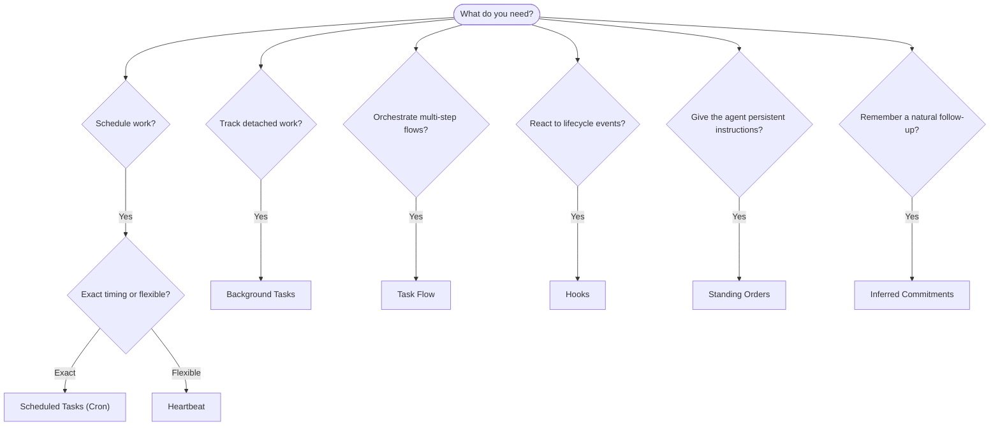

OpenClaw executa trabalho em segundo plano por meio de tarefas, trabalhos agendados, compromissos inferidos, hooks de eventos e instruções permanentes. Esta página ajuda você a escolher o mecanismo certo e entender como eles se encaixam.

## Guia rápido de decisão

| Caso de uso                                      | Recomendado                | Por quê                                                |
| ------------------------------------------------ | -------------------------- | ------------------------------------------------------ |
| Enviar relatório diário exatamente às 9h         | Tarefas agendadas (Cron)   | Horário exato, execução isolada                        |
| Lembre-me em 20 minutos                          | Tarefas agendadas (Cron)   | Execução única com horário preciso (`--at`)            |
| Executar análise aprofundada semanal             | Tarefas agendadas (Cron)   | Tarefa independente, pode usar modelo diferente        |
| Verificar caixa de entrada a cada 30 min         | Heartbeat                  | Agrupa com outras verificações, ciente do contexto     |
| Monitorar calendário para próximos eventos       | Heartbeat                  | Encaixe natural para percepção periódica               |
| Verificar depois de uma entrevista mencionada    | Compromissos inferidos     | Acompanhamento semelhante a memória, sem pedido exato de lembrete |
| Check-in cuidadoso após contexto do usuário      | Compromissos inferidos     | Escopo limitado ao mesmo agente e canal                |
| Inspecionar status de um subagente ou execução ACP | Tarefas em segundo plano | O registro de tarefas acompanha todo trabalho destacado |
| Auditar o que foi executado e quando             | Tarefas em segundo plano   | `openclaw tasks list` e `openclaw tasks audit`         |
| Pesquisa em várias etapas e depois resumo        | Task Flow                  | Orquestração durável com acompanhamento de revisões    |
| Executar um script ao redefinir a sessão         | Hooks                      | Orientado por eventos, dispara em eventos de ciclo de vida |
| Executar código a cada chamada de ferramenta     | Hooks de Plugin            | Hooks em processo podem interceptar chamadas de ferramenta |
| Sempre verificar conformidade antes de responder | Ordens permanentes         | Injetadas automaticamente em toda sessão               |

### Tarefas agendadas (Cron) vs Heartbeat

| Dimensão          | Tarefas agendadas (Cron)          | Heartbeat                                  |
| ----------------- | --------------------------------- | ------------------------------------------ |
| Horário           | Exato (expressões cron, execução única) | Aproximado (padrão a cada 30 min)      |
| Contexto da sessão | Novo (isolado) ou compartilhado  | Contexto completo da sessão principal      |
| Registros de tarefa | Sempre criados                  | Nunca criados                              |
| Entrega           | Canal, webhook ou silenciosa      | Em linha na sessão principal               |
| Melhor para       | Relatórios, lembretes, trabalhos em segundo plano | Verificações de caixa de entrada, calendário, notificações |

Use Tarefas agendadas (Cron) quando precisar de horário preciso ou execução isolada. Use Heartbeat quando o trabalho se beneficiar do contexto completo da sessão e o horário aproximado for suficiente.

## Conceitos centrais

### Tarefas agendadas (cron)

Cron é o agendador integrado do Gateway para horários precisos. Ele persiste trabalhos, desperta o agente no momento certo e pode entregar a saída a um canal de chat ou endpoint de webhook. Oferece suporte a lembretes de execução única, expressões recorrentes e acionadores de webhook de entrada.

Consulte [Tarefas agendadas](/pt-BR/automation/cron-jobs).

### Tarefas

O registro de tarefas em segundo plano acompanha todo trabalho destacado: execuções ACP, criações de subagentes, execuções cron isoladas e operações da CLI. Tarefas são registros, não agendadores. Use `openclaw tasks list` e `openclaw tasks audit` para inspecioná-las.

Consulte [Tarefas em segundo plano](/pt-BR/automation/tasks).

### Compromissos inferidos

Compromissos são memórias de acompanhamento opcionais e de curta duração. O OpenClaw os infere a partir de conversas normais, limita o escopo ao mesmo agente e canal, e entrega check-ins vencidos por meio do Heartbeat. Lembretes exatos solicitados pelo usuário ainda pertencem ao cron.

Consulte [Compromissos inferidos](/pt-BR/concepts/commitments).

### Task Flow

Task Flow é a base de orquestração de fluxos acima das tarefas em segundo plano. Ele gerencia fluxos duráveis de várias etapas com modos de sincronização gerenciado e espelhado, acompanhamento de revisões e `openclaw tasks flow list|show|cancel` para inspeção.

Consulte [Task Flow](/pt-BR/automation/taskflow).

### Ordens permanentes

Ordens permanentes concedem ao agente autoridade operacional permanente para programas definidos. Elas ficam em arquivos do workspace (normalmente `AGENTS.md`) e são injetadas em toda sessão. Combine com cron para aplicação baseada em tempo.

Consulte [Ordens permanentes](/pt-BR/automation/standing-orders).

### Hooks

Hooks internos são scripts orientados por eventos acionados por eventos de ciclo de vida do agente (`/new`, `/reset`, `/stop`), Compaction da sessão, inicialização do Gateway e fluxo de mensagens. Eles são descobertos automaticamente a partir de diretórios e podem ser gerenciados com `openclaw hooks`. Para interceptação de chamadas de ferramenta em processo, use [hooks de Plugin](/pt-BR/plugins/hooks).

Consulte [Hooks](/pt-BR/automation/hooks).

### Heartbeat

Heartbeat é um turno periódico da sessão principal (padrão a cada 30 minutos). Ele agrupa várias verificações (caixa de entrada, calendário, notificações) em um turno do agente com contexto completo da sessão. Turnos de Heartbeat não criam registros de tarefa e não estendem a atualização de redefinição diária/ociosa da sessão. Use `HEARTBEAT.md` para uma pequena lista de verificação, ou um bloco `tasks:` quando quiser verificações periódicas apenas de vencidos dentro do próprio Heartbeat. Arquivos de Heartbeat vazios são ignorados como `empty-heartbeat-file`; o modo de tarefas apenas vencidas é ignorado como `no-tasks-due`. Heartbeats são adiados enquanto trabalho cron está ativo ou enfileirado, e `heartbeat.skipWhenBusy` também pode adiá-los enquanto subagentes ou lanes aninhadas estão ocupadas.

Consulte [Heartbeat](/pt-BR/gateway/heartbeat).

## Como eles funcionam juntos

- **Cron** lida com agendamentos precisos (relatórios diários, revisões semanais) e lembretes de execução única. Todas as execuções cron criam registros de tarefa.
- **Heartbeat** lida com monitoramento de rotina (caixa de entrada, calendário, notificações) em um turno agrupado a cada 30 minutos.
- **Hooks** reagem a eventos específicos (redefinições de sessão, Compaction, fluxo de mensagens) com scripts personalizados. Hooks de Plugin cobrem chamadas de ferramenta.
- **Ordens permanentes** dão ao agente contexto persistente e limites de autoridade.
- **Task Flow** coordena fluxos de várias etapas acima de tarefas individuais.
- **Tarefas** acompanham automaticamente todo trabalho destacado para que você possa inspecioná-lo e auditá-lo.

## Relacionado

- [Tarefas agendadas](/pt-BR/automation/cron-jobs) — agendamento preciso e lembretes de execução única
- [Compromissos inferidos](/pt-BR/concepts/commitments) — check-ins de acompanhamento semelhantes a memória
- [Tarefas em segundo plano](/pt-BR/automation/tasks) — registro de tarefas para todo trabalho destacado
- [Task Flow](/pt-BR/automation/taskflow) — orquestração durável de fluxos de várias etapas
- [Hooks](/pt-BR/automation/hooks) — scripts de ciclo de vida orientados por eventos
- [Hooks de Plugin](/pt-BR/plugins/hooks) — hooks em processo de ferramenta, prompt, mensagem e ciclo de vida
- [Ordens permanentes](/pt-BR/automation/standing-orders) — instruções persistentes do agente
- [Heartbeat](/pt-BR/gateway/heartbeat) — turnos periódicos da sessão principal
- [Referência de configuração](/pt-BR/gateway/configuration-reference) — todas as chaves de configuração
