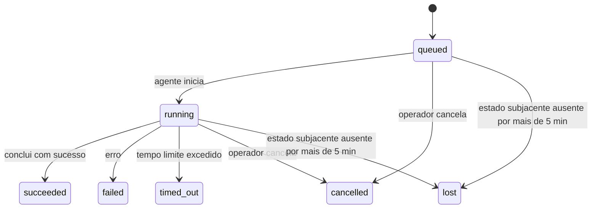

---
read_when:
    - Inspecionando trabalhos em segundo plano em andamento ou concluídos recentemente
    - Depuração de falhas de entrega em execuções de agente desvinculadas
    - Entendendo como as execuções em segundo plano se relacionam com sessões, Cron e Heartbeat
sidebarTitle: Background tasks
summary: Rastreamento de tarefas em segundo plano para execuções do ACP, subagentes, execuções do Cron e operações da CLI
title: Tarefas em segundo plano
x-i18n:
    generated_at: "2026-07-12T14:55:19Z"
    model: gpt-5.6
    postprocess_version: locale-links-v1
    prompt_version: 15
    provider: openai
    source_hash: 0a945e8103c5df5a64785f326a9d0b08784ac32a2ca6fa3d4c399d75fc54be2b
    source_path: automation/tasks.md
    workflow: 16
---

<Note>
Está procurando agendamento? Consulte [Automação](/pt-BR/automation) para escolher o mecanismo adequado. Esta página é o registro de atividades do trabalho em segundo plano, não o agendador.
</Note>

As tarefas em segundo plano acompanham trabalhos executados **fora da sua sessão de conversa principal**: execuções ACP, inicializações de subagentes, execuções de trabalhos Cron e operações iniciadas pela CLI.

As tarefas **não** substituem sessões, trabalhos Cron nem heartbeats — elas são o **registro de atividades** que registra qual trabalho desacoplado ocorreu, quando e se foi bem-sucedido.

<Note>
Nem toda execução de agente cria uma tarefa. Turnos de Heartbeat e conversas interativas normais não criam. Todas as execuções de Cron, inicializações de ACP, inicializações de subagentes e comandos de agente da CLI despachados pelo Gateway criam.
</Note>

## Resumo

- As tarefas são **registros**, não agendadores — Cron e Heartbeat decidem _quando_ o trabalho é executado; as tarefas acompanham _o que aconteceu_.
- ACP, subagentes, todos os trabalhos Cron e operações da CLI criam tarefas. Turnos de Heartbeat não criam.
- Cada tarefa passa por `queued → running → terminal` (succeeded, failed, timed_out, cancelled ou lost).
- As tarefas Cron permanecem ativas enquanto o runtime do Cron ainda é responsável pelo trabalho; se o estado do runtime em memória não estiver mais disponível, a manutenção de tarefas primeiro verifica o histórico durável de execuções do Cron antes de marcar uma tarefa como perdida.
- A conclusão é orientada por push: o trabalho desacoplado pode notificar diretamente ou despertar a sessão/Heartbeat do solicitante quando termina, portanto loops de consulta de status geralmente são a abordagem errada.
- Execuções isoladas do Cron e conclusões de subagentes fazem o possível para limpar abas/processos de navegador rastreados da sessão filha antes da contabilização final da limpeza.
- A entrega de execuções isoladas do Cron suprime respostas intermediárias obsoletas da sessão pai enquanto o trabalho de subagentes descendentes ainda está sendo concluído e dá preferência à saída final dos descendentes quando ela chega antes da entrega.
- As notificações de conclusão são entregues diretamente a um canal ou enfileiradas para o próximo Heartbeat.
- `openclaw tasks list` mostra todas as tarefas; `openclaw tasks audit` apresenta problemas.
- Os registros terminais são mantidos por 7 dias (registros `lost` por 24 horas) e depois removidos automaticamente.

## Início rápido

<Tabs>
  <Tab title="Listar e filtrar">
    ```bash
    # Lista todas as tarefas (mais recentes primeiro)
    openclaw tasks list

    # Filtra por runtime ou status
    openclaw tasks list --runtime acp
    openclaw tasks list --status running
    ```

  </Tab>
  <Tab title="Inspecionar">
    ```bash
    # Mostra detalhes de uma tarefa específica (por ID da tarefa, ID da execução ou chave da sessão)
    openclaw tasks show <lookup>
    ```
  </Tab>
  <Tab title="Cancelar e notificar">
    ```bash
    # Cancela uma tarefa em execução (encerra a sessão filha)
    openclaw tasks cancel <lookup>

    # Altera a política de notificação de uma tarefa
    openclaw tasks notify <lookup> state_changes
    ```

  </Tab>
  <Tab title="Auditoria e manutenção">
    ```bash
    # Executa uma auditoria de integridade
    openclaw tasks audit

    # Visualiza ou aplica a manutenção
    openclaw tasks maintenance
    openclaw tasks maintenance --apply
    ```

  </Tab>
  <Tab title="Fluxo de tarefas">
    ```bash
    # Inspeciona o estado do TaskFlow
    openclaw tasks flow list
    openclaw tasks flow show <lookup>
    openclaw tasks flow cancel <lookup>
    ```
  </Tab>
</Tabs>

## O que cria uma tarefa

| Origem                 | Tipo de runtime | Quando um registro de tarefa é criado                                  | Política de notificação padrão |
| ---------------------- | --------------- | ---------------------------------------------------------------------- | ------------------------------ |
| Execuções de ACP em segundo plano | `acp`        | Ao inicializar uma sessão ACP filha                                    | `done_only`                    |
| Orquestração de subagentes | `subagent`   | Ao inicializar um subagente por meio de `sessions_spawn`               | `done_only`                    |
| Trabalhos Cron (todos os tipos) | `cron`       | A cada execução do Cron (na sessão principal ou isolada)               | `silent`                       |
| Operações da CLI       | `cli`           | Comandos `openclaw agent` executados por meio do Gateway                | `silent`                       |
| Trabalhos de mídia do agente | `cli`      | Execuções de `image_generate`/`music_generate`/`video_generate` vinculadas a uma sessão | `silent`              |

<AccordionGroup>
  <Accordion title="Padrões de notificação para Cron e mídia">
    As tarefas Cron (na sessão principal e isoladas) usam a política de notificação `silent` — elas criam registros para acompanhamento, mas não geram notificações de tarefa próprias; o Cron é responsável pelo caminho de entrega.

    As execuções de `image_generate`, `music_generate` e `video_generate` vinculadas a uma sessão também usam a política de notificação `silent`. Elas ainda criam registros de tarefa, mas a conclusão é devolvida à sessão original do agente como um despertar interno, para que o agente possa escrever a mensagem de acompanhamento e anexar a mídia concluída. O agente solicitante segue seu contrato normal de resposta visível: resposta final automática quando configurada, ou `message(action="send")` mais `NO_REPLY` quando a sessão exige respostas pela ferramenta de mensagens. Se a sessão solicitante não estiver mais ativa ou seu despertar ativo falhar, e o agente de conclusão não incluir parte ou toda a mídia gerada, o OpenClaw enviará diretamente um fallback idempotente contendo apenas a mídia ausente para o destino original do canal.

  </Accordion>
  <Accordion title="Proteção para geração simultânea de mídia">
    Enquanto uma tarefa de geração de mídia vinculada a uma sessão ainda estiver ativa, `image_generate`, `music_generate` e `video_generate` protegem contra novas tentativas acidentais: repetir a chamada para o mesmo prompt/solicitação retorna o status da tarefa ativa correspondente em vez de iniciar uma duplicata, enquanto um prompt diferente pode iniciar sua própria tarefa. Use `action: "status"` quando quiser consultar explicitamente o progresso/status pelo agente.
  </Accordion>
  <Accordion title="O que não cria tarefas">
    - Turnos de Heartbeat — sessão principal; consulte [Heartbeat](/pt-BR/gateway/heartbeat)
    - Turnos normais de conversa interativa
    - Respostas diretas a `/command`

  </Accordion>
</AccordionGroup>

## Ciclo de vida das tarefas



| Status      | O que significa                                                             |
| ----------- | --------------------------------------------------------------------------- |
| `queued`    | Criada, aguardando o agente iniciar                                         |
| `running`   | O turno do agente está em execução ativa                                    |
| `succeeded` | Concluída com sucesso                                                       |
| `failed`    | Concluída com um erro                                                       |
| `timed_out` | Excedeu o tempo limite configurado                                          |
| `cancelled` | Interrompida pelo operador por meio de `openclaw tasks cancel`, ou a execução foi abortada |
| `lost`      | O runtime perdeu o estado subjacente autoritativo após um período de tolerância de 5 minutos |

As transições ocorrem automaticamente — eventos do ciclo de vida da execução do agente (início, fim, erro) atualizam o status da tarefa; você não precisa gerenciá-lo manualmente.

A conclusão da execução do agente é autoritativa para registros de tarefas ativas. Uma execução desacoplada bem-sucedida é finalizada como `succeeded`, erros comuns de execução são finalizados como `failed`, tempos limite são finalizados como `timed_out` e resultados de cancelamento/aborto são finalizados como `cancelled`. Depois que uma tarefa se torna terminal, sinais posteriores do ciclo de vida não rebaixam seu estado — uma tarefa cancelada pelo operador ou que já esteja como `failed`/`timed_out`/`lost` permanece assim mesmo que um sinal de sucesso chegue posteriormente.

`lost` considera o runtime:

- Tarefas ACP: somente um turno ACP ativo no processo do Gateway comprova que a execução está ativa; apenas metadados persistidos da sessão não comprovam isso. A auditoria offline da CLI permanece conservadora e nunca recupera tarefas ACP.
- Tarefas de subagentes: a sessão filha subjacente desapareceu do armazenamento do agente de destino (ou contém uma lápide de recuperação após reinicialização).
- Tarefas Cron: o runtime do Cron não acompanha mais o trabalho como ativo e o histórico durável de execuções do Cron não mostra um resultado terminal para essa execução. A auditoria offline da CLI não considera seu próprio estado vazio do runtime do Cron em processo como autoritativo.
- Tarefas da CLI: tarefas com ID de execução/ID de origem usam o contexto da execução ativa, portanto registros persistentes de sessão filha ou sessão de conversa não as mantêm ativas depois que a execução controlada pelo Gateway desaparece. Tarefas legadas da CLI sem identidade de execução ainda recorrem à sessão filha. Execuções de `openclaw agent` respaldadas pelo Gateway também são finalizadas a partir do resultado da execução, portanto execuções concluídas não permanecem ativas até que o processo de limpeza as marque como `lost`.

## Entrega e notificações

Quando uma tarefa atinge um estado terminal, o OpenClaw notifica você. Há dois caminhos de entrega:

**Entrega direta** — se a tarefa tiver um destino de canal (o `requesterOrigin`), a mensagem de conclusão será enviada diretamente a esse canal (Discord, Slack, Telegram etc.). As conclusões de tarefas de grupos e canais, por sua vez, são encaminhadas pela sessão solicitante para que o agente pai possa escrever a resposta visível. Para conclusões de subagentes, o OpenClaw também preserva o roteamento vinculado de thread/tópico quando disponível e pode preencher um `to` / uma conta ausente usando a rota armazenada da sessão solicitante (`lastChannel` / `lastTo` / `lastAccountId`) antes de desistir da entrega direta.

**Entrega enfileirada na sessão** — se a entrega direta falhar ou nenhuma origem estiver definida, a atualização será enfileirada como um evento do sistema na sessão do solicitante e aparecerá no próximo Heartbeat.

<Tip>
Conclusões de tarefas enfileiradas na sessão acionam imediatamente um despertar de Heartbeat, para que você veja o resultado rapidamente — não é necessário aguardar o próximo ciclo agendado do Heartbeat.
</Tip>

Isso significa que o fluxo de trabalho usual é baseado em push: inicie o trabalho desacoplado uma vez e permita que o runtime desperte ou notifique você após a conclusão. Consulte o estado da tarefa somente quando precisar depurar, intervir ou realizar uma auditoria explícita.

### Políticas de notificação

Controle quanto você recebe de informações sobre cada tarefa:

| Política              | O que é entregue                                         |
| --------------------- | -------------------------------------------------------- |
| `done_only` (padrão)  | Apenas o estado terminal (succeeded, failed etc.)        |
| `state_changes`       | Cada transição de estado e atualização de progresso      |
| `silent`              | Nada (padrão para tarefas Cron, da CLI e de mídia)       |

Altere a política enquanto uma tarefa estiver em execução:

```bash
openclaw tasks notify <lookup> state_changes
```

## Referência da CLI

<AccordionGroup>
  <Accordion title="tasks list">
    ```bash
    openclaw tasks list [--runtime <acp|subagent|cron|cli>] [--status <status>] [--json]
    ```

    Colunas da saída: Task, Kind, Status, Delivery, Run, Child Session, Summary. `openclaw tasks` sem argumentos se comporta como `openclaw tasks list`.

  </Accordion>
  <Accordion title="tasks show">
    ```bash
    openclaw tasks show <lookup> [--json]
    ```

    O token de consulta aceita um ID de tarefa, ID de execução ou chave de sessão. Mostra o registro completo, incluindo tempos, estado da entrega, erro e resumo terminal.

  </Accordion>
  <Accordion title="tasks cancel">
    ```bash
    openclaw tasks cancel <lookup>
    ```

    Para tarefas ACP e de subagentes, isso encerra a sessão filha; cancelamentos de ACP e Cron são encaminhados pelo Gateway em execução (`tasks.cancel`). Para tarefas acompanhadas pela CLI, o cancelamento é registrado no registro de tarefas (não há um identificador separado do runtime filho). O status muda para `cancelled` e uma notificação de entrega é enviada quando aplicável.

  </Accordion>
  <Accordion title="tasks notify">
    ```bash
    openclaw tasks notify <lookup> <done_only|state_changes|silent>
    ```
  </Accordion>
  <Accordion title="tasks audit">
    ```bash
    openclaw tasks audit [--severity <warn|error>] [--code <name>] [--limit <n>] [--json]
    ```

    Apresenta problemas operacionais de tarefas **e** TaskFlows em um único relatório. As constatações também aparecem em `openclaw status` quando problemas são detectados.

    Constatações de tarefas:

    | Constatação                 | Gravidade   | Gatilho                                                                                                           |
    | --------------------------- | ----------- | ----------------------------------------------------------------------------------------------------------------- |
    | `stale_queued`              | aviso       | Na fila por mais de 10 minutos                                                                                    |
    | `stale_running`             | erro        | Em execução por mais de 30 minutos                                                                                |
    | `lost`                      | aviso/erro  | A propriedade da tarefa respaldada pelo runtime desapareceu; tarefas perdidas retidas geram avisos até `cleanupAfter` e depois se tornam erros |
    | `delivery_failed`           | aviso       | A entrega falhou e a política de notificação não é `silent`                                                       |
    | `missing_cleanup`           | aviso       | Tarefa terminal sem registro de data e hora de limpeza                                                            |
    | `inconsistent_timestamps`   | aviso       | Violação da linha do tempo (por exemplo, terminou antes de começar)                                               |

    Constatações do TaskFlow:

    | Constatação             | Gravidade   | Gatilho                                                                       |
    | ----------------------- | ----------- | ----------------------------------------------------------------------------- |
    | `restore_failed`        | erro        | Falha ao restaurar o registro de fluxos do SQLite                             |
    | `stale_running`         | erro        | O fluxo em execução não avançou por mais de 30 minutos                        |
    | `stale_waiting`         | aviso       | O fluxo em espera não avançou por mais de 30 minutos                          |
    | `stale_blocked`         | aviso       | O fluxo bloqueado não avançou por mais de 30 minutos                          |
    | `cancel_stuck`          | aviso       | Cancelamento solicitado há mais de 5 minutos, sem tarefas filhas ativas, mas ainda não terminal |
    | `missing_linked_tasks`  | aviso/erro  | Fluxo gerenciado obsoleto sem tarefas vinculadas nem estado de espera         |
    | `blocked_task_missing`  | aviso       | O fluxo bloqueado aponta para um id de tarefa que não existe mais             |

  </Accordion>
  <Accordion title="manutenção de tarefas">
    ```bash
    openclaw tasks maintenance [--json]
    openclaw tasks maintenance --apply [--json]
    ```

    Use este comando para visualizar ou aplicar reconciliação, registro de limpeza e remoção de tarefas, estado do TaskFlow e linhas obsoletas do registro de sessões de execuções cron.

    A reconciliação considera o runtime:

    - Tarefas ACP exigem um turno ativo no processo do Gateway; tarefas de subagentes verificam a sessão filha correspondente.
    - Tarefas de subagentes cuja sessão filha tenha uma marca de recuperação após reinicialização são marcadas como perdidas, em vez de serem tratadas como sessões correspondentes recuperáveis.
    - Tarefas Cron verificam se o runtime do cron ainda é proprietário do trabalho e depois recuperam o status terminal dos logs persistidos das execuções cron ou do estado do trabalho antes de recorrer a `lost`. Somente o processo do Gateway é autoritativo para o conjunto de trabalhos cron ativos em memória; a auditoria offline da CLI usa o histórico durável, mas não marca uma tarefa cron como perdida apenas porque esse conjunto local está vazio.
    - Tarefas da CLI com identidade de execução verificam o contexto ativo da execução proprietária, não apenas as linhas da sessão filha ou da sessão de chat.

    A limpeza após a conclusão também considera o runtime:

    - A conclusão de um subagente tenta fechar, sem garantia, as abas e os processos do navegador monitorados para a sessão filha antes de continuar a limpeza do anúncio.
    - A conclusão de um cron isolado tenta fechar, sem garantia, as abas e os processos do navegador monitorados para a sessão cron antes que a execução seja totalmente encerrada.
    - A entrega do cron isolado aguarda, quando necessário, o acompanhamento dos subagentes descendentes e suprime o texto obsoleto de confirmação do pai em vez de anunciá-lo.
    - A entrega da conclusão do subagente usa somente o texto visível mais recente do assistente filho. A saída de tool/toolResult não é promovida a texto de resultado do filho. Execuções terminais com falha anunciam o status da falha sem reproduzir o texto de resposta capturado.
    - Falhas de limpeza não ocultam o resultado real da tarefa.

    Ao aplicar a manutenção, o OpenClaw também remove linhas obsoletas `cron:<jobId>:run:<runId>` do registro de sessões com mais de 7 dias, preservando as linhas de trabalhos cron atualmente em execução e mantendo intactas as linhas de sessões não relacionadas a cron.

  </Accordion>
  <Accordion title="tasks flow list | show | cancel">
    ```bash
    openclaw tasks flow list [--status <status>] [--json]
    openclaw tasks flow show <lookup> [--json]
    openclaw tasks flow cancel <lookup>
    ```

    O token de consulta do fluxo aceita um id de fluxo ou uma chave de proprietário. Use esses comandos quando o [Fluxo de Tarefas](/pt-BR/automation/taskflow) orquestrador for o que importa, em vez de um registro individual de tarefa em segundo plano.

  </Accordion>
</AccordionGroup>

## Quadro de tarefas do chat (`/tasks`)

Use `/tasks` em qualquer sessão de chat para ver as tarefas em segundo plano vinculadas àquela sessão. O quadro exibe até cinco tarefas ativas e concluídas recentemente, com runtime, status, duração e detalhes de progresso ou erro.

Quando a sessão atual não tem tarefas vinculadas visíveis, `/tasks` recorre às contagens de tarefas locais do agente para que você ainda tenha uma visão geral sem expor detalhes de outras sessões.

Para consultar o registro operacional completo, use a CLI: `openclaw tasks list`.

### Interface de Controle

A Interface de Controle web tem uma página **Tarefas** na barra lateral com tarefas em segundo plano ativas e recentes em tempo real. Use-a para inspecionar o progresso, abrir sessões vinculadas, atualizar o registro ou cancelar tarefas na fila e em execução.

Os painéis de chat também têm uma barra recolhível de **Tarefas em segundo plano** limitada ao agente do painel: tarefas e subagentes em execução com um controle de interrupção, uma seção de itens concluídos e links para Ver transcrição na sessão filha de cada tarefa. Abra-a pelo botão de atividade no cabeçalho do painel (ou pelo botão flutuante de atividade no chat de painel único).

## Integração de status (pressão das tarefas)

`openclaw status` inclui uma linha resumida de tarefas:

```
Tarefas    2 ativas · 1 na fila · 1 em execução · 1 problema · auditoria limpa · 6 monitoradas
```

O resumo contabiliza o trabalho ativo (`queued` + `running`), as falhas (`failed` + `timed_out` + `lost`), as constatações da auditoria e o total de registros monitorados; o conteúdo JSON também detalha as contagens por runtime (`acp`, `subagent`, `cron`, `cli`).

Tanto `/status` quanto a ferramenta `session_status` usam um instantâneo de tarefas que considera a limpeza: tarefas ativas têm prioridade, linhas expiradas ficam ocultas e tarefas terminais aparecem somente durante uma janela recente curta (5 minutos), com destaque para falhas quando não resta trabalho ativo. Isso mantém o cartão de status concentrado no que importa agora.

## Armazenamento e manutenção

### Onde as tarefas ficam armazenadas

Os registros de tarefas e o estado de entrega persistem no banco de dados de estado SQLite compartilhado do OpenClaw:

```
~/.openclaw/state/openclaw.sqlite   (tabelas: task_runs, task_delivery_state, flow_runs)
```

Defina `OPENCLAW_STATE_DIR` para mover todo o diretório raiz de estado (por padrão, `~/.openclaw`) para outro local; o caminho do banco de dados compartilhado será movido com ele.

O registro é carregado na memória no primeiro uso e persiste cada gravação no SQLite, portanto os registros sobrevivem às reinicializações do Gateway. O crescimento do WAL permanece limitado pelo limiar padrão de checkpoint automático do SQLite, além de checkpoints `PASSIVE` periódicos; o encerramento e os checkpoints explícitos de manutenção usam `TRUNCATE`, de modo que os encerramentos normais recuperem o espaço do WAL sem fazer o processo de limpeza em segundo plano aguardar leitores ativos.

Os armazenamentos auxiliares legados de instalações antigas (`tasks/runs.sqlite`, `flows/registry.sqlite`) são importados para o banco de dados compartilhado pelo `openclaw doctor`.

### Manutenção automática

Um processo de limpeza é executado a cada **60 segundos** (a primeira passagem ocorre cerca de 5 segundos após o início do Gateway) e realiza quatro ações:

<Steps>
  <Step title="Reconciliação">
    Verifica se as tarefas ativas ainda têm respaldo autoritativo no runtime. Tarefas ACP exigem um turno ativo no processo, tarefas de subagentes usam o estado da sessão filha, tarefas cron usam a propriedade do trabalho ativo junto com o histórico durável de execuções e tarefas da CLI com identidade de execução usam o contexto da execução proprietária. Se o estado correspondente estiver ausente por mais de 5 minutos (30 minutos para tarefas nativas de subagentes sem filhos), a tarefa será marcada como `lost`.
  </Step>
  <Step title="Reparo de sessões ACP">
    Encerra sessões ACP pontuais, terminais ou órfãs, pertencentes ao pai e encerra sessões ACP persistentes obsoletas, terminais ou órfãs, somente quando não resta nenhum vínculo de conversa ativo.
  </Step>
  <Step title="Registro da limpeza">
    Define um registro de data e hora `cleanupAfter` nas tarefas terminais (hora terminal + janela de retenção). Durante a retenção, tarefas perdidas ainda aparecem na auditoria como avisos; após a expiração de `cleanupAfter` ou quando os metadados de limpeza estiverem ausentes, elas se tornam erros.
  </Step>
  <Step title="Remoção">
    Exclui registros cuja data `cleanupAfter` já passou.
  </Step>
</Steps>

<Note>
**Retenção:** os registros de tarefas terminais são mantidos por **7 dias** (registros `lost` por **24 horas**) e depois removidos automaticamente. Nenhuma configuração é necessária.
</Note>

## Como as tarefas se relacionam com outros sistemas

<AccordionGroup>
  <Accordion title="Tarefas e Fluxo de Tarefas">
    O [Fluxo de Tarefas](/pt-BR/automation/taskflow) é a camada de orquestração de fluxos acima das tarefas em segundo plano. Um único fluxo pode coordenar várias tarefas durante seu ciclo de vida usando modos de sincronização gerenciado ou espelhado. Use `openclaw tasks` para inspecionar registros individuais de tarefas e `openclaw tasks flow` para inspecionar o fluxo orquestrador.

  </Accordion>
  <Accordion title="Tarefas e cron">
    As definições de trabalhos Cron, o estado de execução do runtime e o histórico de execuções ficam no banco de dados de estado SQLite compartilhado do OpenClaw. **Toda** execução cron cria um registro de tarefa — tanto na sessão principal quanto isolada — com a política de notificação `silent`, portanto as execuções cron são monitoradas sem gerar notificações de tarefas próprias.

    Consulte [Trabalhos Cron](/pt-BR/automation/cron-jobs).

  </Accordion>
  <Accordion title="Tarefas e Heartbeat">
    As execuções de Heartbeat são turnos da sessão principal — elas não criam registros de tarefas. Quando uma tarefa é concluída, ela pode acionar um despertar de Heartbeat para que você veja o resultado rapidamente.

    Consulte [Heartbeat](/pt-BR/gateway/heartbeat).

  </Accordion>
  <Accordion title="Tarefas e sessões">
    Uma tarefa pode fazer referência a uma `childSessionKey` (onde o trabalho é executado) e uma `requesterSessionKey` (quem o iniciou). Seu `agentId` identifica o agente que executa o trabalho, enquanto os campos de solicitante e proprietário preservam o contexto de início e controle. As sessões são o contexto da conversa; as tarefas são o monitoramento de atividades sobre esse contexto.
  </Accordion>
  <Accordion title="Tarefas e execuções de agentes">
    O `runId` de uma tarefa a vincula à execução do agente que realiza o trabalho. Os eventos do ciclo de vida do agente (início, término, erro) atualizam automaticamente o status da tarefa — não é necessário gerenciar o ciclo de vida manualmente.
  </Accordion>
</AccordionGroup>

## Relacionados

- [Automação](/pt-BR/automation) - visão geral de todos os mecanismos de automação
- [CLI: Tarefas](/pt-BR/cli/tasks) - referência de comandos da CLI
- [Heartbeat](/pt-BR/gateway/heartbeat) - turnos periódicos da sessão principal
- [Tarefas Agendadas](/pt-BR/automation/cron-jobs) - agendamento de trabalho em segundo plano
- [Fluxo de Tarefas](/pt-BR/automation/taskflow) - orquestração de fluxos acima das tarefas
