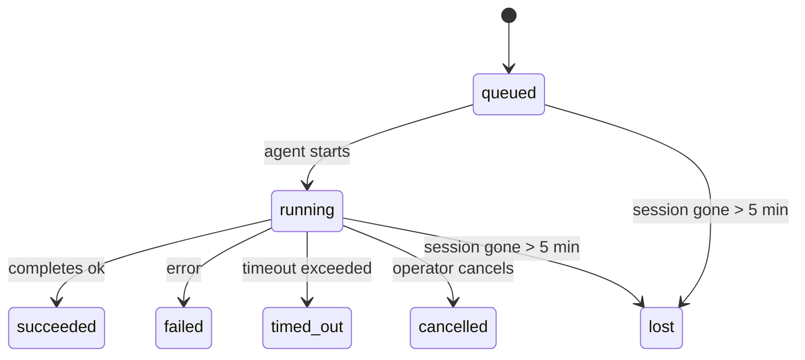

---
read_when:
    - Inspecionando trabalho em segundo plano em andamento ou concluído recentemente
    - Depurando falhas de entrega para execuções de agentes desacopladas
    - Entendendo como execuções em segundo plano se relacionam com sessões, Cron e Heartbeat
sidebarTitle: Background tasks
summary: Rastreamento de tarefas em segundo plano para execuções ACP, subagentes, tarefas Cron isoladas e operações da CLI
title: Tarefas em segundo plano
x-i18n:
    generated_at: "2026-06-27T17:08:52Z"
    model: gpt-5.5
    postprocess_version: locale-links-v1
    provider: openai
    source_hash: 4a630a52d0d6bfd387a37415dd63fc4bfbce23f99eaa8cb780c3d6f8913675fd
    source_path: automation/tasks.md
    workflow: 16
---

<Note>
Procurando agendamento? Consulte [Automação](/pt-BR/automation) para escolher o mecanismo certo. Esta página é o registro de atividades do trabalho em segundo plano, não o agendador.
</Note>

Tarefas em segundo plano rastreiam trabalho executado **fora da sua sessão de conversa principal**: execuções ACP, criações de subagentes, execuções isoladas de trabalhos cron e operações iniciadas pela CLI.

Tarefas **não** substituem sessões, trabalhos cron nem Heartbeats - elas são o **registro de atividades** que registra qual trabalho destacado aconteceu, quando e se foi bem-sucedido.

<Note>
Nem toda execução de agente cria uma tarefa. Turnos de Heartbeat e conversas interativas normais não criam. Todas as execuções cron, criações ACP, criações de subagentes e comandos de agente pela CLI criam.
</Note>

## Resumo

- Tarefas são **registros**, não agendadores - cron e Heartbeat decidem _quando_ o trabalho é executado; tarefas rastreiam _o que aconteceu_.
- ACP, subagentes, todos os trabalhos cron e operações da CLI criam tarefas. Turnos de Heartbeat não criam.
- Cada tarefa passa por `queued → running → terminal` (succeeded, failed, timed_out, cancelled ou lost).
- Tarefas cron permanecem ativas enquanto o runtime cron ainda possui o trabalho; se o
  estado do runtime em memória desapareceu, a manutenção de tarefas primeiro verifica o histórico durável de execuções
  cron antes de marcar uma tarefa como perdida.
- A conclusão é orientada por push: trabalho destacado pode notificar diretamente ou acordar a
  sessão/Heartbeat solicitante quando termina, então loops de sondagem de status
  geralmente têm o formato errado.
- Execuções cron isoladas e conclusões de subagentes fazem a melhor tentativa de limpar abas/processos de navegador rastreados para sua sessão filha antes da escrituração final de limpeza.
- A entrega de cron isolado suprime respostas provisórias obsoletas do pai enquanto o trabalho de subagentes descendentes ainda está escoando, e prefere a saída final do descendente quando ela chega antes da entrega.
- Notificações de conclusão são entregues diretamente a um canal ou enfileiradas para o próximo Heartbeat.
- `openclaw tasks list` mostra todas as tarefas; `openclaw tasks audit` expõe problemas.
- Registros terminais são mantidos por 7 dias e depois removidos automaticamente.

## Início rápido

<Tabs>
  <Tab title="Listar e filtrar">
    ```bash
    # List all tasks (newest first)
    openclaw tasks list

    # Filter by runtime or status
    openclaw tasks list --runtime acp
    openclaw tasks list --status running
    ```

  </Tab>
  <Tab title="Inspecionar">
    ```bash
    # Show details for a specific task (by ID, run ID, or session key)
    openclaw tasks show <lookup>
    ```
  </Tab>
  <Tab title="Cancelar e notificar">
    ```bash
    # Cancel a running task (kills the child session)
    openclaw tasks cancel <lookup>

    # Change notification policy for a task
    openclaw tasks notify <lookup> state_changes
    ```

  </Tab>
  <Tab title="Auditoria e manutenção">
    ```bash
    # Run a health audit
    openclaw tasks audit

    # Preview or apply maintenance
    openclaw tasks maintenance
    openclaw tasks maintenance --apply
    ```

  </Tab>
  <Tab title="Fluxo de tarefas">
    ```bash
    # Inspect TaskFlow state
    openclaw tasks flow list
    openclaw tasks flow show <lookup>
    openclaw tasks flow cancel <lookup>
    ```
  </Tab>
</Tabs>

## O que cria uma tarefa

| Origem                 | Tipo de runtime | Quando um registro de tarefa é criado                                  | Política padrão de notificação |
| ---------------------- | ------------ | ---------------------------------------------------------------------- | --------------------- |
| Execuções ACP em segundo plano    | `acp`        | Criação de uma sessão ACP filha                                           | `done_only`           |
| Orquestração de subagentes | `subagent`   | Criação de um subagente via `sessions_spawn`                               | `done_only`           |
| Trabalhos cron (todos os tipos)  | `cron`       | Toda execução cron (sessão principal e isolada)                       | `silent`              |
| Operações da CLI         | `cli`        | Comandos `openclaw agent` executados pelo Gateway                 | `silent`              |
| Trabalhos de mídia do agente       | `cli`        | Execuções `image_generate`/`music_generate`/`video_generate` apoiadas por sessão | `silent`              |

<AccordionGroup>
  <Accordion title="Padrões de notificação para cron e mídia">
    Tarefas cron da sessão principal usam a política de notificação `silent` por padrão - elas criam registros para rastreamento, mas não geram notificações. Tarefas cron isoladas também usam `silent` por padrão, mas são mais visíveis porque são executadas em sua própria sessão.

    Execuções `image_generate`, `music_generate` e `video_generate` apoiadas por sessão também usam a política de notificação `silent`. Elas ainda criam registros de tarefa, mas a conclusão é devolvida à sessão original do agente como um wake interno para que o agente possa escrever a mensagem de acompanhamento e anexar a mídia finalizada por conta própria. O agente solicitante segue seu contrato normal de resposta visível: resposta final automática quando configurada, ou `message(action="send")` mais `NO_REPLY` quando a sessão exige respostas por ferramenta de mensagem. Se a sessão solicitante não estiver mais ativa ou seu wake ativo falhar, e o agente de conclusão perder parte ou toda a mídia gerada, o OpenClaw envia um fallback direto idempotente apenas com a mídia ausente para o alvo original do canal.

  </Accordion>
  <Accordion title="Proteção contra geração de mídia concorrente">
    Enquanto uma tarefa de geração de mídia apoiada por sessão ainda está ativa, as ferramentas de mídia também atuam como proteções contra novas tentativas acidentais. Chamadas repetidas de `image_generate` para o mesmo prompt retornam o status da tarefa ativa correspondente, enquanto um prompt de imagem distinto pode iniciar sua própria tarefa. Chamadas `music_generate` e `video_generate` ainda retornam o status da tarefa ativa dessa sessão em vez de iniciar uma segunda geração concorrente. Use `action: "status"` quando quiser uma consulta explícita de progresso/status pelo lado do agente.
  </Accordion>
  <Accordion title="O que não cria tarefas">
    - Turnos de Heartbeat - sessão principal; consulte [Heartbeat](/pt-BR/gateway/heartbeat)
    - Turnos normais de conversa interativa
    - Respostas diretas a `/command`

  </Accordion>
</AccordionGroup>

## Ciclo de vida da tarefa



| Status      | O que significa                                                            |
| ----------- | -------------------------------------------------------------------------- |
| `queued`    | Criada, aguardando o agente iniciar                                    |
| `running`   | O turno do agente está em execução ativa                                           |
| `succeeded` | Concluída com sucesso                                                     |
| `failed`    | Concluída com um erro                                                    |
| `timed_out` | Excedeu o tempo limite configurado                                            |
| `cancelled` | Interrompida pelo operador via `openclaw tasks cancel`                        |
| `lost`      | O runtime perdeu o estado de apoio autoritativo após um período de carência de 5 minutos |

Transições acontecem automaticamente - quando a execução de agente associada termina, o status da tarefa é atualizado para corresponder.

A conclusão da execução de agente é autoritativa para registros de tarefas ativas. Uma execução destacada bem-sucedida finaliza como `succeeded`, erros comuns de execução finalizam como `failed`, e resultados de tempo limite ou aborto finalizam como `timed_out`. Se um operador já cancelou a tarefa, ou o runtime já registrou um estado terminal mais forte, como `failed`, `timed_out` ou `lost`, um sinal posterior de sucesso não rebaixa esse status terminal.

`lost` reconhece o runtime:

- Tarefas ACP: metadados da sessão ACP filha de apoio desapareceram.
- Tarefas de subagente: a sessão filha de apoio desapareceu do armazenamento do agente de destino.
- Tarefas cron: o runtime cron não rastreia mais o trabalho como ativo e o histórico durável de execuções
  cron não mostra um resultado terminal para essa execução. A auditoria offline pela CLI
  não trata seu próprio estado vazio de runtime cron em processo como autoridade.
- Tarefas CLI: tarefas com um id de execução/id de origem usam o contexto de execução ao vivo, então
  linhas remanescentes de sessão filha ou sessão de chat não as mantêm ativas depois que a
  execução pertencente ao Gateway desaparece. Tarefas CLI legadas sem identidade de execução ainda recaem
  para a sessão filha. Execuções `openclaw agent` apoiadas pelo Gateway também finalizam
  a partir de seu resultado de execução, então execuções concluídas não permanecem ativas até que o varredor
  as marque como `lost`.

## Entrega e notificações

Quando uma tarefa atinge um estado terminal, o OpenClaw notifica você. Há dois caminhos de entrega:

**Entrega direta** - se a tarefa tem um alvo de canal (o `requesterOrigin`), a mensagem de conclusão vai direto para esse canal (Telegram, Discord, Slack etc.). Conclusões de tarefas em grupos e canais, em vez disso, são roteadas pela sessão solicitante para que o agente pai possa escrever a resposta visível. Para conclusões de subagentes, o OpenClaw também preserva o roteamento de thread/tópico vinculado quando disponível e pode preencher um `to` / conta ausente a partir da rota armazenada da sessão solicitante (`lastChannel` / `lastTo` / `lastAccountId`) antes de desistir da entrega direta.

**Entrega enfileirada na sessão** - se a entrega direta falhar ou nenhuma origem estiver definida, a atualização é enfileirada como um evento de sistema na sessão do solicitante e aparece no próximo Heartbeat.

<Tip>
A conclusão da tarefa aciona um wake imediato de Heartbeat para que você veja o resultado rapidamente - você não precisa esperar pelo próximo tique de Heartbeat agendado.
</Tip>

Isso significa que o fluxo de trabalho usual é baseado em push: inicie o trabalho destacado uma vez e depois deixe o runtime acordar ou notificar você na conclusão. Consulte o estado da tarefa por sondagem somente quando precisar depurar, intervir ou executar uma auditoria explícita.

### Políticas de notificação

Controle o quanto você ouve sobre cada tarefa:

| Política                | O que é entregue                                                       |
| --------------------- | ----------------------------------------------------------------------- |
| `done_only` (padrão) | Apenas estado terminal (succeeded, failed etc.) - **este é o padrão** |
| `state_changes`       | Toda transição de estado e atualização de progresso                              |
| `silent`              | Nada                                                          |

Altere a política enquanto uma tarefa está em execução:

```bash
openclaw tasks notify <lookup> state_changes
```

## Referência da CLI

<AccordionGroup>
  <Accordion title="tasks list">
    ```bash
    openclaw tasks list [--runtime <acp|subagent|cron|cli>] [--status <status>] [--json]
    ```

    Colunas de saída: ID da tarefa, Tipo, Status, Entrega, ID da execução, Sessão filha, Resumo.

  </Accordion>
  <Accordion title="tasks show">
    ```bash
    openclaw tasks show <lookup>
    ```

    O token de consulta aceita um ID de tarefa, ID de execução ou chave de sessão. Mostra o registro completo, incluindo temporização, estado de entrega, erro e resumo terminal.

  </Accordion>
  <Accordion title="tasks cancel">
    ```bash
    openclaw tasks cancel <lookup>
    ```

    Para tarefas ACP e de subagentes, isso encerra a sessão filha. Para tarefas rastreadas pela CLI, o cancelamento é registrado no registro de tarefas (não há um identificador separado de runtime filho). O status transita para `cancelled` e uma notificação de entrega é enviada quando aplicável.

  </Accordion>
  <Accordion title="tasks notify">
    ```bash
    openclaw tasks notify <lookup> <done_only|state_changes|silent>
    ```
  </Accordion>
  <Accordion title="tasks audit">
    ```bash
    openclaw tasks audit [--json]
    ```

    Expõe problemas operacionais. Achados também aparecem em `openclaw status` quando problemas são detectados.

    | Achado                   | Severidade | Gatilho                                                                                                                   |
    | ------------------------- | ---------- | ------------------------------------------------------------------------------------------------------------------------- |
    | `stale_queued`            | warn       | Em fila há mais de 10 minutos                                                                                             |
    | `stale_running`           | error      | Em execução há mais de 30 minutos                                                                                         |
    | `lost`                    | warn/error | A propriedade da tarefa respaldada pelo runtime desapareceu; tarefas perdidas retidas avisam até `cleanupAfter`, depois viram erros |
    | `delivery_failed`         | warn       | A entrega falhou e a política de notificação não é `silent`                                                               |
    | `missing_cleanup`         | warn       | Tarefa terminal sem timestamp de limpeza                                                                                   |
    | `inconsistent_timestamps` | warn       | Violação de linha do tempo (por exemplo, terminou antes de começar)                                                       |

  </Accordion>
  <Accordion title="tasks maintenance">
    ```bash
    openclaw tasks maintenance [--json]
    openclaw tasks maintenance --apply [--json]
    ```

    Use isto para pré-visualizar ou aplicar reconciliação, marcação de limpeza e remoção de tarefas, estado do Task Flow e linhas obsoletas do registro de sessões de execuções de cron.

    A reconciliação é ciente do runtime:

    - Tarefas ACP/subagente verificam a sessão filha que as respalda.
    - Tarefas de subagente cuja sessão filha tem uma lápide de recuperação de reinicialização são marcadas como perdidas em vez de serem tratadas como sessões de respaldo recuperáveis.
    - Tarefas Cron verificam se o runtime de cron ainda possui o job, depois recuperam o status terminal a partir de logs de execução de cron/estado de job persistidos antes de recorrer a `lost`. Somente o processo do Gateway é autoritativo para o conjunto em memória de jobs ativos de cron; a auditoria offline da CLI usa histórico durável, mas não marca uma tarefa cron como perdida apenas porque esse Set local está vazio.
    - Tarefas CLI com identidade de execução verificam o contexto de execução ao vivo proprietário, não apenas linhas de sessão filha ou sessão de chat.

    A limpeza de conclusão também é ciente do runtime:

    - A conclusão de subagente fecha, em melhor esforço, abas/processos de navegador rastreados para a sessão filha antes que a limpeza do anúncio continue.
    - A conclusão de cron isolado fecha, em melhor esforço, abas/processos de navegador rastreados para a sessão de cron antes que a execução seja totalmente encerrada.
    - A entrega de cron isolado aguarda o acompanhamento de subagentes descendentes quando necessário e suprime texto obsoleto de confirmação do pai em vez de anunciá-lo.
    - A entrega de conclusão de subagente usa apenas o texto visível mais recente do assistente da criança. Saída de ferramenta/toolResult não é promovida para texto de resultado da criança. Execuções terminais com falha anunciam o status de falha sem reproduzir o texto de resposta capturado.
    - Falhas de limpeza não mascaram o resultado real da tarefa.

    Ao aplicar manutenção, o OpenClaw também remove linhas obsoletas do registro de sessões `cron:<jobId>:run:<uuid>` com mais de 7 dias, preservando linhas de jobs cron atualmente em execução e deixando linhas de sessão que não são cron intocadas.

  </Accordion>
  <Accordion title="tasks flow list | show | cancel">
    ```bash
    openclaw tasks flow list [--status <status>] [--json]
    openclaw tasks flow show <lookup> [--json]
    openclaw tasks flow cancel <lookup>
    ```

    Use isto quando o Task Flow orquestrador for o que importa para você, em vez de um registro individual de tarefa em segundo plano.

  </Accordion>
</AccordionGroup>

## Quadro de tarefas do chat (`/tasks`)

Use `/tasks` em qualquer sessão de chat para ver tarefas em segundo plano vinculadas a essa sessão. O quadro mostra tarefas ativas e concluídas recentemente com runtime, status, tempo e progresso ou detalhes de erro.

Quando a sessão atual não tem tarefas vinculadas visíveis, `/tasks` recorre a contagens de tarefas locais do agente para que você ainda tenha uma visão geral sem vazar detalhes de outras sessões.

Para o livro-razão completo do operador, use a CLI: `openclaw tasks list`.

## Integração de status (pressão de tarefas)

`openclaw status` inclui um resumo de tarefas de relance:

```
Tasks: 3 queued · 2 running · 1 issues
```

O resumo informa:

- **active** - contagem de `queued` + `running`
- **failures** - contagem de `failed` + `timed_out` + `lost`
- **byRuntime** - detalhamento por `acp`, `subagent`, `cron`, `cli`

Tanto `/status` quanto a ferramenta `session_status` usam um snapshot de tarefas ciente de limpeza: tarefas ativas são preferidas, linhas concluídas obsoletas são ocultadas, e falhas recentes só aparecem quando não resta nenhum trabalho ativo. Isso mantém o cartão de status focado no que importa agora.

## Armazenamento e manutenção

### Onde as tarefas ficam

Registros de tarefas persistem no SQLite em:

```
$OPENCLAW_STATE_DIR/tasks/runs.sqlite
```

O registro é carregado na memória na inicialização do gateway e sincroniza gravações no SQLite para durabilidade entre reinicializações.
O Gateway mantém o log write-ahead do SQLite limitado usando o limite padrão de
autocheckpoint do SQLite mais checkpoints `PASSIVE` periódicos. Desligamento e
checkpoints explícitos de manutenção ainda usam `TRUNCATE` para que fechamentos normais possam
recuperar espaço de WAL sem fazer o varredor em segundo plano esperar por leitores ativos.

### Manutenção automática

Um varredor roda a cada **60 segundos** e cuida de quatro coisas:

<Steps>
  <Step title="Reconciliação">
    Verifica se tarefas ativas ainda têm respaldo autoritativo do runtime. Tarefas ACP/subagente usam estado de sessão filha, tarefas cron usam propriedade de job ativo, e tarefas CLI com identidade de execução usam o contexto de execução proprietário. Se esse estado de respaldo desaparecer por mais de 5 minutos, a tarefa é marcada como `lost`.
  </Step>
  <Step title="Reparo de sessão ACP">
    Fecha sessões ACP one-shot terminais ou órfãs pertencentes ao pai, e fecha sessões ACP persistentes terminais obsoletas ou órfãs somente quando não resta nenhum vínculo de conversa ativo.
  </Step>
  <Step title="Marcação de limpeza">
    Define um timestamp `cleanupAfter` em tarefas terminais (endedAt + 7 dias). Durante a retenção, tarefas perdidas ainda aparecem na auditoria como avisos; depois que `cleanupAfter` expira ou quando metadados de limpeza estão ausentes, elas são erros.
  </Step>
  <Step title="Remoção">
    Exclui registros após a data `cleanupAfter`.
  </Step>
</Steps>

<Note>
**Retenção:** registros de tarefas terminais são mantidos por **7 dias** e então removidos automaticamente. Nenhuma configuração necessária.
</Note>

## Como as tarefas se relacionam com outros sistemas

<AccordionGroup>
  <Accordion title="Tarefas e Task Flow">
    [Task Flow](/pt-BR/automation/taskflow) é a camada de orquestração de fluxos acima das tarefas em segundo plano. Um único fluxo pode coordenar várias tarefas ao longo de seu ciclo de vida usando modos de sincronização gerenciados ou espelhados. Use `openclaw tasks` para inspecionar registros individuais de tarefas e `openclaw tasks flow` para inspecionar o fluxo orquestrador.

    Consulte [Task Flow](/pt-BR/automation/taskflow) para detalhes.

  </Accordion>
  <Accordion title="Tarefas e cron">
    Definições de jobs Cron, estado de execução em runtime e histórico de execuções ficam no banco de dados SQLite de estado compartilhado do OpenClaw. **Toda** execução de cron cria um registro de tarefa - tanto de sessão principal quanto isolada. Tarefas cron de sessão principal usam a política de notificação `silent` por padrão para que sejam rastreadas sem gerar notificações.

    Consulte [Cron Jobs](/pt-BR/automation/cron-jobs).

  </Accordion>
  <Accordion title="Tarefas e heartbeat">
    Execuções de Heartbeat são turnos de sessão principal - elas não criam registros de tarefas. Quando uma tarefa é concluída, ela pode acionar um despertar de heartbeat para que você veja o resultado prontamente.

    Consulte [Heartbeat](/pt-BR/gateway/heartbeat).

  </Accordion>
  <Accordion title="Tarefas e sessões">
    Uma tarefa pode referenciar um `childSessionKey` (onde o trabalho roda) e um `requesterSessionKey` (quem a iniciou). Seu `agentId` identifica o agente que executa o trabalho, enquanto os campos de solicitante e proprietário preservam o contexto de lançamento e controle. Sessões são contexto de conversa; tarefas são rastreamento de atividade por cima disso.
  </Accordion>
  <Accordion title="Tarefas e execuções de agente">
    O `runId` de uma tarefa se vincula à execução do agente que realiza o trabalho. Eventos de ciclo de vida do agente (início, fim, erro) atualizam automaticamente o status da tarefa - você não precisa gerenciar o ciclo de vida manualmente.
  </Accordion>
</AccordionGroup>

## Relacionado

- [Automação](/pt-BR/automation) - todos os mecanismos de automação em resumo
- [CLI: Tarefas](/pt-BR/cli/tasks) - referência de comandos da CLI
- [Heartbeat](/pt-BR/gateway/heartbeat) - turnos periódicos de sessão principal
- [Tarefas Agendadas](/pt-BR/automation/cron-jobs) - agendamento de trabalho em segundo plano
- [Task Flow](/pt-BR/automation/taskflow) - orquestração de fluxos acima de tarefas
