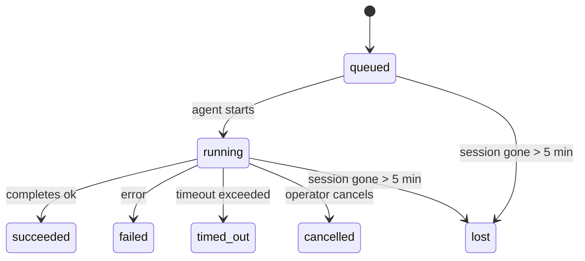

---
read_when:
    - Inspecionando trabalho em segundo plano em andamento ou concluído recentemente
    - Depuração de falhas de entrega em execuções destacadas de agentes
    - Entendendo como execuções em segundo plano se relacionam com sessões, Cron e Heartbeat
sidebarTitle: Background tasks
summary: Rastreamento de tarefas em segundo plano para execuções do ACP, subagentes, trabalhos Cron isolados e operações da CLI
title: Tarefas em segundo plano
x-i18n:
    generated_at: "2026-04-30T16:27:52Z"
    model: gpt-5.5
    provider: openai
    source_hash: 999653c9360323d5135e33193c76458cba8c288227de46a6217f1ccbed2a6d34
    source_path: automation/tasks.md
    workflow: 16
---

<Note>
Procurando agendamento? Consulte [Automação e tarefas](/pt-BR/automation) para escolher o mecanismo certo. Esta página é o registro de atividades para trabalho em segundo plano, não o agendador.
</Note>

Tarefas em segundo plano rastreiam trabalho que é executado **fora da sua sessão de conversa principal**: execuções ACP, criação de subagentes, execuções isoladas de trabalhos Cron e operações iniciadas pela CLI.

Tarefas **não** substituem sessões, trabalhos Cron nem Heartbeats — elas são o **registro de atividades** que registra qual trabalho desconectado aconteceu, quando e se foi bem-sucedido.

<Note>
Nem toda execução de agente cria uma tarefa. Turnos de Heartbeat e chat interativo normal não criam. Todas as execuções Cron, criações ACP, criações de subagentes e comandos de agente da CLI criam.
</Note>

## TL;DR

- Tarefas são **registros**, não agendadores — Cron e Heartbeat decidem _quando_ o trabalho é executado; tarefas rastreiam _o que aconteceu_.
- ACP, subagentes, todos os trabalhos Cron e operações da CLI criam tarefas. Turnos de Heartbeat não criam.
- Cada tarefa passa por `queued → running → terminal` (succeeded, failed, timed_out, cancelled ou lost).
- Tarefas Cron permanecem ativas enquanto o runtime Cron ainda é dono do trabalho; se o
  estado do runtime em memória desapareceu, a manutenção de tarefas primeiro verifica o histórico durável de
  execuções Cron antes de marcar uma tarefa como perdida.
- A conclusão é orientada por push: trabalho desconectado pode notificar diretamente ou acordar a
  sessão/Heartbeat solicitante quando termina, então loops de polling de status
  geralmente têm o formato errado.
- Execuções Cron isoladas e conclusões de subagentes fazem a melhor tentativa de limpar abas/processos do navegador rastreados para sua sessão filha antes da contabilidade final de limpeza.
- A entrega Cron isolada suprime respostas intermediárias obsoletas do pai enquanto o trabalho de subagente descendente ainda está esvaziando, e prefere a saída final do descendente quando ela chega antes da entrega.
- Notificações de conclusão são entregues diretamente a um canal ou enfileiradas para o próximo Heartbeat.
- `openclaw tasks list` mostra todas as tarefas; `openclaw tasks audit` revela problemas.
- Registros terminais são mantidos por 7 dias e depois removidos automaticamente.

## Início rápido

<Tabs>
  <Tab title="List and filter">
    ```bash
    # List all tasks (newest first)
    openclaw tasks list

    # Filter by runtime or status
    openclaw tasks list --runtime acp
    openclaw tasks list --status running
    ```

  </Tab>
  <Tab title="Inspect">
    ```bash
    # Show details for a specific task (by ID, run ID, or session key)
    openclaw tasks show <lookup>
    ```
  </Tab>
  <Tab title="Cancel and notify">
    ```bash
    # Cancel a running task (kills the child session)
    openclaw tasks cancel <lookup>

    # Change notification policy for a task
    openclaw tasks notify <lookup> state_changes
    ```

  </Tab>
  <Tab title="Audit and maintenance">
    ```bash
    # Run a health audit
    openclaw tasks audit

    # Preview or apply maintenance
    openclaw tasks maintenance
    openclaw tasks maintenance --apply
    ```

  </Tab>
  <Tab title="Task flow">
    ```bash
    # Inspect TaskFlow state
    openclaw tasks flow list
    openclaw tasks flow show <lookup>
    openclaw tasks flow cancel <lookup>
    ```
  </Tab>
</Tabs>

## O que cria uma tarefa

| Origem                 | Tipo de runtime | Quando um registro de tarefa é criado                          | Política de notificação padrão |
| ---------------------- | ------------ | ------------------------------------------------------ | --------------------- |
| Execuções em segundo plano ACP    | `acp`        | Ao criar uma sessão ACP filha                           | `done_only`           |
| Orquestração de subagentes | `subagent`   | Ao criar um subagente via `sessions_spawn`               | `done_only`           |
| Trabalhos Cron (todos os tipos)  | `cron`       | Toda execução Cron (sessão principal e isolada)       | `silent`              |
| Operações da CLI         | `cli`        | Comandos `openclaw agent` que são executados pelo Gateway | `silent`              |
| Trabalhos de mídia do agente       | `cli`        | Execuções `video_generate` respaldadas por sessão                   | `silent`              |

<AccordionGroup>
  <Accordion title="Notify defaults for cron and media">
    Tarefas Cron de sessão principal usam a política de notificação `silent` por padrão — elas criam registros para rastreamento, mas não geram notificações. Tarefas Cron isoladas também usam `silent` por padrão, mas são mais visíveis porque são executadas em sua própria sessão.

    Execuções `video_generate` respaldadas por sessão também usam a política de notificação `silent`. Elas ainda criam registros de tarefa, mas a conclusão é devolvida à sessão original do agente como um despertar interno para que o agente possa escrever a mensagem de acompanhamento e anexar o vídeo finalizado por conta própria. Se você optar por `tools.media.asyncCompletion.directSend`, conclusões assíncronas de `music_generate` e `video_generate` tentam primeiro a entrega direta no canal antes de recorrer ao caminho de despertar da sessão solicitante.

  </Accordion>
  <Accordion title="Concurrent video_generate guardrail">
    Enquanto uma tarefa `video_generate` respaldada por sessão ainda está ativa, a ferramenta também atua como uma proteção: chamadas repetidas a `video_generate` nessa mesma sessão retornam o status da tarefa ativa em vez de iniciar uma segunda geração concorrente. Use `action: "status"` quando quiser uma consulta explícita de progresso/status pelo lado do agente.
  </Accordion>
  <Accordion title="What does not create tasks">
    - Turnos de Heartbeat — sessão principal; consulte [Heartbeat](/pt-BR/gateway/heartbeat)
    - Turnos de chat interativo normal
    - Respostas diretas de `/command`

  </Accordion>
</AccordionGroup>

## Ciclo de vida da tarefa



| Status      | O que significa                                                              |
| ----------- | -------------------------------------------------------------------------- |
| `queued`    | Criada, aguardando o agente iniciar                                    |
| `running`   | O turno do agente está em execução ativa                                           |
| `succeeded` | Concluída com sucesso                                                     |
| `failed`    | Concluída com erro                                                    |
| `timed_out` | Excedeu o tempo limite configurado                                            |
| `cancelled` | Interrompida pelo operador via `openclaw tasks cancel`                        |
| `lost`      | O runtime perdeu o estado de apoio autoritativo após um período de carência de 5 minutos |

Transições acontecem automaticamente — quando a execução de agente associada termina, o status da tarefa é atualizado para corresponder.

A conclusão da execução do agente é autoritativa para registros de tarefa ativos. Uma execução desconectada bem-sucedida é finalizada como `succeeded`, erros comuns de execução são finalizados como `failed`, e resultados de timeout ou abort são finalizados como `timed_out`. Se um operador já cancelou a tarefa, ou o runtime já registrou um estado terminal mais forte como `failed`, `timed_out` ou `lost`, um sinal de sucesso posterior não rebaixa esse status terminal.

`lost` considera o runtime:

- Tarefas ACP: os metadados da sessão ACP filha de apoio desapareceram.
- Tarefas de subagente: a sessão filha de apoio desapareceu do armazenamento do agente de destino.
- Tarefas Cron: o runtime Cron não rastreia mais o trabalho como ativo e o histórico durável de
  execuções Cron não mostra um resultado terminal para essa execução. Auditoria da CLI offline
  não trata seu próprio estado vazio de runtime Cron em processo como autoridade.
- Tarefas da CLI: tarefas isoladas de sessão filha usam a sessão filha; tarefas da CLI respaldadas por chat
  usam o contexto de execução ao vivo em vez disso, então linhas persistentes de
  sessão de canal/grupo/direta não as mantêm vivas. Execuções `openclaw agent`
  respaldadas pelo Gateway também são finalizadas a partir do resultado da execução, então execuções concluídas
  não ficam ativas até que o varredor as marque como `lost`.

## Entrega e notificações

Quando uma tarefa chega a um estado terminal, o OpenClaw notifica você. Há dois caminhos de entrega:

**Entrega direta** — se a tarefa tiver um destino de canal (o `requesterOrigin`), a mensagem de conclusão vai direto para esse canal (Telegram, Discord, Slack etc.). Para conclusões de subagentes, o OpenClaw também preserva o roteamento de thread/tópico vinculado quando disponível e pode preencher um `to` / conta ausente a partir da rota armazenada da sessão solicitante (`lastChannel` / `lastTo` / `lastAccountId`) antes de desistir da entrega direta.

**Entrega enfileirada na sessão** — se a entrega direta falhar ou nenhuma origem estiver definida, a atualização é enfileirada como um evento de sistema na sessão do solicitante e aparece no próximo Heartbeat.

<Tip>
A conclusão da tarefa aciona um despertar imediato do Heartbeat para que você veja o resultado rapidamente — você não precisa esperar pelo próximo tick de Heartbeat agendado.
</Tip>

Isso significa que o fluxo de trabalho usual é baseado em push: inicie o trabalho desconectado uma vez e então deixe o runtime acordar ou notificar você na conclusão. Consulte o estado da tarefa por polling apenas quando precisar de depuração, intervenção ou uma auditoria explícita.

### Políticas de notificação

Controle quanto você ouve sobre cada tarefa:

| Política                | O que é entregue                                                       |
| --------------------- | ----------------------------------------------------------------------- |
| `done_only` (padrão) | Apenas estado terminal (succeeded, failed etc.) — **este é o padrão** |
| `state_changes`       | Toda transição de estado e atualização de progresso                              |
| `silent`              | Nada                                                          |

Altere a política enquanto uma tarefa está em execução:

```bash
openclaw tasks notify <lookup> state_changes
```

## Referência da CLI

<AccordionGroup>
  <Accordion title="tasks list">
    ```bash
    openclaw tasks list [--runtime <acp|subagent|cron|cli>] [--status <status>] [--json]
    ```

    Colunas de saída: ID da tarefa, Tipo, Status, Entrega, ID da execução, Sessão filha, Resumo.

  </Accordion>
  <Accordion title="tasks show">
    ```bash
    openclaw tasks show <lookup>
    ```

    O token de consulta aceita um ID de tarefa, ID de execução ou chave de sessão. Mostra o registro completo, incluindo temporização, estado de entrega, erro e resumo terminal.

  </Accordion>
  <Accordion title="tasks cancel">
    ```bash
    openclaw tasks cancel <lookup>
    ```

    Para tarefas ACP e de subagente, isso encerra a sessão filha. Para tarefas rastreadas pela CLI, o cancelamento é registrado no registro de tarefas (não há identificador separado de runtime filho). O status muda para `cancelled` e uma notificação de entrega é enviada quando aplicável.

  </Accordion>
  <Accordion title="tasks notify">
    ```bash
    openclaw tasks notify <lookup> <done_only|state_changes|silent>
    ```
  </Accordion>
  <Accordion title="tasks audit">
    ```bash
    openclaw tasks audit [--json]
    ```

    Revela problemas operacionais. Achados também aparecem em `openclaw status` quando problemas são detectados.

    | Constatação               | Gravidade  | Acionador                                                                                                                   |
    | ------------------------- | ---------- | --------------------------------------------------------------------------------------------------------------------------- |
    | `stale_queued`            | warn       | Na fila por mais de 10 minutos                                                                                              |
    | `stale_running`           | error      | Em execução por mais de 30 minutos                                                                                          |
    | `lost`                    | warn/error | A propriedade da tarefa apoiada pelo runtime desapareceu; tarefas perdidas retidas avisam até `cleanupAfter` e depois viram erros |
    | `delivery_failed`         | warn       | A entrega falhou e a política de notificação não é `silent`                                                                 |
    | `missing_cleanup`         | warn       | Tarefa terminal sem timestamp de limpeza                                                                                    |
    | `inconsistent_timestamps` | warn       | Violação da linha do tempo (por exemplo, terminou antes de começar)                                                         |

  </Accordion>
  <Accordion title="manutenção de tarefas">
    ```bash
    openclaw tasks maintenance [--json]
    openclaw tasks maintenance --apply [--json]
    ```

    Use isto para pré-visualizar ou aplicar reconciliação, marcação de limpeza e poda para tarefas e estado do Task Flow.

    A reconciliação reconhece o runtime:

    - Tarefas ACP/subagent verificam a sessão filha que as sustenta.
    - Tarefas subagent cuja sessão filha tem uma lápide de recuperação de reinício são marcadas como perdidas, em vez de serem tratadas como sessões de sustentação recuperáveis.
    - Tarefas Cron verificam se o runtime cron ainda é proprietário do trabalho e então recuperam o status terminal de logs de execução cron persistidos/estado do trabalho antes de recorrer a `lost`. Somente o processo Gateway é autoritativo para o conjunto em memória de trabalhos cron ativos; a auditoria offline da CLI usa histórico durável, mas não marca uma tarefa cron como perdida apenas porque esse Set local está vazio.
    - Tarefas da CLI apoiadas por chat verificam o contexto de execução ao vivo proprietário, não apenas a linha da sessão de chat.

    A limpeza de conclusão também reconhece o runtime:

    - A conclusão de subagent tenta, em melhor esforço, fechar abas/processos de navegador rastreados para a sessão filha antes que a limpeza de anúncio continue.
    - A conclusão de cron isolado tenta, em melhor esforço, fechar abas/processos de navegador rastreados para a sessão cron antes que a execução seja totalmente encerrada.
    - A entrega de cron isolado aguarda o acompanhamento de subagent descendente quando necessário e suprime texto obsoleto de confirmação do pai em vez de anunciá-lo.
    - A entrega de conclusão de subagent prefere o texto de assistente visível mais recente; se estiver vazio, recorre ao texto sanitizado mais recente de ferramenta/toolResult, e execuções de chamada de ferramenta apenas com timeout podem ser reduzidas a um breve resumo de progresso parcial. Execuções terminais com falha anunciam o status de falha sem reproduzir o texto de resposta capturado.
    - Falhas de limpeza não mascaram o resultado real da tarefa.

  </Accordion>
  <Accordion title="listar | mostrar | cancelar fluxo de tarefas">
    ```bash
    openclaw tasks flow list [--status <status>] [--json]
    openclaw tasks flow show <lookup> [--json]
    openclaw tasks flow cancel <lookup>
    ```

    Use estes comandos quando o Task Flow orquestrador for o que importa para você, em vez de um registro individual de tarefa em segundo plano.

  </Accordion>
</AccordionGroup>

## Quadro de tarefas do chat (`/tasks`)

Use `/tasks` em qualquer sessão de chat para ver tarefas em segundo plano vinculadas a essa sessão. O quadro mostra tarefas ativas e concluídas recentemente com runtime, status, tempo e detalhes de progresso ou erro.

Quando a sessão atual não tem tarefas vinculadas visíveis, `/tasks` recorre às contagens de tarefas locais do agente para que você ainda tenha uma visão geral sem vazar detalhes de outras sessões.

Para o livro-razão completo do operador, use a CLI: `openclaw tasks list`.

## Integração de status (pressão de tarefas)

`openclaw status` inclui um resumo rápido de tarefas:

```
Tasks: 3 queued · 2 running · 1 issues
```

O resumo informa:

- **active** — contagem de `queued` + `running`
- **failures** — contagem de `failed` + `timed_out` + `lost`
- **byRuntime** — detalhamento por `acp`, `subagent`, `cron`, `cli`

Tanto `/status` quanto a ferramenta `session_status` usam um snapshot de tarefas com reconhecimento de limpeza: tarefas ativas são preferidas, linhas concluídas obsoletas são ocultadas, e falhas recentes só aparecem quando não há mais trabalho ativo. Isso mantém o cartão de status focado no que importa agora.

## Armazenamento e manutenção

### Onde as tarefas ficam

Registros de tarefas persistem no SQLite em:

```
$OPENCLAW_STATE_DIR/tasks/runs.sqlite
```

O registro é carregado na memória na inicialização do Gateway e sincroniza gravações com o SQLite para durabilidade entre reinicializações.
O Gateway mantém o log write-ahead do SQLite limitado usando o limite padrão de autocheckpoint do SQLite, além de checkpoints periódicos e de desligamento `TRUNCATE`.

### Manutenção automática

Um varredor é executado a cada **60 segundos** e cuida de quatro coisas:

<Steps>
  <Step title="Reconciliação">
    Verifica se tarefas ativas ainda têm sustentação autoritativa do runtime. Tarefas ACP/subagent usam o estado da sessão filha, tarefas cron usam propriedade de trabalho ativo, e tarefas da CLI apoiadas por chat usam o contexto de execução proprietário. Se esse estado de sustentação desaparecer por mais de 5 minutos, a tarefa é marcada como `lost`.
  </Step>
  <Step title="Reparo de sessão ACP">
    Fecha sessões ACP one-shot terminais ou órfãs pertencentes ao pai, e fecha sessões ACP persistentes terminais obsoletas ou órfãs somente quando não resta nenhuma vinculação de conversa ativa.
  </Step>
  <Step title="Marcação de limpeza">
    Define um timestamp `cleanupAfter` em tarefas terminais (endedAt + 7 dias). Durante a retenção, tarefas perdidas ainda aparecem na auditoria como avisos; depois que `cleanupAfter` expira ou quando os metadados de limpeza estão ausentes, elas são erros.
  </Step>
  <Step title="Poda">
    Exclui registros após sua data `cleanupAfter`.
  </Step>
</Steps>

<Note>
**Retenção:** registros de tarefas terminais são mantidos por **7 dias** e depois automaticamente podados. Nenhuma configuração necessária.
</Note>

## Como tarefas se relacionam com outros sistemas

<AccordionGroup>
  <Accordion title="Tarefas e Task Flow">
    [Task Flow](/pt-BR/automation/taskflow) é a camada de orquestração de fluxos acima das tarefas em segundo plano. Um único fluxo pode coordenar várias tarefas ao longo de sua vida útil usando modos de sincronização gerenciados ou espelhados. Use `openclaw tasks` para inspecionar registros individuais de tarefas e `openclaw tasks flow` para inspecionar o fluxo orquestrador.

    Consulte [Task Flow](/pt-BR/automation/taskflow) para obter detalhes.

  </Accordion>
  <Accordion title="Tarefas e cron">
    Uma **definição** de trabalho cron fica em `~/.openclaw/cron/jobs.json`; o estado de execução do runtime fica ao lado, em `~/.openclaw/cron/jobs-state.json`. **Toda** execução cron cria um registro de tarefa, tanto de sessão principal quanto isolada. Tarefas cron de sessão principal usam por padrão a política de notificação `silent`, para que sejam rastreadas sem gerar notificações.

    Consulte [Cron Jobs](/pt-BR/automation/cron-jobs).

  </Accordion>
  <Accordion title="Tarefas e Heartbeat">
    Execuções de Heartbeat são turnos da sessão principal; elas não criam registros de tarefa. Quando uma tarefa é concluída, ela pode acionar um despertar de Heartbeat para que você veja o resultado prontamente.

    Consulte [Heartbeat](/pt-BR/gateway/heartbeat).

  </Accordion>
  <Accordion title="Tarefas e sessões">
    Uma tarefa pode referenciar uma `childSessionKey` (onde o trabalho é executado) e uma `requesterSessionKey` (quem a iniciou). Sessões são contexto de conversa; tarefas são rastreamento de atividade sobre isso.
  </Accordion>
  <Accordion title="Tarefas e execuções de agente">
    O `runId` de uma tarefa vincula à execução do agente que faz o trabalho. Eventos de ciclo de vida do agente (início, fim, erro) atualizam automaticamente o status da tarefa; você não precisa gerenciar o ciclo de vida manualmente.
  </Accordion>
</AccordionGroup>

## Relacionados

- [Automação e tarefas](/pt-BR/automation) — todos os mecanismos de automação em uma visão rápida
- [CLI: Tarefas](/pt-BR/cli/tasks) — referência de comandos da CLI
- [Heartbeat](/pt-BR/gateway/heartbeat) — turnos periódicos da sessão principal
- [Tarefas agendadas](/pt-BR/automation/cron-jobs) — agendamento de trabalho em segundo plano
- [Task Flow](/pt-BR/automation/taskflow) — orquestração de fluxos acima de tarefas
