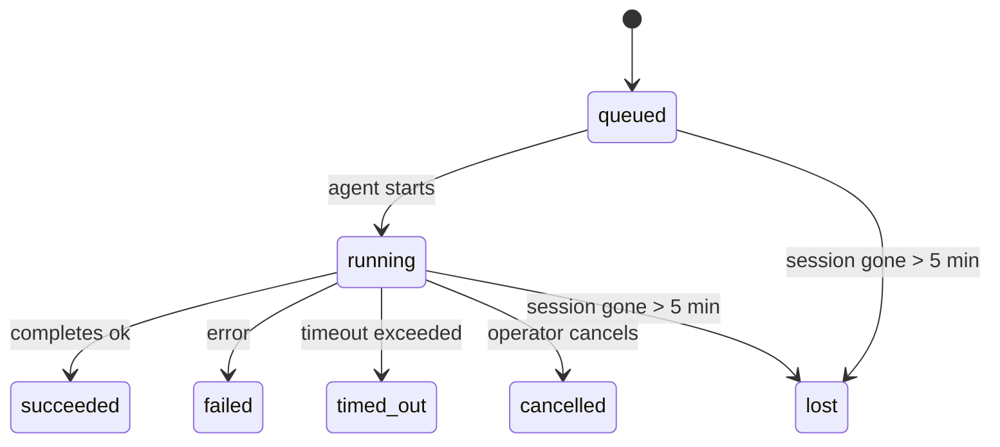

---
read_when:
    - Inspecionando trabalhos em segundo plano em andamento ou concluídos recentemente
    - Depuração de falhas de entrega para execuções de agentes desacopladas
    - Entendendo como as execuções em segundo plano se relacionam com sessões, Cron e Heartbeat
summary: Rastreamento de tarefas em segundo plano para execuções do ACP, subagentes, trabalhos Cron isolados e operações de CLI
title: Tarefas em segundo plano
x-i18n:
    generated_at: "2026-04-24T05:40:42Z"
    model: gpt-5.4
    provider: openai
    source_hash: 10f16268ab5cce8c3dfd26c54d8d913c0ac0f9bfb4856ed1bb28b085ddb78528
    source_path: automation/tasks.md
    workflow: 15
---

> **Está procurando agendamento?** Consulte [Automação e tarefas](/pt-BR/automation) para escolher o mecanismo certo. Esta página aborda o **rastreamento** do trabalho em segundo plano, não o agendamento dele.

As tarefas em segundo plano rastreiam o trabalho que é executado **fora da sua sessão principal de conversa**:
execuções do ACP, inicializações de subagentes, execuções isoladas de trabalhos Cron e operações iniciadas pela CLI.

As tarefas **não** substituem sessões, trabalhos Cron ou heartbeats — elas são o **registro de atividade** que documenta qual trabalho desacoplado aconteceu, quando aconteceu e se foi concluído com sucesso.

<Note>
Nem toda execução de agente cria uma tarefa. Turnos de Heartbeat e chat interativo normal não criam. Todas as execuções de Cron, inicializações do ACP, inicializações de subagentes e comandos de agente da CLI criam.
</Note>

## Resumo rápido

- As tarefas são **registros**, não agendadores — Cron e Heartbeat decidem _quando_ o trabalho é executado, e as tarefas rastreiam _o que aconteceu_.
- ACP, subagentes, todos os trabalhos Cron e operações da CLI criam tarefas. Turnos de Heartbeat não criam.
- Cada tarefa passa por `queued → running → terminal` (succeeded, failed, timed_out, cancelled ou lost).
- As tarefas de Cron permanecem ativas enquanto o runtime do Cron ainda for o responsável pelo trabalho; tarefas da CLI com suporte de chat permanecem ativas somente enquanto o contexto de execução proprietário ainda estiver ativo.
- A conclusão é orientada por envio: o trabalho desacoplado pode notificar diretamente ou despertar a sessão solicitante/heartbeat quando termina, então loops de polling de status geralmente não são a abordagem correta.
- Execuções isoladas de Cron e conclusões de subagentes limpam, em melhor esforço, abas/processos de navegador rastreados para a sessão filha antes da contabilidade final de limpeza.
- A entrega de Cron isolado suprime respostas intermediárias obsoletas do pai enquanto o trabalho descendente de subagentes ainda está sendo drenado, e prefere a saída final descendente quando ela chega antes da entrega.
- As notificações de conclusão são entregues diretamente a um canal ou enfileiradas para o próximo Heartbeat.
- `openclaw tasks list` mostra todas as tarefas; `openclaw tasks audit` destaca problemas.
- Registros terminais são mantidos por 7 dias e depois removidos automaticamente.

## Início rápido

```bash
# Lista todas as tarefas (mais novas primeiro)
openclaw tasks list

# Filtra por runtime ou status
openclaw tasks list --runtime acp
openclaw tasks list --status running

# Mostra detalhes de uma tarefa específica (por ID, ID de execução ou chave de sessão)
openclaw tasks show <lookup>

# Cancela uma tarefa em execução (encerra a sessão filha)
openclaw tasks cancel <lookup>

# Altera a política de notificação de uma tarefa
openclaw tasks notify <lookup> state_changes

# Executa uma auditoria de integridade
openclaw tasks audit

# Visualiza ou aplica manutenção
openclaw tasks maintenance
openclaw tasks maintenance --apply

# Inspeciona o estado do TaskFlow
openclaw tasks flow list
openclaw tasks flow show <lookup>
openclaw tasks flow cancel <lookup>
```

## O que cria uma tarefa

| Origem                 | Tipo de runtime | Quando um registro de tarefa é criado                  | Política de notificação padrão |
| ---------------------- | --------------- | ------------------------------------------------------ | ------------------------------ |
| Execuções em segundo plano do ACP | `acp`           | Ao iniciar uma sessão filha do ACP                     | `done_only`                    |
| Orquestração de subagentes | `subagent`      | Ao iniciar um subagente via `sessions_spawn`           | `done_only`                    |
| Trabalhos Cron (todos os tipos) | `cron`          | Em toda execução de Cron (sessão principal e isolada)  | `silent`                       |
| Operações da CLI       | `cli`           | Comandos `openclaw agent` executados pelo gateway      | `silent`                       |
| Trabalhos de mídia do agente | `cli`           | Execuções `video_generate` com suporte de sessão       | `silent`                       |

As tarefas de Cron da sessão principal usam a política de notificação `silent` por padrão — elas criam registros para rastreamento, mas não geram notificações. Tarefas de Cron isoladas também usam `silent` por padrão, mas são mais visíveis porque são executadas em sua própria sessão.

Execuções `video_generate` com suporte de sessão também usam a política de notificação `silent`. Ainda assim, elas criam registros de tarefa, mas a conclusão é devolvida à sessão original do agente como um acionamento interno para que o agente possa escrever a mensagem de acompanhamento e anexar o vídeo finalizado por conta própria. Se você optar por `tools.media.asyncCompletion.directSend`, conclusões assíncronas de `music_generate` e `video_generate` tentam primeiro a entrega direta ao canal antes de recorrer ao caminho de despertar a sessão solicitante.

Enquanto uma tarefa `video_generate` com suporte de sessão ainda estiver ativa, a ferramenta também atua como proteção: chamadas repetidas de `video_generate` nessa mesma sessão retornam o status da tarefa ativa em vez de iniciar uma segunda geração simultânea. Use `action: "status"` quando quiser uma consulta explícita de progresso/status do lado do agente.

**O que não cria tarefas:**

- Turnos de Heartbeat — sessão principal; consulte [Heartbeat](/pt-BR/gateway/heartbeat)
- Turnos normais de chat interativo
- Respostas diretas de `/command`

## Ciclo de vida da tarefa



| Status      | O que significa                                                           |
| ----------- | ------------------------------------------------------------------------- |
| `queued`    | Criada, aguardando o agente iniciar                                       |
| `running`   | O turno do agente está em execução ativa                                  |
| `succeeded` | Concluída com sucesso                                                     |
| `failed`    | Concluída com erro                                                        |
| `timed_out` | Excedeu o tempo limite configurado                                        |
| `cancelled` | Interrompida pelo operador via `openclaw tasks cancel`                    |
| `lost`      | O runtime perdeu o estado de suporte autoritativo após um período de carência de 5 minutos |

As transições acontecem automaticamente — quando a execução de agente associada termina, o status da tarefa é atualizado para corresponder a isso.

`lost` reconhece o runtime:

- Tarefas do ACP: os metadados da sessão filha do ACP desapareceram.
- Tarefas de subagentes: a sessão filha de suporte desapareceu do armazenamento do agente de destino.
- Tarefas de Cron: o runtime do Cron não rastreia mais o trabalho como ativo.
- Tarefas da CLI: tarefas isoladas de sessão filha usam a sessão filha; tarefas da CLI com suporte de chat usam o contexto de execução ativo, então linhas persistentes de sessão de canal/grupo/direta não as mantêm ativas.

## Entrega e notificações

Quando uma tarefa atinge um estado terminal, o OpenClaw notifica você. Há dois caminhos de entrega:

**Entrega direta** — se a tarefa tiver um destino de canal (o `requesterOrigin`), a mensagem de conclusão vai diretamente para esse canal (Telegram, Discord, Slack etc.). Para conclusões de subagentes, o OpenClaw também preserva o roteamento vinculado de thread/tópico quando disponível e pode preencher `to` / conta ausente a partir da rota armazenada da sessão solicitante (`lastChannel` / `lastTo` / `lastAccountId`) antes de desistir da entrega direta.

**Entrega enfileirada na sessão** — se a entrega direta falhar ou nenhuma origem estiver definida, a atualização é enfileirada como um evento de sistema na sessão do solicitante e aparece no próximo heartbeat.

<Tip>
A conclusão da tarefa aciona um despertar imediato do heartbeat para que você veja o resultado rapidamente — você não precisa esperar o próximo tick agendado do heartbeat.
</Tip>

Isso significa que o fluxo de trabalho usual é baseado em envio: inicie o trabalho desacoplado uma vez e depois deixe o runtime despertar ou notificar você na conclusão. Consulte o estado da tarefa apenas quando precisar de depuração, intervenção ou uma auditoria explícita.

### Políticas de notificação

Controle quanto você recebe de informação sobre cada tarefa:

| Política              | O que é entregue                                                         |
| --------------------- | ------------------------------------------------------------------------ |
| `done_only` (padrão)  | Apenas o estado terminal (succeeded, failed etc.) — **este é o padrão** |
| `state_changes`       | Toda transição de estado e atualização de progresso                      |
| `silent`              | Nada                                                                     |

Altere a política enquanto uma tarefa estiver em execução:

```bash
openclaw tasks notify <lookup> state_changes
```

## Referência da CLI

### `tasks list`

```bash
openclaw tasks list [--runtime <acp|subagent|cron|cli>] [--status <status>] [--json]
```

Colunas de saída: ID da tarefa, tipo, status, entrega, ID de execução, sessão filha, resumo.

### `tasks show`

```bash
openclaw tasks show <lookup>
```

O token de busca aceita um ID de tarefa, ID de execução ou chave de sessão. Mostra o registro completo, incluindo tempo, estado de entrega, erro e resumo terminal.

### `tasks cancel`

```bash
openclaw tasks cancel <lookup>
```

Para tarefas do ACP e de subagentes, isso encerra a sessão filha. Para tarefas rastreadas pela CLI, o cancelamento é registrado no registro de tarefas (não há um identificador de runtime filho separado). O status passa para `cancelled` e uma notificação de entrega é enviada quando aplicável.

### `tasks notify`

```bash
openclaw tasks notify <lookup> <done_only|state_changes|silent>
```

### `tasks audit`

```bash
openclaw tasks audit [--json]
```

Destaca problemas operacionais. As descobertas também aparecem em `openclaw status` quando problemas são detectados.

| Descoberta                | Severidade | Gatilho                                              |
| ------------------------- | ---------- | ---------------------------------------------------- |
| `stale_queued`            | warn       | Em fila por mais de 10 minutos                       |
| `stale_running`           | error      | Em execução por mais de 30 minutos                   |
| `lost`                    | error      | A propriedade da tarefa com suporte de runtime desapareceu |
| `delivery_failed`         | warn       | A entrega falhou e a política de notificação não é `silent` |
| `missing_cleanup`         | warn       | Tarefa terminal sem registro de data/hora de limpeza |
| `inconsistent_timestamps` | warn       | Violação de linha do tempo (por exemplo, terminou antes de começar) |

### `tasks maintenance`

```bash
openclaw tasks maintenance [--json]
openclaw tasks maintenance --apply [--json]
```

Use isto para visualizar ou aplicar reconciliação, marcação de limpeza e remoção para tarefas e estado do fluxo de tarefas.

A reconciliação reconhece o runtime:

- Tarefas do ACP/subagentes verificam sua sessão filha de suporte.
- Tarefas de Cron verificam se o runtime do Cron ainda é o responsável pelo trabalho.
- Tarefas da CLI com suporte de chat verificam o contexto de execução ativo proprietário, não apenas a linha da sessão de chat.

A limpeza de conclusão também reconhece o runtime:

- A conclusão de subagente fecha, em melhor esforço, abas/processos de navegador rastreados para a sessão filha antes que a limpeza anunciada continue.
- A conclusão de Cron isolado fecha, em melhor esforço, abas/processos de navegador rastreados para a sessão de Cron antes que a execução seja totalmente encerrada.
- A entrega de Cron isolado aguarda, quando necessário, o acompanhamento do subagente descendente e suprime texto de confirmação obsoleto do pai em vez de anunciá-lo.
- A entrega da conclusão de subagente prefere o texto visível mais recente do assistente; se estiver vazio, recorre ao texto mais recente e sanitizado de tool/toolResult, e execuções apenas de chamada de ferramenta com timeout podem ser reduzidas a um breve resumo de progresso parcial. Execuções terminais com falha anunciam o status de falha sem reproduzir o texto de resposta capturado.
- Falhas de limpeza não mascaram o resultado real da tarefa.

### `tasks flow list|show|cancel`

```bash
openclaw tasks flow list [--status <status>] [--json]
openclaw tasks flow show <lookup> [--json]
openclaw tasks flow cancel <lookup>
```

Use esses comandos quando o TaskFlow de orquestração for aquilo que interessa a você, em vez de um registro individual de tarefa em segundo plano.

## Quadro de tarefas do chat (`/tasks`)

Use `/tasks` em qualquer sessão de chat para ver tarefas em segundo plano vinculadas a essa sessão. O quadro mostra tarefas ativas e concluídas recentemente com runtime, status, tempo e detalhes de progresso ou erro.

Quando a sessão atual não tem tarefas vinculadas visíveis, `/tasks` recorre às contagens de tarefas locais do agente
para que você ainda tenha uma visão geral sem expor detalhes de outras sessões.

Para o registro completo do operador, use a CLI: `openclaw tasks list`.

## Integração de status (pressão de tarefas)

`openclaw status` inclui um resumo rápido das tarefas:

```
Tasks: 3 queued · 2 running · 1 issues
```

O resumo informa:

- **active** — contagem de `queued` + `running`
- **failures** — contagem de `failed` + `timed_out` + `lost`
- **byRuntime** — detalhamento por `acp`, `subagent`, `cron`, `cli`

Tanto `/status` quanto a ferramenta `session_status` usam um snapshot de tarefas com reconhecimento de limpeza: tarefas ativas têm
prioridade, linhas concluídas obsoletas ficam ocultas, e falhas recentes só aparecem quando não resta trabalho ativo.
Isso mantém o cartão de status focado no que importa agora.

## Armazenamento e manutenção

### Onde as tarefas ficam

Os registros de tarefas persistem no SQLite em:

```
$OPENCLAW_STATE_DIR/tasks/runs.sqlite
```

O registro é carregado na memória na inicialização do gateway e sincroniza gravações com o SQLite para durabilidade entre reinicializações.

### Manutenção automática

Um processo de varredura é executado a cada **60 segundos** e cuida de três coisas:

1. **Reconciliação** — verifica se tarefas ativas ainda têm suporte autoritativo do runtime. Tarefas do ACP/subagentes usam o estado da sessão filha, tarefas de Cron usam a propriedade do trabalho ativo e tarefas da CLI com suporte de chat usam o contexto de execução proprietário. Se esse estado de suporte desaparecer por mais de 5 minutos, a tarefa será marcada como `lost`.
2. **Marcação de limpeza** — define um timestamp `cleanupAfter` em tarefas terminais (`endedAt` + 7 dias).
3. **Remoção** — exclui registros que passaram da data `cleanupAfter`.

**Retenção**: registros de tarefas terminais são mantidos por **7 dias** e depois removidos automaticamente. Nenhuma configuração é necessária.

## Como as tarefas se relacionam com outros sistemas

### Tarefas e Task Flow

[Task Flow](/pt-BR/automation/taskflow) é a camada de orquestração de fluxos acima das tarefas em segundo plano. Um único fluxo pode coordenar várias tarefas ao longo do seu ciclo de vida usando modos de sincronização gerenciados ou espelhados. Use `openclaw tasks` para inspecionar registros individuais de tarefas e `openclaw tasks flow` para inspecionar o fluxo de orquestração.

Consulte [Task Flow](/pt-BR/automation/taskflow) para mais detalhes.

### Tarefas e Cron

Uma **definição** de trabalho Cron fica em `~/.openclaw/cron/jobs.json`; o estado de execução do runtime fica ao lado, em `~/.openclaw/cron/jobs-state.json`. **Toda** execução de Cron cria um registro de tarefa — tanto da sessão principal quanto isolada. Tarefas de Cron da sessão principal usam a política de notificação `silent` por padrão para rastrear sem gerar notificações.

Consulte [Trabalhos Cron](/pt-BR/automation/cron-jobs).

### Tarefas e Heartbeat

Execuções de Heartbeat são turnos da sessão principal — elas não criam registros de tarefa. Quando uma tarefa é concluída, ela pode acionar um despertar do heartbeat para que você veja o resultado rapidamente.

Consulte [Heartbeat](/pt-BR/gateway/heartbeat).

### Tarefas e sessões

Uma tarefa pode referenciar uma `childSessionKey` (onde o trabalho é executado) e uma `requesterSessionKey` (quem a iniciou). Sessões são o contexto da conversa; tarefas são o rastreamento de atividade sobre esse contexto.

### Tarefas e execuções de agentes

O `runId` de uma tarefa se vincula à execução do agente que está realizando o trabalho. Eventos do ciclo de vida do agente (início, término, erro) atualizam automaticamente o status da tarefa — você não precisa gerenciar o ciclo de vida manualmente.

## Relacionado

- [Automação e tarefas](/pt-BR/automation) — todos os mecanismos de automação em um relance
- [Task Flow](/pt-BR/automation/taskflow) — orquestração de fluxos acima das tarefas
- [Tarefas agendadas](/pt-BR/automation/cron-jobs) — agendamento de trabalho em segundo plano
- [Heartbeat](/pt-BR/gateway/heartbeat) — turnos periódicos da sessão principal
- [CLI: Tarefas](/pt-BR/cli/tasks) — referência de comandos da CLI
