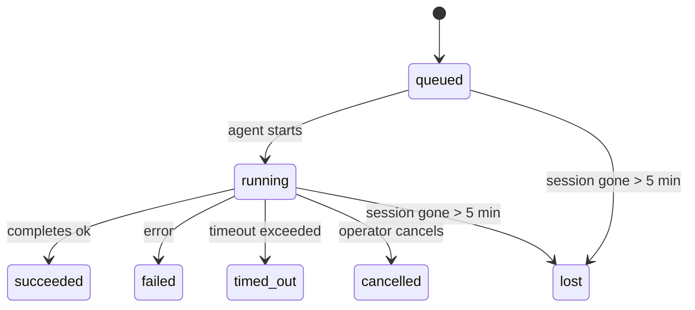

---
read_when:
    - Inspecionando trabalhos em segundo plano em andamento ou concluídos recentemente
    - Depuração de falhas de entrega em execuções de agentes desanexados
    - Entendendo como as execuções em segundo plano se relacionam com sessões, Cron e Heartbeat
sidebarTitle: Background tasks
summary: Rastreamento de tarefas em segundo plano para execuções ACP, subagentes, tarefas Cron isoladas e operações da CLI
title: Tarefas em segundo plano
x-i18n:
    generated_at: "2026-05-10T19:21:00Z"
    model: gpt-5.5
    provider: openai
    source_hash: 5764a89634f90181d826ff3990ec8dac9538239074934d30fd446c1eb4564869
    source_path: automation/tasks.md
    workflow: 16
---

<Note>
Procurando agendamento? Consulte [Automação e tarefas](/pt-BR/automation) para escolher o mecanismo certo. Esta página é o registro de atividades de trabalhos em segundo plano, não o agendador.
</Note>

Tarefas em segundo plano acompanham trabalhos executados **fora da sua sessão de conversa principal**: execuções ACP, criação de subagentes, execuções isoladas de trabalhos cron e operações iniciadas pela CLI.

Tarefas **não** substituem sessões, trabalhos cron nem heartbeats - elas são o **registro de atividades** que registra quais trabalhos destacados aconteceram, quando, e se foram bem-sucedidos.

<Note>
Nem toda execução de agente cria uma tarefa. Turnos de Heartbeat e conversas interativas normais não criam. Todas as execuções cron, criações ACP, criações de subagentes e comandos de agente da CLI criam.
</Note>

## TL;DR

- Tarefas são **registros**, não agendadores - cron e heartbeat decidem _quando_ o trabalho é executado, tarefas acompanham _o que aconteceu_.
- ACP, subagentes, todos os trabalhos cron e operações da CLI criam tarefas. Turnos de Heartbeat não criam.
- Cada tarefa passa por `queued → running → terminal` (succeeded, failed, timed_out, cancelled ou lost).
- Tarefas cron permanecem ativas enquanto o tempo de execução do cron ainda possui o trabalho; se o
  estado do tempo de execução em memória desapareceu, a manutenção de tarefas primeiro verifica o histórico durável de execuções cron
  antes de marcar uma tarefa como lost.
- A conclusão é orientada por envio: trabalhos destacados podem notificar diretamente ou acordar a
  sessão/Heartbeat solicitante quando terminam, então loops de sondagem de status
  geralmente têm o formato errado.
- Execuções cron isoladas e conclusões de subagentes fazem uma limpeza de melhor esforço das abas/processos de navegador rastreados para sua sessão filha antes da escrituração de limpeza final.
- A entrega de cron isolado suprime respostas pai intermediárias obsoletas enquanto o trabalho de subagentes descendentes ainda está escoando, e prefere a saída final do descendente quando ela chega antes da entrega.
- Notificações de conclusão são entregues diretamente a um canal ou enfileiradas para o próximo Heartbeat.
- `openclaw tasks list` mostra todas as tarefas; `openclaw tasks audit` expõe problemas.
- Registros terminais são mantidos por 7 dias e depois removidos automaticamente.

## Início rápido

<Tabs>
  <Tab title="Listar e filtrar">
    ```bash
    # List all tasks (newest first)
    openclaw tasks list

    # Filter by runtime or status
    openclaw tasks list --runtime acp
    openclaw tasks list --status running
    ```

  </Tab>
  <Tab title="Inspecionar">
    ```bash
    # Show details for a specific task (by ID, run ID, or session key)
    openclaw tasks show <lookup>
    ```
  </Tab>
  <Tab title="Cancelar e notificar">
    ```bash
    # Cancel a running task (kills the child session)
    openclaw tasks cancel <lookup>

    # Change notification policy for a task
    openclaw tasks notify <lookup> state_changes
    ```

  </Tab>
  <Tab title="Auditoria e manutenção">
    ```bash
    # Run a health audit
    openclaw tasks audit

    # Preview or apply maintenance
    openclaw tasks maintenance
    openclaw tasks maintenance --apply
    ```

  </Tab>
  <Tab title="Fluxo de tarefas">
    ```bash
    # Inspect TaskFlow state
    openclaw tasks flow list
    openclaw tasks flow show <lookup>
    openclaw tasks flow cancel <lookup>
    ```
  </Tab>
</Tabs>

## O que cria uma tarefa

| Origem                 | Tipo de tempo de execução | Quando um registro de tarefa é criado                  | Política de notificação padrão |
| ---------------------- | ------------ | ------------------------------------------------------ | --------------------- |
| Execuções ACP em segundo plano    | `acp`        | Ao criar uma sessão filha ACP                          | `done_only`           |
| Orquestração de subagentes | `subagent`   | Ao criar um subagente via `sessions_spawn`             | `done_only`           |
| Trabalhos cron (todos os tipos)  | `cron`       | A cada execução cron (sessão principal e isolada)      | `silent`              |
| Operações da CLI         | `cli`        | Comandos `openclaw agent` executados pelo Gateway      | `silent`              |
| Trabalhos de mídia do agente       | `cli`        | Execuções `music_generate`/`video_generate` com suporte de sessão | `silent`              |

<AccordionGroup>
  <Accordion title="Padrões de notificação para cron e mídia">
    Tarefas cron de sessão principal usam a política de notificação `silent` por padrão - elas criam registros para acompanhamento, mas não geram notificações. Tarefas cron isoladas também usam `silent` por padrão, mas são mais visíveis porque são executadas em sua própria sessão.

    Execuções `music_generate` e `video_generate` com suporte de sessão também usam a política de notificação `silent`. Elas ainda criam registros de tarefa, mas a conclusão é devolvida à sessão original do agente como um despertar interno para que o agente possa escrever a mensagem de acompanhamento e anexar a mídia finalizada. Conclusões de grupos/canais seguem a política normal de resposta visível, então o agente usa a ferramenta de mensagem quando a entrega de origem exige isso. Se o agente de conclusão não produzir evidência de entrega pela ferramenta de mensagem em uma rota somente de ferramentas, o OpenClaw envia o fallback de conclusão diretamente ao canal original, em vez de deixar a mídia privada.

  </Accordion>
  <Accordion title="Proteção contra video_generate concorrente">
    Enquanto uma tarefa `video_generate` com suporte de sessão ainda estiver ativa, a ferramenta também atua como proteção: chamadas `video_generate` repetidas nessa mesma sessão retornam o status da tarefa ativa em vez de iniciar uma segunda geração concorrente. Use `action: "status"` quando quiser uma consulta explícita de progresso/status pelo lado do agente.
  </Accordion>
  <Accordion title="O que não cria tarefas">
    - Turnos de Heartbeat - sessão principal; veja [Heartbeat](/pt-BR/gateway/heartbeat)
    - Turnos normais de conversa interativa
    - Respostas diretas a `/command`

  </Accordion>
</AccordionGroup>

## Ciclo de vida da tarefa



| Status      | O que significa                                                           |
| ----------- | -------------------------------------------------------------------------- |
| `queued`    | Criada, aguardando o agente iniciar                                       |
| `running`   | O turno do agente está em execução ativa                                  |
| `succeeded` | Concluída com sucesso                                                     |
| `failed`    | Concluída com um erro                                                     |
| `timed_out` | Excedeu o tempo limite configurado                                        |
| `cancelled` | Interrompida pelo operador via `openclaw tasks cancel`                    |
| `lost`      | O tempo de execução perdeu o estado de suporte autoritativo após um período de carência de 5 minutos |

As transições acontecem automaticamente - quando a execução de agente associada termina, o status da tarefa é atualizado para corresponder.

A conclusão da execução do agente é autoritativa para registros de tarefas ativas. Uma execução destacada bem-sucedida finaliza como `succeeded`, erros comuns de execução finalizam como `failed`, e resultados de timeout ou interrupção finalizam como `timed_out`. Se um operador já cancelou a tarefa, ou o tempo de execução já registrou um estado terminal mais forte, como `failed`, `timed_out` ou `lost`, um sinal de sucesso posterior não rebaixa esse status terminal.

`lost` reconhece o tempo de execução:

- Tarefas ACP: os metadados da sessão filha ACP de suporte desapareceram.
- Tarefas de subagente: a sessão filha de suporte desapareceu do armazenamento do agente de destino.
- Tarefas cron: o tempo de execução do cron não rastreia mais o trabalho como ativo e o histórico durável de execuções
  cron não mostra um resultado terminal para essa execução. A auditoria offline da CLI
  não trata seu próprio estado vazio de tempo de execução cron em processo como autoridade.
- Tarefas da CLI: tarefas com um ID de execução/ID de origem usam o contexto de execução ativo, então
  linhas remanescentes de sessão filha ou sessão de chat não as mantêm vivas depois que a
  execução pertencente ao Gateway desaparece. Tarefas legadas da CLI sem identidade de execução ainda recorrem
  à sessão filha. Execuções `openclaw agent` com suporte do Gateway também finalizam
  a partir de seu resultado de execução, então execuções concluídas não ficam ativas até o varredor
  marcá-las como `lost`.

## Entrega e notificações

Quando uma tarefa alcança um estado terminal, o OpenClaw notifica você. Há dois caminhos de entrega:

**Entrega direta** - se a tarefa tiver um destino de canal (o `requesterOrigin`), a mensagem de conclusão vai direto para esse canal (Telegram, Discord, Slack etc.). Conclusões de tarefas de grupo e canal são encaminhadas pela sessão solicitante para que o agente pai possa escrever a resposta visível. Para conclusões de subagentes, o OpenClaw também preserva o roteamento de thread/tópico vinculado quando disponível e pode preencher um `to` / conta ausente a partir da rota armazenada da sessão solicitante (`lastChannel` / `lastTo` / `lastAccountId`) antes de desistir da entrega direta.

**Entrega enfileirada na sessão** - se a entrega direta falhar ou nenhuma origem estiver definida, a atualização é enfileirada como um evento de sistema na sessão do solicitante e aparece no próximo Heartbeat.

<Tip>
A conclusão da tarefa dispara um despertar imediato do Heartbeat para que você veja o resultado rapidamente - você não precisa esperar o próximo tick agendado do Heartbeat.
</Tip>

Isso significa que o fluxo de trabalho usual é baseado em envio: inicie o trabalho destacado uma vez e deixe o tempo de execução acordar ou notificar você na conclusão. Consulte o estado da tarefa apenas quando precisar de depuração, intervenção ou uma auditoria explícita.

### Políticas de notificação

Controle quanto você ouve sobre cada tarefa:

| Política                | O que é entregue                                                       |
| --------------------- | ----------------------------------------------------------------------- |
| `done_only` (padrão) | Apenas o estado terminal (succeeded, failed etc.) - **este é o padrão** |
| `state_changes`       | Cada transição de estado e atualização de progresso                     |
| `silent`              | Nada                                                                    |

Altere a política enquanto uma tarefa está em execução:

```bash
openclaw tasks notify <lookup> state_changes
```

## Referência da CLI

<AccordionGroup>
  <Accordion title="tasks list">
    ```bash
    openclaw tasks list [--runtime <acp|subagent|cron|cli>] [--status <status>] [--json]
    ```

    Colunas de saída: ID da tarefa, Tipo, Status, Entrega, ID de execução, Sessão filha, Resumo.

  </Accordion>
  <Accordion title="tasks show">
    ```bash
    openclaw tasks show <lookup>
    ```

    O token de consulta aceita um ID de tarefa, ID de execução ou chave de sessão. Mostra o registro completo, incluindo tempo, estado de entrega, erro e resumo terminal.

  </Accordion>
  <Accordion title="tasks cancel">
    ```bash
    openclaw tasks cancel <lookup>
    ```

    Para tarefas ACP e de subagente, isso encerra a sessão filha. Para tarefas rastreadas pela CLI, o cancelamento é registrado no registro de tarefas (não há um handle separado de tempo de execução filho). O status muda para `cancelled` e uma notificação de entrega é enviada quando aplicável.

  </Accordion>
  <Accordion title="tasks notify">
    ```bash
    openclaw tasks notify <lookup> <done_only|state_changes|silent>
    ```
  </Accordion>
  <Accordion title="tasks audit">
    ```bash
    openclaw tasks audit [--json]
    ```

    Expõe problemas operacionais. Descobertas também aparecem em `openclaw status` quando problemas são detectados.

    | Constatação               | Gravidade  | Gatilho                                                                                                                               |
    | ------------------------- | ---------- | ------------------------------------------------------------------------------------------------------------------------------------- |
    | `stale_queued`            | warn       | Na fila por mais de 10 minutos                                                                                                        |
    | `stale_running`           | error      | Em execução por mais de 30 minutos                                                                                                    |
    | `lost`                    | warn/error | A propriedade da tarefa com suporte de runtime desapareceu; tarefas perdidas retidas alertam até `cleanupAfter`, depois viram erros   |
    | `delivery_failed`         | warn       | A entrega falhou e a política de notificação não é `silent`                                                                           |
    | `missing_cleanup`         | warn       | Tarefa terminal sem timestamp de limpeza                                                                                              |
    | `inconsistent_timestamps` | warn       | Violação da linha do tempo (por exemplo, terminou antes de começar)                                                                   |

  </Accordion>
  <Accordion title="tasks maintenance">
    ```bash
    openclaw tasks maintenance [--json]
    openclaw tasks maintenance --apply [--json]
    ```

    Use isso para pré-visualizar ou aplicar reconciliação, marcação de limpeza e remoção para tarefas, estado do Task Flow e linhas obsoletas do registro de sessões de execução de cron.

    A reconciliação é ciente do runtime:

    - Tarefas ACP/subagent verificam sua sessão filha de suporte.
    - Tarefas de subagent cuja sessão filha tem uma lápide de recuperação após reinicialização são marcadas como perdidas, em vez de serem tratadas como sessões de suporte recuperáveis.
    - Tarefas Cron verificam se o runtime do cron ainda é proprietário do job, depois recuperam o status terminal a partir de logs persistidos de execução do cron/estado do job antes de recorrer a `lost`. Somente o processo Gateway é autoritativo para o conjunto ativo de jobs em memória do cron; a auditoria offline da CLI usa o histórico durável, mas não marca uma tarefa de cron como perdida apenas porque esse Set local está vazio.
    - Tarefas CLI com identidade de execução verificam o contexto de execução ativo proprietário, não apenas linhas de sessão filha ou sessão de chat.

    A limpeza de conclusão também é ciente do runtime:

    - A conclusão de subagent tenta, em melhor esforço, fechar abas/processos de navegador rastreados para a sessão filha antes que a limpeza do anúncio continue.
    - A conclusão de cron isolado tenta, em melhor esforço, fechar abas/processos de navegador rastreados para a sessão do cron antes que a execução seja totalmente encerrada.
    - A entrega de cron isolado aguarda o acompanhamento de subagent descendente quando necessário e suprime texto obsoleto de confirmação do pai em vez de anunciá-lo.
    - A entrega de conclusão de subagent prefere o texto visível mais recente do assistente; se ele estiver vazio, recorre ao texto sanitizado mais recente de ferramenta/toolResult, e execuções de chamada de ferramenta que terminam apenas por timeout podem ser condensadas em um resumo curto de progresso parcial. Execuções terminais com falha anunciam o status de falha sem repetir o texto de resposta capturado.
    - Falhas de limpeza não mascaram o resultado real da tarefa.

    Ao aplicar manutenção, o OpenClaw também remove linhas obsoletas do registro de sessões `cron:<jobId>:run:<uuid>` com mais de 7 dias, preservando linhas de jobs de cron atualmente em execução e deixando linhas de sessão não cron intocadas.

  </Accordion>
  <Accordion title="tasks flow list | show | cancel">
    ```bash
    openclaw tasks flow list [--status <status>] [--json]
    openclaw tasks flow show <lookup> [--json]
    openclaw tasks flow cancel <lookup>
    ```

    Use estes comandos quando o Task Flow orquestrador for o que importa para você, em vez de um único registro individual de tarefa em segundo plano.

  </Accordion>
</AccordionGroup>

## Quadro de tarefas do chat (`/tasks`)

Use `/tasks` em qualquer sessão de chat para ver tarefas em segundo plano vinculadas a essa sessão. O quadro mostra tarefas ativas e concluídas recentemente com runtime, status, tempo e detalhes de progresso ou erro.

Quando a sessão atual não tem tarefas vinculadas visíveis, `/tasks` recorre às contagens de tarefas locais do agente para que você ainda tenha uma visão geral sem vazar detalhes de outras sessões.

Para o livro-razão completo do operador, use a CLI: `openclaw tasks list`.

## Integração de status (pressão de tarefas)

`openclaw status` inclui um resumo rápido de tarefas:

```
Tasks: 3 queued · 2 running · 1 issues
```

O resumo informa:

- **active** - contagem de `queued` + `running`
- **failures** - contagem de `failed` + `timed_out` + `lost`
- **byRuntime** - detalhamento por `acp`, `subagent`, `cron`, `cli`

Tanto `/status` quanto a ferramenta `session_status` usam um snapshot de tarefas ciente de limpeza: tarefas ativas são preferidas, linhas concluídas obsoletas são ocultadas, e falhas recentes só aparecem quando não resta nenhum trabalho ativo. Isso mantém o cartão de status focado no que importa agora.

## Armazenamento e manutenção

### Onde as tarefas ficam

Registros de tarefa persistem no SQLite em:

```
$OPENCLAW_STATE_DIR/tasks/runs.sqlite
```

O registro é carregado na memória na inicialização do gateway e sincroniza gravações com o SQLite para durabilidade entre reinicializações.
O Gateway mantém o log de gravação antecipada do SQLite limitado usando o limite padrão de
autocheckpoint do SQLite, além de checkpoints `TRUNCATE` periódicos e no desligamento.

### Manutenção automática

Um varredor executa a cada **60 segundos** e cuida de quatro coisas:

<Steps>
  <Step title="Reconciliation">
    Verifica se tarefas ativas ainda têm suporte autoritativo do runtime. Tarefas ACP/subagent usam o estado da sessão filha, tarefas cron usam a propriedade de job ativo, e tarefas CLI com identidade de execução usam o contexto de execução proprietário. Se esse estado de suporte desaparecer por mais de 5 minutos, a tarefa será marcada como `lost`.
  </Step>
  <Step title="ACP session repair">
    Fecha sessões ACP one-shot terminais ou órfãs pertencentes ao pai, e fecha sessões ACP persistentes terminais obsoletas ou órfãs somente quando não resta nenhum vínculo de conversa ativo.
  </Step>
  <Step title="Cleanup stamping">
    Define um timestamp `cleanupAfter` em tarefas terminais (endedAt + 7 dias). Durante a retenção, tarefas perdidas ainda aparecem na auditoria como avisos; depois que `cleanupAfter` expira ou quando metadados de limpeza estão ausentes, elas são erros.
  </Step>
  <Step title="Pruning">
    Exclui registros após a data `cleanupAfter`.
  </Step>
</Steps>

<Note>
**Retenção:** registros de tarefas terminais são mantidos por **7 dias** e depois removidos automaticamente. Nenhuma configuração é necessária.
</Note>

## Como as tarefas se relacionam a outros sistemas

<AccordionGroup>
  <Accordion title="Tasks and Task Flow">
    [Task Flow](/pt-BR/automation/taskflow) é a camada de orquestração de fluxo acima das tarefas em segundo plano. Um único fluxo pode coordenar várias tarefas ao longo de sua duração usando modos de sincronização gerenciados ou espelhados. Use `openclaw tasks` para inspecionar registros individuais de tarefas e `openclaw tasks flow` para inspecionar o fluxo orquestrador.

    Veja [Task Flow](/pt-BR/automation/taskflow) para detalhes.

  </Accordion>
  <Accordion title="Tasks and cron">
    Uma **definição** de job cron fica em `~/.openclaw/cron/jobs.json`; o estado de execução do runtime fica ao lado dela em `~/.openclaw/cron/jobs-state.json`. **Toda** execução de cron cria um registro de tarefa - tanto de sessão principal quanto isolada. Tarefas cron de sessão principal usam por padrão a política de notificação `silent`, para que rastreiem sem gerar notificações.

    Veja [Jobs Cron](/pt-BR/automation/cron-jobs).

  </Accordion>
  <Accordion title="Tasks and heartbeat">
    Execuções Heartbeat são turnos da sessão principal - elas não criam registros de tarefa. Quando uma tarefa é concluída, ela pode acionar um despertar de heartbeat para que você veja o resultado prontamente.

    Veja [Heartbeat](/pt-BR/gateway/heartbeat).

  </Accordion>
  <Accordion title="Tasks and sessions">
    Uma tarefa pode referenciar uma `childSessionKey` (onde o trabalho é executado) e uma `requesterSessionKey` (quem a iniciou). Sessões são contexto de conversa; tarefas são rastreamento de atividade sobre isso.
  </Accordion>
  <Accordion title="Tasks and agent runs">
    O `runId` de uma tarefa se vincula à execução do agente que realiza o trabalho. Eventos do ciclo de vida do agente (início, fim, erro) atualizam automaticamente o status da tarefa - você não precisa gerenciar o ciclo de vida manualmente.
  </Accordion>
</AccordionGroup>

## Relacionados

- [Automação e Tarefas](/pt-BR/automation) - todos os mecanismos de automação em resumo
- [CLI: Tarefas](/pt-BR/cli/tasks) - referência de comandos CLI
- [Heartbeat](/pt-BR/gateway/heartbeat) - turnos periódicos da sessão principal
- [Tarefas Agendadas](/pt-BR/automation/cron-jobs) - agendamento de trabalho em segundo plano
- [Task Flow](/pt-BR/automation/taskflow) - orquestração de fluxo acima de tarefas
