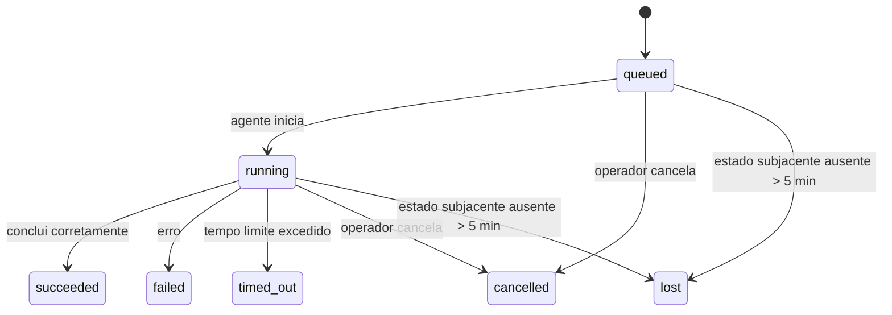

---
read_when:
    - Inspecionando trabalhos em segundo plano em andamento ou concluídos recentemente
    - Depuração de falhas de entrega em execuções de agentes desanexadas
    - Entendendo como as execuções em segundo plano se relacionam com sessões, Cron e Heartbeat
sidebarTitle: Background tasks
summary: Rastreamento de tarefas em segundo plano para execuções ACP, subagentes, execuções Cron e operações da CLI
title: Tarefas em segundo plano
x-i18n:
    generated_at: "2026-07-11T23:43:10Z"
    model: gpt-5.6
    postprocess_version: locale-links-v1
    provider: openai
    source_hash: 0a945e8103c5df5a64785f326a9d0b08784ac32a2ca6fa3d4c399d75fc54be2b
    source_path: automation/tasks.md
    workflow: 16
---

<Note>
Procurando agendamento? Consulte [Automação](/pt-BR/automation) para escolher o mecanismo adequado. Esta página é o registro de atividades do trabalho em segundo plano, não o agendador.
</Note>

As tarefas em segundo plano acompanham o trabalho executado **fora da sua sessão de conversa principal**: execuções de ACP, criações de subagentes, execuções de trabalhos Cron e operações iniciadas pela CLI.

As tarefas **não** substituem sessões, trabalhos Cron nem Heartbeats — elas são o **registro de atividades** que documenta qual trabalho desacoplado ocorreu, quando ocorreu e se foi bem-sucedido.

<Note>
Nem toda execução de agente cria uma tarefa. Turnos de Heartbeat e conversas interativas normais não criam. Todas as execuções de Cron, criações de ACP, criações de subagentes e comandos de agente da CLI despachados pelo Gateway criam.
</Note>

## Resumo

- As tarefas são **registros**, não agendadores — Cron e Heartbeat decidem _quando_ o trabalho é executado; as tarefas acompanham _o que aconteceu_.
- ACP, subagentes, todos os trabalhos Cron e operações da CLI criam tarefas. Turnos de Heartbeat não criam.
- Cada tarefa passa por `queued → running → terminal` (succeeded, failed, timed_out, cancelled ou lost).
- As tarefas de Cron permanecem ativas enquanto o runtime do Cron ainda controla o trabalho; se o estado do runtime em memória tiver desaparecido, a manutenção de tarefas verificará primeiro o histórico durável de execuções do Cron antes de marcar uma tarefa como perdida.
- A conclusão é orientada por envio: o trabalho desacoplado pode notificar diretamente ou despertar a sessão/Heartbeat do solicitante quando terminar, portanto loops de consulta de status geralmente são uma abordagem inadequada.
- Execuções isoladas de Cron e conclusões de subagentes tentam, na medida do possível, limpar as abas/processos do navegador rastreados para suas sessões filhas antes da contabilização final da limpeza.
- A entrega de Cron isolado suprime respostas intermediárias obsoletas do agente pai enquanto o trabalho dos subagentes descendentes ainda está sendo concluído e dá preferência à saída final dos descendentes quando ela chega antes da entrega.
- As notificações de conclusão são entregues diretamente a um canal ou enfileiradas para o próximo Heartbeat.
- `openclaw tasks list` mostra todas as tarefas; `openclaw tasks audit` apresenta problemas.
- Os registros terminais são mantidos por 7 dias (registros `lost` por 24 horas) e depois removidos automaticamente.

## Início rápido

<Tabs>
  <Tab title="Listar e filtrar">
    ```bash
    # Listar todas as tarefas (mais recentes primeiro)
    openclaw tasks list

    # Filtrar por runtime ou status
    openclaw tasks list --runtime acp
    openclaw tasks list --status running
    ```

  </Tab>
  <Tab title="Inspecionar">
    ```bash
    # Mostrar detalhes de uma tarefa específica (por ID da tarefa, ID da execução ou chave da sessão)
    openclaw tasks show <lookup>
    ```
  </Tab>
  <Tab title="Cancelar e notificar">
    ```bash
    # Cancelar uma tarefa em execução (encerra a sessão filha)
    openclaw tasks cancel <lookup>

    # Alterar a política de notificação de uma tarefa
    openclaw tasks notify <lookup> state_changes
    ```

  </Tab>
  <Tab title="Auditoria e manutenção">
    ```bash
    # Executar uma auditoria de integridade
    openclaw tasks audit

    # Visualizar ou aplicar a manutenção
    openclaw tasks maintenance
    openclaw tasks maintenance --apply
    ```

  </Tab>
  <Tab title="Fluxo de tarefas">
    ```bash
    # Inspecionar o estado do TaskFlow
    openclaw tasks flow list
    openclaw tasks flow show <lookup>
    openclaw tasks flow cancel <lookup>
    ```
  </Tab>
</Tabs>

## O que cria uma tarefa

| Origem                  | Tipo de runtime | Quando um registro de tarefa é criado                                   | Política padrão de notificação |
| ----------------------- | --------------- | ----------------------------------------------------------------------- | ------------------------------ |
| Execuções de ACP em segundo plano | `acp`         | Ao criar uma sessão filha de ACP                                        | `done_only`                    |
| Orquestração de subagentes | `subagent`    | Ao criar um subagente por meio de `sessions_spawn`                       | `done_only`                    |
| Trabalhos Cron (todos os tipos) | `cron`     | A cada execução de Cron (na sessão principal e isolada)                  | `silent`                       |
| Operações da CLI        | `cli`           | Comandos `openclaw agent` executados por meio do Gateway                 | `silent`                       |
| Trabalhos de mídia do agente | `cli`      | Execuções de `image_generate`/`music_generate`/`video_generate` vinculadas à sessão | `silent`              |

<AccordionGroup>
  <Accordion title="Padrões de notificação para Cron e mídia">
    As tarefas de Cron (na sessão principal e isoladas) usam a política de notificação `silent` — elas criam registros para acompanhamento, mas não geram notificações de tarefa próprias; o Cron controla seu caminho de entrega.

    As execuções de `image_generate`, `music_generate` e `video_generate` vinculadas à sessão também usam a política de notificação `silent`. Elas ainda criam registros de tarefa, mas a conclusão é devolvida à sessão original do agente como um despertar interno, para que o agente possa escrever a mensagem de acompanhamento e anexar por conta própria a mídia concluída. O agente solicitante segue seu contrato normal de resposta visível: resposta final automática quando configurada ou `message(action="send")` mais `NO_REPLY` quando a sessão exige respostas por meio da ferramenta de mensagens. Se a sessão solicitante não estiver mais ativa ou seu despertar ativo falhar, e o agente de conclusão não incluir parte ou toda a mídia gerada, o OpenClaw enviará, de forma idempotente, uma entrega alternativa direta contendo apenas a mídia ausente para o destino original do canal.

  </Accordion>
  <Accordion title="Proteção contra geração simultânea de mídia">
    Enquanto uma tarefa de geração de mídia vinculada à sessão ainda estiver ativa, `image_generate`, `music_generate` e `video_generate` protegem contra novas tentativas acidentais: repetir a chamada para o mesmo prompt/solicitação retorna o status da tarefa ativa correspondente em vez de iniciar uma duplicata, enquanto um prompt diferente pode iniciar sua própria tarefa. Use `action: "status"` quando quiser uma consulta explícita de progresso/status pelo agente.
  </Accordion>
  <Accordion title="O que não cria tarefas">
    - Turnos de Heartbeat — na sessão principal; consulte [Heartbeat](/pt-BR/gateway/heartbeat)
    - Turnos normais de conversa interativa
    - Respostas diretas a `/command`

  </Accordion>
</AccordionGroup>

## Ciclo de vida da tarefa



| Status      | O que significa                                                               |
| ----------- | ----------------------------------------------------------------------------- |
| `queued`    | Criada e aguardando o agente iniciar                                          |
| `running`   | O turno do agente está sendo executado ativamente                             |
| `succeeded` | Concluída com sucesso                                                         |
| `failed`    | Concluída com um erro                                                         |
| `timed_out` | Excedeu o tempo limite configurado                                            |
| `cancelled` | Interrompida pelo operador por meio de `openclaw tasks cancel` ou a execução foi abortada |
| `lost`      | O runtime perdeu o estado subjacente autoritativo após um período de tolerância de 5 minutos |

As transições ocorrem automaticamente — os eventos do ciclo de vida da execução do agente (início, término e erro) atualizam o status da tarefa; você não precisa gerenciá-lo manualmente.

A conclusão da execução do agente é autoritativa para os registros de tarefas ativas. Uma execução desacoplada bem-sucedida é finalizada como `succeeded`, erros comuns de execução são finalizados como `failed`, tempos limite são finalizados como `timed_out` e resultados de cancelamento/aborto são finalizados como `cancelled`. Depois que uma tarefa se torna terminal, sinais posteriores do ciclo de vida não rebaixam seu estado — uma tarefa cancelada pelo operador ou que já esteja como `failed`/`timed_out`/`lost` permanece assim mesmo que um sinal de sucesso chegue posteriormente.

`lost` considera o runtime:

- Tarefas de ACP: somente um turno de ACP ativo no processo do Gateway comprova que a execução está ativa; apenas os metadados persistidos da sessão não comprovam isso. A auditoria offline da CLI permanece conservadora e nunca recupera tarefas de ACP.
- Tarefas de subagentes: a sessão filha subjacente desapareceu do armazenamento do agente de destino (ou contém uma marca de recuperação após reinicialização).
- Tarefas de Cron: o runtime do Cron deixou de rastrear o trabalho como ativo e o histórico durável de execuções do Cron não mostra um resultado terminal para essa execução. A auditoria offline da CLI não considera autoritativo seu próprio estado vazio do runtime do Cron no processo.
- Tarefas da CLI: tarefas com um ID de execução/ID de origem usam o contexto ativo da execução, portanto registros remanescentes de sessões filhas ou sessões de conversa não as mantêm ativas depois que a execução controlada pelo Gateway desaparece. Tarefas legadas da CLI sem identidade de execução ainda recorrem à sessão filha. As execuções de `openclaw agent` vinculadas ao Gateway também são finalizadas com base no resultado da execução, portanto execuções concluídas não permanecem ativas até que o processo de limpeza as marque como `lost`.

## Entrega e notificações

Quando uma tarefa atinge um estado terminal, o OpenClaw envia uma notificação. Há dois caminhos de entrega:

**Entrega direta** — se a tarefa tiver um destino de canal (o `requesterOrigin`), a mensagem de conclusão irá diretamente para esse canal (Discord, Slack, Telegram etc.). As conclusões de tarefas de grupo e canal são encaminhadas pela sessão solicitante para que o agente pai possa escrever a resposta visível. Para conclusões de subagentes, o OpenClaw também preserva o encaminhamento vinculado de thread/tópico quando disponível e pode preencher um `to`/uma conta ausente usando a rota armazenada da sessão solicitante (`lastChannel`/`lastTo`/`lastAccountId`) antes de desistir da entrega direta.

**Entrega enfileirada na sessão** — se a entrega direta falhar ou nenhuma origem estiver definida, a atualização será enfileirada como um evento do sistema na sessão do solicitante e aparecerá no próximo Heartbeat.

<Tip>
Conclusões de tarefas enfileiradas na sessão acionam imediatamente um despertar de Heartbeat, portanto você vê o resultado rapidamente — não é necessário esperar pelo próximo ciclo agendado do Heartbeat.
</Tip>

Isso significa que o fluxo de trabalho habitual é baseado em envio: inicie o trabalho desacoplado uma vez e deixe o runtime despertar ou notificar você após a conclusão. Consulte o estado da tarefa somente quando precisar depurar, intervir ou realizar uma auditoria explícita.

### Políticas de notificação

Controle quanto você recebe de informação sobre cada tarefa:

| Política              | O que é entregue                                                |
| --------------------- | --------------------------------------------------------------- |
| `done_only` (padrão)  | Somente o estado terminal (succeeded, failed etc.)               |
| `state_changes`       | Toda transição de estado e atualização de progresso              |
| `silent`              | Nada (padrão para tarefas de Cron, CLI e mídia)                  |

Altere a política enquanto uma tarefa estiver em execução:

```bash
openclaw tasks notify <lookup> state_changes
```

## Referência da CLI

<AccordionGroup>
  <Accordion title="tasks list">
    ```bash
    openclaw tasks list [--runtime <acp|subagent|cron|cli>] [--status <status>] [--json]
    ```

    Colunas da saída: Tarefa, Tipo, Status, Entrega, Execução, Sessão filha, Resumo. `openclaw tasks` sem argumentos se comporta como `openclaw tasks list`.

  </Accordion>
  <Accordion title="tasks show">
    ```bash
    openclaw tasks show <lookup> [--json]
    ```

    O token de consulta aceita um ID de tarefa, ID de execução ou chave de sessão. Mostra o registro completo, incluindo tempos, estado da entrega, erro e resumo terminal.

  </Accordion>
  <Accordion title="tasks cancel">
    ```bash
    openclaw tasks cancel <lookup>
    ```

    Para tarefas de ACP e subagentes, isso encerra a sessão filha; cancelamentos de ACP e Cron são encaminhados pelo Gateway em execução (`tasks.cancel`). Para tarefas rastreadas pela CLI, o cancelamento é registrado no registro de tarefas (não há um identificador separado do runtime filho). O status muda para `cancelled` e uma notificação de entrega é enviada quando aplicável.

  </Accordion>
  <Accordion title="tasks notify">
    ```bash
    openclaw tasks notify <lookup> <done_only|state_changes|silent>
    ```
  </Accordion>
  <Accordion title="tasks audit">
    ```bash
    openclaw tasks audit [--severity <warn|error>] [--code <name>] [--limit <n>] [--json]
    ```

    Apresenta problemas operacionais de tarefas **e** TaskFlows em um único relatório. As constatações também aparecem em `openclaw status` quando problemas são detectados.

    Constatações de tarefas:

    | Constatação                | Gravidade  | Gatilho                                                                                                                           |
    | ------------------------- | ---------- | --------------------------------------------------------------------------------------------------------------------------------- |
    | `stale_queued`            | aviso      | Na fila há mais de 10 minutos                                                                                                     |
    | `stale_running`           | erro       | Em execução há mais de 30 minutos                                                                                                 |
    | `lost`                    | aviso/erro | A propriedade da tarefa respaldada pelo runtime desapareceu; tarefas perdidas retidas geram avisos até `cleanupAfter` e depois se tornam erros |
    | `delivery_failed`         | aviso      | A entrega falhou e a política de notificação não é `silent`                                                                       |
    | `missing_cleanup`         | aviso      | Tarefa terminal sem carimbo de data/hora de limpeza                                                                               |
    | `inconsistent_timestamps` | aviso      | Violação da linha do tempo (por exemplo, terminou antes de começar)                                                               |

    Constatações do TaskFlow:

    | Constatação            | Gravidade  | Gatilho                                                                                 |
    | ---------------------- | ---------- | --------------------------------------------------------------------------------------- |
    | `restore_failed`       | erro       | Falha ao restaurar o registro de fluxos do SQLite                                       |
    | `stale_running`        | erro       | O fluxo em execução não avança há mais de 30 minutos                                    |
    | `stale_waiting`        | aviso      | O fluxo em espera não avança há mais de 30 minutos                                      |
    | `stale_blocked`        | aviso      | O fluxo bloqueado não avança há mais de 30 minutos                                      |
    | `cancel_stuck`         | aviso      | Cancelamento solicitado há mais de 5 minutos, sem tarefas filhas ativas, ainda não terminal |
    | `missing_linked_tasks` | aviso/erro | Fluxo gerenciado obsoleto sem tarefas vinculadas nem estado de espera                   |
    | `blocked_task_missing` | aviso      | O fluxo bloqueado aponta para um ID de tarefa que não existe mais                       |

  </Accordion>
  <Accordion title="tasks maintenance">
    ```bash
    openclaw tasks maintenance [--json]
    openclaw tasks maintenance --apply [--json]
    ```

    Use este comando para visualizar ou aplicar a reconciliação, a marcação de limpeza e a remoção de tarefas, do estado do TaskFlow e de linhas obsoletas do registro de sessões de execuções do Cron.

    A reconciliação considera o runtime:

    - Tarefas ACP exigem um turno ativo no processo do Gateway; tarefas de subagentes verificam sua sessão filha subjacente.
    - Tarefas de subagentes cuja sessão filha tenha uma lápide de recuperação após reinicialização são marcadas como perdidas, em vez de serem tratadas como sessões subjacentes recuperáveis.
    - Tarefas do Cron verificam se o runtime do Cron ainda é proprietário do trabalho e, em seguida, recuperam o status terminal dos logs persistidos de execução do Cron ou do estado do trabalho antes de recorrer a `lost`. Somente o processo do Gateway é a fonte autoritativa para o conjunto de trabalhos ativos do Cron mantido em memória; a auditoria da CLI em modo offline usa o histórico persistente, mas não marca uma tarefa do Cron como perdida apenas porque esse conjunto local está vazio.
    - Tarefas da CLI com identidade de execução verificam o contexto ativo proprietário da execução, não apenas linhas de sessões filhas ou de sessões de chat.

    A limpeza após a conclusão também considera o runtime:

    - Na conclusão de um subagente, o sistema tenta fechar, sem garantia, as abas e os processos de navegador monitorados para a sessão filha antes de prosseguir com a limpeza do anúncio.
    - Na conclusão isolada do Cron, o sistema tenta fechar, sem garantia, as abas e os processos de navegador monitorados para a sessão do Cron antes de encerrar completamente a execução.
    - A entrega isolada do Cron aguarda o acompanhamento de subagentes descendentes quando necessário e suprime textos obsoletos de confirmação do processo pai, em vez de anunciá-los.
    - A entrega da conclusão do subagente usa somente o texto visível mais recente do assistente na sessão filha. A saída de ferramenta ou `toolResult` não é promovida a texto de resultado da sessão filha. Execuções terminais com falha anunciam o status da falha sem reproduzir o texto de resposta capturado.
    - Falhas de limpeza não ocultam o resultado real da tarefa.

    Ao aplicar a manutenção, o OpenClaw também remove linhas obsoletas `cron:<jobId>:run:<runId>` do registro de sessões com mais de 7 dias, preservando as linhas de trabalhos do Cron atualmente em execução e mantendo intactas as linhas de sessões que não pertencem ao Cron.

  </Accordion>
  <Accordion title="tasks flow list | show | cancel">
    ```bash
    openclaw tasks flow list [--status <status>] [--json]
    openclaw tasks flow show <lookup> [--json]
    openclaw tasks flow cancel <lookup>
    ```

    O token de consulta do fluxo aceita um ID de fluxo ou uma chave de proprietário. Use estes comandos quando o [Fluxo de tarefas](/pt-BR/automation/taskflow) orquestrador for o elemento relevante, em vez de um registro individual de tarefa em segundo plano.

  </Accordion>
</AccordionGroup>

## Quadro de tarefas do chat (`/tasks`)

Use `/tasks` em qualquer sessão de chat para ver as tarefas em segundo plano vinculadas a essa sessão. O quadro mostra até cinco tarefas ativas e concluídas recentemente, com runtime, status, duração e detalhes do progresso ou do erro.

Quando a sessão atual não tem tarefas vinculadas visíveis, `/tasks` recorre às contagens de tarefas locais do agente, para que você ainda tenha uma visão geral sem expor detalhes de outras sessões.

Para consultar o registro operacional completo, use a CLI: `openclaw tasks list`.

### Interface de controle

A Interface de controle da Web tem uma página **Tarefas** na barra lateral, com tarefas em segundo plano ativas e recentes em tempo real. Use-a para inspecionar o progresso, abrir sessões vinculadas, atualizar o registro ou cancelar tarefas na fila e em execução.

Os painéis de chat também têm uma barra recolhível de **Tarefas em segundo plano**, limitada ao agente do painel: tarefas e subagentes em execução com um controle de interrupção, uma seção de itens concluídos e links para visualizar a transcrição na sessão filha de cada tarefa. Abra-a pelo botão de atividade no cabeçalho do painel (ou pelo botão flutuante de atividade no chat de painel único).

## Integração de status (pressão das tarefas)

`openclaw status` inclui uma linha resumida de tarefas:

```
Tarefas    2 ativas · 1 na fila · 1 em execução · 1 problema · auditoria limpa · 6 monitoradas
```

O resumo contabiliza o trabalho ativo (`queued` + `running`), as falhas (`failed` + `timed_out` + `lost`), as constatações da auditoria e o total de registros monitorados; a carga JSON também detalha as contagens por runtime (`acp`, `subagent`, `cron`, `cli`).

Tanto `/status` quanto a ferramenta `session_status` usam um instantâneo de tarefas que considera a limpeza: tarefas ativas têm preferência, linhas expiradas ficam ocultas e tarefas terminais aparecem apenas durante uma breve janela recente (5 minutos), com destaque para falhas quando não há trabalho ativo restante. Isso mantém o cartão de status concentrado no que importa agora.

## Armazenamento e manutenção

### Onde as tarefas ficam armazenadas

Os registros de tarefas e o estado de entrega persistem no banco de dados de estado SQLite compartilhado do OpenClaw:

```
~/.openclaw/state/openclaw.sqlite   (tables: task_runs, task_delivery_state, flow_runs)
```

Defina `OPENCLAW_STATE_DIR` para mover toda a raiz de estado (por padrão, `~/.openclaw`) para outro local; o caminho do banco de dados compartilhado será movido junto.

O registro é carregado na memória no primeiro uso e persiste cada gravação no SQLite, portanto os registros sobrevivem às reinicializações do Gateway. O crescimento do WAL permanece limitado pelo limiar padrão de autocheckpoint do SQLite e por checkpoints `PASSIVE` periódicos; checkpoints durante o desligamento e a manutenção explícita usam `TRUNCATE`, para que encerramentos normais recuperem o espaço do WAL sem fazer o processo de limpeza em segundo plano aguardar leitores ativos.

Armazenamentos auxiliares legados de instalações mais antigas (`tasks/runs.sqlite`, `flows/registry.sqlite`) são importados para o banco de dados compartilhado por `openclaw doctor`.

### Manutenção automática

Um processo de limpeza é executado a cada **60 segundos** (a primeira execução ocorre cerca de 5 segundos após o início do Gateway) e realiza quatro ações:

<Steps>
  <Step title="Reconciliation">
    Verifica se tarefas ativas ainda têm suporte autoritativo do runtime. Tarefas ACP exigem um turno ativo no processo, tarefas de subagentes usam o estado da sessão filha, tarefas do Cron usam a propriedade do trabalho ativo junto com o histórico persistente de execução e tarefas da CLI com identidade de execução usam o contexto proprietário da execução. Se o estado subjacente desaparecer por mais de 5 minutos (30 minutos para tarefas nativas de subagentes sem filhos), a tarefa será marcada como `lost`.
  </Step>
  <Step title="ACP session repair">
    Fecha sessões ACP terminais ou órfãs, de execução única e pertencentes ao processo pai, e fecha sessões ACP persistentes obsoletas, terminais ou órfãs, somente quando não houver mais nenhum vínculo de conversa ativo.
  </Step>
  <Step title="Cleanup stamping">
    Define um carimbo de data/hora `cleanupAfter` nas tarefas terminais (horário terminal + janela de retenção). Durante a retenção, tarefas perdidas ainda aparecem como avisos na auditoria; após a expiração de `cleanupAfter` ou quando os metadados de limpeza estão ausentes, elas se tornam erros.
  </Step>
  <Step title="Pruning">
    Exclui registros que ultrapassaram sua data `cleanupAfter`.
  </Step>
</Steps>

<Note>
**Retenção:** os registros de tarefas terminais são mantidos por **7 dias** (registros `lost` por **24 horas**) e depois removidos automaticamente. Nenhuma configuração é necessária.
</Note>

## Como as tarefas se relacionam com outros sistemas

<AccordionGroup>
  <Accordion title="Tasks and Task Flow">
    O [Fluxo de tarefas](/pt-BR/automation/taskflow) é a camada de orquestração de fluxos acima das tarefas em segundo plano. Um único fluxo pode coordenar várias tarefas ao longo de seu ciclo de vida usando modos de sincronização gerenciados ou espelhados. Use `openclaw tasks` para inspecionar registros individuais de tarefas e `openclaw tasks flow` para inspecionar o fluxo orquestrador.

  </Accordion>
  <Accordion title="Tasks and cron">
    As definições de trabalhos do Cron, o estado de execução do runtime e o histórico de execuções ficam no banco de dados de estado SQLite compartilhado do OpenClaw. **Toda** execução do Cron cria um registro de tarefa — tanto na sessão principal quanto de forma isolada — com a política de notificação `silent`, para que as execuções do Cron sejam monitoradas sem gerar suas próprias notificações de tarefa.

    Consulte [Trabalhos do Cron](/pt-BR/automation/cron-jobs).

  </Accordion>
  <Accordion title="Tasks and heartbeat">
    Execuções de Heartbeat são turnos da sessão principal — elas não criam registros de tarefas. Quando uma tarefa é concluída, ela pode acionar o despertar de um Heartbeat para que você veja o resultado rapidamente.

    Consulte [Heartbeat](/pt-BR/gateway/heartbeat).

  </Accordion>
  <Accordion title="Tasks and sessions">
    Uma tarefa pode fazer referência a uma `childSessionKey` (onde o trabalho é executado) e a uma `requesterSessionKey` (quem o iniciou). Seu `agentId` identifica o agente que executa o trabalho, enquanto os campos de solicitante e proprietário preservam o contexto de inicialização e controle. Sessões são o contexto da conversa; tarefas são o monitoramento de atividades sobre esse contexto.
  </Accordion>
  <Accordion title="Tasks and agent runs">
    O `runId` de uma tarefa é vinculado à execução do agente que realiza o trabalho. Eventos do ciclo de vida do agente (início, término e erro) atualizam automaticamente o status da tarefa — não é necessário gerenciar o ciclo de vida manualmente.
  </Accordion>
</AccordionGroup>

## Relacionados

- [Automação](/pt-BR/automation) - visão geral de todos os mecanismos de automação
- [CLI: Tarefas](/pt-BR/cli/tasks) - referência de comandos da CLI
- [Heartbeat](/pt-BR/gateway/heartbeat) - turnos periódicos da sessão principal
- [Tarefas agendadas](/pt-BR/automation/cron-jobs) - agendamento de trabalho em segundo plano
- [Fluxo de tarefas](/pt-BR/automation/taskflow) - orquestração de fluxos acima das tarefas
