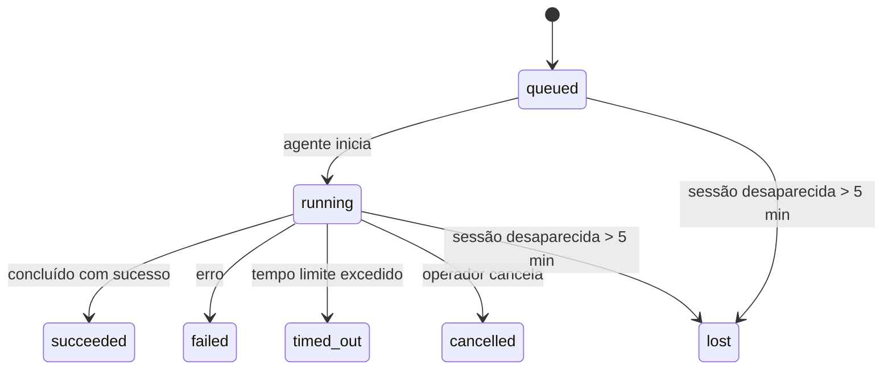

---
read_when:
    - Inspecionando trabalhos em segundo plano em andamento ou concluídos recentemente
    - Depurando falhas de entrega para execuções desanexadas do agente
    - Entendendo como execuções em segundo plano se relacionam com sessões, Cron e Heartbeat
sidebarTitle: Background tasks
summary: Rastreamento de tarefas em segundo plano para execuções do ACP, subagentes, tarefas Cron isoladas e operações da CLI
title: Tarefas em segundo plano
x-i18n:
    generated_at: "2026-04-26T11:23:00Z"
    model: gpt-5.4
    provider: openai
    source_hash: 46952a378babdee9f43102bfa71dbd35b6ca7ecb142ffce3785eeb479e19d6b6
    source_path: automation/tasks.md
    workflow: 15
---

<Note>
Procurando agendamento? Veja [Automação e Tarefas](/pt-BR/automation) para escolher o mecanismo certo. Esta página cobre o **rastreamento** de trabalho em segundo plano, não o agendamento.
</Note>

As tarefas em segundo plano rastreiam trabalhos executados **fora da sua sessão principal de conversa**: execuções do ACP, inicializações de subagentes, execuções isoladas de tarefas Cron e operações iniciadas pela CLI.

As tarefas **não** substituem sessões, tarefas Cron ou Heartbeats — elas são o **registro de atividade** que documenta que trabalho desanexado aconteceu, quando aconteceu e se foi bem-sucedido.

<Note>
Nem toda execução de agente cria uma tarefa. Turnos de Heartbeat e chat interativo normal não criam. Todas as execuções de Cron, inicializações de ACP, inicializações de subagentes e comandos de agente da CLI criam.
</Note>

## Resumo rápido

- As tarefas são **registros**, não agendadores — Cron e Heartbeat decidem _quando_ o trabalho é executado, as tarefas rastreiam _o que aconteceu_.
- ACP, subagentes, todas as tarefas Cron e operações da CLI criam tarefas. Turnos de Heartbeat não criam.
- Cada tarefa passa por `queued → running → terminal` (succeeded, failed, timed_out, cancelled ou lost).
- As tarefas Cron permanecem ativas enquanto o runtime do Cron ainda controla a tarefa; se o estado de runtime em memória desaparecer, a manutenção da tarefa primeiro verifica o histórico durável de execuções do Cron antes de marcar uma tarefa como lost.
- A conclusão é orientada por envio: o trabalho desanexado pode notificar diretamente ou despertar a sessão/Heartbeat solicitante quando termina, então loops de polling de status normalmente não são a abordagem certa.
- Execuções isoladas de Cron e conclusões de subagentes limpam, na medida do possível, abas/processos do navegador rastreados para a sessão filha antes da limpeza final do registro.
- A entrega isolada de Cron suprime respostas intermediárias obsoletas do pai enquanto o trabalho de subagentes descendentes ainda está sendo escoado, e prefere a saída final do descendente quando ela chega antes da entrega.
- As notificações de conclusão são entregues diretamente a um canal ou enfileiradas para o próximo Heartbeat.
- `openclaw tasks list` mostra todas as tarefas; `openclaw tasks audit` exibe problemas.
- Registros terminais são mantidos por 7 dias e depois removidos automaticamente.

## Início rápido

<Tabs>
  <Tab title="Listar e filtrar">
    ```bash
    # Lista todas as tarefas (mais recentes primeiro)
    openclaw tasks list

    # Filtra por runtime ou status
    openclaw tasks list --runtime acp
    openclaw tasks list --status running
    ```

  </Tab>
  <Tab title="Inspecionar">
    ```bash
    # Mostra detalhes de uma tarefa específica (por ID, ID de execução ou chave de sessão)
    openclaw tasks show <lookup>
    ```
  </Tab>
  <Tab title="Cancelar e notificar">
    ```bash
    # Cancela uma tarefa em execução (encerra a sessão filha)
    openclaw tasks cancel <lookup>

    # Altera a política de notificação de uma tarefa
    openclaw tasks notify <lookup> state_changes
    ```

  </Tab>
  <Tab title="Auditoria e manutenção">
    ```bash
    # Executa uma auditoria de integridade
    openclaw tasks audit

    # Visualiza ou aplica a manutenção
    openclaw tasks maintenance
    openclaw tasks maintenance --apply
    ```

  </Tab>
  <Tab title="Fluxo de tarefas">
    ```bash
    # Inspeciona o estado do TaskFlow
    openclaw tasks flow list
    openclaw tasks flow show <lookup>
    openclaw tasks flow cancel <lookup>
    ```
  </Tab>
</Tabs>

## O que cria uma tarefa

| Origem                 | Tipo de runtime | Quando um registro de tarefa é criado                  | Política de notificação padrão |
| ---------------------- | --------------- | ------------------------------------------------------ | ------------------------------ |
| Execuções em segundo plano do ACP | `acp`        | Ao iniciar uma sessão filha do ACP                     | `done_only`                    |
| Orquestração de subagentes | `subagent`   | Ao iniciar um subagente via `sessions_spawn`           | `done_only`                    |
| Tarefas Cron (todos os tipos)  | `cron`       | A cada execução de Cron (sessão principal e isolada)   | `silent`                       |
| Operações da CLI         | `cli`        | Comandos `openclaw agent` que passam pelo Gateway      | `silent`                       |
| Tarefas de mídia do agente       | `cli`        | Execuções de `video_generate` com suporte de sessão    | `silent`                       |

<AccordionGroup>
  <Accordion title="Padrões de notificação para Cron e mídia">
    Tarefas Cron da sessão principal usam a política de notificação `silent` por padrão — elas criam registros para rastreamento, mas não geram notificações. Tarefas Cron isoladas também usam `silent` por padrão, mas são mais visíveis porque são executadas em sua própria sessão.

    Execuções de `video_generate` com suporte de sessão também usam a política de notificação `silent`. Ainda assim, elas criam registros de tarefa, mas a conclusão é devolvida à sessão original do agente como um despertar interno para que o agente possa escrever a mensagem de acompanhamento e anexar o vídeo finalizado por conta própria. Se você optar por `tools.media.asyncCompletion.directSend`, conclusões assíncronas de `music_generate` e `video_generate` tentam primeiro a entrega direta ao canal antes de recorrer ao caminho de despertar da sessão solicitante.

  </Accordion>
  <Accordion title="Proteção contra concorrência de video_generate">
    Enquanto uma tarefa de `video_generate` com suporte de sessão ainda estiver ativa, a ferramenta também atua como uma proteção: chamadas repetidas de `video_generate` nessa mesma sessão retornam o status da tarefa ativa em vez de iniciar uma segunda geração simultânea. Use `action: "status"` quando quiser uma consulta explícita de progresso/status do lado do agente.
  </Accordion>
  <Accordion title="O que não cria tarefas">
    - Turnos de Heartbeat — sessão principal; veja [Heartbeat](/pt-BR/gateway/heartbeat)
    - Turnos normais de chat interativo
    - Respostas diretas de `/command`

  </Accordion>
</AccordionGroup>

## Ciclo de vida da tarefa



| Status      | O que significa                                                            |
| ----------- | -------------------------------------------------------------------------- |
| `queued`    | Criada, aguardando o agente iniciar                                        |
| `running`   | O turno do agente está sendo executado ativamente                          |
| `succeeded` | Concluída com sucesso                                                      |
| `failed`    | Concluída com erro                                                         |
| `timed_out` | Excedeu o tempo limite configurado                                         |
| `cancelled` | Interrompida pelo operador via `openclaw tasks cancel`                     |
| `lost`      | O runtime perdeu o estado de suporte autoritativo após um período de tolerância de 5 minutos |

As transições acontecem automaticamente — quando a execução de agente associada termina, o status da tarefa é atualizado para corresponder.

A conclusão da execução do agente é autoritativa para registros de tarefas ativas. Uma execução desanexada bem-sucedida é finalizada como `succeeded`, erros comuns de execução são finalizados como `failed`, e resultados de timeout ou aborto são finalizados como `timed_out`. Se um operador já tiver cancelado a tarefa, ou se o runtime já tiver registrado um estado terminal mais forte, como `failed`, `timed_out` ou `lost`, um sinal posterior de sucesso não rebaixa esse status terminal.

`lost` reconhece o runtime:

- Tarefas ACP: os metadados da sessão filha do ACP desapareceram.
- Tarefas de subagente: a sessão filha de suporte desapareceu do armazenamento do agente de destino.
- Tarefas Cron: o runtime do Cron não rastreia mais a tarefa como ativa e o histórico durável de execuções do Cron não mostra um resultado terminal para essa execução. A auditoria offline da CLI não trata seu próprio estado vazio de runtime de Cron em processo como autoridade.
- Tarefas da CLI: tarefas de sessão filha isolada usam a sessão filha; tarefas da CLI com suporte de chat usam o contexto de execução ativo em vez disso, então linhas persistentes de sessão de canal/grupo/direta não as mantêm ativas. Execuções de `openclaw agent` com suporte do Gateway também são finalizadas a partir do resultado da execução, então execuções concluídas não ficam ativas até que o limpador as marque como `lost`.

## Entrega e notificações

Quando uma tarefa chega a um estado terminal, o OpenClaw notifica você. Há dois caminhos de entrega:

**Entrega direta** — se a tarefa tiver um destino de canal (o `requesterOrigin`), a mensagem de conclusão vai diretamente para esse canal (Telegram, Discord, Slack etc.). Para conclusões de subagentes, o OpenClaw também preserva o roteamento vinculado de thread/tópico quando disponível e pode preencher um `to` / conta ausente a partir da rota armazenada da sessão solicitante (`lastChannel` / `lastTo` / `lastAccountId`) antes de desistir da entrega direta.

**Entrega enfileirada na sessão** — se a entrega direta falhar ou nenhuma origem estiver definida, a atualização é enfileirada como um evento de sistema na sessão do solicitante e aparece no próximo Heartbeat.

<Tip>
A conclusão da tarefa dispara um despertar imediato do Heartbeat para que você veja o resultado rapidamente — você não precisa esperar o próximo tick agendado do Heartbeat.
</Tip>

Isso significa que o fluxo de trabalho usual é baseado em envio: inicie o trabalho desanexado uma vez e depois deixe o runtime despertar ou notificar você ao concluir. Faça polling do estado da tarefa apenas quando precisar de depuração, intervenção ou uma auditoria explícita.

### Políticas de notificação

Controle quanto você recebe de cada tarefa:

| Política                | O que é entregue                                                         |
| ----------------------- | ------------------------------------------------------------------------ |
| `done_only` (padrão)    | Apenas o estado terminal (succeeded, failed etc.) — **este é o padrão** |
| `state_changes`         | Toda transição de estado e atualização de progresso                      |
| `silent`                | Nada                                                                     |

Altere a política enquanto uma tarefa estiver em execução:

```bash
openclaw tasks notify <lookup> state_changes
```

## Referência da CLI

<AccordionGroup>
  <Accordion title="tasks list">
    ```bash
    openclaw tasks list [--runtime <acp|subagent|cron|cli>] [--status <status>] [--json]
    ```

    Colunas de saída: ID da tarefa, Tipo, Status, Entrega, ID da execução, Sessão filha, Resumo.

  </Accordion>
  <Accordion title="tasks show">
    ```bash
    openclaw tasks show <lookup>
    ```

    O token de busca aceita um ID de tarefa, ID de execução ou chave de sessão. Mostra o registro completo, incluindo tempo, estado de entrega, erro e resumo terminal.

  </Accordion>
  <Accordion title="tasks cancel">
    ```bash
    openclaw tasks cancel <lookup>
    ```

    Para tarefas ACP e de subagente, isso encerra a sessão filha. Para tarefas rastreadas pela CLI, o cancelamento é registrado no registro de tarefas (não há um identificador separado de runtime filho). O status muda para `cancelled` e uma notificação de entrega é enviada quando aplicável.

  </Accordion>
  <Accordion title="tasks notify">
    ```bash
    openclaw tasks notify <lookup> <done_only|state_changes|silent>
    ```
  </Accordion>
  <Accordion title="tasks audit">
    ```bash
    openclaw tasks audit [--json]
    ```

    Exibe problemas operacionais. Descobertas também aparecem em `openclaw status` quando problemas são detectados.

    | Descoberta               | Severidade | Gatilho                                                                                                      |
    | ------------------------ | ---------- | ------------------------------------------------------------------------------------------------------------ |
    | `stale_queued`           | warn       | Em fila por mais de 10 minutos                                                                               |
    | `stale_running`          | error      | Em execução por mais de 30 minutos                                                                           |
    | `lost`                   | warn/error | A propriedade da tarefa com suporte de runtime desapareceu; tarefas lost retidas emitem aviso até `cleanupAfter`, depois se tornam erros |
    | `delivery_failed`        | warn       | A entrega falhou e a política de notificação não é `silent`                                                  |
    | `missing_cleanup`        | warn       | Tarefa terminal sem carimbo de data/hora de limpeza                                                          |
    | `inconsistent_timestamps`| warn       | Violação da linha do tempo (por exemplo, terminou antes de iniciar)                                          |

  </Accordion>
  <Accordion title="tasks maintenance">
    ```bash
    openclaw tasks maintenance [--json]
    openclaw tasks maintenance --apply [--json]
    ```

    Use isto para visualizar ou aplicar reconciliação, registro de limpeza e remoção para tarefas e estado do TaskFlow.

    A reconciliação reconhece o runtime:

    - Tarefas ACP/subagent verificam sua sessão filha de suporte.
    - Tarefas Cron verificam se o runtime do Cron ainda controla a tarefa, depois recuperam o status terminal a partir de logs persistidos de execução do Cron/estado da tarefa antes de recorrer a `lost`. Apenas o processo Gateway é autoritativo para o conjunto em memória de tarefas ativas do Cron; a auditoria offline da CLI usa o histórico durável, mas não marca uma tarefa Cron como lost apenas porque esse Set local está vazio.
    - Tarefas da CLI com suporte de chat verificam o contexto ativo de execução proprietário, não apenas a linha da sessão de chat.

    A limpeza após a conclusão também reconhece o runtime:

    - A conclusão de subagente fecha, na medida do possível, abas/processos do navegador rastreados para a sessão filha antes que a limpeza do anúncio continue.
    - A conclusão de Cron isolado fecha, na medida do possível, abas/processos do navegador rastreados para a sessão do Cron antes que a execução seja totalmente encerrada.
    - A entrega de Cron isolado espera o acompanhamento de subagente descendente quando necessário e suprime texto obsoleto de confirmação do pai em vez de anunciá-lo.
    - A entrega de conclusão de subagente prefere o texto visível mais recente do assistente; se ele estiver vazio, recorre ao texto mais recente e sanitizado de tool/toolResult, e execuções apenas de chamada de ferramenta com timeout podem ser condensadas em um breve resumo de progresso parcial. Execuções terminais com falha anunciam o status de falha sem reproduzir o texto de resposta capturado.
    - Falhas de limpeza não ocultam o resultado real da tarefa.

  </Accordion>
  <Accordion title="tasks flow list | show | cancel">
    ```bash
    openclaw tasks flow list [--status <status>] [--json]
    openclaw tasks flow show <lookup> [--json]
    openclaw tasks flow cancel <lookup>
    ```

    Use estes comandos quando o TaskFlow de orquestração for o que importa para você, e não um registro individual de tarefa em segundo plano.

  </Accordion>
</AccordionGroup>

## Painel de tarefas do chat (`/tasks`)

Use `/tasks` em qualquer sessão de chat para ver tarefas em segundo plano vinculadas àquela sessão. O painel mostra tarefas ativas e concluídas recentemente com runtime, status, tempo e detalhes de progresso ou erro.

Quando a sessão atual não tem tarefas vinculadas visíveis, `/tasks` recorre a contagens locais do agente para que você ainda tenha uma visão geral sem expor detalhes de outras sessões.

Para o registro completo do operador, use a CLI: `openclaw tasks list`.

## Integração com status (pressão de tarefas)

`openclaw status` inclui um resumo rápido de tarefas:

```
Tasks: 3 queued · 2 running · 1 issues
```

O resumo informa:

- **active** — contagem de `queued` + `running`
- **failures** — contagem de `failed` + `timed_out` + `lost`
- **byRuntime** — detalhamento por `acp`, `subagent`, `cron`, `cli`

Tanto `/status` quanto a ferramenta `session_status` usam um instantâneo de tarefas com reconhecimento de limpeza: tarefas ativas têm prioridade, linhas concluídas obsoletas ficam ocultas, e falhas recentes só aparecem quando não resta trabalho ativo. Isso mantém o cartão de status focado no que importa agora.

## Armazenamento e manutenção

### Onde as tarefas ficam

Os registros de tarefas persistem em SQLite em:

```
$OPENCLAW_STATE_DIR/tasks/runs.sqlite
```

O registro é carregado na memória na inicialização do Gateway e sincroniza gravações com o SQLite para durabilidade entre reinicializações.

### Manutenção automática

Um processo de varredura é executado a cada **60 segundos** e lida com três coisas:

<Steps>
  <Step title="Reconciliação">
    Verifica se tarefas ativas ainda têm suporte autoritativo de runtime. Tarefas ACP/subagent usam o estado da sessão filha, tarefas Cron usam a propriedade da tarefa ativa, e tarefas da CLI com suporte de chat usam o contexto de execução proprietário. Se esse estado de suporte desaparecer por mais de 5 minutos, a tarefa é marcada como `lost`.
  </Step>
  <Step title="Registro de limpeza">
    Define um carimbo de data/hora `cleanupAfter` em tarefas terminais (`endedAt + 7 days`). Durante a retenção, tarefas lost ainda aparecem na auditoria como avisos; depois que `cleanupAfter` expira ou quando faltam metadados de limpeza, tornam-se erros.
  </Step>
  <Step title="Remoção">
    Exclui registros após sua data `cleanupAfter`.
  </Step>
</Steps>

<Note>
**Retenção:** registros de tarefas terminais são mantidos por **7 dias** e depois removidos automaticamente. Nenhuma configuração é necessária.
</Note>

## Como as tarefas se relacionam com outros sistemas

<AccordionGroup>
  <Accordion title="Tarefas e TaskFlow">
    [TaskFlow](/pt-BR/automation/taskflow) é a camada de orquestração de fluxos acima das tarefas em segundo plano. Um único fluxo pode coordenar várias tarefas ao longo de sua vida útil usando modos de sincronização gerenciados ou espelhados. Use `openclaw tasks` para inspecionar registros individuais de tarefas e `openclaw tasks flow` para inspecionar o fluxo de orquestração.

    Veja [TaskFlow](/pt-BR/automation/taskflow) para detalhes.

  </Accordion>
  <Accordion title="Tarefas e Cron">
    Uma **definição** de tarefa Cron fica em `~/.openclaw/cron/jobs.json`; o estado de execução do runtime fica ao lado dela em `~/.openclaw/cron/jobs-state.json`. **Toda** execução de Cron cria um registro de tarefa — tanto na sessão principal quanto isolada. Tarefas Cron da sessão principal usam a política de notificação `silent` por padrão, para rastrear sem gerar notificações.

    Veja [Tarefas Cron](/pt-BR/automation/cron-jobs).

  </Accordion>
  <Accordion title="Tarefas e Heartbeat">
    Execuções de Heartbeat são turnos da sessão principal — elas não criam registros de tarefa. Quando uma tarefa é concluída, ela pode disparar um despertar do Heartbeat para que você veja o resultado prontamente.

    Veja [Heartbeat](/pt-BR/gateway/heartbeat).

  </Accordion>
  <Accordion title="Tarefas e sessões">
    Uma tarefa pode referenciar uma `childSessionKey` (onde o trabalho é executado) e uma `requesterSessionKey` (quem a iniciou). Sessões são o contexto da conversa; tarefas são o rastreamento de atividade sobre esse contexto.
  </Accordion>
  <Accordion title="Tarefas e execuções de agente">
    O `runId` de uma tarefa se vincula à execução de agente que está fazendo o trabalho. Eventos do ciclo de vida do agente (início, término, erro) atualizam automaticamente o status da tarefa — você não precisa gerenciar o ciclo de vida manualmente.
  </Accordion>
</AccordionGroup>

## Relacionado

- [Automação e Tarefas](/pt-BR/automation) — todos os mecanismos de automação em um relance
- [CLI: Tarefas](/pt-BR/cli/tasks) — referência de comandos da CLI
- [Heartbeat](/pt-BR/gateway/heartbeat) — turnos periódicos da sessão principal
- [Tarefas agendadas](/pt-BR/automation/cron-jobs) — agendamento de trabalho em segundo plano
- [TaskFlow](/pt-BR/automation/taskflow) — orquestração de fluxos acima das tarefas
