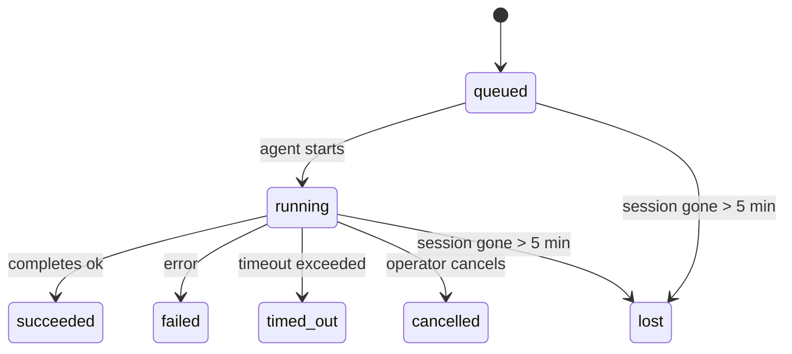

---
read_when:
    - Inspecionando trabalhos em segundo plano em andamento ou concluídos recentemente
    - Depuração de falhas de entrega em execuções desacopladas de agentes
    - Entendendo como as execuções em segundo plano se relacionam a sessões, Cron e Heartbeat
sidebarTitle: Background tasks
summary: Rastreamento de tarefas em segundo plano para execuções do ACP, subagentes, trabalhos Cron isolados e operações da CLI
title: Tarefas em segundo plano
x-i18n:
    generated_at: "2026-04-30T09:35:15Z"
    model: gpt-5.5
    provider: openai
    source_hash: 4bbf74f3aeea532738b56b83cd2e1a0a3734bfd453da6636b8be985a28ccc027
    source_path: automation/tasks.md
    workflow: 16
---

<Note>
Procurando agendamento? Consulte [Automação e tarefas](/pt-BR/automation) para escolher o mecanismo certo. Esta página é o registro de atividades do trabalho em segundo plano, não o agendador.
</Note>

Tarefas em segundo plano acompanham trabalhos que rodam **fora da sua sessão principal de conversa**: execuções ACP, criações de subagentes, execuções isoladas de trabalhos Cron e operações iniciadas pela CLI.

Tarefas **não** substituem sessões, trabalhos Cron nem Heartbeats — elas são o **registro de atividades** que registra qual trabalho desacoplado aconteceu, quando e se foi bem-sucedido.

<Note>
Nem toda execução de agente cria uma tarefa. Turnos de Heartbeat e chat interativo normal não criam. Todas as execuções Cron, criações ACP, criações de subagentes e comandos de agente da CLI criam.
</Note>

## TL;DR

- Tarefas são **registros**, não agendadores — Cron e Heartbeat decidem _quando_ o trabalho roda; tarefas acompanham _o que aconteceu_.
- ACP, subagentes, todos os trabalhos Cron e operações da CLI criam tarefas. Turnos de Heartbeat não criam.
- Cada tarefa passa por `queued → running → terminal` (succeeded, failed, timed_out, cancelled ou lost).
- Tarefas Cron permanecem ativas enquanto o runtime do Cron ainda é dono do trabalho; se o
  estado em memória do runtime desaparecer, a manutenção de tarefas primeiro verifica o histórico durável de execuções Cron
  antes de marcar uma tarefa como perdida.
- A conclusão é orientada por push: trabalhos desacoplados podem notificar diretamente ou acordar a
  sessão solicitante/Heartbeat quando terminam, portanto loops de polling de status
  geralmente têm o formato errado.
- Execuções Cron isoladas e conclusões de subagentes tentam limpar, em melhor esforço, abas/processos de navegador rastreados da sessão filha antes da escrituração final de limpeza.
- A entrega de Cron isolado suprime respostas intermediárias obsoletas do pai enquanto trabalho descendente de subagentes ainda está drenando, e prefere a saída final do descendente quando ela chega antes da entrega.
- Notificações de conclusão são entregues diretamente a um canal ou enfileiradas para o próximo Heartbeat.
- `openclaw tasks list` mostra todas as tarefas; `openclaw tasks audit` expõe problemas.
- Registros terminais são mantidos por 7 dias e depois removidos automaticamente.

## Início rápido

<Tabs>
  <Tab title="List and filter">
    ```bash
    # List all tasks (newest first)
    openclaw tasks list

    # Filter by runtime or status
    openclaw tasks list --runtime acp
    openclaw tasks list --status running
    ```

  </Tab>
  <Tab title="Inspect">
    ```bash
    # Show details for a specific task (by ID, run ID, or session key)
    openclaw tasks show <lookup>
    ```
  </Tab>
  <Tab title="Cancel and notify">
    ```bash
    # Cancel a running task (kills the child session)
    openclaw tasks cancel <lookup>

    # Change notification policy for a task
    openclaw tasks notify <lookup> state_changes
    ```

  </Tab>
  <Tab title="Audit and maintenance">
    ```bash
    # Run a health audit
    openclaw tasks audit

    # Preview or apply maintenance
    openclaw tasks maintenance
    openclaw tasks maintenance --apply
    ```

  </Tab>
  <Tab title="Task flow">
    ```bash
    # Inspect TaskFlow state
    openclaw tasks flow list
    openclaw tasks flow show <lookup>
    openclaw tasks flow cancel <lookup>
    ```
  </Tab>
</Tabs>

## O que cria uma tarefa

| Origem                 | Tipo de runtime | Quando um registro de tarefa é criado                  | Política de notificação padrão |
| ---------------------- | ------------ | ------------------------------------------------------ | --------------------- |
| Execuções em segundo plano ACP | `acp`        | Ao criar uma sessão ACP filha                          | `done_only`           |
| Orquestração de subagentes | `subagent`   | Ao criar um subagente via `sessions_spawn`             | `done_only`           |
| Trabalhos Cron (todos os tipos) | `cron`       | A cada execução Cron (sessão principal e isolada)      | `silent`              |
| Operações da CLI       | `cli`        | Comandos `openclaw agent` que rodam pelo Gateway       | `silent`              |
| Trabalhos de mídia do agente | `cli`        | Execuções `video_generate` apoiadas por sessão         | `silent`              |

<AccordionGroup>
  <Accordion title="Notify defaults for cron and media">
    Tarefas Cron da sessão principal usam a política de notificação `silent` por padrão — elas criam registros para acompanhamento, mas não geram notificações. Tarefas Cron isoladas também usam `silent` por padrão, mas são mais visíveis porque rodam em sua própria sessão.

    Execuções `video_generate` apoiadas por sessão também usam a política de notificação `silent`. Elas ainda criam registros de tarefa, mas a conclusão é devolvida à sessão original do agente como uma ativação interna, para que o agente possa escrever a mensagem de acompanhamento e anexar o vídeo finalizado por conta própria. Se você optar por `tools.media.asyncCompletion.directSend`, conclusões assíncronas de `music_generate` e `video_generate` tentam primeiro a entrega direta ao canal antes de recorrer ao caminho de ativação da sessão solicitante.

  </Accordion>
  <Accordion title="Concurrent video_generate guardrail">
    Enquanto uma tarefa `video_generate` apoiada por sessão ainda estiver ativa, a ferramenta também atua como uma proteção: chamadas repetidas de `video_generate` nessa mesma sessão retornam o status da tarefa ativa em vez de iniciar uma segunda geração concorrente. Use `action: "status"` quando quiser uma consulta explícita de progresso/status pelo lado do agente.
  </Accordion>
  <Accordion title="What does not create tasks">
    - Turnos de Heartbeat — sessão principal; consulte [Heartbeat](/pt-BR/gateway/heartbeat)
    - Turnos normais de chat interativo
    - Respostas diretas de `/command`

  </Accordion>
</AccordionGroup>

## Ciclo de vida da tarefa



| Status      | O que significa                                                           |
| ----------- | -------------------------------------------------------------------------- |
| `queued`    | Criada, aguardando o agente iniciar                                       |
| `running`   | O turno do agente está em execução ativa                                  |
| `succeeded` | Concluída com sucesso                                                     |
| `failed`    | Concluída com erro                                                        |
| `timed_out` | Excedeu o tempo limite configurado                                        |
| `cancelled` | Interrompida pelo operador via `openclaw tasks cancel`                    |
| `lost`      | O runtime perdeu o estado de apoio autoritativo após um período de tolerância de 5 minutos |

Transições acontecem automaticamente — quando a execução do agente associada termina, o status da tarefa é atualizado para corresponder.

A conclusão da execução do agente é autoritativa para registros de tarefas ativos. Uma execução desacoplada bem-sucedida finaliza como `succeeded`, erros comuns de execução finalizam como `failed`, e resultados de timeout ou abortamento finalizam como `timed_out`. Se um operador já cancelou a tarefa, ou o runtime já registrou um estado terminal mais forte, como `failed`, `timed_out` ou `lost`, um sinal de sucesso posterior não rebaixa esse status terminal.

`lost` leva em conta o runtime:

- Tarefas ACP: metadados da sessão ACP filha de apoio desapareceram.
- Tarefas de subagentes: a sessão filha de apoio desapareceu do armazenamento do agente de destino.
- Tarefas Cron: o runtime do Cron não rastreia mais o trabalho como ativo e o histórico durável de execuções
  Cron não mostra um resultado terminal para essa execução. A auditoria offline da CLI
  não trata seu próprio estado vazio do runtime Cron em processo como autoridade.
- Tarefas da CLI: tarefas de sessão filha isolada usam a sessão filha; tarefas da CLI apoiadas por chat
  usam o contexto de execução ao vivo, portanto linhas persistentes de sessão de
  canal/grupo/direta não as mantêm ativas. Execuções `openclaw agent` apoiadas pelo Gateway
  também finalizam a partir do resultado da execução, portanto execuções concluídas
  não ficam ativas até que o varredor as marque como `lost`.

## Entrega e notificações

Quando uma tarefa atinge um estado terminal, o OpenClaw notifica você. Há dois caminhos de entrega:

**Entrega direta** — se a tarefa tiver um destino de canal (o `requesterOrigin`), a mensagem de conclusão vai diretamente para esse canal (Telegram, Discord, Slack etc.). Para conclusões de subagentes, o OpenClaw também preserva o roteamento de thread/tópico vinculado quando disponível e pode preencher um `to` / conta ausente a partir da rota armazenada da sessão solicitante (`lastChannel` / `lastTo` / `lastAccountId`) antes de desistir da entrega direta.

**Entrega enfileirada na sessão** — se a entrega direta falhar ou nenhuma origem estiver definida, a atualização é enfileirada como um evento de sistema na sessão solicitante e aparece no próximo Heartbeat.

<Tip>
A conclusão da tarefa aciona uma ativação imediata do Heartbeat para que você veja o resultado rapidamente — você não precisa esperar pelo próximo tick agendado do Heartbeat.
</Tip>

Isso significa que o fluxo de trabalho usual é baseado em push: inicie o trabalho desacoplado uma vez e deixe o runtime acordar ou notificar você na conclusão. Consulte o estado da tarefa apenas quando precisar de depuração, intervenção ou uma auditoria explícita.

### Políticas de notificação

Controle quanto você recebe sobre cada tarefa:

| Política                | O que é entregue                                                      |
| --------------------- | ----------------------------------------------------------------------- |
| `done_only` (padrão) | Apenas estado terminal (succeeded, failed etc.) — **este é o padrão** |
| `state_changes`       | Cada transição de estado e atualização de progresso                    |
| `silent`              | Nada                                                                    |

Altere a política enquanto uma tarefa está em execução:

```bash
openclaw tasks notify <lookup> state_changes
```

## Referência da CLI

<AccordionGroup>
  <Accordion title="tasks list">
    ```bash
    openclaw tasks list [--runtime <acp|subagent|cron|cli>] [--status <status>] [--json]
    ```

    Colunas de saída: ID da tarefa, Tipo, Status, Entrega, ID da execução, Sessão filha, Resumo.

  </Accordion>
  <Accordion title="tasks show">
    ```bash
    openclaw tasks show <lookup>
    ```

    O token de consulta aceita um ID de tarefa, ID de execução ou chave de sessão. Mostra o registro completo, incluindo temporização, estado de entrega, erro e resumo terminal.

  </Accordion>
  <Accordion title="tasks cancel">
    ```bash
    openclaw tasks cancel <lookup>
    ```

    Para tarefas ACP e de subagentes, isso encerra a sessão filha. Para tarefas rastreadas pela CLI, o cancelamento é registrado no registro de tarefas (não há um handle separado de runtime filho). O status transiciona para `cancelled` e uma notificação de entrega é enviada quando aplicável.

  </Accordion>
  <Accordion title="tasks notify">
    ```bash
    openclaw tasks notify <lookup> <done_only|state_changes|silent>
    ```
  </Accordion>
  <Accordion title="tasks audit">
    ```bash
    openclaw tasks audit [--json]
    ```

    Expõe problemas operacionais. As descobertas também aparecem em `openclaw status` quando problemas são detectados.

    | Constatação               | Severidade | Gatilho                                                                                                      |
    | ------------------------- | ---------- | ------------------------------------------------------------------------------------------------------------ |
    | `stale_queued`            | aviso      | Na fila há mais de 10 minutos                                                                                |
    | `stale_running`           | erro       | Em execução há mais de 30 minutos                                                                            |
    | `lost`                    | aviso/erro | A propriedade da tarefa apoiada por runtime desapareceu; tarefas perdidas retidas avisam até `cleanupAfter`, então viram erros |
    | `delivery_failed`         | aviso      | A entrega falhou e a política de notificação não é `silent`                                                  |
    | `missing_cleanup`         | aviso      | Tarefa terminal sem timestamp de limpeza                                                                     |
    | `inconsistent_timestamps` | aviso      | Violação da linha do tempo (por exemplo, terminou antes de iniciar)                                          |

  </Accordion>
  <Accordion title="manutenção de tarefas">
    ```bash
    openclaw tasks maintenance [--json]
    openclaw tasks maintenance --apply [--json]
    ```

    Use isto para pré-visualizar ou aplicar reconciliação, marcação de limpeza e poda para tarefas e o estado do Fluxo de Tarefas.

    A reconciliação reconhece o runtime:

    - Tarefas de ACP/subagente verificam sua sessão filha de suporte.
    - Tarefas de Cron verificam se o runtime de cron ainda possui o trabalho, então recuperam o status terminal dos logs de execução de cron persistidos/estado do trabalho antes de recorrer a `lost`. Somente o processo do Gateway é autoritativo para o conjunto em memória de trabalhos ativos de cron; a auditoria offline da CLI usa histórico durável, mas não marca uma tarefa de cron como perdida apenas porque esse Set local está vazio.
    - Tarefas da CLI apoiadas por chat verificam o contexto da execução ativa proprietária, não apenas a linha da sessão de chat.

    A limpeza de conclusão também reconhece o runtime:

    - A conclusão de subagente tenta fechar, em melhor esforço, abas do navegador/processos rastreados para a sessão filha antes de a limpeza de anúncio continuar.
    - A conclusão de cron isolado tenta fechar, em melhor esforço, abas do navegador/processos rastreados para a sessão de cron antes de a execução ser totalmente encerrada.
    - A entrega de cron isolado aguarda o acompanhamento de subagentes descendentes quando necessário e suprime o texto obsoleto de confirmação do pai em vez de anunciá-lo.
    - A entrega de conclusão de subagente prefere o texto mais recente visível do assistente; se ele estiver vazio, recorre ao texto sanitizado mais recente de ferramenta/toolResult, e execuções de chamada de ferramenta apenas com timeout podem ser reduzidas a um resumo curto de progresso parcial. Execuções terminais com falha anunciam o status de falha sem reproduzir o texto de resposta capturado.
    - Falhas de limpeza não mascaram o resultado real da tarefa.

  </Accordion>
  <Accordion title="listar | mostrar | cancelar fluxo de tarefas">
    ```bash
    openclaw tasks flow list [--status <status>] [--json]
    openclaw tasks flow show <lookup> [--json]
    openclaw tasks flow cancel <lookup>
    ```

    Use estes quando o Fluxo de Tarefas orquestrador for o que importa, em vez de um registro individual de tarefa em segundo plano.

  </Accordion>
</AccordionGroup>

## Quadro de tarefas do chat (`/tasks`)

Use `/tasks` em qualquer sessão de chat para ver tarefas em segundo plano vinculadas a essa sessão. O quadro mostra tarefas ativas e concluídas recentemente com runtime, status, tempo e detalhes de progresso ou erro.

Quando a sessão atual não tem tarefas vinculadas visíveis, `/tasks` recorre a contagens de tarefas locais do agente para que você ainda tenha uma visão geral sem vazar detalhes de outras sessões.

Para o registro completo do operador, use a CLI: `openclaw tasks list`.

## Integração de status (pressão de tarefas)

`openclaw status` inclui um resumo rápido de tarefas:

```
Tasks: 3 queued · 2 running · 1 issues
```

O resumo informa:

- **ativas** — contagem de `queued` + `running`
- **falhas** — contagem de `failed` + `timed_out` + `lost`
- **porRuntime** — detalhamento por `acp`, `subagent`, `cron`, `cli`

Tanto `/status` quanto a ferramenta `session_status` usam um snapshot de tarefas com reconhecimento de limpeza: tarefas ativas têm preferência, linhas concluídas obsoletas ficam ocultas, e falhas recentes só aparecem quando não resta nenhum trabalho ativo. Isso mantém o cartão de status focado no que importa agora.

## Armazenamento e manutenção

### Onde as tarefas ficam

Os registros de tarefas persistem no SQLite em:

```
$OPENCLAW_STATE_DIR/tasks/runs.sqlite
```

O registro é carregado na memória na inicialização do gateway e sincroniza gravações no SQLite para durabilidade entre reinicializações.
O Gateway mantém o log de gravação antecipada do SQLite delimitado usando o limite padrão de autocheckpoint do SQLite, além de checkpoints `TRUNCATE` periódicos e no desligamento.

### Manutenção automática

Um varredor executa a cada **60 segundos** e cuida de quatro coisas:

<Steps>
  <Step title="Reconciliação">
    Verifica se tarefas ativas ainda têm suporte autoritativo do runtime. Tarefas de ACP/subagente usam o estado da sessão filha, tarefas de cron usam a propriedade de trabalho ativo, e tarefas da CLI apoiadas por chat usam o contexto da execução proprietária. Se esse estado de suporte desaparecer por mais de 5 minutos, a tarefa é marcada como `lost`.
  </Step>
  <Step title="Reparo de sessão ACP">
    Fecha sessões ACP one-shot terminais ou órfãs de propriedade do pai, e fecha sessões ACP persistentes terminais obsoletas ou órfãs somente quando não resta nenhuma vinculação ativa de conversa.
  </Step>
  <Step title="Marcação de limpeza">
    Define um timestamp `cleanupAfter` em tarefas terminais (endedAt + 7 dias). Durante a retenção, tarefas perdidas ainda aparecem na auditoria como avisos; depois que `cleanupAfter` expira ou quando metadados de limpeza estão ausentes, elas são erros.
  </Step>
  <Step title="Poda">
    Exclui registros após a data `cleanupAfter`.
  </Step>
</Steps>

<Note>
**Retenção:** registros de tarefas terminais são mantidos por **7 dias** e então podados automaticamente. Nenhuma configuração necessária.
</Note>

## Como as tarefas se relacionam com outros sistemas

<AccordionGroup>
  <Accordion title="Tarefas e Fluxo de Tarefas">
    [Fluxo de Tarefas](/pt-BR/automation/taskflow) é a camada de orquestração de fluxos acima das tarefas em segundo plano. Um único fluxo pode coordenar várias tarefas ao longo de sua vida útil usando modos de sincronização gerenciados ou espelhados. Use `openclaw tasks` para inspecionar registros individuais de tarefas e `openclaw tasks flow` para inspecionar o fluxo orquestrador.

    Veja [Fluxo de Tarefas](/pt-BR/automation/taskflow) para detalhes.

  </Accordion>
  <Accordion title="Tarefas e cron">
    Uma **definição** de trabalho de cron fica em `~/.openclaw/cron/jobs.json`; o estado de execução em runtime fica ao lado dela em `~/.openclaw/cron/jobs-state.json`. **Toda** execução de cron cria um registro de tarefa — tanto em sessão principal quanto isolada. Tarefas de cron em sessão principal usam a política de notificação `silent` por padrão, para que rastreiem sem gerar notificações.

    Veja [Trabalhos Cron](/pt-BR/automation/cron-jobs).

  </Accordion>
  <Accordion title="Tarefas e heartbeat">
    Execuções de Heartbeat são turnos de sessão principal — elas não criam registros de tarefa. Quando uma tarefa é concluída, ela pode acionar um despertar de heartbeat para que você veja o resultado rapidamente.

    Veja [Heartbeat](/pt-BR/gateway/heartbeat).

  </Accordion>
  <Accordion title="Tarefas e sessões">
    Uma tarefa pode referenciar uma `childSessionKey` (onde o trabalho é executado) e uma `requesterSessionKey` (quem a iniciou). Sessões são contexto de conversa; tarefas são rastreamento de atividade por cima disso.
  </Accordion>
  <Accordion title="Tarefas e execuções de agente">
    O `runId` de uma tarefa vincula à execução do agente que realiza o trabalho. Eventos do ciclo de vida do agente (início, fim, erro) atualizam automaticamente o status da tarefa — você não precisa gerenciar o ciclo de vida manualmente.
  </Accordion>
</AccordionGroup>

## Relacionado

- [Automação e Tarefas](/pt-BR/automation) — todos os mecanismos de automação em resumo
- [CLI: Tarefas](/pt-BR/cli/tasks) — referência de comandos da CLI
- [Heartbeat](/pt-BR/gateway/heartbeat) — turnos periódicos de sessão principal
- [Tarefas Agendadas](/pt-BR/automation/cron-jobs) — agendamento de trabalho em segundo plano
- [Fluxo de Tarefas](/pt-BR/automation/taskflow) — orquestração de fluxos acima de tarefas
