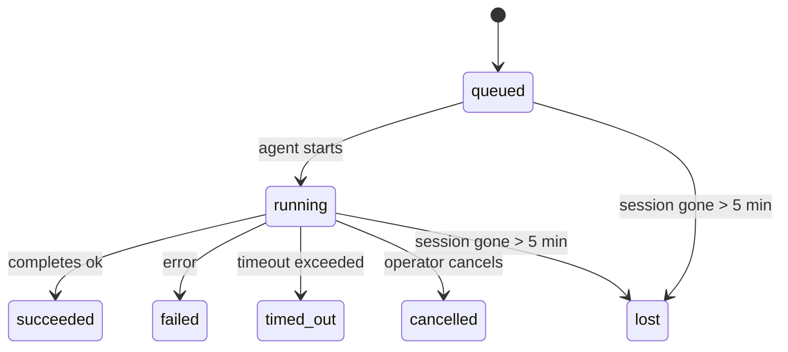

---
read_when:
    - Inspecionando trabalhos em segundo plano em andamento ou concluídos recentemente
    - Depuração de falhas de entrega em execuções de agente desanexadas
    - Entendendo como as execuções em segundo plano se relacionam com sessões, Cron e Heartbeat
sidebarTitle: Background tasks
summary: Rastreamento de tarefas em segundo plano para execuções do ACP, subagentes, tarefas Cron isoladas e operações da CLI
title: Tarefas em segundo plano
x-i18n:
    generated_at: "2026-05-01T05:55:21Z"
    model: gpt-5.5
    provider: openai
    source_hash: 8782987a79989264ae3bd1ca4b16755bdfb7e295e4f77933bf3a38c136d837f4
    source_path: automation/tasks.md
    workflow: 16
---

<Note>
Procurando agendamento? Consulte [Automação e tarefas](/pt-BR/automation) para escolher o mecanismo certo. Esta página é o registro de atividades do trabalho em segundo plano, não o agendador.
</Note>

Tarefas em segundo plano rastreiam o trabalho executado **fora da sua sessão principal de conversa**: execuções ACP, criação de subagentes, execuções isoladas de tarefas Cron e operações iniciadas pela CLI.

Tarefas **não** substituem sessões, tarefas Cron nem Heartbeats — elas são o **registro de atividades** que registra qual trabalho destacado aconteceu, quando e se ele teve sucesso.

<Note>
Nem toda execução de agente cria uma tarefa. Turnos de Heartbeat e chat interativo normal não criam. Todas as execuções Cron, criações ACP, criações de subagentes e comandos de agente pela CLI criam.
</Note>

## TL;DR

- Tarefas são **registros**, não agendadores — Cron e Heartbeat decidem _quando_ o trabalho é executado, tarefas rastreiam _o que aconteceu_.
- ACP, subagentes, todas as tarefas Cron e operações da CLI criam tarefas. Turnos de Heartbeat não criam.
- Cada tarefa passa por `queued → running → terminal` (succeeded, failed, timed_out, cancelled ou lost).
- Tarefas Cron permanecem ativas enquanto o runtime Cron ainda controla o job; se o
  estado do runtime em memória desapareceu, a manutenção de tarefas primeiro verifica o histórico durável de execuções Cron
  antes de marcar uma tarefa como perdida.
- A conclusão é orientada por push: trabalho destacado pode notificar diretamente ou acordar a
  sessão/Heartbeat solicitante quando termina, então loops de sondagem de status
  geralmente têm o formato errado.
- Execuções Cron isoladas e conclusões de subagentes fazem a melhor tentativa de limpar abas/processos de navegador rastreados para a sessão filha antes da escrituração final de limpeza.
- A entrega Cron isolada suprime respostas intermediárias obsoletas do pai enquanto trabalho de subagente descendente ainda está escoando, e prefere a saída final do descendente quando ela chega antes da entrega.
- Notificações de conclusão são entregues diretamente a um canal ou enfileiradas para o próximo Heartbeat.
- `openclaw tasks list` mostra todas as tarefas; `openclaw tasks audit` expõe problemas.
- Registros terminais são mantidos por 7 dias e depois removidos automaticamente.

## Início rápido

<Tabs>
  <Tab title="Listar e filtrar">
    ```bash
    # List all tasks (newest first)
    openclaw tasks list

    # Filter by runtime or status
    openclaw tasks list --runtime acp
    openclaw tasks list --status running
    ```

  </Tab>
  <Tab title="Inspecionar">
    ```bash
    # Show details for a specific task (by ID, run ID, or session key)
    openclaw tasks show <lookup>
    ```
  </Tab>
  <Tab title="Cancelar e notificar">
    ```bash
    # Cancel a running task (kills the child session)
    openclaw tasks cancel <lookup>

    # Change notification policy for a task
    openclaw tasks notify <lookup> state_changes
    ```

  </Tab>
  <Tab title="Auditoria e manutenção">
    ```bash
    # Run a health audit
    openclaw tasks audit

    # Preview or apply maintenance
    openclaw tasks maintenance
    openclaw tasks maintenance --apply
    ```

  </Tab>
  <Tab title="Fluxo de tarefas">
    ```bash
    # Inspect TaskFlow state
    openclaw tasks flow list
    openclaw tasks flow show <lookup>
    openclaw tasks flow cancel <lookup>
    ```
  </Tab>
</Tabs>

## O que cria uma tarefa

| Origem                 | Tipo de runtime | Quando um registro de tarefa é criado                  | Política padrão de notificação |
| ---------------------- | ------------ | ------------------------------------------------------ | --------------------- |
| Execuções em segundo plano ACP | `acp`        | Ao criar uma sessão ACP filha                          | `done_only`           |
| Orquestração de subagentes | `subagent`   | Ao criar um subagente via `sessions_spawn`             | `done_only`           |
| Tarefas Cron (todos os tipos) | `cron`       | Toda execução Cron (sessão principal e isolada)        | `silent`              |
| Operações da CLI       | `cli`        | Comandos `openclaw agent` que executam pelo Gateway    | `silent`              |
| Jobs de mídia do agente | `cli`        | Execuções `music_generate`/`video_generate` apoiadas por sessão | `silent`              |

<AccordionGroup>
  <Accordion title="Padrões de notificação para Cron e mídia">
    Tarefas Cron de sessão principal usam a política de notificação `silent` por padrão — elas criam registros para rastreamento, mas não geram notificações. Tarefas Cron isoladas também usam `silent` por padrão, mas são mais visíveis porque executam em sua própria sessão.

    Execuções `music_generate` e `video_generate` apoiadas por sessão também usam a política de notificação `silent`. Elas ainda criam registros de tarefa, mas a conclusão é devolvida à sessão original do agente como um despertar interno para que o agente possa escrever a mensagem de acompanhamento e anexar a mídia finalizada por conta própria. Se você optar por `tools.media.asyncCompletion.directSend`, conclusões assíncronas de `video_generate` podem tentar primeiro a entrega direta no canal; conclusões assíncronas de `music_generate` permanecem no caminho de despertar da sessão solicitante.

  </Accordion>
  <Accordion title="Proteção contra video_generate concorrente">
    Enquanto uma tarefa `video_generate` apoiada por sessão ainda está ativa, a ferramenta também atua como uma proteção: chamadas repetidas de `video_generate` nessa mesma sessão retornam o status da tarefa ativa em vez de iniciar uma segunda geração concorrente. Use `action: "status"` quando quiser uma consulta explícita de progresso/status pelo lado do agente.
  </Accordion>
  <Accordion title="O que não cria tarefas">
    - Turnos de Heartbeat — sessão principal; consulte [Heartbeat](/pt-BR/gateway/heartbeat)
    - Turnos de chat interativo normal
    - Respostas diretas de `/command`

  </Accordion>
</AccordionGroup>

## Ciclo de vida da tarefa



| Status      | O que significa                                                            |
| ----------- | -------------------------------------------------------------------------- |
| `queued`    | Criada, aguardando o agente iniciar                                        |
| `running`   | O turno do agente está executando ativamente                               |
| `succeeded` | Concluída com sucesso                                                      |
| `failed`    | Concluída com erro                                                         |
| `timed_out` | Excedeu o timeout configurado                                              |
| `cancelled` | Interrompida pelo operador via `openclaw tasks cancel`                     |
| `lost`      | O runtime perdeu o estado de apoio autoritativo após um período de tolerância de 5 minutos |

As transições acontecem automaticamente — quando a execução de agente associada termina, o status da tarefa é atualizado para corresponder.

A conclusão da execução do agente é autoritativa para registros de tarefa ativos. Uma execução destacada bem-sucedida finaliza como `succeeded`, erros comuns de execução finalizam como `failed`, e resultados de timeout ou abortamento finalizam como `timed_out`. Se um operador já cancelou a tarefa, ou o runtime já registrou um estado terminal mais forte, como `failed`, `timed_out` ou `lost`, um sinal posterior de sucesso não rebaixa esse status terminal.

`lost` é ciente do runtime:

- Tarefas ACP: os metadados da sessão ACP filha de apoio desapareceram.
- Tarefas de subagente: a sessão filha de apoio desapareceu do armazenamento do agente de destino.
- Tarefas Cron: o runtime Cron não rastreia mais o job como ativo e o histórico durável de execuções Cron
  não mostra um resultado terminal para essa execução. A auditoria offline da CLI
  não trata seu próprio estado vazio de runtime Cron em processo como autoridade.
- Tarefas CLI: tarefas de sessão filha isolada usam a sessão filha; tarefas CLI
  apoiadas por chat usam o contexto de execução ao vivo, então linhas persistentes
  de sessão de canal/grupo/direta não as mantêm vivas. Execuções
  `openclaw agent` apoiadas pelo Gateway também finalizam pelo resultado da execução, então execuções concluídas
  não ficam ativas até que o varredor as marque como `lost`.

## Entrega e notificações

Quando uma tarefa atinge um estado terminal, o OpenClaw notifica você. Há dois caminhos de entrega:

**Entrega direta** — se a tarefa tem um destino de canal (o `requesterOrigin`), a mensagem de conclusão vai direto para esse canal (Telegram, Discord, Slack etc.). Para conclusões de subagente, o OpenClaw também preserva o roteamento de thread/tópico vinculado quando disponível e pode preencher um `to` / conta ausente a partir da rota armazenada da sessão solicitante (`lastChannel` / `lastTo` / `lastAccountId`) antes de desistir da entrega direta.

**Entrega enfileirada na sessão** — se a entrega direta falha ou nenhuma origem está definida, a atualização é enfileirada como um evento de sistema na sessão do solicitante e aparece no próximo Heartbeat.

<Tip>
A conclusão da tarefa aciona um despertar imediato do Heartbeat para que você veja o resultado rapidamente — você não precisa esperar pelo próximo tick de Heartbeat agendado.
</Tip>

Isso significa que o fluxo de trabalho usual é baseado em push: inicie o trabalho destacado uma vez e depois deixe o runtime acordar ou notificar você na conclusão. Sonde o estado da tarefa somente quando precisar de depuração, intervenção ou uma auditoria explícita.

### Políticas de notificação

Controle quanto você ouve sobre cada tarefa:

| Política                | O que é entregue                                                        |
| --------------------- | ----------------------------------------------------------------------- |
| `done_only` (padrão) | Somente estado terminal (succeeded, failed etc.) — **este é o padrão** |
| `state_changes`       | Toda transição de estado e atualização de progresso                     |
| `silent`              | Nada                                                                    |

Altere a política enquanto uma tarefa está em execução:

```bash
openclaw tasks notify <lookup> state_changes
```

## Referência da CLI

<AccordionGroup>
  <Accordion title="tasks list">
    ```bash
    openclaw tasks list [--runtime <acp|subagent|cron|cli>] [--status <status>] [--json]
    ```

    Colunas de saída: ID da tarefa, Tipo, Status, Entrega, ID da execução, Sessão filha, Resumo.

  </Accordion>
  <Accordion title="tasks show">
    ```bash
    openclaw tasks show <lookup>
    ```

    O token de consulta aceita um ID de tarefa, ID de execução ou chave de sessão. Mostra o registro completo, incluindo temporização, estado de entrega, erro e resumo terminal.

  </Accordion>
  <Accordion title="tasks cancel">
    ```bash
    openclaw tasks cancel <lookup>
    ```

    Para tarefas ACP e de subagente, isso encerra a sessão filha. Para tarefas rastreadas pela CLI, o cancelamento é registrado no registro de tarefas (não há handle separado de runtime filho). O status transita para `cancelled` e uma notificação de entrega é enviada quando aplicável.

  </Accordion>
  <Accordion title="tasks notify">
    ```bash
    openclaw tasks notify <lookup> <done_only|state_changes|silent>
    ```
  </Accordion>
  <Accordion title="tasks audit">
    ```bash
    openclaw tasks audit [--json]
    ```

    Expõe problemas operacionais. Constatações também aparecem em `openclaw status` quando problemas são detectados.

    | Constatação              | Severidade | Acionador                                                                                                                         |
    | ------------------------- | ---------- | --------------------------------------------------------------------------------------------------------------------------------- |
    | `stale_queued`            | warn       | Em fila por mais de 10 minutos                                                                                                    |
    | `stale_running`           | error      | Em execução por mais de 30 minutos                                                                                                |
    | `lost`                    | warn/error | A propriedade da tarefa respaldada por runtime desapareceu; tarefas perdidas retidas emitem aviso até `cleanupAfter`, depois viram erros |
    | `delivery_failed`         | warn       | A entrega falhou e a política de notificação não é `silent`                                                                       |
    | `missing_cleanup`         | warn       | Tarefa terminal sem timestamp de limpeza                                                                                          |
    | `inconsistent_timestamps` | warn       | Violação da linha do tempo (por exemplo, terminou antes de começar)                                                               |

  </Accordion>
  <Accordion title="manutenção de tarefas">
    ```bash
    openclaw tasks maintenance [--json]
    openclaw tasks maintenance --apply [--json]
    ```

    Use isto para visualizar ou aplicar reconciliação, marcação de limpeza e poda para tarefas e estado do TaskFlow.

    A reconciliação é ciente de runtime:

    - Tarefas ACP/subagente verificam sua sessão filha de apoio.
    - Tarefas de subagente cuja sessão filha tem uma lápide de recuperação de reinicialização são marcadas como perdidas em vez de serem tratadas como sessões de apoio recuperáveis.
    - Tarefas Cron verificam se o runtime do cron ainda possui o job, depois recuperam o status terminal de logs de execução de cron/estado de job persistidos antes de recorrer a `lost`. Apenas o processo Gateway é autoritativo para o conjunto de jobs ativos de cron em memória; a auditoria offline da CLI usa histórico durável, mas não marca uma tarefa de cron como perdida somente porque esse Set local está vazio.
    - Tarefas da CLI respaldadas por chat verificam o contexto de execução ao vivo proprietário, não apenas a linha da sessão de chat.

    A limpeza de conclusão também é ciente de runtime:

    - A conclusão de subagente tenta, em melhor esforço, fechar abas/processos de navegador rastreados para a sessão filha antes que a limpeza de anúncio continue.
    - A conclusão de cron isolado tenta, em melhor esforço, fechar abas/processos de navegador rastreados para a sessão de cron antes que a execução seja totalmente encerrada.
    - A entrega de cron isolado aguarda acompanhamento de subagente descendente quando necessário e suprime texto obsoleto de confirmação do pai em vez de anunciá-lo.
    - A entrega de conclusão de subagente prefere o texto de assistente visível mais recente; se ele estiver vazio, recorre ao texto sanitizado mais recente de tool/toolResult, e execuções de chamadas de ferramenta apenas por timeout podem ser reduzidas a um breve resumo de progresso parcial. Execuções terminais com falha anunciam o status de falha sem repetir o texto de resposta capturado.
    - Falhas de limpeza não mascaram o resultado real da tarefa.

  </Accordion>
  <Accordion title="tasks flow list | show | cancel">
    ```bash
    openclaw tasks flow list [--status <status>] [--json]
    openclaw tasks flow show <lookup> [--json]
    openclaw tasks flow cancel <lookup>
    ```

    Use estes quando o TaskFlow orquestrador for o que importa para você, em vez de um registro individual de tarefa em segundo plano.

  </Accordion>
</AccordionGroup>

## Quadro de tarefas do chat (`/tasks`)

Use `/tasks` em qualquer sessão de chat para ver tarefas em segundo plano vinculadas a essa sessão. O quadro mostra tarefas ativas e concluídas recentemente com runtime, status, tempo e detalhes de progresso ou erro.

Quando a sessão atual não tem tarefas vinculadas visíveis, `/tasks` recorre às contagens de tarefas locais do agente, para que você ainda tenha uma visão geral sem vazar detalhes de outras sessões.

Para o livro-razão completo do operador, use a CLI: `openclaw tasks list`.

## Integração de status (pressão de tarefas)

`openclaw status` inclui um resumo rápido de tarefas:

```
Tasks: 3 queued · 2 running · 1 issues
```

O resumo informa:

- **active** — contagem de `queued` + `running`
- **failures** — contagem de `failed` + `timed_out` + `lost`
- **byRuntime** — detalhamento por `acp`, `subagent`, `cron`, `cli`

Tanto `/status` quanto a ferramenta `session_status` usam um snapshot de tarefas ciente de limpeza: tarefas ativas são preferidas, linhas concluídas obsoletas são ocultadas e falhas recentes só aparecem quando nenhum trabalho ativo permanece. Isso mantém o cartão de status focado no que importa agora.

## Armazenamento e manutenção

### Onde as tarefas ficam

Registros de tarefas persistem no SQLite em:

```
$OPENCLAW_STATE_DIR/tasks/runs.sqlite
```

O registro é carregado na memória na inicialização do Gateway e sincroniza gravações com o SQLite para durabilidade entre reinicializações.
O Gateway mantém o log de gravação antecipada do SQLite limitado usando o limite padrão de
autocheckpoint do SQLite mais checkpoints `TRUNCATE` periódicos e no desligamento.

### Manutenção automática

Um varredor é executado a cada **60 segundos** e cuida de quatro coisas:

<Steps>
  <Step title="Reconciliação">
    Verifica se tarefas ativas ainda têm respaldo autoritativo de runtime. Tarefas ACP/subagente usam o estado da sessão filha, tarefas de cron usam a propriedade de jobs ativos, e tarefas da CLI respaldadas por chat usam o contexto de execução proprietário. Se esse estado de apoio desaparecer por mais de 5 minutos, a tarefa é marcada como `lost`.
  </Step>
  <Step title="Reparo de sessão ACP">
    Fecha sessões ACP one-shot terminais ou órfãs pertencentes ao pai, e fecha sessões ACP persistentes terminais obsoletas ou órfãs somente quando não resta nenhum vínculo de conversa ativo.
  </Step>
  <Step title="Marcação de limpeza">
    Define um timestamp `cleanupAfter` em tarefas terminais (endedAt + 7 dias). Durante a retenção, tarefas perdidas ainda aparecem na auditoria como avisos; depois que `cleanupAfter` expira ou quando metadados de limpeza estão ausentes, elas são erros.
  </Step>
  <Step title="Poda">
    Exclui registros após sua data `cleanupAfter`.
  </Step>
</Steps>

<Note>
**Retenção:** registros de tarefas terminais são mantidos por **7 dias** e depois podados automaticamente. Nenhuma configuração necessária.
</Note>

## Como as tarefas se relacionam com outros sistemas

<AccordionGroup>
  <Accordion title="Tarefas e TaskFlow">
    [TaskFlow](/pt-BR/automation/taskflow) é a camada de orquestração de fluxos acima das tarefas em segundo plano. Um único fluxo pode coordenar várias tarefas ao longo de sua vida útil usando modos de sincronização gerenciados ou espelhados. Use `openclaw tasks` para inspecionar registros individuais de tarefas e `openclaw tasks flow` para inspecionar o fluxo orquestrador.

    Consulte [TaskFlow](/pt-BR/automation/taskflow) para detalhes.

  </Accordion>
  <Accordion title="Tarefas e cron">
    Uma **definição** de job de cron fica em `~/.openclaw/cron/jobs.json`; o estado de execução em runtime fica ao lado dela em `~/.openclaw/cron/jobs-state.json`. **Toda** execução de cron cria um registro de tarefa — tanto de sessão principal quanto isolada. Tarefas de cron de sessão principal usam por padrão a política de notificação `silent`, de modo que são rastreadas sem gerar notificações.

    Consulte [Cron Jobs](/pt-BR/automation/cron-jobs).

  </Accordion>
  <Accordion title="Tarefas e Heartbeat">
    Execuções de Heartbeat são turnos de sessão principal — elas não criam registros de tarefas. Quando uma tarefa é concluída, ela pode acionar um despertar de Heartbeat para que você veja o resultado prontamente.

    Consulte [Heartbeat](/pt-BR/gateway/heartbeat).

  </Accordion>
  <Accordion title="Tarefas e sessões">
    Uma tarefa pode referenciar uma `childSessionKey` (onde o trabalho é executado) e uma `requesterSessionKey` (quem a iniciou). Sessões são contexto de conversa; tarefas são rastreamento de atividade sobre isso.
  </Accordion>
  <Accordion title="Tarefas e execuções de agente">
    O `runId` de uma tarefa aponta para a execução do agente que realiza o trabalho. Eventos de ciclo de vida do agente (início, fim, erro) atualizam automaticamente o status da tarefa — você não precisa gerenciar o ciclo de vida manualmente.
  </Accordion>
</AccordionGroup>

## Relacionados

- [Automação e tarefas](/pt-BR/automation) — todos os mecanismos de automação em resumo
- [CLI: Tarefas](/pt-BR/cli/tasks) — referência de comandos da CLI
- [Heartbeat](/pt-BR/gateway/heartbeat) — turnos periódicos de sessão principal
- [Tarefas agendadas](/pt-BR/automation/cron-jobs) — agendamento de trabalho em segundo plano
- [TaskFlow](/pt-BR/automation/taskflow) — orquestração de fluxo acima das tarefas
