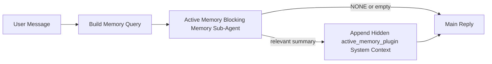

---
read_when:
    - Você quer entender para que serve a Active Memory
    - Você quer ativar a Active Memory para um agente conversacional
    - Você quer ajustar o comportamento da Active Memory sem ativá-la em todos os lugares
summary: Um subagente de memória de bloqueio pertencente ao Plugin que injeta memória relevante em sessões de chat interativas
title: Active Memory
x-i18n:
    generated_at: "2026-04-12T23:28:02Z"
    model: gpt-5.4
    provider: openai
    source_hash: 11665dbc888b6d4dc667a47624cc1f2e4cc71e1d58e1f7d9b5fe4057ec4da108
    source_path: concepts/active-memory.md
    workflow: 15
---

# Active Memory

A Active Memory é um subagente opcional de memória de bloqueio pertencente ao Plugin que roda
antes da resposta principal para sessões conversacionais qualificadas.

Ela existe porque a maioria dos sistemas de memória é capaz, mas reativa. Eles dependem
do agente principal para decidir quando pesquisar na memória, ou do usuário para dizer coisas
como "lembre-se disso" ou "pesquise na memória". Nesse ponto, o momento em que a memória
teria tornado a resposta natural já passou.

A Active Memory dá ao sistema uma chance limitada de trazer memória relevante
antes que a resposta principal seja gerada.

## Cole isto no seu agente

Cole isto no seu agente se quiser que ele ative a Active Memory com uma
configuração autocontida e segura por padrão:

```json5
{
  plugins: {
    entries: {
      "active-memory": {
        enabled: true,
        config: {
          enabled: true,
          agents: ["main"],
          allowedChatTypes: ["direct"],
          modelFallback: "google/gemini-3-flash",
          queryMode: "recent",
          promptStyle: "balanced",
          timeoutMs: 15000,
          maxSummaryChars: 220,
          persistTranscripts: false,
          logging: true,
        },
      },
    },
  },
}
```

Isso ativa o plugin para o agente `main`, mantém o uso limitado por padrão a
sessões no estilo mensagem direta, permite que ele herde primeiro o modelo atual da sessão e
usa o modelo de fallback configurado somente se nenhum modelo explícito ou herdado estiver disponível.

Depois disso, reinicie o Gateway:

```bash
openclaw gateway
```

Para inspecioná-la ao vivo em uma conversa:

```text
/verbose on
/trace on
```

## Ativar a Active Memory

A configuração mais segura é:

1. ativar o plugin
2. direcionar um agente conversacional
3. manter o logging ativado apenas durante o ajuste

Comece com isto em `openclaw.json`:

```json5
{
  plugins: {
    entries: {
      "active-memory": {
        enabled: true,
        config: {
          agents: ["main"],
          allowedChatTypes: ["direct"],
          modelFallback: "google/gemini-3-flash",
          queryMode: "recent",
          promptStyle: "balanced",
          timeoutMs: 15000,
          maxSummaryChars: 220,
          persistTranscripts: false,
          logging: true,
        },
      },
    },
  },
}
```

Depois reinicie o Gateway:

```bash
openclaw gateway
```

O que isso significa:

- `plugins.entries.active-memory.enabled: true` ativa o plugin
- `config.agents: ["main"]` habilita a active memory apenas para o agente `main`
- `config.allowedChatTypes: ["direct"]` mantém a active memory ativada por padrão apenas para sessões no estilo mensagem direta
- se `config.model` não estiver definido, a active memory primeiro herda o modelo atual da sessão
- `config.modelFallback` opcionalmente fornece seu próprio provedor/modelo de fallback para recuperação
- `config.promptStyle: "balanced"` usa o estilo de prompt geral padrão para o modo `recent`
- a active memory ainda roda apenas em sessões de chat persistentes interativas qualificadas

## Como vê-la

A Active Memory injeta contexto oculto de sistema para o modelo. Ela não expõe
tags brutas `<active_memory_plugin>...</active_memory_plugin>` ao cliente.

## Alternância por sessão

Use o comando do plugin quando quiser pausar ou retomar a active memory para a
sessão de chat atual sem editar a configuração:

```text
/active-memory status
/active-memory off
/active-memory on
```

Isso é restrito à sessão. Não altera
`plugins.entries.active-memory.enabled`, o direcionamento de agente nem outras
configurações globais.

Se quiser que o comando grave a configuração e pause ou retome a active memory para
todas as sessões, use a forma global explícita:

```text
/active-memory status --global
/active-memory off --global
/active-memory on --global
```

A forma global grava `plugins.entries.active-memory.config.enabled`. Ela mantém
`plugins.entries.active-memory.enabled` ativado para que o comando continue disponível para
reativar a active memory mais tarde.

Se quiser ver o que a active memory está fazendo em uma sessão ao vivo, ative os
alternadores de sessão que correspondem à saída desejada:

```text
/verbose on
/trace on
```

Com isso ativado, o OpenClaw pode mostrar:

- uma linha de status da active memory como `Active Memory: ok 842ms recent 34 chars` quando `/verbose on`
- um resumo de depuração legível como `Active Memory Debug: Lemon pepper wings with blue cheese.` quando `/trace on`

Essas linhas são derivadas da mesma passagem de active memory que alimenta o contexto
oculto do sistema, mas são formatadas para humanos em vez de expor marcação bruta de
prompt. Elas são enviadas como uma mensagem de diagnóstico de acompanhamento após a
resposta normal do assistente para que clientes de canal como o Telegram não exibam
um balão de diagnóstico separado antes da resposta.

Por padrão, a transcrição temporária do subagente de memória de bloqueio é excluída
após a conclusão da execução.

Fluxo de exemplo:

```text
/verbose on
/trace on
what wings should i order?
```

Formato de resposta visível esperado:

```text
...normal assistant reply...

🧩 Active Memory: ok 842ms recent 34 chars
🔎 Active Memory Debug: Lemon pepper wings with blue cheese.
```

## Quando ela roda

A Active Memory usa dois critérios:

1. **Opt-in de configuração**
   O plugin precisa estar ativado, e o id do agente atual precisa aparecer em
   `plugins.entries.active-memory.config.agents`.
2. **Qualificação estrita em tempo de execução**
   Mesmo quando ativada e direcionada, a active memory roda apenas em sessões de chat
   persistentes interativas qualificadas.

A regra real é:

```text
plugin enabled
+
agent id targeted
+
allowed chat type
+
eligible interactive persistent chat session
=
active memory runs
```

Se qualquer um deles falhar, a active memory não roda.

## Tipos de sessão

`config.allowedChatTypes` controla em quais tipos de conversa a Active
Memory pode rodar.

O padrão é:

```json5
allowedChatTypes: ["direct"]
```

Isso significa que a Active Memory roda por padrão em sessões no estilo mensagem direta, mas
não em sessões de grupo ou canal, a menos que você as habilite explicitamente.

Exemplos:

```json5
allowedChatTypes: ["direct"]
```

```json5
allowedChatTypes: ["direct", "group"]
```

```json5
allowedChatTypes: ["direct", "group", "channel"]
```

## Onde ela roda

A Active Memory é um recurso de enriquecimento conversacional, não um recurso
de inferência para toda a plataforma.

| Superfície                                                          | A active memory roda?                                   |
| ------------------------------------------------------------------- | ------------------------------------------------------- |
| Sessões persistentes da Control UI / chat web                       | Sim, se o plugin estiver ativado e o agente for direcionado |
| Outras sessões de canal interativas no mesmo caminho de chat persistente | Sim, se o plugin estiver ativado e o agente for direcionado |
| Execuções avulsas headless                                          | Não                                                     |
| Execuções de Heartbeat/em segundo plano                             | Não                                                     |
| Caminhos internos genéricos de `agent-command`                      | Não                                                     |
| Execução interna/de subagente auxiliar                              | Não                                                     |

## Por que usá-la

Use a active memory quando:

- a sessão for persistente e voltada ao usuário
- o agente tiver memória de longo prazo relevante para pesquisar
- continuidade e personalização forem mais importantes do que determinismo bruto de prompt

Ela funciona especialmente bem para:

- preferências estáveis
- hábitos recorrentes
- contexto de longo prazo do usuário que deve surgir naturalmente

Ela é pouco adequada para:

- automação
- workers internos
- tarefas de API avulsas
- lugares em que personalização oculta seria surpreendente

## Como ela funciona

O formato em tempo de execução é:



O subagente de memória de bloqueio pode usar apenas:

- `memory_search`
- `memory_get`

Se a conexão estiver fraca, ele deve retornar `NONE`.

## Modos de consulta

`config.queryMode` controla quanto da conversa o subagente de memória de bloqueio vê.

## Estilos de prompt

`config.promptStyle` controla o quão ansioso ou estrito o subagente de memória de bloqueio é
ao decidir se deve retornar memória.

Estilos disponíveis:

- `balanced`: padrão de uso geral para o modo `recent`
- `strict`: menos ansioso; melhor quando você quer pouquíssimo vazamento do contexto próximo
- `contextual`: mais favorável à continuidade; melhor quando o histórico da conversa deve importar mais
- `recall-heavy`: mais disposto a trazer memória com correspondências mais suaves, mas ainda plausíveis
- `precision-heavy`: prefere agressivamente `NONE`, a menos que a correspondência seja óbvia
- `preference-only`: otimizado para favoritos, hábitos, rotinas, gostos e fatos pessoais recorrentes

Mapeamento padrão quando `config.promptStyle` não está definido:

```text
message -> strict
recent -> balanced
full -> contextual
```

Se você definir `config.promptStyle` explicitamente, essa substituição prevalece.

Exemplo:

```json5
promptStyle: "preference-only"
```

## Política de fallback de modelo

Se `config.model` não estiver definido, a Active Memory tenta resolver um modelo nesta ordem:

```text
explicit plugin model
-> current session model
-> agent primary model
-> optional configured fallback model
```

`config.modelFallback` controla a etapa de fallback configurado.

Fallback personalizado opcional:

```json5
modelFallback: "google/gemini-3-flash"
```

Se nenhum modelo explícito, herdado ou de fallback configurado for resolvido, a Active Memory
ignora a recuperação nesse turno.

`config.modelFallbackPolicy` é mantido apenas como um campo de compatibilidade
obsoleto para configurações antigas. Ele não altera mais o comportamento em tempo de execução.

## Válvulas de escape avançadas

Essas opções intencionalmente não fazem parte da configuração recomendada.

`config.thinking` pode substituir o nível de raciocínio do subagente de memória de bloqueio:

```json5
thinking: "medium"
```

Padrão:

```json5
thinking: "off"
```

Não ative isso por padrão. A Active Memory roda no caminho da resposta, então tempo extra
de raciocínio aumenta diretamente a latência visível para o usuário.

`config.promptAppend` adiciona instruções extras do operador após o prompt padrão da Active
Memory e antes do contexto da conversa:

```json5
promptAppend: "Prefer stable long-term preferences over one-off events."
```

`config.promptOverride` substitui o prompt padrão da Active Memory. O OpenClaw
ainda acrescenta o contexto da conversa em seguida:

```json5
promptOverride: "You are a memory search agent. Return NONE or one compact user fact."
```

A personalização de prompt não é recomendada, a menos que você esteja testando deliberadamente
um contrato de recuperação diferente. O prompt padrão é ajustado para retornar `NONE`
ou contexto compacto de fatos do usuário para o modelo principal.

### `message`

Somente a mensagem mais recente do usuário é enviada.

```text
Latest user message only
```

Use isto quando:

- você quiser o comportamento mais rápido
- você quiser o viés mais forte para recuperação de preferências estáveis
- turnos de acompanhamento não precisarem de contexto conversacional

Timeout recomendado:

- comece em torno de `3000` a `5000` ms

### `recent`

A mensagem mais recente do usuário mais uma pequena cauda conversacional recente são enviadas.

```text
Recent conversation tail:
user: ...
assistant: ...
user: ...

Latest user message:
...
```

Use isto quando:

- você quiser um equilíbrio melhor entre velocidade e fundamentação conversacional
- perguntas de acompanhamento frequentemente dependerem dos últimos turnos

Timeout recomendado:

- comece em torno de `15000` ms

### `full`

A conversa completa é enviada ao subagente de memória de bloqueio.

```text
Full conversation context:
user: ...
assistant: ...
user: ...
...
```

Use isto quando:

- a qualidade máxima de recuperação for mais importante do que a latência
- a conversa contiver preparação importante muito antes no fio

Timeout recomendado:

- aumente-o substancialmente em comparação com `message` ou `recent`
- comece em torno de `15000` ms ou mais, dependendo do tamanho do fio

Em geral, o timeout deve aumentar com o tamanho do contexto:

```text
message < recent < full
```

## Persistência de transcrição

As execuções do subagente de memória de bloqueio da active memory criam uma
transcrição real em `session.jsonl` durante a chamada do subagente de memória de bloqueio.

Por padrão, essa transcrição é temporária:

- ela é gravada em um diretório temporário
- ela é usada apenas para a execução do subagente de memória de bloqueio
- ela é excluída imediatamente após o fim da execução

Se você quiser manter essas transcrições do subagente de memória de bloqueio em disco para depuração ou
inspeção, ative a persistência explicitamente:

```json5
{
  plugins: {
    entries: {
      "active-memory": {
        enabled: true,
        config: {
          agents: ["main"],
          persistTranscripts: true,
          transcriptDir: "active-memory",
        },
      },
    },
  },
}
```

Quando ativada, a active memory armazena transcrições em um diretório separado sob a
pasta de sessões do agente de destino, não no caminho principal de transcrição
da conversa do usuário.

O layout padrão é conceitualmente:

```text
agents/<agent>/sessions/active-memory/<blocking-memory-sub-agent-session-id>.jsonl
```

Você pode alterar o subdiretório relativo com `config.transcriptDir`.

Use isso com cuidado:

- as transcrições do subagente de memória de bloqueio podem se acumular rapidamente em sessões movimentadas
- o modo de consulta `full` pode duplicar muito contexto de conversa
- essas transcrições contêm contexto de prompt oculto e memórias recuperadas

## Configuração

Toda a configuração da active memory fica em:

```text
plugins.entries.active-memory
```

Os campos mais importantes são:

| Chave                       | Tipo                                                                                                 | Significado                                                                                             |
| --------------------------- | ---------------------------------------------------------------------------------------------------- | ------------------------------------------------------------------------------------------------------- |
| `enabled`                   | `boolean`                                                                                            | Ativa o próprio plugin                                                                                  |
| `config.agents`             | `string[]`                                                                                           | IDs de agente que podem usar a active memory                                                            |
| `config.model`              | `string`                                                                                             | Referência opcional de modelo do subagente de memória de bloqueio; quando não definida, a active memory usa o modelo atual da sessão |
| `config.queryMode`          | `"message" \| "recent" \| "full"`                                                                    | Controla quanto da conversa o subagente de memória de bloqueio vê                                       |
| `config.promptStyle`        | `"balanced" \| "strict" \| "contextual" \| "recall-heavy" \| "precision-heavy" \| "preference-only"` | Controla o quão ansioso ou estrito o subagente de memória de bloqueio é ao decidir se retorna memória  |
| `config.thinking`           | `"off" \| "minimal" \| "low" \| "medium" \| "high" \| "xhigh" \| "adaptive"`                         | Substituição avançada de raciocínio para o subagente de memória de bloqueio; padrão `off` para velocidade |
| `config.promptOverride`     | `string`                                                                                             | Substituição avançada completa do prompt; não recomendada para uso normal                               |
| `config.promptAppend`       | `string`                                                                                             | Instruções extras avançadas anexadas ao prompt padrão ou substituído                                    |
| `config.timeoutMs`          | `number`                                                                                             | Timeout rígido para o subagente de memória de bloqueio                                                  |
| `config.maxSummaryChars`    | `number`                                                                                             | Total máximo de caracteres permitido no resumo da active memory                                         |
| `config.logging`            | `boolean`                                                                                            | Emite logs da active memory durante o ajuste                                                            |
| `config.persistTranscripts` | `boolean`                                                                                            | Mantém em disco as transcrições do subagente de memória de bloqueio em vez de excluir arquivos temporários |
| `config.transcriptDir`      | `string`                                                                                             | Diretório relativo das transcrições do subagente de memória de bloqueio sob a pasta de sessões do agente |

Campos úteis para ajuste:

| Chave                         | Tipo     | Significado                                                  |
| ----------------------------- | -------- | ------------------------------------------------------------ |
| `config.maxSummaryChars`      | `number` | Total máximo de caracteres permitido no resumo da active memory |
| `config.recentUserTurns`      | `number` | Turnos anteriores do usuário a incluir quando `queryMode` for `recent` |
| `config.recentAssistantTurns` | `number` | Turnos anteriores do assistente a incluir quando `queryMode` for `recent` |
| `config.recentUserChars`      | `number` | Máximo de caracteres por turno recente do usuário            |
| `config.recentAssistantChars` | `number` | Máximo de caracteres por turno recente do assistente         |
| `config.cacheTtlMs`           | `number` | Reutilização de cache para consultas idênticas repetidas     |

## Configuração recomendada

Comece com `recent`.

```json5
{
  plugins: {
    entries: {
      "active-memory": {
        enabled: true,
        config: {
          agents: ["main"],
          queryMode: "recent",
          promptStyle: "balanced",
          timeoutMs: 15000,
          maxSummaryChars: 220,
          logging: true,
        },
      },
    },
  },
}
```

Se quiser inspecionar o comportamento ao vivo durante o ajuste, use `/verbose on` para a
linha de status normal e `/trace on` para o resumo de depuração da active memory, em vez
de procurar um comando de depuração separado da active memory. Em canais de chat, essas
linhas de diagnóstico são enviadas após a resposta principal do assistente, e não antes.

Depois passe para:

- `message` se quiser menor latência
- `full` se decidir que contexto extra vale o subagente de memória de bloqueio mais lento

## Depuração

Se a active memory não estiver aparecendo onde você espera:

1. Confirme que o plugin está ativado em `plugins.entries.active-memory.enabled`.
2. Confirme que o id do agente atual está listado em `config.agents`.
3. Confirme que você está testando por meio de uma sessão de chat persistente interativa.
4. Ative `config.logging: true` e observe os logs do Gateway.
5. Verifique se a própria pesquisa de memória funciona com `openclaw memory status --deep`.

Se os acertos de memória estiverem ruidosos, aperte:

- `maxSummaryChars`

Se a active memory estiver lenta demais:

- reduza `queryMode`
- reduza `timeoutMs`
- reduza as contagens de turnos recentes
- reduza os limites de caracteres por turno

## Problemas comuns

### O provedor de embeddings mudou inesperadamente

A Active Memory usa o pipeline normal de `memory_search` em
`agents.defaults.memorySearch`. Isso significa que a configuração do provedor de embeddings só é
necessária quando sua configuração de `memorySearch` exige embeddings para o comportamento
que você deseja.

Na prática:

- a configuração explícita de provedor é **obrigatória** se você quiser um provedor que não seja
  detectado automaticamente, como `ollama`
- a configuração explícita de provedor é **obrigatória** se a detecção automática não resolver
  nenhum provedor de embeddings utilizável para o seu ambiente
- a configuração explícita de provedor é **altamente recomendada** se você quiser seleção de
  provedor determinística em vez de "o primeiro disponível vence"
- a configuração explícita de provedor geralmente **não é obrigatória** se a detecção automática já
  resolver o provedor que você quer e esse provedor for estável na sua implantação

Se `memorySearch.provider` não estiver definido, o OpenClaw detecta automaticamente o primeiro provedor de
embeddings disponível.

Isso pode ser confuso em implantações reais:

- uma nova chave de API disponível pode mudar qual provedor a pesquisa de memória usa
- um comando ou superfície de diagnóstico pode fazer o provedor selecionado parecer
  diferente do caminho que você realmente está atingindo durante sincronização de memória ao vivo ou
  bootstrap de pesquisa
- provedores hospedados podem falhar com erros de cota ou limite de taxa que só aparecem
  quando a Active Memory começa a emitir pesquisas de recuperação antes de cada resposta

A Active Memory ainda pode funcionar sem embeddings quando `memory_search` pode operar
em modo degradado apenas lexical, o que normalmente acontece quando nenhum provedor
de embeddings pode ser resolvido.

Não presuma o mesmo fallback em falhas em tempo de execução do provedor, como esgotamento de
cota, limites de taxa, erros de rede/provedor ou modelos locais/remotos ausentes depois que um
provedor já tiver sido selecionado.

Na prática:

- se nenhum provedor de embeddings puder ser resolvido, `memory_search` pode degradar para
  recuperação apenas lexical
- se um provedor de embeddings for resolvido e depois falhar em tempo de execução, o OpenClaw
  atualmente não garante um fallback lexical para essa requisição
- se você precisar de seleção de provedor determinística, fixe
  `agents.defaults.memorySearch.provider`
- se você precisar de failover de provedor em erros de tempo de execução, configure
  `agents.defaults.memorySearch.fallback` explicitamente

Se você depende de recuperação com embeddings, indexação multimodal ou de um provedor
local/remoto específico, fixe o provedor explicitamente em vez de depender da
detecção automática.

Exemplos comuns de fixação:

OpenAI:

```json5
{
  agents: {
    defaults: {
      memorySearch: {
        provider: "openai",
        model: "text-embedding-3-small",
      },
    },
  },
}
```

Gemini:

```json5
{
  agents: {
    defaults: {
      memorySearch: {
        provider: "gemini",
        model: "gemini-embedding-001",
      },
    },
  },
}
```

Ollama:

```json5
{
  agents: {
    defaults: {
      memorySearch: {
        provider: "ollama",
        model: "nomic-embed-text",
      },
    },
  },
}
```

Se você espera failover de provedor em erros de tempo de execução como esgotamento de cota,
fixar um provedor sozinho não basta. Configure também um fallback explícito:

```json5
{
  agents: {
    defaults: {
      memorySearch: {
        provider: "openai",
        fallback: "gemini",
      },
    },
  },
}
```

### Depurando problemas de provedor

Se a Active Memory estiver lenta, vazia ou parecer trocar de provedor inesperadamente:

- observe os logs do Gateway enquanto reproduz o problema; procure linhas como
  `active-memory: ... start|done`, `memory sync failed (search-bootstrap)` ou
  erros de embeddings específicos do provedor
- ative `/trace on` para exibir o resumo de depuração da Active Memory pertencente ao plugin na
  sessão
- ative `/verbose on` se também quiser a linha de status normal `🧩 Active Memory: ...`
  após cada resposta
- execute `openclaw memory status --deep` para inspecionar o backend atual de pesquisa de memória
  e a integridade do índice
- verifique `agents.defaults.memorySearch.provider` e a autenticação/configuração relacionada para
  garantir que o provedor que você espera é realmente aquele que pode ser resolvido em tempo de execução
- se você usa `ollama`, verifique se o modelo de embeddings configurado está instalado, por
  exemplo `ollama list`

Exemplo de loop de depuração:

```text
1. Inicie o Gateway e observe seus logs
2. Na sessão de chat, execute /trace on
3. Envie uma mensagem que deve acionar a Active Memory
4. Compare a linha de depuração visível no chat com as linhas de log do Gateway
5. Se a escolha de provedor estiver ambígua, fixe agents.defaults.memorySearch.provider explicitamente
```

Exemplo:

```json5
{
  agents: {
    defaults: {
      memorySearch: {
        provider: "ollama",
        model: "nomic-embed-text",
      },
    },
  },
}
```

Ou, se você quiser embeddings do Gemini:

```json5
{
  agents: {
    defaults: {
      memorySearch: {
        provider: "gemini",
      },
    },
  },
}
```

Depois de alterar o provedor, reinicie o Gateway e execute um teste novo com
`/trace on` para que a linha de depuração da Active Memory reflita o novo caminho de embeddings.

## Páginas relacionadas

- [Memory Search](/pt-BR/concepts/memory-search)
- [Referência de configuração de memória](/pt-BR/reference/memory-config)
- [Configuração do Plugin SDK](/pt-BR/plugins/sdk-setup)
