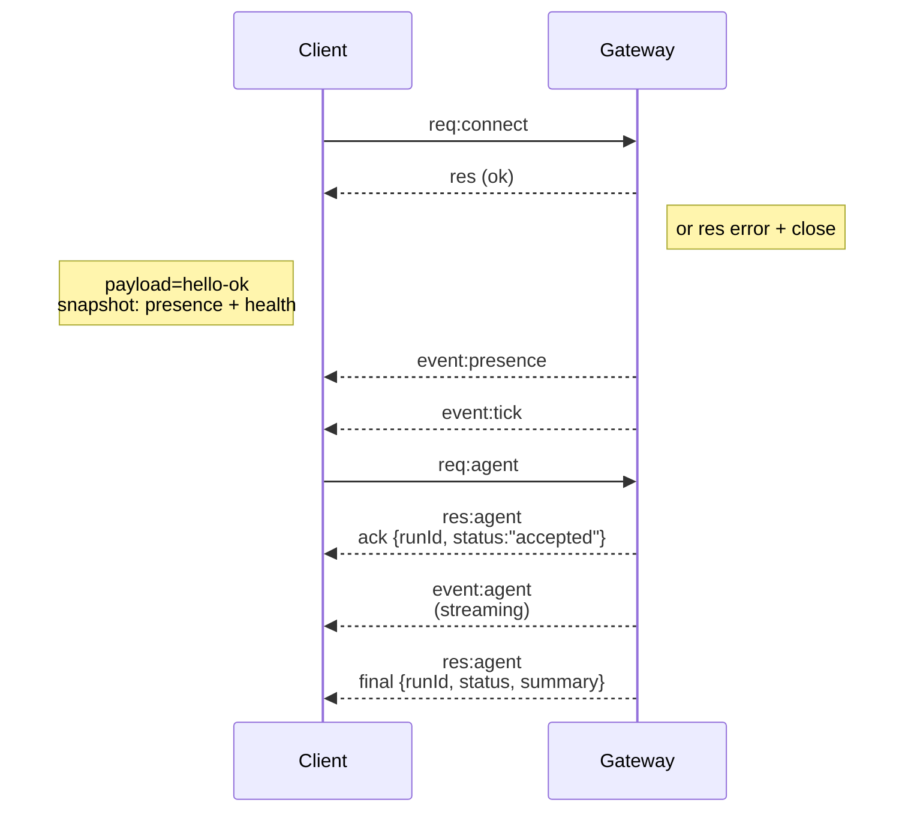

---
read_when:
    - Trabalhando no protocolo, nos clientes ou nos transportes do Gateway
summary: Arquitetura do Gateway WebSocket, componentes e fluxos do cliente
title: Arquitetura do Gateway
x-i18n:
    generated_at: "2026-04-24T05:47:15Z"
    model: gpt-5.4
    provider: openai
    source_hash: 91c553489da18b6ad83fc860014f5bfb758334e9789cb7893d4d00f81c650f02
    source_path: concepts/architecture.md
    workflow: 15
---

## Visão geral

- Um único **Gateway** de longa duração controla todas as superfícies de mensagens (WhatsApp via
  Baileys, Telegram via grammY, Slack, Discord, Signal, iMessage, WebChat).
- Clientes do plano de controle (app macOS, CLI, UI web, automações) se conectam ao
  Gateway por **WebSocket** no host de bind configurado (padrão
  `127.0.0.1:18789`).
- **Nodes** (macOS/iOS/Android/headless) também se conectam por **WebSocket**, mas
  declaram `role: node` com caps/comandos explícitos.
- Um Gateway por host; é o único local que abre uma sessão do WhatsApp.
- O **canvas host** é servido pelo servidor HTTP do Gateway em:
  - `/__openclaw__/canvas/` (HTML/CSS/JS editável pelo agente)
  - `/__openclaw__/a2ui/` (host A2UI)
    Ele usa a mesma porta do Gateway (padrão `18789`).

## Componentes e fluxos

### Gateway (daemon)

- Mantém conexões com provedores.
- Expõe uma API WS tipada (solicitações, respostas, eventos push do servidor).
- Valida frames de entrada com JSON Schema.
- Emite eventos como `agent`, `chat`, `presence`, `health`, `heartbeat`, `cron`.

### Clientes (app macOS / CLI / administração web)

- Uma conexão WS por cliente.
- Enviam solicitações (`health`, `status`, `send`, `agent`, `system-presence`).
- Assinam eventos (`tick`, `agent`, `presence`, `shutdown`).

### Nodes (macOS / iOS / Android / headless)

- Conectam-se ao **mesmo servidor WS** com `role: node`.
- Fornecem uma identidade de dispositivo em `connect`; o pareamento é **baseado em dispositivo** (role `node`) e
  a aprovação fica no armazenamento de pareamento de dispositivo.
- Expõem comandos como `canvas.*`, `camera.*`, `screen.record`, `location.get`.

Detalhes do protocolo:

- [Protocolo do Gateway](/pt-BR/gateway/protocol)

### WebChat

- UI estática que usa a API WS do Gateway para histórico de chat e envios.
- Em configurações remotas, conecta-se pelo mesmo túnel SSH/Tailscale que os outros
  clientes.

## Ciclo de vida da conexão (cliente único)



## Protocolo wire (resumo)

- Transporte: WebSocket, frames de texto com payload JSON.
- O primeiro frame **deve** ser `connect`.
- Após o handshake:
  - Solicitações: `{type:"req", id, method, params}` → `{type:"res", id, ok, payload|error}`
  - Eventos: `{type:"event", event, payload, seq?, stateVersion?}`
- `hello-ok.features.methods` / `events` são metadados de descoberta, não um
  dump gerado de toda rota auxiliar chamável.
- A autenticação por segredo compartilhado usa `connect.params.auth.token` ou
  `connect.params.auth.password`, dependendo do modo de autenticação configurado do gateway.
- Modos com identidade, como Tailscale Serve
  (`gateway.auth.allowTailscale: true`) ou `gateway.auth.mode: "trusted-proxy"` fora de loopback,
  satisfazem a autenticação a partir dos cabeçalhos da solicitação
  em vez de `connect.params.auth.*`.
- `gateway.auth.mode: "none"` em entrada privada desativa totalmente a autenticação por segredo compartilhado;
  mantenha esse modo desativado em entradas públicas/não confiáveis.
- Chaves de idempotência são obrigatórias para métodos com efeitos colaterais (`send`, `agent`) para
  permitir repetição segura; o servidor mantém um cache de deduplicação de curta duração.
- Nodes devem incluir `role: "node"` mais caps/comandos/permissões em `connect`.

## Pareamento + confiança local

- Todos os clientes WS (operadores + nodes) incluem uma **identidade de dispositivo** em `connect`.
- Novos IDs de dispositivo exigem aprovação de pareamento; o Gateway emite um **token de dispositivo**
  para conexões subsequentes.
- Conexões diretas de loopback local podem ser aprovadas automaticamente para manter a UX no mesmo host
  fluida.
- O OpenClaw também tem um caminho restrito de autoconexão local de backend/container para fluxos auxiliares confiáveis com segredo compartilhado.
- Conexões tailnet e LAN, incluindo binds tailnet no mesmo host, ainda exigem
  aprovação explícita de pareamento.
- Todas as conexões devem assinar o nonce `connect.challenge`.
- O payload de assinatura `v3` também vincula `platform` + `deviceFamily`; o gateway
  fixa os metadados pareados na reconexão e exige pareamento de reparo para
  mudanças de metadados.
- Conexões **não locais** ainda exigem aprovação explícita.
- A autenticação do Gateway (`gateway.auth.*`) ainda se aplica a **todas** as conexões, locais ou
  remotas.

Detalhes: [Protocolo do Gateway](/pt-BR/gateway/protocol), [Pareamento](/pt-BR/channels/pairing),
[Segurança](/pt-BR/gateway/security).

## Tipagem de protocolo e geração de código

- Schemas TypeBox definem o protocolo.
- JSON Schema é gerado a partir desses schemas.
- Modelos Swift são gerados a partir do JSON Schema.

## Acesso remoto

- Preferencial: Tailscale ou VPN.
- Alternativa: túnel SSH

  ```bash
  ssh -N -L 18789:127.0.0.1:18789 user@host
  ```

- O mesmo handshake + token de autenticação se aplicam pelo túnel.
- TLS + pinning opcional podem ser ativados para WS em configurações remotas.

## Snapshot operacional

- Início: `openclaw gateway` (primeiro plano, logs em stdout).
- Integridade: `health` por WS (também incluído em `hello-ok`).
- Supervisão: launchd/systemd para reinício automático.

## Invariantes

- Exatamente um Gateway controla uma única sessão Baileys por host.
- O handshake é obrigatório; qualquer primeiro frame não JSON ou diferente de connect resulta em encerramento forçado.
- Eventos não são reproduzidos; clientes devem atualizar em caso de lacunas.

## Relacionado

- [Loop do agente](/pt-BR/concepts/agent-loop) — ciclo detalhado de execução do agente
- [Protocolo do Gateway](/pt-BR/gateway/protocol) — contrato do protocolo WebSocket
- [Fila](/pt-BR/concepts/queue) — fila de comandos e concorrência
- [Segurança](/pt-BR/gateway/security) — modelo de confiança e reforço de segurança
