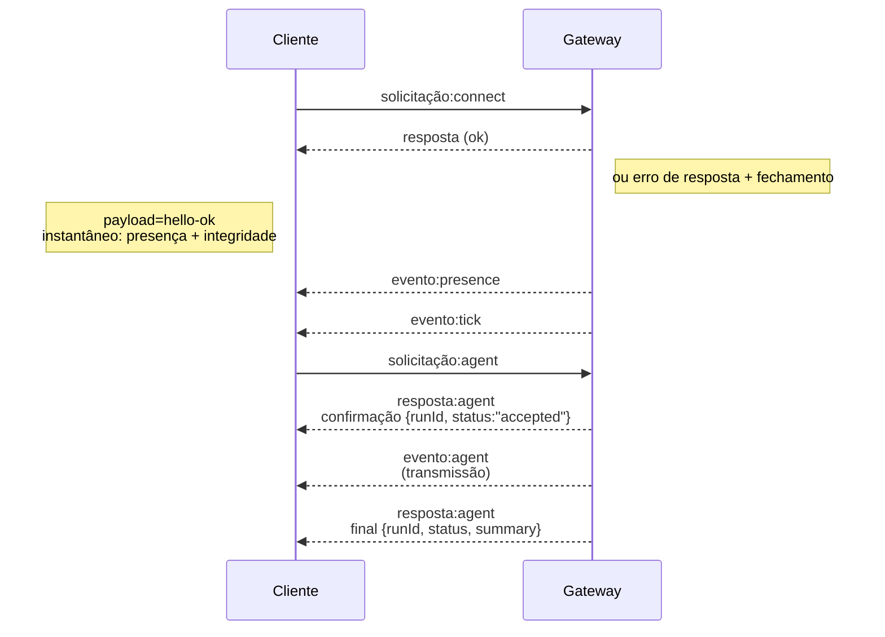

---
read_when:
    - Trabalhando no protocolo do Gateway, nos clientes ou nos transportes
summary: Arquitetura, componentes e fluxos de clientes do Gateway WebSocket
title: Arquitetura do Gateway
x-i18n:
    generated_at: "2026-07-12T15:04:25Z"
    model: gpt-5.6
    postprocess_version: locale-links-v1
    prompt_version: 15
    provider: openai
    source_hash: f8054bd87f738b957c24f8d6965d55365de2293d44902530a9ba778afa597cc7
    source_path: concepts/architecture.md
    workflow: 16
---

## Visão geral

- Um único **Gateway** de longa duração é responsável por todas as interfaces de mensagens (WhatsApp via
  Baileys, Telegram via grammY, Slack, Discord, Signal, iMessage, WebChat).
- Clientes do plano de controle (aplicativo para macOS, CLI, interface web, automações) conectam-se ao
  Gateway por **WebSocket** no host de vinculação configurado (padrão:
  `127.0.0.1:18789`).
- **Nodes** (macOS/iOS/Android/sem interface gráfica) também se conectam por **WebSocket**, mas
  declaram `role: node` com recursos/comandos explícitos.
- Um Gateway por host; ele é o único local que abre uma sessão do WhatsApp.
- O **host do canvas** é servido pelo servidor HTTP do Gateway em:
  - `/__openclaw__/canvas/` (HTML/CSS/JS editável pelo agente)
  - `/__openclaw__/a2ui/` (host A2UI)

  Ele usa a mesma porta que o Gateway (padrão: `18789`).

## Componentes e fluxos

### Gateway (daemon)

- Mantém conexões com provedores.
- Expõe uma API WS tipada (solicitações, respostas e eventos enviados pelo servidor).
- Valida quadros recebidos em relação ao JSON Schema.
- Emite eventos como `agent`, `chat`, `presence`, `health`, `heartbeat`, `cron`.

### Clientes (aplicativo para Mac/CLI/administração web)

- Uma conexão WS por cliente.
- Enviam solicitações (`health`, `status`, `send`, `agent`, `system-presence`).
- Inscrevem-se em eventos (`tick`, `agent`, `presence`, `shutdown`).

### Nodes (macOS/iOS/Android/sem interface gráfica)

- Conectam-se ao **mesmo servidor WS** com `role: node`.
- Fornecem uma identidade de dispositivo em `connect`; o pareamento é **baseado no dispositivo** (função `node`) e
  a aprovação fica no armazenamento de pareamento de dispositivos.
- Expõem comandos como `canvas.*`, `camera.*`, `screen.record`, `location.get`.

Detalhes do protocolo: [Protocolo do Gateway](/pt-BR/gateway/protocol)

### WebChat

- Interface estática que usa a API WS do Gateway para acessar o histórico do chat e enviar mensagens.
- Em configurações remotas, conecta-se pelo mesmo túnel SSH/Tailscale que os demais
  clientes.

## Ciclo de vida da conexão (cliente único)



## Protocolo de comunicação (resumo)

- Transporte: WebSocket, quadros de texto com payloads JSON.
- O primeiro quadro **deve** ser `connect`.
- Após o handshake:
  - Solicitações: `{type:"req", id, method, params}` → `{type:"res", id, ok, payload|error}`
  - Eventos: `{type:"event", event, payload, seq?, stateVersion?}`
- `hello-ok.features.methods` / `events` são metadados de descoberta, não um
  despejo gerado de todas as rotas auxiliares invocáveis.
- A autenticação por segredo compartilhado usa `connect.params.auth.token` ou
  `connect.params.auth.password`, dependendo do modo de autenticação configurado do gateway.
- Modos que incluem identidade, como Tailscale Serve
  (`gateway.auth.allowTailscale: true`) ou
  `gateway.auth.mode: "trusted-proxy"` fora de loopback, realizam a autenticação por meio dos
  cabeçalhos da solicitação, em vez de `connect.params.auth.*`.
- `gateway.auth.mode: "none"` para entrada privada desativa completamente a
  autenticação por segredo compartilhado; não use esse modo em entradas públicas/não confiáveis.
- Chaves de idempotência são obrigatórias para métodos com efeitos colaterais (`send`, `agent`),
  permitindo novas tentativas com segurança; o servidor mantém um cache temporário de desduplicação.
- Nodes devem incluir `role: "node"`, além de capacidades/comandos/permissões, em `connect`.

## Pareamento e confiança local

- Todos os clientes WS (operadores + nodes) incluem uma **identidade de dispositivo** em `connect`.
- Novos IDs de dispositivo exigem aprovação de pareamento; o Gateway emite um **token de dispositivo**
  para conexões subsequentes.
- Conexões locais diretas via loopback podem ser aprovadas automaticamente para manter fluida a experiência
  no mesmo host.
- O OpenClaw também tem um caminho restrito de autoconexão local ao backend/contêiner para
  fluxos auxiliares confiáveis com segredo compartilhado.
- Conexões pela tailnet e LAN, incluindo vínculos de tailnet no mesmo host, ainda exigem
  aprovação explícita de pareamento.
- Todas as conexões devem assinar o nonce de `connect.challenge`. O payload de assinatura `v3`
  também vincula `platform` e `deviceFamily`; o gateway fixa os metadados pareados ao
  reconectar e exige pareamento de reparo para alterações nos metadados.
- Conexões **não locais** ainda exigem aprovação explícita.
- A autenticação do Gateway (`gateway.auth.*`) ainda se aplica a **todas** as conexões, locais ou
  remotas.

Detalhes: [Protocolo do Gateway](/pt-BR/gateway/protocol), [Pareamento](/pt-BR/channels/pairing),
[Segurança](/pt-BR/gateway/security).

## Tipagem do protocolo e geração de código

- Os esquemas TypeBox definem o protocolo.
- O JSON Schema é gerado com base nesses esquemas.
- Os modelos Swift são gerados com base no JSON Schema.

## Acesso remoto

- Preferencial: Tailscale ou VPN.
- Alternativa: túnel SSH

  ```bash
  ssh -N -L 18789:127.0.0.1:18789 user@gateway-host
  ```

- O mesmo handshake + token de autenticação se aplicam pelo túnel.
- TLS + fixação opcional podem ser habilitados para WS em configurações remotas.

## Visão geral das operações

- Início: `openclaw gateway` (em primeiro plano, registra logs em stdout).
- Integridade: `health` via WS (também incluído em `hello-ok`).
- Supervisão: launchd/systemd para reinicialização automática.

## Invariantes

- Exatamente um Gateway controla uma única sessão do Baileys por host.
- O handshake é obrigatório; qualquer primeiro frame que não seja JSON ou de conexão resulta em encerramento imediato.
- Os eventos não são reproduzidos novamente; os clientes devem atualizar quando houver lacunas.

## Relacionado

- [Loop do agente](/pt-BR/concepts/agent-loop) — ciclo detalhado de execução do agente
- [Protocolo do Gateway](/pt-BR/gateway/protocol) — contrato do protocolo WebSocket
- [Fila](/pt-BR/concepts/queue) — fila de comandos e concorrência
- [Segurança](/pt-BR/gateway/security) — modelo de confiança e reforço de segurança
