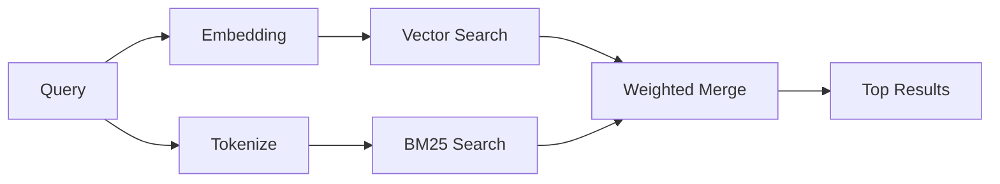

---
read_when:
    - Você quer entender como o memory_search funciona
    - Você quer escolher um provedor de incorporações
    - Você quer ajustar a qualidade da busca
summary: Como a busca de memória encontra notas relevantes usando embeddings e recuperação híbrida
title: Busca na memória
x-i18n:
    generated_at: "2026-05-02T05:45:12Z"
    model: gpt-5.5
    provider: openai
    source_hash: 2a71fb0809d5c70689e8046f854e4b4b4e79f45769ac2964e40a762ebb4e91a8
    source_path: concepts/memory-search.md
    workflow: 16
---

`memory_search` encontra notas relevantes dos seus arquivos de memória, mesmo quando a
redação difere do texto original. Ele funciona indexando a memória em pequenos
trechos e pesquisando neles usando embeddings, palavras-chave ou ambos.

## Início rápido

Se você tiver uma assinatura do GitHub Copilot, uma chave de API da OpenAI,
Gemini, Voyage ou Mistral configurada, a busca na memória funcionará
automaticamente. Para definir um provedor explicitamente:

```json5
{
  agents: {
    defaults: {
      memorySearch: {
        provider: "openai", // or "gemini", "local", "ollama", etc.
      },
    },
  },
}
```

Para configurações com vários endpoints, `provider` também pode ser uma entrada
personalizada de `models.providers.<id>`, como `ollama-5080`, quando esse
provedor define `api: "ollama"` ou outro proprietário de adaptador de embedding.

Para embeddings locais sem chave de API, defina `provider: "local"`. Checkouts
do código-fonte ainda podem exigir aprovação de build nativo:
`pnpm approve-builds` e depois `pnpm rebuild node-llama-cpp`.

Alguns endpoints de embedding compatíveis com OpenAI exigem rótulos assimétricos,
como `input_type: "query"` para buscas e `input_type: "document"` ou `"passage"`
para trechos indexados. Configure-os com `memorySearch.queryInputType` e
`memorySearch.documentInputType`; consulte a [referência de configuração de memória](/pt-BR/reference/memory-config#provider-specific-config).

## Provedores compatíveis

| Provedor       | ID               | Precisa de chave de API | Observações                                                |
| -------------- | ---------------- | ----------------------- | ---------------------------------------------------------- |
| Bedrock        | `bedrock`        | Não                     | Detectado automaticamente quando a cadeia de credenciais da AWS é resolvida |
| Gemini         | `gemini`         | Sim                     | Oferece suporte à indexação de imagem/áudio                |
| GitHub Copilot | `github-copilot` | Não                     | Detectado automaticamente, usa a assinatura do Copilot     |
| Local          | `local`          | Não                     | Modelo GGUF, download de ~0,6 GB                           |
| Mistral        | `mistral`        | Sim                     | Detectado automaticamente                                 |
| Ollama         | `ollama`         | Não                     | Local, deve ser definido explicitamente                    |
| OpenAI         | `openai`         | Sim                     | Detectado automaticamente, rápido                         |
| Voyage         | `voyage`         | Sim                     | Detectado automaticamente                                 |

## Como a busca funciona

O OpenClaw executa dois caminhos de recuperação em paralelo e mescla os resultados:



- **Busca vetorial** encontra notas com significado semelhante ("gateway host" corresponde
  a "a máquina que executa o OpenClaw").
- **Busca por palavras-chave BM25** encontra correspondências exatas (IDs, strings de erro,
  chaves de configuração).

Se apenas um caminho estiver disponível (sem embeddings ou sem FTS), o outro será executado sozinho.

Quando embeddings estão indisponíveis, o OpenClaw ainda usa ranqueamento lexical sobre os resultados de FTS em vez de recorrer apenas à ordenação bruta por correspondência exata. Esse modo degradado impulsiona trechos com maior cobertura dos termos da consulta e caminhos de arquivos relevantes, o que mantém a revocação útil mesmo sem `sqlite-vec` ou um provedor de embedding.

## Melhorando a qualidade da busca

Dois recursos opcionais ajudam quando você tem um histórico grande de notas:

### Decaimento temporal

Notas antigas perdem peso de ranqueamento gradualmente para que informações recentes apareçam primeiro.
Com a meia-vida padrão de 30 dias, uma nota do mês passado pontua 50% do
seu peso original. Arquivos perenes como `MEMORY.md` nunca sofrem decaimento.

<Tip>
Ative o decaimento temporal se o seu agente tiver meses de notas diárias e
informações obsoletas continuarem ficando acima do contexto recente.
</Tip>

### MMR (diversidade)

Reduz resultados redundantes. Se cinco notas mencionam a mesma configuração de roteador, o MMR
garante que os principais resultados cubram tópicos diferentes em vez de se repetirem.

<Tip>
Ative o MMR se `memory_search` continuar retornando trechos quase duplicados de
notas diárias diferentes.
</Tip>

### Ativar ambos

```json5
{
  agents: {
    defaults: {
      memorySearch: {
        query: {
          hybrid: {
            mmr: { enabled: true },
            temporalDecay: { enabled: true },
          },
        },
      },
    },
  },
}
```

## Memória multimodal

Com o Gemini Embedding 2, você pode indexar imagens e arquivos de áudio junto com
Markdown. As consultas de busca continuam sendo texto, mas correspondem a conteúdo
visual e de áudio. Consulte a [referência de configuração de memória](/pt-BR/reference/memory-config) para
a configuração.

## Busca na memória da sessão

Você pode opcionalmente indexar transcrições de sessão para que `memory_search` possa lembrar
conversas anteriores. Isso é opcional via
`memorySearch.experimental.sessionMemory`. Consulte a
[referência de configuração](/pt-BR/reference/memory-config) para obter detalhes.

## Solução de problemas

**Sem resultados?** Execute `openclaw memory status` para verificar o índice. Se estiver vazio, execute
`openclaw memory index --force`.

**Apenas correspondências por palavra-chave?** Seu provedor de embedding pode não estar configurado. Verifique
`openclaw memory status --deep`.

**Embeddings locais expiram?** `ollama`, `lmstudio` e `local` usam um tempo limite
maior para lote inline por padrão. Se o host estiver simplesmente lento, defina
`agents.defaults.memorySearch.sync.embeddingBatchTimeoutSeconds` e execute novamente
`openclaw memory index --force`.

**Texto CJK não encontrado?** Reconstrua o índice FTS com
`openclaw memory index --force`.

## Leitura adicional

- [Active Memory](/pt-BR/concepts/active-memory) -- memória de subagente para sessões de chat interativas
- [Memória](/pt-BR/concepts/memory) -- layout de arquivos, backends, ferramentas
- [Referência de configuração de memória](/pt-BR/reference/memory-config) -- todos os controles de configuração

## Relacionado

- [Visão geral da memória](/pt-BR/concepts/memory)
- [Active Memory](/pt-BR/concepts/active-memory)
- [Mecanismo de memória integrado](/pt-BR/concepts/memory-builtin)
