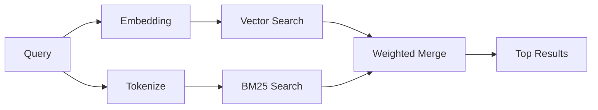

---
read_when:
    - Você quer entender como memory_search funciona
    - Você quer escolher um provedor de embeddings
    - Você quer ajustar a qualidade da busca
summary: Como a busca na memória encontra notas relevantes usando embeddings e recuperação híbrida
title: Busca na memória
x-i18n:
    generated_at: "2026-06-27T17:25:07Z"
    model: gpt-5.5
    postprocess_version: locale-links-v1
    provider: openai
    source_hash: b0bcb8cf400100ba8b6ddbb46bdf8b2a89a8bc32a550ee6df47c874e7e9e0879
    source_path: concepts/memory-search.md
    workflow: 16
---

`memory_search` encontra notas relevantes nos seus arquivos de memória, mesmo quando a
redação difere do texto original. Ele funciona indexando a memória em pequenos
trechos e pesquisando-os usando embeddings, palavras-chave ou ambos.

## Início rápido

A pesquisa de memória usa embeddings da OpenAI por padrão. Para usar outro
backend de embedding, defina explicitamente um provedor:

```json5
{
  agents: {
    defaults: {
      memorySearch: {
        provider: "openai", // or "gemini", "local", "ollama", "openai-compatible", etc.
      },
    },
  },
}
```

Para configurações com múltiplos endpoints e provedores específicos de memória,
`provider` também pode ser uma entrada personalizada `models.providers.<id>`,
como `ollama-5080`, quando esse provedor define `api: "ollama"` ou outro
proprietário de adaptador de embedding de memória.

Para embeddings locais sem chave de API, instale
`@openclaw/llama-cpp-provider` e defina `provider: "local"`. Checkouts de origem
ainda podem exigir aprovação de build nativo: `pnpm approve-builds` e depois
`pnpm rebuild node-llama-cpp`.

Alguns endpoints de embedding compatíveis com OpenAI exigem rótulos
assimétricos, como `input_type: "query"` para pesquisas e
`input_type: "document"` ou `"passage"` para trechos indexados. Configure-os com
`memorySearch.queryInputType` e `memorySearch.documentInputType`; consulte a
[referência de configuração de memória](/pt-BR/reference/memory-config#provider-specific-config).

## Provedores compatíveis

| Provedor          | ID                  | Precisa de chave de API | Observações                         |
| ----------------- | ------------------- | ------------- | ----------------------------- |
| Bedrock           | `bedrock`           | Não            | Usa a cadeia de credenciais da AWS     |
| DeepInfra         | `deepinfra`         | Sim           | Padrão: `BAAI/bge-m3`        |
| Gemini            | `gemini`            | Sim           | Compatível com indexação de imagem/áudio |
| GitHub Copilot    | `github-copilot`    | Não            | Usa assinatura do Copilot     |
| Local             | `local`             | Não            | Modelo GGUF, download de ~0,6 GB  |
| Mistral           | `mistral`           | Sim           |                               |
| Ollama            | `ollama`            | Não            | Local/auto-hospedado             |
| OpenAI            | `openai`            | Sim           | Padrão                       |
| Compatível com OpenAI | `openai-compatible` | Geralmente       | `/v1/embeddings` genérico      |
| Voyage            | `voyage`            | Sim           |                               |

## Como a pesquisa funciona

O OpenClaw executa dois caminhos de recuperação em paralelo e mescla os resultados:



- **Pesquisa vetorial** encontra notas com significado semelhante ("gateway host" corresponde a
  "the machine running OpenClaw").
- **Pesquisa por palavra-chave BM25** encontra correspondências exatas (IDs, strings de erro, chaves de
  configuração).

Se apenas um caminho estiver disponível, o outro será executado sozinho. O modo
intencional somente FTS (`provider: "none"`) e a seleção automática/padrão de
provedor ainda podem usar classificação lexical quando embeddings não estão disponíveis.

Provedores explícitos de embedding não locais são diferentes. Se você definir
`memorySearch.provider` como um provedor concreto com backend remoto e esse
provedor estiver indisponível em tempo de execução, `memory_search` informará que a memória está indisponível em vez
de usar silenciosamente resultados somente FTS. Isso mantém visível um provedor
semântico configurado que está quebrado. Defina `provider: "none"` para recuperação deliberada somente FTS ou corrija
a configuração de provedor/autenticação para restaurar a classificação semântica.

## Como melhorar a qualidade da pesquisa

Dois recursos opcionais ajudam quando você tem um histórico grande de notas:

### Decaimento temporal

Notas antigas perdem gradualmente peso de classificação para que informações recentes apareçam primeiro.
Com a meia-vida padrão de 30 dias, uma nota do mês passado pontua com 50% do
seu peso original. Arquivos perenes como `MEMORY.md` nunca sofrem decaimento.

<Tip>
Ative o decaimento temporal se o seu agente tiver meses de notas diárias e informações obsoletas
continuarem superando o contexto recente.
</Tip>

### MMR (diversidade)

Reduz resultados redundantes. Se cinco notas mencionarem a mesma configuração de roteador, o MMR
garante que os principais resultados cubram tópicos diferentes em vez de se repetirem.

<Tip>
Ative o MMR se `memory_search` continuar retornando trechos quase duplicados de
notas diárias diferentes.
</Tip>

### Ativar ambos

```json5
{
  agents: {
    defaults: {
      memorySearch: {
        query: {
          hybrid: {
            mmr: { enabled: true },
            temporalDecay: { enabled: true },
          },
        },
      },
    },
  },
}
```

## Memória multimodal

Com o Gemini Embedding 2, você pode indexar imagens e arquivos de áudio junto com
Markdown. As consultas de pesquisa continuam sendo texto, mas correspondem a conteúdo visual e de áudio.
Consulte a [referência de configuração de memória](/pt-BR/reference/memory-config) para
a configuração.

## Pesquisa de memória de sessão

Opcionalmente, você pode indexar transcrições de sessão para que `memory_search` possa recuperar
conversas anteriores. Isso é opcional via
`memorySearch.experimental.sessionMemory`. Consulte a
[referência de configuração](/pt-BR/reference/memory-config) para obter detalhes.

## Solução de problemas

**Sem resultados?** Execute `openclaw memory status` para verificar o índice. Se estiver vazio, execute
`openclaw memory index --force`.

**Apenas correspondências por palavra-chave?** Seu provedor de embedding pode não estar configurado. Verifique
`openclaw memory status --deep`.

**Embeddings locais atingem timeout?** `ollama`, `lmstudio` e `local` usam um timeout de lote inline mais longo
por padrão. Se o host estiver simplesmente lento, defina
`agents.defaults.memorySearch.sync.embeddingBatchTimeoutSeconds` e execute novamente
`openclaw memory index --force`.

**Texto CJK não encontrado?** Recrie o índice FTS com
`openclaw memory index --force`.

## Leitura adicional

- [Active Memory](/pt-BR/concepts/active-memory) -- memória de subagente para sessões de chat interativas
- [Memória](/pt-BR/concepts/memory) -- layout de arquivos, backends, ferramentas
- [Referência de configuração de memória](/pt-BR/reference/memory-config) -- todos os controles de configuração

## Relacionado

- [Visão geral da memória](/pt-BR/concepts/memory)
- [Active Memory](/pt-BR/concepts/active-memory)
- [Mecanismo de memória integrado](/pt-BR/concepts/memory-builtin)
