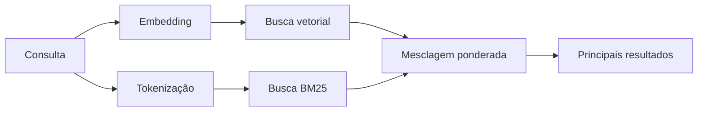

---
read_when:
    - Você quer entender como `memory_search` funciona
    - Você quer escolher um provider de embeddings
    - Você quer ajustar a qualidade da busca
summary: Como a busca de memória encontra notas relevantes usando embeddings e recuperação híbrida
title: Busca de memória
x-i18n:
    generated_at: "2026-04-25T13:44:48Z"
    model: gpt-5.4
    provider: openai
    source_hash: 5cc6bbaf7b0a755bbe44d3b1b06eed7f437ebdc41a81c48cca64bd08bbc546b7
    source_path: concepts/memory-search.md
    workflow: 15
---

`memory_search` encontra notas relevantes nos seus arquivos de memória, mesmo quando a
redação difere do texto original. Ele funciona indexando a memória em pequenos
fragmentos e pesquisando neles usando embeddings, palavras-chave ou ambos.

## Início rápido

Se você tiver uma assinatura do GitHub Copilot, uma chave de API da OpenAI, Gemini, Voyage ou Mistral
configurada, a busca de memória funcionará automaticamente. Para definir um provider
explicitamente:

```json5
{
  agents: {
    defaults: {
      memorySearch: {
        provider: "openai", // ou "gemini", "local", "ollama", etc.
      },
    },
  },
}
```

Para embeddings locais sem chave de API, instale o pacote de runtime opcional `node-llama-cpp`
ao lado do OpenClaw e use `provider: "local"`.

## Providers compatíveis

| Provider       | ID               | Precisa de chave de API | Observações                                           |
| -------------- | ---------------- | ----------------------- | ----------------------------------------------------- |
| Bedrock        | `bedrock`        | Não                     | Detectado automaticamente quando a cadeia de credenciais AWS é resolvida |
| Gemini         | `gemini`         | Sim                     | Compatível com indexação de imagem/áudio              |
| GitHub Copilot | `github-copilot` | Não                     | Detectado automaticamente, usa assinatura do Copilot  |
| Local          | `local`          | Não                     | Modelo GGUF, download de ~0,6 GB                      |
| Mistral        | `mistral`        | Sim                     | Detectado automaticamente                             |
| Ollama         | `ollama`         | Não                     | Local, deve ser definido explicitamente               |
| OpenAI         | `openai`         | Sim                     | Detectado automaticamente, rápido                     |
| Voyage         | `voyage`         | Sim                     | Detectado automaticamente                             |

## Como a busca funciona

O OpenClaw executa dois caminhos de recuperação em paralelo e mescla os resultados:



- **Busca vetorial** encontra notas com significado semelhante ("gateway host" corresponde a
  "a máquina que executa o OpenClaw").
- **Busca por palavra-chave BM25** encontra correspondências exatas (IDs, strings de erro, chaves de
  configuração).

Se apenas um caminho estiver disponível (sem embeddings ou sem FTS), o outro é executado sozinho.

Quando embeddings não estão disponíveis, o OpenClaw ainda usa classificação lexical sobre resultados de FTS em vez de fazer fallback apenas para ordenação bruta por correspondência exata. Esse modo degradado impulsiona fragmentos com cobertura mais forte dos termos da consulta e caminhos de arquivo relevantes, o que mantém o recall útil mesmo sem `sqlite-vec` ou um provider de embeddings.

## Melhorando a qualidade da busca

Dois recursos opcionais ajudam quando você tem um histórico grande de notas:

### Decaimento temporal

Notas antigas perdem peso gradualmente no ranking, para que informações recentes apareçam primeiro.
Com a meia-vida padrão de 30 dias, uma nota do mês passado recebe 50% de
seu peso original. Arquivos perenes como `MEMORY.md` nunca sofrem decaimento.

<Tip>
Ative o decaimento temporal se o seu agente tiver meses de notas diárias e
informações desatualizadas continuarem superando o contexto recente.
</Tip>

### MMR (diversidade)

Reduz resultados redundantes. Se cinco notas mencionarem a mesma configuração de roteador, o MMR
garante que os principais resultados cubram tópicos diferentes em vez de repetir.

<Tip>
Ative MMR se `memory_search` continuar retornando snippets quase duplicados de
diferentes notas diárias.
</Tip>

### Ativar ambos

```json5
{
  agents: {
    defaults: {
      memorySearch: {
        query: {
          hybrid: {
            mmr: { enabled: true },
            temporalDecay: { enabled: true },
          },
        },
      },
    },
  },
}
```

## Memória multimodal

Com Gemini Embedding 2, você pode indexar imagens e arquivos de áudio junto com
Markdown. As consultas de busca continuam sendo texto, mas correspondem a conteúdo
visual e de áudio. Consulte a [Referência de configuração de memória](/pt-BR/reference/memory-config) para
configuração.

## Busca na memória de sessão

Opcionalmente, você pode indexar transcrições de sessão para que `memory_search` possa recuperar
conversas anteriores. Isso é ativado por opt-in via
`memorySearch.experimental.sessionMemory`. Consulte a
[referência de configuração](/pt-BR/reference/memory-config) para detalhes.

## Solução de problemas

**Sem resultados?** Execute `openclaw memory status` para verificar o índice. Se estiver vazio, execute
`openclaw memory index --force`.

**Somente correspondências por palavra-chave?** Seu provider de embeddings pode não estar configurado. Verifique
`openclaw memory status --deep`.

**Texto CJK não encontrado?** Reconstrua o índice FTS com
`openclaw memory index --force`.

## Leitura adicional

- [Active Memory](/pt-BR/concepts/active-memory) -- memória de subagente para sessões interativas de chat
- [Memória](/pt-BR/concepts/memory) -- layout de arquivos, backends, ferramentas
- [Referência de configuração de memória](/pt-BR/reference/memory-config) -- todos os controles de configuração

## Relacionado

- [Visão geral da memória](/pt-BR/concepts/memory)
- [Active Memory](/pt-BR/concepts/active-memory)
- [Mecanismo de memória embutido](/pt-BR/concepts/memory-builtin)
