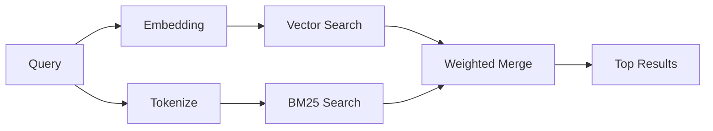

---
read_when:
    - Você quer entender como `memory_search` funciona
    - Você quer escolher um provedor de embeddings
    - Você quer ajustar a qualidade da busca
summary: Como a busca de memória encontra notas relevantes usando embeddings e recuperação híbrida
title: Busca de Memória
x-i18n:
    generated_at: "2026-04-12T23:28:06Z"
    model: gpt-5.4
    provider: openai
    source_hash: 71fde251b7d2dc455574aa458e7e09136f30613609ad8dafeafd53b2729a0310
    source_path: concepts/memory-search.md
    workflow: 15
---

# Busca de Memória

`memory_search` encontra notas relevantes nos seus arquivos de memória, mesmo quando a formulação é diferente do texto original. Ele funciona indexando a memória em pequenos blocos e pesquisando neles usando embeddings, palavras-chave ou ambos.

## Início rápido

Se você tiver uma chave de API da OpenAI, Gemini, Voyage ou Mistral configurada, a busca de memória funciona automaticamente. Para definir um provedor explicitamente:

```json5
{
  agents: {
    defaults: {
      memorySearch: {
        provider: "openai", // ou "gemini", "local", "ollama", etc.
      },
    },
  },
}
```

Para embeddings locais sem chave de API, use `provider: "local"` (requer `node-llama-cpp`).

## Provedores compatíveis

| Provedor | ID        | Precisa de chave de API | Observações                                           |
| -------- | --------- | ----------------------- | ----------------------------------------------------- |
| OpenAI   | `openai`  | Sim                     | Detectado automaticamente, rápido                     |
| Gemini   | `gemini`  | Sim                     | Suporta indexação de imagens/áudio                    |
| Voyage   | `voyage`  | Sim                     | Detectado automaticamente                             |
| Mistral  | `mistral` | Sim                     | Detectado automaticamente                             |
| Bedrock  | `bedrock` | Não                     | Detectado automaticamente quando a cadeia de credenciais da AWS é resolvida |
| Ollama   | `ollama`  | Não                     | Local, deve ser definido explicitamente               |
| Local    | `local`   | Não                     | Modelo GGUF, download de ~0,6 GB                      |

## Como a busca funciona

O OpenClaw executa dois caminhos de recuperação em paralelo e mescla os resultados:



- **Busca vetorial** encontra notas com significado semelhante ("gateway host" corresponde a "a máquina que executa o OpenClaw").
- **Busca por palavras-chave com BM25** encontra correspondências exatas (IDs, strings de erro, chaves de configuração).

Se apenas um caminho estiver disponível (sem embeddings ou sem FTS), o outro será executado sozinho.

Quando embeddings não estão disponíveis, o OpenClaw ainda usa classificação lexical sobre os resultados de FTS em vez de recorrer apenas à ordenação bruta por correspondência exata. Esse modo degradado prioriza blocos com cobertura mais forte dos termos da consulta e caminhos de arquivo relevantes, o que mantém a revocação útil mesmo sem `sqlite-vec` ou um provedor de embeddings.

## Melhorando a qualidade da busca

Dois recursos opcionais ajudam quando você tem um grande histórico de notas:

### Decaimento temporal

Notas antigas perdem peso de classificação gradualmente para que informações recentes apareçam primeiro.
Com a meia-vida padrão de 30 dias, uma nota do mês passado pontua com 50% do
peso original. Arquivos perenes como `MEMORY.md` nunca sofrem decaimento.

<Tip>
Ative o decaimento temporal se o seu agente tiver meses de notas diárias e informações desatualizadas continuarem ficando acima do contexto recente.
</Tip>

### MMR (diversidade)

Reduz resultados redundantes. Se cinco notas mencionarem a mesma configuração de roteador, o MMR garante que os principais resultados cubram tópicos diferentes em vez de se repetirem.

<Tip>
Ative o MMR se `memory_search` continuar retornando trechos quase duplicados de diferentes notas diárias.
</Tip>

### Ativar ambos

```json5
{
  agents: {
    defaults: {
      memorySearch: {
        query: {
          hybrid: {
            mmr: { enabled: true },
            temporalDecay: { enabled: true },
          },
        },
      },
    },
  },
}
```

## Memória multimodal

Com Gemini Embedding 2, você pode indexar imagens e arquivos de áudio junto com
Markdown. As consultas de busca continuam sendo texto, mas correspondem ao conteúdo visual e de áudio. Consulte a [referência de configuração de memória](/pt-BR/reference/memory-config) para a configuração.

## Busca na memória da sessão

Você pode opcionalmente indexar transcrições de sessão para que `memory_search` possa recuperar conversas anteriores. Isso é opt-in via `memorySearch.experimental.sessionMemory`. Consulte a [referência de configuração](/pt-BR/reference/memory-config) para mais detalhes.

## Solução de problemas

**Sem resultados?** Execute `openclaw memory status` para verificar o índice. Se estiver vazio, execute `openclaw memory index --force`.

**Apenas correspondências por palavra-chave?** Seu provedor de embeddings pode não estar configurado. Verifique com `openclaw memory status --deep`.

**Texto CJK não encontrado?** Reconstrua o índice FTS com `openclaw memory index --force`.

## Leitura adicional

- [Active Memory](/pt-BR/concepts/active-memory) -- memória de subagente para sessões de chat interativas
- [Memória](/pt-BR/concepts/memory) -- layout de arquivos, backends, ferramentas
- [Referência de configuração de memória](/pt-BR/reference/memory-config) -- todas as opções de configuração
