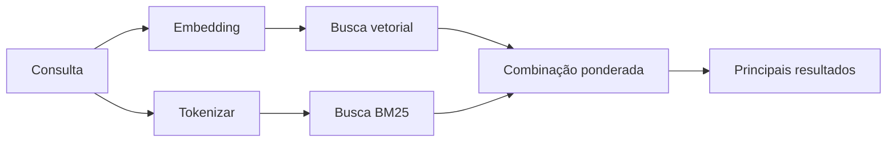

---
read_when:
    - Você quer entender como `memory_search` funciona
    - Você quer escolher um provedor de embeddings
    - Você quer ajustar a qualidade da pesquisa
summary: Como a busca de memória encontra notas relevantes usando embeddings e recuperação híbrida
title: Pesquisa de memória
x-i18n:
    generated_at: "2026-07-12T15:09:23Z"
    model: gpt-5.6
    postprocess_version: locale-links-v1
    prompt_version: 15
    provider: openai
    source_hash: 2ae0830843fba28c24159d85425240051fb8caf086cd0563d3091890045dcfad
    source_path: concepts/memory-search.md
    workflow: 16
---

`memory_search` encontra notas relevantes nos seus arquivos de memória, mesmo quando a
redação difere do texto original. Ele divide a memória em pequenos trechos e
faz buscas neles usando embeddings, palavras-chave ou ambos.

## Início rápido

O OpenClaw usa embeddings da OpenAI por padrão. Para usar outro provedor, defina-o
explicitamente:

```json5
{
  agents: {
    defaults: {
      memorySearch: {
        provider: "openai", // ou "gemini", "voyage", "mistral", "bedrock", "local", "ollama", "lmstudio", "github-copilot", "openai-compatible"
      },
    },
  },
}
```

`provider` também pode referenciar uma entrada personalizada `models.providers.<id>` (por
exemplo, `ollama-5080`), desde que essa entrada defina `api` como `"ollama"` ou
outro ID de provedor com um adaptador de embeddings de memória.

Para embeddings locais sem chave de API, instale o plugin oficial do provedor
llama.cpp e defina `provider: "local"`:

```bash
openclaw plugins install @openclaw/llama-cpp-provider
```

Checkouts do código-fonte ainda exigem aprovação da compilação nativa: `pnpm approve-builds` e, em seguida,
`pnpm rebuild node-llama-cpp`.

Alguns endpoints de embeddings compatíveis com OpenAI exigem rótulos assimétricos de `input_type`,
como `"query"` para buscas e `"document"`/`"passage"` para trechos
indexados. Defina-os com `queryInputType` e `documentInputType`; consulte a
[Referência de configuração de memória](/pt-BR/reference/memory-config#provider-specific-config).

## Provedores compatíveis

| Provedor          | ID                  | Exige chave de API | Observações                             |
| ----------------- | ------------------- | ------------------ | --------------------------------------- |
| Bedrock           | `bedrock`           | Não                | Usa a cadeia de credenciais da AWS      |
| DeepInfra         | `deepinfra`         | Sim                | Modelo padrão `BAAI/bge-m3`             |
| Gemini            | `gemini`            | Sim                | Compatível com indexação de imagem/áudio |
| GitHub Copilot    | `github-copilot`    | Não                | Usa sua assinatura do Copilot           |
| Local             | `local`             | Não                | Modelo GGUF, download automático de ~0.6 GB |
| LM Studio         | `lmstudio`          | Não                | Servidor local/auto-hospedado            |
| Mistral           | `mistral`           | Sim                |                                         |
| Ollama            | `ollama`            | Não                | Servidor local/auto-hospedado            |
| OpenAI            | `openai`            | Sim                | Padrão                                  |
| Compatível com OpenAI | `openai-compatible` | Geralmente     | Endpoint genérico `/v1/embeddings`      |
| Voyage            | `voyage`            | Sim                |                                         |

## Como a busca funciona

O OpenClaw executa duas rotas de recuperação em paralelo e combina os resultados:



- **Busca vetorial** encontra significados semelhantes ("host do gateway" corresponde a "a
  máquina que executa o OpenClaw").
- **Busca por palavras-chave BM25** encontra termos exatos (IDs, strings de erro, chaves de
  configuração).
- **Busca por nome de arquivo** indexa os caminhos separadamente do conteúdo das notas. Caminhos completos
  exatos, nomes de arquivos e nomes sem extensão aparecem antes de correspondências parciais de caminhos,
  enquanto os trechos e as pontuações de palavras-chave do conteúdo ainda vêm do conteúdo das notas.

Se apenas uma rota estiver disponível, ela será executada sozinha.

**Modo somente FTS.** Defina `provider: "none"` para desativar intencionalmente os embeddings
e buscar apenas com palavras-chave. Deixar `provider` sem definição ou definido como `"auto"`
também recorre à classificação apenas por palavras-chave se nenhuma autenticação de embeddings estiver configurada,
sem gerar erro, assim como `provider: "local"` (o provedor
GGUF/llama.cpp) quando falha.

**Provedor explícito indisponível.** Se você nomear explicitamente qualquer outro provedor
(por exemplo, `openai`, `ollama`, `gemini`) e ele ficar indisponível no
momento da solicitação (autenticação incorreta, falha de rede), `memory_search` informa que a memória está
indisponível em vez de degradar silenciosamente para resultados somente FTS. Isso mantém
visível um provedor configurado com problemas. Defina `provider: "none"` para uma
recuperação deliberadamente somente FTS ou corrija a configuração do provedor/autenticação para restaurar a classificação
semântica.

## Como melhorar a qualidade da busca

Dois recursos opcionais ajudam quando há um grande histórico de notas.

### Decaimento temporal

Notas antigas perdem gradualmente peso na classificação para que informações recentes apareçam primeiro.
Com a meia-vida padrão de 30 dias, uma nota do mês passado recebe 50% do seu
peso original. `MEMORY.md` e outros arquivos sem data em `memory/` são
perenes e nunca sofrem decaimento; apenas arquivos datados `memory/YYYY-MM-DD.md` sofrem decaimento.

<Tip>
Ative este recurso se o seu agente tiver meses de notas diárias e informações desatualizadas
continuarem aparecendo acima do contexto recente.
</Tip>

### MMR (diversidade)

Reduz resultados redundantes. Se cinco notas mencionarem a mesma configuração de roteador,
o MMR garante que os principais resultados abranjam diferentes tópicos em vez de se repetirem.

<Tip>
Ative este recurso se `memory_search` continuar retornando trechos quase duplicados de
diferentes notas diárias.
</Tip>

### Ativar ambos

```json5
{
  agents: {
    defaults: {
      memorySearch: {
        query: {
          hybrid: {
            mmr: { enabled: true },
            temporalDecay: { enabled: true },
          },
        },
      },
    },
  },
}
```

## Memória multimodal

Com `gemini-embedding-2-preview`, você pode indexar imagens e áudio junto com
Markdown. Isso se aplica apenas aos arquivos em `memorySearch.extraPaths`; as raízes
de memória padrão (`MEMORY.md`, `memory/*.md`) permanecem restritas a Markdown. As consultas de busca
continuam sendo texto, mas encontram correspondências em conteúdo visual e de áudio. Consulte a
[Referência de configuração de memória](/pt-BR/reference/memory-config#multimodal-memory-gemini)
para saber como configurar.

## Busca na memória de sessões

Para recuperação exata de texto completo nas transcrições de sessões, use [`sessions_search`](/concepts/session-search)
e depois abra um resultado com `sessions_history`. A busca na memória de sessões continua sendo o complemento
semântico e experimental.

Opcionalmente, indexe as transcrições de sessões para que `memory_search` possa recuperar
conversas anteriores. Esse recurso é opcional: defina `experimental.sessionMemory: true` e adicione
`"sessions"` a `sources` (o valor padrão de `sources` é `["memory"]`).

Os resultados de sessões obedecem a `tools.sessions.visibility`: o padrão `"tree"` apenas
expõe a sessão atual e as sessões que ela iniciou. Para recuperar uma sessão não relacionada
do mesmo agente a partir de outra sessão (por exemplo, uma sessão despachada pelo gateway
a partir de uma DM), amplie a visibilidade para `"agent"`.

Ao usar o backend QMD, defina também `memory.qmd.sessions.enabled: true` para que
as transcrições sejam exportadas para a coleção QMD; `experimental.sessionMemory`
e `sources` sozinhos não exportam transcrições para o QMD. Consulte a
[referência de configuração](/pt-BR/reference/memory-config#session-memory-search-experimental).

## Solução de problemas

**Nenhum resultado?** Execute `openclaw memory status` para verificar o índice. Se estiver vazio, execute
`openclaw memory index --force`.

**Apenas correspondências de palavras-chave?** Seu provedor de embeddings pode não estar configurado. Verifique
`openclaw memory status --deep`.

**Os embeddings locais atingem o tempo limite?** `ollama`, `lmstudio` e `local` usam um tempo limite maior
para lotes em linha por padrão. Se o host estiver apenas lento, defina
`agents.defaults.memorySearch.sync.embeddingBatchTimeoutSeconds` e execute novamente
`openclaw memory index --force`.

**Texto CJK não encontrado?** Recrie o índice FTS com
`openclaw memory index --force`.

## Relacionados

- [Visão geral da memória](/pt-BR/concepts/memory)
- [Active Memory](/pt-BR/concepts/active-memory)
- [Mecanismo de memória integrado](/pt-BR/concepts/memory-builtin)
- [Referência de configuração de memória](/pt-BR/reference/memory-config)
