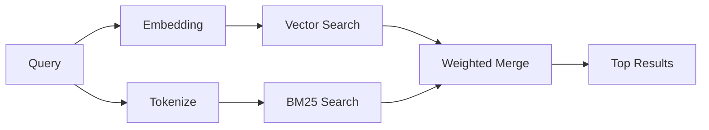

---
read_when:
    - Você quer entender como `memory_search` funciona
    - Você quer escolher um provedor de embeddings
    - Você quer ajustar a qualidade da busca
summary: Como a busca de memória encontra notas relevantes usando embeddings e recuperação híbrida
title: Busca de memória
x-i18n:
    generated_at: "2026-04-26T11:26:57Z"
    model: gpt-5.4
    provider: openai
    source_hash: 95d86fb3efe79aae92f5e3590f1c15fb0d8f3bb3301f8fe9a41f891e290d7a14
    source_path: concepts/memory-search.md
    workflow: 15
---

`memory_search` encontra notas relevantes dos seus arquivos de memória, mesmo quando a
redação difere do texto original. Ele funciona indexando a memória em pequenos
blocos e pesquisando neles usando embeddings, palavras-chave ou ambos.

## Início rápido

Se você tiver uma assinatura do GitHub Copilot, OpenAI, Gemini, Voyage ou Mistral
com chave de API configurada, a busca de memória funciona automaticamente. Para definir um provedor
explicitamente:

```json5
{
  agents: {
    defaults: {
      memorySearch: {
        provider: "openai", // ou "gemini", "local", "ollama", etc.
      },
    },
  },
}
```

Para embeddings locais sem chave de API, instale o pacote de runtime opcional `node-llama-cpp`
ao lado do OpenClaw e use `provider: "local"`.

## Provedores compatíveis

| Provedor         | ID               | Precisa de chave de API | Observações                                          |
| ---------------- | ---------------- | ----------------------- | ---------------------------------------------------- |
| Bedrock          | `bedrock`        | Não                     | Detectado automaticamente quando a cadeia de credenciais AWS é resolvida |
| Gemini           | `gemini`         | Sim                     | Compatível com indexação de imagem/áudio             |
| GitHub Copilot   | `github-copilot` | Não                     | Detectado automaticamente, usa assinatura do Copilot |
| Local            | `local`          | Não                     | Modelo GGUF, download de ~0,6 GB                     |
| Mistral          | `mistral`        | Sim                     | Detectado automaticamente                            |
| Ollama           | `ollama`         | Não                     | Local, deve ser definido explicitamente              |
| OpenAI           | `openai`         | Sim                     | Detectado automaticamente, rápido                    |
| Voyage           | `voyage`         | Sim                     | Detectado automaticamente                            |

## Como a busca funciona

O OpenClaw executa dois caminhos de recuperação em paralelo e mescla os resultados:



- **Busca vetorial** encontra notas com significado semelhante ("gateway host" corresponde a
  "the machine running OpenClaw").
- **Busca por palavra-chave BM25** encontra correspondências exatas (IDs, strings de erro, chaves
  de configuração).

Se apenas um caminho estiver disponível (sem embeddings ou sem FTS), o outro será executado sozinho.

Quando embeddings não estão disponíveis, o OpenClaw ainda usa classificação lexical sobre resultados FTS em vez de recorrer apenas à ordenação bruta por correspondência exata. Esse modo degradado impulsiona blocos com cobertura mais forte dos termos da consulta e caminhos de arquivo relevantes, o que mantém a recuperação útil mesmo sem `sqlite-vec` ou um provedor de embeddings.

## Melhorando a qualidade da busca

Dois recursos opcionais ajudam quando você tem um histórico grande de notas:

### Decaimento temporal

Notas antigas perdem gradualmente peso no ranking para que informações recentes apareçam primeiro.
Com a meia-vida padrão de 30 dias, uma nota do mês passado pontua com 50% do
peso original. Arquivos perenes como `MEMORY.md` nunca sofrem decaimento.

<Tip>
Ative o decaimento temporal se seu agente tiver meses de notas diárias e
informações desatualizadas continuarem ficando acima do contexto recente.
</Tip>

### MMR (diversidade)

Reduz resultados redundantes. Se cinco notas mencionarem a mesma configuração de roteador, o MMR
garante que os principais resultados cubram tópicos diferentes em vez de se repetirem.

<Tip>
Ative o MMR se `memory_search` continuar retornando trechos quase duplicados de
notas diárias diferentes.
</Tip>

### Ativar ambos

```json5
{
  agents: {
    defaults: {
      memorySearch: {
        query: {
          hybrid: {
            mmr: { enabled: true },
            temporalDecay: { enabled: true },
          },
        },
      },
    },
  },
}
```

## Memória multimodal

Com Gemini Embedding 2, você pode indexar imagens e arquivos de áudio junto com
Markdown. As consultas de busca continuam sendo texto, mas correspondem a conteúdo visual e de áudio. Consulte a [Referência de configuração de memória](/pt-BR/reference/memory-config) para
a configuração.

## Busca de memória da sessão

Opcionalmente, você pode indexar transcrições de sessão para que `memory_search` possa recuperar
conversas anteriores. Isso é opt-in via
`memorySearch.experimental.sessionMemory`. Consulte a
[referência de configuração](/pt-BR/reference/memory-config) para mais detalhes.

## Solução de problemas

**Sem resultados?** Execute `openclaw memory status` para verificar o índice. Se estiver vazio, execute
`openclaw memory index --force`.

**Apenas correspondências por palavra-chave?** Seu provedor de embeddings pode não estar configurado. Verifique
`openclaw memory status --deep`.

**Embeddings locais expiram por tempo limite?** `ollama`, `lmstudio` e `local` usam por padrão um
tempo limite mais longo para lote inline. Se o host estiver apenas lento, defina
`agents.defaults.memorySearch.sync.embeddingBatchTimeoutSeconds` e execute novamente
`openclaw memory index --force`.

**Texto CJK não é encontrado?** Recrie o índice FTS com
`openclaw memory index --force`.

## Leitura adicional

- [Active Memory](/pt-BR/concepts/active-memory) -- memória de subagente para sessões de chat interativas
- [Memória](/pt-BR/concepts/memory) -- layout de arquivo, backends, ferramentas
- [Referência de configuração de memória](/pt-BR/reference/memory-config) -- todos os ajustes de configuração

## Relacionados

- [Visão geral da memória](/pt-BR/concepts/memory)
- [Active Memory](/pt-BR/concepts/active-memory)
- [Mecanismo de memória embutido](/pt-BR/concepts/memory-builtin)
