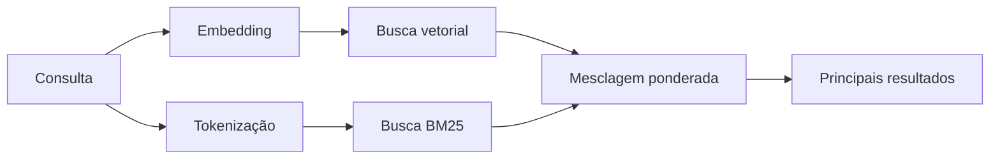

---
read_when:
    - Você quer entender como `memory_search` funciona
    - Você quer escolher um provedor de embedding
    - Você quer ajustar a qualidade da busca
summary: Como a busca de memória encontra notas relevantes usando embeddings e recuperação híbrida
title: Busca de memória
x-i18n:
    generated_at: "2026-04-24T05:48:19Z"
    model: gpt-5.4
    provider: openai
    source_hash: 04db62e519a691316ce40825c082918094bcaa9c36042cc8101c6504453d238e
    source_path: concepts/memory-search.md
    workflow: 15
---

`memory_search` encontra notas relevantes nos seus arquivos de memória, mesmo quando a
formulação é diferente do texto original. Ele funciona indexando a memória em pequenos
blocos e pesquisando neles usando embeddings, palavras-chave ou ambos.

## Início rápido

Se você tiver uma assinatura do GitHub Copilot, OpenAI, Gemini, Voyage ou uma chave de API
do Mistral configurada, a busca de memória funciona automaticamente. Para definir um provedor
explicitamente:

```json5
{
  agents: {
    defaults: {
      memorySearch: {
        provider: "openai", // ou "gemini", "local", "ollama", etc.
      },
    },
  },
}
```

Para embeddings locais sem chave de API, use `provider: "local"` (exige
node-llama-cpp).

## Provedores compatíveis

| Provedor        | ID               | Precisa de chave de API | Observações                                           |
| --------------- | ---------------- | ----------------------- | ----------------------------------------------------- |
| Bedrock         | `bedrock`        | Não                     | Detectado automaticamente quando a cadeia de credenciais AWS resolve |
| Gemini          | `gemini`         | Sim                     | Compatível com indexação de imagem/áudio              |
| GitHub Copilot  | `github-copilot` | Não                     | Detectado automaticamente, usa assinatura do Copilot  |
| Local           | `local`          | Não                     | Modelo GGUF, download de ~0,6 GB                      |
| Mistral         | `mistral`        | Sim                     | Detectado automaticamente                             |
| Ollama          | `ollama`         | Não                     | Local, precisa ser definido explicitamente            |
| OpenAI          | `openai`         | Sim                     | Detectado automaticamente, rápido                     |
| Voyage          | `voyage`         | Sim                     | Detectado automaticamente                             |

## Como a busca funciona

O OpenClaw executa dois caminhos de recuperação em paralelo e mescla os resultados:



- **Busca vetorial** encontra notas com significado semelhante ("gateway host" corresponde a
  "a máquina que executa o OpenClaw").
- **Busca por palavra-chave BM25** encontra correspondências exatas (IDs, strings de erro, chaves de configuração).

Se apenas um caminho estiver disponível (sem embeddings ou sem FTS), o outro roda sozinho.

Quando embeddings não estão disponíveis, o OpenClaw ainda usa ranqueamento lexical sobre resultados de FTS em vez de recorrer apenas à ordenação bruta por correspondência exata. Esse modo degradado reforça blocos com maior cobertura dos termos da consulta e caminhos de arquivo relevantes, o que mantém um recall útil mesmo sem `sqlite-vec` ou um provedor de embedding.

## Melhorando a qualidade da busca

Dois recursos opcionais ajudam quando você tem um histórico grande de notas:

### Decaimento temporal

Notas antigas perdem gradualmente peso no ranqueamento para que informações recentes apareçam primeiro.
Com a meia-vida padrão de 30 dias, uma nota do mês passado pontua 50% do seu
peso original. Arquivos perenes como `MEMORY.md` nunca sofrem decaimento.

<Tip>
Habilite o decaimento temporal se o seu agente tiver meses de notas diárias e informações antigas
continuarem superando o contexto recente no ranqueamento.
</Tip>

### MMR (diversidade)

Reduz resultados redundantes. Se cinco notas mencionarem a mesma configuração do roteador, o MMR
garante que os principais resultados cubram tópicos diferentes em vez de repetir.

<Tip>
Habilite MMR se `memory_search` continuar retornando trechos quase duplicados de
notas diárias diferentes.
</Tip>

### Habilitar ambos

```json5
{
  agents: {
    defaults: {
      memorySearch: {
        query: {
          hybrid: {
            mmr: { enabled: true },
            temporalDecay: { enabled: true },
          },
        },
      },
    },
  },
}
```

## Memória multimodal

Com Gemini Embedding 2, você pode indexar imagens e arquivos de áudio junto com
Markdown. As consultas de busca continuam sendo texto, mas correspondem a conteúdo visual e de áudio. Consulte a [referência de configuração de memória](/pt-BR/reference/memory-config) para a
configuração.

## Busca de memória de sessão

Opcionalmente, você pode indexar transcrições de sessão para que `memory_search` possa recuperar
conversas anteriores. Isso é opt-in via
`memorySearch.experimental.sessionMemory`. Consulte a
[referência de configuração](/pt-BR/reference/memory-config) para detalhes.

## Solução de problemas

**Sem resultados?** Execute `openclaw memory status` para verificar o índice. Se estiver vazio, execute
`openclaw memory index --force`.

**Apenas correspondências por palavra-chave?** Seu provedor de embedding pode não estar configurado. Verifique
`openclaw memory status --deep`.

**Texto em CJK não encontrado?** Reconstrua o índice FTS com
`openclaw memory index --force`.

## Leitura adicional

- [Active Memory](/pt-BR/concepts/active-memory) -- memória de subagente para sessões de chat interativas
- [Memory](/pt-BR/concepts/memory) -- estrutura de arquivos, backends, ferramentas
- [Referência de configuração de memória](/pt-BR/reference/memory-config) -- todos os controles de configuração

## Relacionado

- [Visão geral da memória](/pt-BR/concepts/memory)
- [Active Memory](/pt-BR/concepts/active-memory)
- [Mecanismo de memória integrado](/pt-BR/concepts/memory-builtin)
