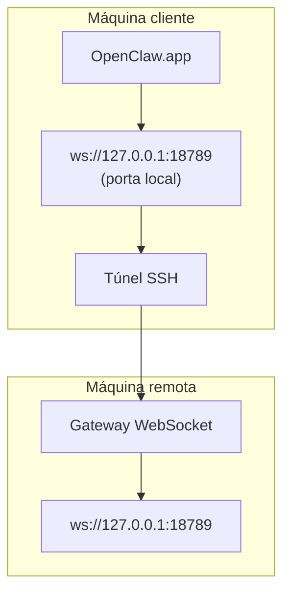

> Este conteúdo foi incorporado a [Acesso remoto](/pt-BR/gateway/remote#macos-persistent-ssh-tunnel-via-launchagent). Consulte essa página para ver o guia atual.

# Executando o OpenClaw.app com um Gateway remoto

O OpenClaw.app usa tunelamento SSH para se conectar a um gateway remoto. Este guia mostra como configurá-lo.

## Visão geral



## Configuração rápida

### Etapa 1: adicionar configuração SSH

Edite `~/.ssh/config` e adicione:

```ssh
Host remote-gateway
    HostName <REMOTE_IP>          # ex.: 172.27.187.184
    User <REMOTE_USER>            # ex.: jefferson
    LocalForward 18789 127.0.0.1:18789
    IdentityFile ~/.ssh/id_rsa
```

Substitua `<REMOTE_IP>` e `<REMOTE_USER>` pelos seus valores.

### Etapa 2: copiar a chave SSH

Copie sua chave pública para a máquina remota (digite a senha uma vez):

```bash
ssh-copy-id -i ~/.ssh/id_rsa <REMOTE_USER>@<REMOTE_IP>
```

### Etapa 3: configurar a autenticação do Gateway remoto

```bash
openclaw config set gateway.remote.token "<your-token>"
```

Use `gateway.remote.password` em vez disso se o seu gateway remoto usar autenticação por senha.
`OPENCLAW_GATEWAY_TOKEN` continua válido como substituição no nível do shell, mas a
configuração durável do cliente remoto é `gateway.remote.token` / `gateway.remote.password`.

### Etapa 4: iniciar o túnel SSH

```bash
ssh -N remote-gateway &
```

### Etapa 5: reiniciar o OpenClaw.app

```bash
# Feche o OpenClaw.app (⌘Q) e abra novamente:
open /path/to/OpenClaw.app
```

O aplicativo agora se conectará ao gateway remoto por meio do túnel SSH.

---

## Iniciar o túnel automaticamente no login

Para que o túnel SSH seja iniciado automaticamente quando você fizer login, crie um Launch Agent.

### Criar o arquivo PLIST

Salve isto como `~/Library/LaunchAgents/ai.openclaw.ssh-tunnel.plist`:

```xml
<?xml version="1.0" encoding="UTF-8"?>
<!DOCTYPE plist PUBLIC "-//Apple//DTD PLIST 1.0//EN" "http://www.apple.com/DTDs/PropertyList-1.0.dtd">
<plist version="1.0">
<dict>
    <key>Label</key>
    <string>ai.openclaw.ssh-tunnel</string>
    <key>ProgramArguments</key>
    <array>
        <string>/usr/bin/ssh</string>
        <string>-N</string>
        <string>remote-gateway</string>
    </array>
    <key>KeepAlive</key>
    <true/>
    <key>RunAtLoad</key>
    <true/>
</dict>
</plist>
```

### Carregar o Launch Agent

```bash
launchctl bootstrap gui/$UID ~/Library/LaunchAgents/ai.openclaw.ssh-tunnel.plist
```

Agora o túnel irá:

- Iniciar automaticamente quando você fizer login
- Reiniciar se falhar
- Permanecer em execução em segundo plano

Observação legada: remova qualquer LaunchAgent `com.openclaw.ssh-tunnel` remanescente, se existir.

---

## Solução de problemas

**Verificar se o túnel está em execução:**

```bash
ps aux | grep "ssh -N remote-gateway" | grep -v grep
lsof -i :18789
```

**Reiniciar o túnel:**

```bash
launchctl kickstart -k gui/$UID/ai.openclaw.ssh-tunnel
```

**Parar o túnel:**

```bash
launchctl bootout gui/$UID/ai.openclaw.ssh-tunnel
```

---

## Como funciona

| Component                            | O que faz                                                    |
| ------------------------------------ | ------------------------------------------------------------ |
| `LocalForward 18789 127.0.0.1:18789` | Encaminha a porta local 18789 para a porta remota 18789      |
| `ssh -N`                             | SSH sem executar comandos remotos (apenas encaminhamento de porta) |
| `KeepAlive`                          | Reinicia automaticamente o túnel se ele falhar               |
| `RunAtLoad`                          | Inicia o túnel quando o agente é carregado                   |

O OpenClaw.app se conecta a `ws://127.0.0.1:18789` na sua máquina cliente. O túnel SSH encaminha essa conexão para a porta 18789 na máquina remota onde o Gateway está em execução.

## Relacionado

- [Acesso remoto](/pt-BR/gateway/remote)
- [Tailscale](/pt-BR/gateway/tailscale)
