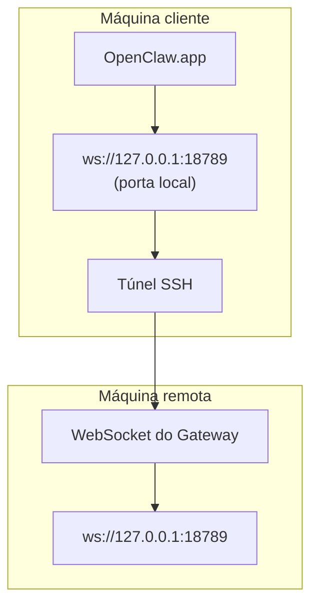

<Note>
Este conteúdo agora está em [Acesso remoto](/pt-BR/gateway/remote#macos-persistent-ssh-tunnel-via-launchagent). Use essa página para consultar o guia atual; esta página permanece como destino de redirecionamento.
</Note>

# Executando o OpenClaw.app com um Gateway remoto

O OpenClaw.app acessa um Gateway remoto por meio de um túnel SSH: um `LocalForward` SSH mapeia uma porta local para a porta WebSocket do Gateway no host remoto.

## Configuração

1. Adicione uma entrada à configuração SSH com `LocalForward 18789 127.0.0.1:18789` (consulte [Acesso remoto](/pt-BR/gateway/remote#macos-persistent-ssh-tunnel-via-launchagent) para ver o bloco de configuração completo).
2. Copie sua chave SSH para o host remoto com `ssh-copy-id`.
3. Defina `gateway.remote.token` (ou `gateway.remote.password`) por meio de `openclaw config set gateway.remote.token "<your-token>"`.
4. Inicie o túnel: `ssh -N remote-gateway &`.
5. Encerre e reabra o OpenClaw.app.

Para usar um túnel que persista após reinicializações e se reconecte automaticamente, use a configuração do LaunchAgent na página [Acesso remoto](/pt-BR/gateway/remote#macos-persistent-ssh-tunnel-via-launchagent), em vez de executar `ssh -N` manualmente.

## Como funciona

| Componente                           | O que faz                                                                  |
| ------------------------------------ | -------------------------------------------------------------------------- |
| `LocalForward 18789 127.0.0.1:18789` | Encaminha a porta local 18789 para a porta remota 18789                    |
| `ssh -N`                             | Usa SSH sem executar comandos remotos (apenas encaminhamento de portas)    |
| `KeepAlive`                          | Reinicia o túnel automaticamente em caso de falha (LaunchAgent)            |
| `RunAtLoad`                          | Inicia o túnel quando o LaunchAgent é carregado (LaunchAgent)              |

O OpenClaw.app se conecta a `ws://127.0.0.1:18789` no cliente. O túnel encaminha essa conexão para a porta 18789 no host remoto que executa o Gateway.

## Relacionados

- [Acesso remoto](/pt-BR/gateway/remote)
- [Tailscale](/pt-BR/gateway/tailscale)
