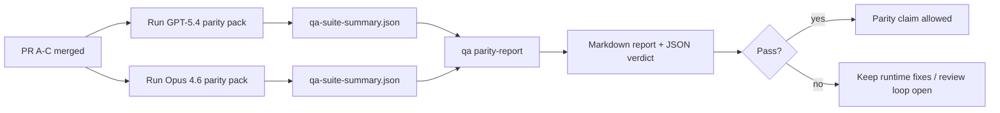

---
read_when:
    - Revisando a série de PRs de paridade GPT-5.4 / Codex
    - Mantendo a arquitetura agêntica de seis contratos por trás do programa de paridade GPT-5.4 / Codex
summary: Como revisar o programa de paridade GPT-5.4 / Codex como quatro unidades de merge
title: Notas do mantenedor sobre paridade GPT-5.4 / Codex
x-i18n:
    generated_at: "2026-04-22T04:22:36Z"
    model: gpt-5.4
    provider: openai
    source_hash: b872d6a33b269c01b44537bfa8646329063298fdfcd3671a17d0eadbc9da5427
    source_path: help/gpt54-codex-agentic-parity-maintainers.md
    workflow: 15
---

# Notas do mantenedor sobre paridade GPT-5.4 / Codex

Esta nota explica como revisar o programa de paridade GPT-5.4 / Codex como quatro unidades de merge sem perder a arquitetura original de seis contratos.

## Unidades de merge

### PR A: execução estritamente agêntica

É dona de:

- `executionContract`
- continuidade no mesmo turno com GPT-5 em primeiro lugar
- `update_plan` como rastreamento de progresso não terminal
- estados de bloqueio explícitos em vez de paradas silenciosas apenas com plano

Não é dona de:

- classificação de falhas de autenticação/runtime
- veracidade de permissões
- reformulação de replay/continuação
- benchmarking de paridade

### PR B: veracidade do runtime

É dona de:

- correção de escopo OAuth do Codex
- classificação tipada de falhas de provider/runtime
- disponibilidade verídica de `/elevated full` e motivos de bloqueio

Não é dona de:

- normalização de schema de ferramentas
- estado de replay/liveness
- gating de benchmark

### PR C: correção de execução

É dona de:

- compatibilidade de ferramentas OpenAI/Codex sob responsabilidade do provider
- tratamento estrito de schema sem parâmetros
- exposição de replay inválido
- visibilidade de estados de tarefas longas pausadas, bloqueadas e abandonadas

Não é dona de:

- continuação autoeleita
- comportamento genérico de dialeto Codex fora de hooks do provider
- gating de benchmark

### PR D: harness de paridade

É dona de:

- primeiro pacote de cenários GPT-5.4 vs Opus 4.6
- documentação de paridade
- mecânica de relatório de paridade e gate de release

Não é dona de:

- mudanças de comportamento de runtime fora do QA-lab
- simulação de autenticação/proxy/DNS dentro do harness

## Mapeamento de volta para os seis contratos originais

| Contrato original                       | Unidade de merge |
| --------------------------------------- | ---------------- |
| Correção de transporte/autenticação do provider | PR B       |
| Compatibilidade de contrato/schema de ferramentas | PR C       |
| Execução no mesmo turno                 | PR A             |
| Veracidade de permissões                | PR B             |
| Correção de replay/continuação/liveness | PR C             |
| Benchmark/gate de release               | PR D             |

## Ordem de revisão

1. PR A
2. PR B
3. PR C
4. PR D

PR D é a camada de prova. Ela não deve ser o motivo para atrasar PRs de correção de runtime.

## O que procurar

### PR A

- execuções de GPT-5 agem ou falham com bloqueio, em vez de parar na explicação
- `update_plan` não parece mais progresso por si só
- o comportamento continua com GPT-5 em primeiro lugar e com escopo de Pi embutido

### PR B

- falhas de autenticação/proxy/runtime deixam de colapsar em tratamento genérico de “falha do modelo”
- `/elevated full` só é descrito como disponível quando realmente está disponível
- motivos de bloqueio são visíveis tanto para o modelo quanto para o runtime voltado ao usuário

### PR C

- o registro estrito de ferramentas OpenAI/Codex se comporta de forma previsível
- ferramentas sem parâmetros não falham nas verificações estritas de schema
- resultados de replay e Compaction preservam um estado de liveness verídico

### PR D

- o pacote de cenários é compreensível e reproduzível
- o pacote inclui uma trilha mutável de segurança de replay, não apenas fluxos somente leitura
- os relatórios são legíveis por humanos e por automação
- as alegações de paridade são sustentadas por evidências, não anedóticas

Artefatos esperados da PR D:

- `qa-suite-report.md` / `qa-suite-summary.json` para cada execução de modelo
- `qa-agentic-parity-report.md` com comparação agregada e por cenário
- `qa-agentic-parity-summary.json` com um veredito legível por máquina

## Gate de release

Não afirme paridade ou superioridade do GPT-5.4 sobre o Opus 4.6 até que:

- PR A, PR B e PR C sejam mescladas
- PR D execute o primeiro pacote de paridade sem falhas
- suítes de regressão de veracidade do runtime permaneçam verdes
- o relatório de paridade não mostre casos de falso sucesso nem regressão no comportamento de parada

O harness de paridade não é a única fonte de evidência. Mantenha essa separação explícita na revisão:

- PR D é dona da comparação baseada em cenários GPT-5.4 vs Opus 4.6
- as suítes determinísticas da PR B continuam sendo donas das evidências de autenticação/proxy/DNS e veracidade de acesso total

## Mapa de objetivo para evidência

| Item do gate de conclusão                | Dono principal | Artefato de revisão                                                |
| ---------------------------------------- | -------------- | ------------------------------------------------------------------ |
| Sem travamentos apenas com plano         | PR A           | testes de runtime estritamente agêntico e `approval-turn-tool-followthrough` |
| Sem progresso falso nem conclusão falsa de ferramenta | PR A + PR D   | contagem de falso sucesso de paridade mais detalhes do relatório por cenário |
| Sem orientação falsa de `/elevated full` | PR B           | suítes determinísticas de veracidade do runtime                    |
| Falhas de replay/liveness continuam explícitas | PR C + PR D   | suítes de ciclo de vida/replay mais `compaction-retry-mutating-tool` |
| GPT-5.4 iguala ou supera Opus 4.6        | PR D           | `qa-agentic-parity-report.md` e `qa-agentic-parity-summary.json`   |

## Atalho para revisores: antes vs depois

| Problema visível ao usuário antes                        | Sinal de revisão depois                                                                  |
| -------------------------------------------------------- | ---------------------------------------------------------------------------------------- |
| GPT-5.4 parava após o planejamento                       | A PR A mostra comportamento de agir-ou-bloquear em vez de conclusão apenas descritiva   |
| O uso de ferramentas parecia frágil com schemas OpenAI/Codex estritos | A PR C mantém previsíveis o registro de ferramentas e a invocação sem parâmetros |
| Dicas de `/elevated full` às vezes eram enganosas        | A PR B vincula a orientação à capacidade real de runtime e aos motivos de bloqueio      |
| Tarefas longas podiam desaparecer em ambiguidade de replay/Compaction | A PR C emite estado explícito de pausado, bloqueado, abandonado e replay inválido |
| Alegações de paridade eram anedóticas                    | A PR D produz um relatório mais veredito JSON com a mesma cobertura de cenários em ambos os modelos |
