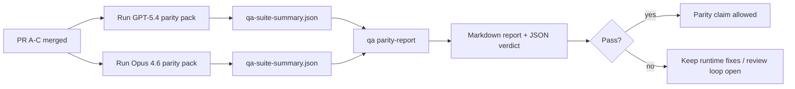

---
read_when:
    - Revisando a série de PRs de paridade GPT-5.4 / Codex
    - Mantendo a arquitetura agentic de seis contratos por trás do programa de paridade
summary: Como revisar o programa de paridade GPT-5.4 / Codex como quatro unidades de merge
title: Notas de manutenção da paridade GPT-5.4 / Codex
x-i18n:
    generated_at: "2026-04-24T05:55:26Z"
    model: gpt-5.4
    provider: openai
    source_hash: 803b62bf5bb6b00125f424fa733e743ecdec7f8410dec0782096f9d1ddbed6c0
    source_path: help/gpt54-codex-agentic-parity-maintainers.md
    workflow: 15
---

Esta nota explica como revisar o programa de paridade GPT-5.4 / Codex como quatro unidades de merge sem perder a arquitetura agentic original de seis contratos.

## Unidades de merge

### PR A: execução strict-agentic

Responsável por:

- `executionContract`
- follow-through no mesmo turno com GPT-5 em primeiro lugar
- `update_plan` como rastreamento de progresso não terminal
- estados explícitos de bloqueio em vez de paradas silenciosas apenas com plano

Não é responsável por:

- classificação de falhas de autenticação/runtime
- veracidade de permissões
- redesenho de replay/continuação
- benchmarking de paridade

### PR B: veracidade de runtime

Responsável por:

- correção de escopo OAuth do Codex
- classificação tipada de falhas de provedor/runtime
- disponibilidade verídica de `/elevated full` e motivos de bloqueio

Não é responsável por:

- normalização de schema de ferramentas
- estado de replay/liveness
- gating de benchmark

### PR C: correção de execução

Responsável por:

- compatibilidade de ferramentas OpenAI/Codex controlada pelo provedor
- tratamento estrito de schema sem parâmetros
- exposição de replay inválido
- visibilidade de estado pausado, bloqueado e abandonado em tarefas longas

Não é responsável por:

- continuação autoeleita
- comportamento genérico do dialeto Codex fora de hooks de provedor
- gating de benchmark

### PR D: harness de paridade

Responsável por:

- primeiro pacote de cenários de GPT-5.4 vs Opus 4.6
- documentação de paridade
- relatório de paridade e mecanismos de gate de release

Não é responsável por:

- mudanças de comportamento de runtime fora do QA-lab
- simulação de autenticação/proxy/DNS dentro do harness

## Mapeamento de volta para os seis contratos originais

| Contrato original                         | Unidade de merge |
| ---------------------------------------- | ---------------- |
| Correção de transporte/autenticação do provedor | PR B       |
| Compatibilidade de contrato/schema de ferramenta | PR C       |
| Execução no mesmo turno                  | PR A             |
| Veracidade de permissões                 | PR B             |
| Correção de replay/continuação/liveness  | PR C             |
| Gate de benchmark/release                | PR D             |

## Ordem de revisão

1. PR A
2. PR B
3. PR C
4. PR D

PR D é a camada de prova. Ele não deve ser o motivo pelo qual PRs de correção de runtime atrasam.

## O que observar

### PR A

- execuções do GPT-5 agem ou falham de forma fechada em vez de parar em comentário
- `update_plan` não parece mais progresso por si só
- o comportamento continua com GPT-5 em primeiro lugar e com escopo em Pi embutido

### PR B

- falhas de autenticação/proxy/runtime deixam de colapsar em tratamento genérico de “modelo falhou”
- `/elevated full` só é descrito como disponível quando realmente está disponível
- os motivos de bloqueio ficam visíveis tanto para o modelo quanto para o runtime voltado ao usuário

### PR C

- o registro estrito de ferramentas OpenAI/Codex se comporta de forma previsível
- ferramentas sem parâmetros não falham em verificações estritas de schema
- resultados de replay e Compaction preservam estado de liveness verídico

### PR D

- o pacote de cenários é compreensível e reproduzível
- o pacote inclui uma trilha mutável de segurança de replay, não apenas fluxos somente leitura
- os relatórios são legíveis por humanos e automação
- alegações de paridade são sustentadas por evidências, não anedóticas

Artefatos esperados do PR D:

- `qa-suite-report.md` / `qa-suite-summary.json` para cada execução de modelo
- `qa-agentic-parity-report.md` com comparação agregada e por cenário
- `qa-agentic-parity-summary.json` com um veredito legível por máquina

## Gate de release

Não afirme paridade ou superioridade do GPT-5.4 sobre o Opus 4.6 até que:

- PR A, PR B e PR C tenham sido mergeados
- PR D execute limpo o primeiro pacote de paridade
- suítes de regressão de veracidade de runtime permaneçam verdes
- o relatório de paridade não mostre casos de falso sucesso nem regressão no comportamento de parada

O harness de paridade não é a única fonte de evidência. Mantenha essa divisão explícita na revisão:

- PR D é responsável pela comparação baseada em cenários entre GPT-5.4 e Opus 4.6
- as suítes determinísticas do PR B continuam sendo responsáveis por evidências de autenticação/proxy/DNS e veracidade de acesso total

## Mapa de objetivo para evidência

| Item do gate de conclusão                 | Responsável principal | Artefato de revisão                                                |
| ---------------------------------------- | --------------------- | ------------------------------------------------------------------ |
| Sem travamentos apenas com plano         | PR A                  | testes de runtime strict-agentic e `approval-turn-tool-followthrough` |
| Sem progresso falso ou conclusão falsa de ferramenta | PR A + PR D   | contagem de falso sucesso na paridade mais detalhes do relatório por cenário |
| Sem orientação falsa de `/elevated full` | PR B                  | suítes determinísticas de veracidade de runtime                    |
| Falhas de replay/liveness continuam explícitas | PR C + PR D      | suítes de ciclo de vida/replay mais `compaction-retry-mutating-tool` |
| GPT-5.4 iguala ou supera Opus 4.6        | PR D                  | `qa-agentic-parity-report.md` e `qa-agentic-parity-summary.json`   |

## Atalho para revisores: antes vs depois

| Problema visível ao usuário antes                         | Sinal de revisão depois                                                                  |
| -------------------------------------------------------- | ---------------------------------------------------------------------------------------- |
| GPT-5.4 parava após planejar                             | PR A mostra comportamento de agir-ou-bloquear em vez de conclusão apenas com comentário |
| O uso de ferramentas parecia frágil com schemas estritos OpenAI/Codex | PR C mantém previsíveis o registro de ferramentas e a invocação sem parâmetros |
| Dicas de `/elevated full` às vezes eram enganosas        | PR B vincula a orientação à capacidade real de runtime e aos motivos de bloqueio         |
| Tarefas longas podiam desaparecer em ambiguidade de replay/Compaction | PR C emite estado explícito pausado, bloqueado, abandonado e replay inválido |
| Alegações de paridade eram anedóticas                    | PR D produz um relatório e um veredito JSON com a mesma cobertura de cenários em ambos os modelos |

## Relacionado

- [Paridade agentic GPT-5.4 / Codex](/pt-BR/help/gpt54-codex-agentic-parity)
