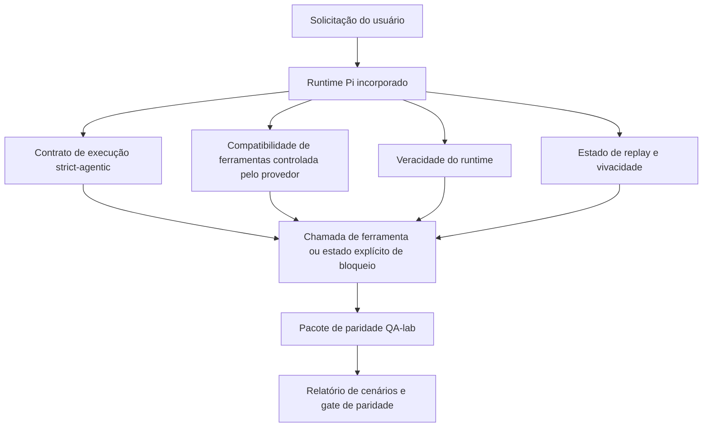
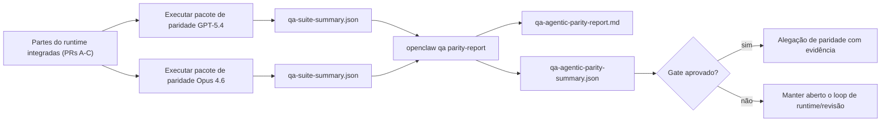

---
read_when:
    - Depurando o comportamento agêntico do GPT-5.4 ou Codex
    - Comparando o comportamento agêntico do OpenClaw entre modelos de fronteira
    - Revisando as correções de strict-agentic, schema de ferramentas, elevação e replay
summary: Como o OpenClaw fecha lacunas de execução agêntica para GPT-5.4 e modelos no estilo Codex
title: Paridade agêntica de GPT-5.4 / Codex
x-i18n:
    generated_at: "2026-04-24T05:55:29Z"
    model: gpt-5.4
    provider: openai
    source_hash: 9f8c7dcf21583e6dbac80da9ddd75f2dc9af9b80801072ade8fa14b04258d4dc
    source_path: help/gpt54-codex-agentic-parity.md
    workflow: 15
---

# Paridade agêntica de GPT-5.4 / Codex no OpenClaw

O OpenClaw já funcionava bem com modelos de fronteira que usam ferramentas, mas GPT-5.4 e modelos no estilo Codex ainda apresentavam desempenho inferior em alguns pontos práticos:

- podiam parar após planejar em vez de fazer o trabalho
- podiam usar incorretamente schemas de ferramentas estritos de OpenAI/Codex
- podiam pedir `/elevated full` mesmo quando acesso total era impossível
- podiam perder o estado de tarefas longas durante replay ou Compaction
- alegações de paridade em relação ao Claude Opus 4.6 eram baseadas em anedotas, não em cenários reproduzíveis

Este programa de paridade corrige essas lacunas em quatro partes revisáveis.

## O que mudou

### PR A: execução strict-agentic

Esta parte adiciona um contrato de execução `strict-agentic` com opt-in para execuções incorporadas do Pi GPT-5.

Quando habilitado, o OpenClaw deixa de aceitar turnos apenas de planejamento como uma conclusão “boa o suficiente”. Se o modelo apenas disser o que pretende fazer e não usar ferramentas nem fizer progresso de fato, o OpenClaw tenta novamente com uma orientação de agir agora e então falha de forma fechada com um estado explícito de bloqueio, em vez de encerrar silenciosamente a tarefa.

Isso melhora mais a experiência com GPT-5.4 em:

- acompanhamentos curtos do tipo “ok, faça isso”
- tarefas de código em que a primeira etapa é óbvia
- fluxos em que `update_plan` deve servir para rastreamento de progresso, e não como texto de preenchimento

### PR B: veracidade do runtime

Esta parte faz o OpenClaw dizer a verdade sobre duas coisas:

- por que a chamada do provedor/runtime falhou
- se `/elevated full` está realmente disponível

Isso significa que o GPT-5.4 recebe sinais melhores de runtime para escopo ausente, falhas de renovação de autenticação, falhas de autenticação HTML 403, problemas de proxy, falhas de DNS ou timeout e modos de acesso total bloqueados. O modelo tem menos probabilidade de alucinar a correção errada ou continuar pedindo um modo de permissão que o runtime não pode fornecer.

### PR C: correção de execução

Esta parte melhora dois tipos de correção:

- compatibilidade com schema de ferramentas OpenAI/Codex controlado pelo provedor
- exibição de replay e vivacidade de tarefas longas

O trabalho de compatibilidade de ferramentas reduz atrito de schema para registro estrito de ferramentas OpenAI/Codex, especialmente em torno de ferramentas sem parâmetros e expectativas estritas de objeto na raiz. O trabalho de replay/vivacidade torna tarefas longas mais observáveis, de modo que estados pausados, bloqueados e abandonados fiquem visíveis, em vez de desaparecerem em um texto genérico de falha.

### PR D: harness de paridade

Esta parte adiciona o primeiro pacote de paridade do QA-lab, para que GPT-5.4 e Opus 4.6 possam ser exercitados nos mesmos cenários e comparados usando evidência compartilhada.

O pacote de paridade é a camada de prova. Ele não altera o comportamento do runtime por si só.

Depois de ter dois artefatos `qa-suite-summary.json`, gere a comparação de gate de release com:

```bash
pnpm openclaw qa parity-report \
  --repo-root . \
  --candidate-summary .artifacts/qa-e2e/gpt54/qa-suite-summary.json \
  --baseline-summary .artifacts/qa-e2e/opus46/qa-suite-summary.json \
  --output-dir .artifacts/qa-e2e/parity
```

Esse comando grava:

- um relatório Markdown legível por humanos
- um veredito JSON legível por máquina
- um resultado explícito de gate `pass` / `fail`

## Por que isso melhora o GPT-5.4 na prática

Antes desse trabalho, o GPT-5.4 no OpenClaw podia parecer menos agêntico que o Opus em sessões reais de programação, porque o runtime tolerava comportamentos especialmente prejudiciais para modelos no estilo GPT-5:

- turnos só de comentário
- atrito de schema em ferramentas
- feedback vago de permissão
- quebra silenciosa em replay ou Compaction

O objetivo não é fazer o GPT-5.4 imitar o Opus. O objetivo é dar ao GPT-5.4 um contrato de runtime que recompense progresso real, forneça semântica mais clara de ferramentas e permissões e transforme modos de falha em estados explícitos legíveis por máquina e por humanos.

Isso muda a experiência do usuário de:

- “o modelo tinha um bom plano, mas parou”

para:

- “o modelo agiu, ou o OpenClaw expôs o motivo exato de por que não pôde agir”

## Antes vs depois para usuários de GPT-5.4

| Antes deste programa                                                                         | Depois das PRs A-D                                                                      |
| -------------------------------------------------------------------------------------------- | ---------------------------------------------------------------------------------------- |
| O GPT-5.4 podia parar após um plano razoável sem dar o próximo passo com ferramenta         | A PR A transforma “apenas plano” em “aja agora ou exponha um estado bloqueado”          |
| Schemas estritos de ferramentas podiam rejeitar ferramentas sem parâmetros ou no formato OpenAI/Codex de maneiras confusas | A PR C torna registro e invocação de ferramentas controladas pelo provedor mais previsíveis |
| A orientação de `/elevated full` podia ser vaga ou incorreta em runtimes bloqueados         | A PR B dá ao GPT-5.4 e ao usuário pistas verdadeiras sobre runtime e permissões         |
| Falhas de replay ou Compaction podiam parecer como se a tarefa simplesmente desaparecesse   | A PR C expõe explicitamente resultados pausados, bloqueados, abandonados e inválidos para replay |
| “GPT-5.4 parece pior que Opus” era quase sempre anedótico                                   | A PR D transforma isso no mesmo pacote de cenários, nas mesmas métricas e em um gate rígido de pass/fail |

## Arquitetura



## Fluxo de release



## Pacote de cenários

Atualmente, o primeiro pacote de paridade cobre cinco cenários:

### `approval-turn-tool-followthrough`

Verifica se o modelo não para em “vou fazer isso” após uma aprovação curta. Ele deve executar a primeira ação concreta no mesmo turno.

### `model-switch-tool-continuity`

Verifica se o trabalho com uso de ferramenta permanece coerente ao atravessar limites de troca de modelo/runtime, em vez de voltar para comentário ou perder o contexto de execução.

### `source-docs-discovery-report`

Verifica se o modelo consegue ler código-fonte e documentação, sintetizar achados e continuar a tarefa de forma agêntica, em vez de produzir um resumo superficial e parar cedo.

### `image-understanding-attachment`

Verifica se tarefas de modo misto envolvendo anexos permanecem acionáveis e não colapsam em uma narração vaga.

### `compaction-retry-mutating-tool`

Verifica se uma tarefa com uma escrita mutável real mantém explícita a insegurança de replay, em vez de parecer silenciosamente segura para replay se a execução passar por Compaction, retry ou perder o estado de resposta sob pressão.

## Matriz de cenários

| Cenário                            | O que testa                               | Bom comportamento do GPT-5.4                                                  | Sinal de falha                                                                  |
| ---------------------------------- | ----------------------------------------- | ----------------------------------------------------------------------------- | -------------------------------------------------------------------------------- |
| `approval-turn-tool-followthrough` | Turnos curtos de aprovação após um plano  | Inicia imediatamente a primeira ação concreta com ferramenta, em vez de repetir a intenção | acompanhamento apenas com plano, sem atividade de ferramenta, ou turno bloqueado sem bloqueador real |
| `model-switch-tool-continuity`     | Troca de runtime/modelo durante uso de ferramenta | Preserva o contexto da tarefa e continua agindo de forma coerente         | volta para comentário, perde contexto de ferramenta ou para após a troca        |
| `source-docs-discovery-report`     | Leitura de fonte + síntese + ação         | Encontra fontes, usa ferramentas e produz um relatório útil sem travar        | resumo superficial, falta de trabalho com ferramenta ou parada em turno incompleto |
| `image-understanding-attachment`   | Trabalho agêntico orientado por anexo     | Interpreta o anexo, conecta-o a ferramentas e continua a tarefa               | narração vaga, anexo ignorado ou ausência de próxima ação concreta              |
| `compaction-retry-mutating-tool`   | Trabalho mutável sob pressão de Compaction | Executa uma escrita real e mantém explícita a insegurança de replay após o efeito colateral | a escrita mutável ocorre, mas a segurança de replay é implícita, ausente ou contraditória |

## Gate de release

O GPT-5.4 só pode ser considerado em paridade ou melhor quando o runtime integrado passa pelo pacote de paridade e pelos regressos de veracidade do runtime ao mesmo tempo.

Resultados exigidos:

- nenhuma parada apenas de planejamento quando a próxima ação com ferramenta está clara
- nenhuma conclusão falsa sem execução real
- nenhuma orientação incorreta de `/elevated full`
- nenhum abandono silencioso em replay ou Compaction
- métricas do pacote de paridade pelo menos tão fortes quanto a baseline acordada do Opus 4.6

Para o primeiro harness, o gate compara:

- taxa de conclusão
- taxa de parada não intencional
- taxa de chamada de ferramenta válida
- contagem de sucesso falso

A evidência de paridade foi intencionalmente dividida em duas camadas:

- a PR D prova o comportamento de GPT-5.4 vs Opus 4.6 nos mesmos cenários com QA-lab
- suites determinísticas da PR B provam veracidade de autenticação, proxy, DNS e `/elevated full` fora do harness

## Matriz meta-evidência

| Item do gate de conclusão                                 | PR responsável | Fonte de evidência                                                   | Sinal de aprovação                                                                      |
| --------------------------------------------------------- | -------------- | -------------------------------------------------------------------- | --------------------------------------------------------------------------------------- |
| GPT-5.4 não trava mais após planejar                      | PR A           | `approval-turn-tool-followthrough` mais suites de runtime da PR A    | turnos de aprovação acionam trabalho real ou um estado explícito de bloqueio           |
| GPT-5.4 não simula mais progresso ou conclusão falsa com ferramenta | PR A + PR D | resultados de cenários do relatório de paridade e contagem de sucesso falso | nenhum resultado suspeito de aprovação e nenhuma conclusão apenas com comentário |
| GPT-5.4 não fornece mais orientação falsa de `/elevated full` | PR B        | suites determinísticas de veracidade                                 | razões de bloqueio e dicas de acesso total permanecem corretas em relação ao runtime   |
| Falhas de replay/vivacidade permanecem explícitas         | PR C + PR D    | suites de ciclo de vida/replay da PR C mais `compaction-retry-mutating-tool` | trabalho mutável mantém explícita a insegurança de replay em vez de desaparecer silenciosamente |
| GPT-5.4 iguala ou supera Opus 4.6 nas métricas acordadas | PR D           | `qa-agentic-parity-report.md` e `qa-agentic-parity-summary.json`     | mesma cobertura de cenários e nenhuma regressão em conclusão, comportamento de parada ou uso válido de ferramenta |

## Como ler o veredito de paridade

Use o veredito em `qa-agentic-parity-summary.json` como a decisão final legível por máquina para o primeiro pacote de paridade.

- `pass` significa que o GPT-5.4 cobriu os mesmos cenários que o Opus 4.6 e não regrediu nas métricas agregadas acordadas.
- `fail` significa que pelo menos um gate rígido foi acionado: conclusão mais fraca, mais paradas não intencionais, uso válido de ferramenta mais fraco, qualquer caso de sucesso falso ou cobertura de cenários incompatível.
- “shared/base CI issue” não é, por si só, um resultado de paridade. Se ruído de CI fora da PR D bloquear uma execução, o veredito deve esperar uma execução limpa do runtime integrado, em vez de ser inferido a partir de logs antigos de branch.
- A veracidade de autenticação, proxy, DNS e `/elevated full` continua vindo das suites determinísticas da PR B, então a alegação final de release precisa de ambos: um veredito de paridade aprovado da PR D e cobertura de veracidade verde da PR B.

## Quem deve habilitar `strict-agentic`

Use `strict-agentic` quando:

- espera-se que o agente aja imediatamente quando a próxima etapa for óbvia
- GPT-5.4 ou modelos da família Codex forem o runtime principal
- você preferir estados explícitos de bloqueio a respostas “úteis” apenas de recapitulação

Mantenha o contrato padrão quando:

- você quiser o comportamento existente, mais flexível
- você não estiver usando modelos da família GPT-5
- você estiver testando prompts em vez de aplicação de regras de runtime

## Relacionado

- [Notas do mantenedor sobre paridade GPT-5.4 / Codex](/pt-BR/help/gpt54-codex-agentic-parity-maintainers)
