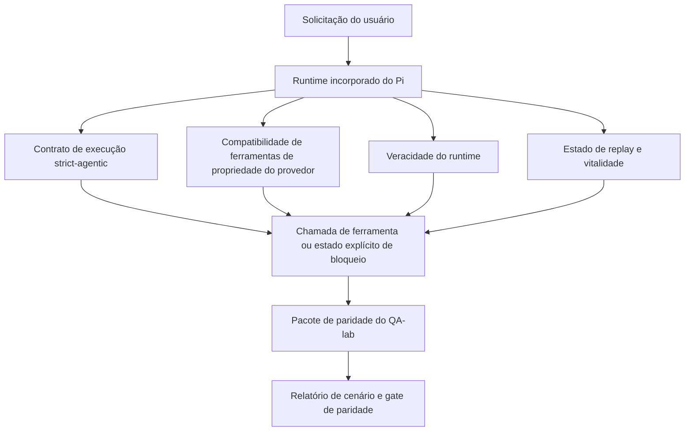
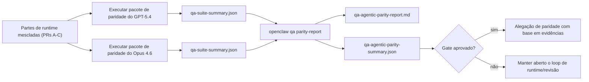

---
read_when:
    - Depurando o comportamento agêntico do GPT-5.4 ou Codex
    - Comparando o comportamento agêntico do OpenClaw entre modelos de ponta
    - Revisando as correções de strict-agentic, schema de ferramenta, elevação e replay
summary: Como o OpenClaw fecha lacunas de execução agêntica para GPT-5.4 e modelos no estilo Codex
title: Paridade agêntica do GPT-5.4 / Codex
x-i18n:
    generated_at: "2026-04-22T04:22:46Z"
    model: gpt-5.4
    provider: openai
    source_hash: 77bc9b8fab289bd35185fa246113503b3f5c94a22bd44739be07d39ae6779056
    source_path: help/gpt54-codex-agentic-parity.md
    workflow: 15
---

# Paridade agêntica do GPT-5.4 / Codex no OpenClaw

O OpenClaw já funcionava bem com modelos de ponta que usam ferramentas, mas o GPT-5.4 e modelos no estilo Codex ainda estavam tendo desempenho abaixo do esperado em alguns aspectos práticos:

- eles podiam parar depois de planejar em vez de fazer o trabalho
- eles podiam usar incorretamente schemas de ferramenta strict do OpenAI/Codex
- eles podiam pedir `/elevated full` mesmo quando acesso total era impossível
- eles podiam perder o estado de tarefas longas durante replay ou Compaction
- alegações de paridade em relação ao Claude Opus 4.6 se baseavam em relatos, e não em cenários repetíveis

Este programa de paridade corrige essas lacunas em quatro partes revisáveis.

## O que mudou

### PR A: execução strict-agentic

Esta parte adiciona um contrato de execução `strict-agentic` opcional para execuções incorporadas do Pi GPT-5.

Quando habilitado, o OpenClaw deixa de aceitar turnos apenas com plano como conclusão “boa o suficiente”. Se o modelo apenas disser o que pretende fazer e não usar ferramentas de fato nem fizer progresso, o OpenClaw tenta novamente com uma orientação para agir agora e depois falha de forma fechada com um estado explícito de bloqueio em vez de encerrar a tarefa silenciosamente.

Isso melhora a experiência do GPT-5.4 principalmente em:

- acompanhamentos curtos do tipo “ok, faça”
- tarefas de código em que a primeira etapa é óbvia
- fluxos em que `update_plan` deve servir para acompanhamento de progresso, e não como texto de preenchimento

### PR B: veracidade do runtime

Esta parte faz o OpenClaw dizer a verdade sobre duas coisas:

- por que a chamada do provedor/runtime falhou
- se `/elevated full` está realmente disponível

Isso significa que o GPT-5.4 recebe sinais de runtime melhores para escopo ausente, falhas ao atualizar autenticação, falhas de autenticação HTML 403, problemas de proxy, falhas de DNS ou timeout e modos de acesso total bloqueados. O modelo passa a ter menos chance de alucinar a remediação errada ou continuar pedindo um modo de permissão que o runtime não pode fornecer.

### PR C: correção de execução

Esta parte melhora dois tipos de correção:

- compatibilidade com schemas de ferramenta OpenAI/Codex de propriedade do provedor
- exposição de replay e vitalidade de tarefas longas

O trabalho de compatibilidade com ferramentas reduz o atrito de schema no registro strict de ferramentas OpenAI/Codex, especialmente em torno de ferramentas sem parâmetros e expectativas strict de objeto na raiz. O trabalho de replay/vitalidade torna tarefas longas mais observáveis, para que estados pausados, bloqueados e abandonados fiquem visíveis em vez de desaparecerem em um texto genérico de falha.

### PR D: harness de paridade

Esta parte adiciona o primeiro pacote de paridade do QA-lab para que GPT-5.4 e Opus 4.6 possam ser exercitados nos mesmos cenários e comparados usando evidências compartilhadas.

O pacote de paridade é a camada de prova. Ele não altera o comportamento do runtime por si só.

Depois que você tiver dois artefatos `qa-suite-summary.json`, gere a comparação do gate de release com:

```bash
pnpm openclaw qa parity-report \
  --repo-root . \
  --candidate-summary .artifacts/qa-e2e/gpt54/qa-suite-summary.json \
  --baseline-summary .artifacts/qa-e2e/opus46/qa-suite-summary.json \
  --output-dir .artifacts/qa-e2e/parity
```

Esse comando grava:

- um relatório Markdown legível por humanos
- um veredito JSON legível por máquina
- um resultado de gate explícito `pass` / `fail`

## Por que isso melhora o GPT-5.4 na prática

Antes deste trabalho, o GPT-5.4 no OpenClaw podia parecer menos agêntico do que o Opus em sessões reais de programação porque o runtime tolerava comportamentos especialmente prejudiciais para modelos no estilo GPT-5:

- turnos apenas com comentário
- atrito de schema em torno de ferramentas
- feedback vago sobre permissões
- quebra silenciosa de replay ou Compaction

O objetivo não é fazer o GPT-5.4 imitar o Opus. O objetivo é dar ao GPT-5.4 um contrato de runtime que recompense progresso real, forneça semântica mais limpa para ferramentas e permissões e transforme modos de falha em estados explícitos legíveis por máquina e por humanos.

Isso muda a experiência do usuário de:

- “o modelo tinha um bom plano, mas parou”

para:

- “o modelo ou agiu, ou o OpenClaw mostrou o motivo exato pelo qual não conseguiu”

## Antes vs. depois para usuários do GPT-5.4

| Antes deste programa                                                                        | Depois das PRs A-D                                                                  |
| ------------------------------------------------------------------------------------------- | ----------------------------------------------------------------------------------- |
| O GPT-5.4 podia parar depois de um plano razoável sem executar a próxima etapa com ferramenta | A PR A transforma “apenas plano” em “aja agora ou mostre um estado de bloqueio” |
| Schemas de ferramenta strict podiam rejeitar ferramentas sem parâmetros ou com formato OpenAI/Codex de maneira confusa | A PR C torna o registro e a invocação de ferramentas de propriedade do provedor mais previsíveis |
| A orientação sobre `/elevated full` podia ser vaga ou incorreta em runtimes bloqueados     | A PR B dá ao GPT-5.4 e ao usuário dicas verdadeiras sobre runtime e permissões     |
| Falhas de replay ou Compaction podiam dar a sensação de que a tarefa simplesmente desapareceu | A PR C expõe explicitamente resultados pausados, bloqueados, abandonados e replay-invalid |
| “O GPT-5.4 parece pior que o Opus” era, em grande parte, anedótico                          | A PR D transforma isso no mesmo pacote de cenários, nas mesmas métricas e em um gate rígido de pass/fail |

## Arquitetura



## Fluxo de release



## Pacote de cenários

O primeiro pacote de paridade atualmente cobre cinco cenários:

### `approval-turn-tool-followthrough`

Verifica se o modelo não para em “vou fazer isso” depois de uma aprovação curta. Ele deve executar a primeira ação concreta no mesmo turno.

### `model-switch-tool-continuity`

Verifica se o trabalho com uso de ferramentas permanece coerente em limites de troca de modelo/runtime em vez de reiniciar em comentários ou perder o contexto de execução.

### `source-docs-discovery-report`

Verifica se o modelo consegue ler código-fonte e documentação, sintetizar conclusões e continuar a tarefa de forma agêntica, em vez de produzir um resumo superficial e parar cedo.

### `image-understanding-attachment`

Verifica se tarefas de modo misto com anexos permanecem acionáveis e não colapsam em narração vaga.

### `compaction-retry-mutating-tool`

Verifica se uma tarefa com uma gravação mutável real mantém a insegurança de replay explícita em vez de parecer silenciosamente segura para replay quando a execução sofre Compaction, retry ou perde o estado de resposta sob pressão.

## Matriz de cenários

| Cenário                            | O que testa                              | Bom comportamento do GPT-5.4                                                   | Sinal de falha                                                                    |
| ---------------------------------- | ---------------------------------------- | ------------------------------------------------------------------------------ | --------------------------------------------------------------------------------- |
| `approval-turn-tool-followthrough` | Turnos curtos de aprovação após um plano | Inicia imediatamente a primeira ação concreta com ferramenta em vez de reafirmar a intenção | acompanhamento apenas com plano, sem atividade de ferramenta, ou turno bloqueado sem bloqueador real |
| `model-switch-tool-continuity`     | Troca de runtime/modelo durante uso de ferramentas | Preserva o contexto da tarefa e continua agindo com coerência                  | reinicia em comentários, perde o contexto de ferramenta ou para após a troca     |
| `source-docs-discovery-report`     | Leitura de código-fonte + síntese + ação | Encontra fontes, usa ferramentas e produz um relatório útil sem travar         | resumo superficial, trabalho de ferramenta ausente ou parada com turno incompleto |
| `image-understanding-attachment`   | Trabalho agêntico guiado por anexo       | Interpreta o anexo, o conecta às ferramentas e continua a tarefa               | narração vaga, anexo ignorado ou ausência de próxima ação concreta               |
| `compaction-retry-mutating-tool`   | Trabalho mutável sob pressão de Compaction | Executa uma gravação real e mantém explícita a insegurança de replay após o efeito colateral | a gravação mutável acontece, mas a segurança de replay é implícita, ausente ou contraditória |

## Gate de release

O GPT-5.4 só pode ser considerado em paridade ou melhor quando o runtime mesclado passar pelo pacote de paridade e, ao mesmo tempo, pelas regressões de veracidade do runtime.

Resultados obrigatórios:

- nenhuma parada apenas em plano quando a próxima ação de ferramenta estiver clara
- nenhuma conclusão falsa sem execução real
- nenhuma orientação incorreta de `/elevated full`
- nenhum abandono silencioso de replay ou Compaction
- métricas do pacote de paridade pelo menos tão fortes quanto a linha de base acordada do Opus 4.6

Para o primeiro harness, o gate compara:

- taxa de conclusão
- taxa de parada não intencional
- taxa de chamada de ferramenta válida
- contagem de sucesso falso

A evidência de paridade é intencionalmente dividida em duas camadas:

- a PR D prova o comportamento do GPT-5.4 vs. Opus 4.6 nos mesmos cenários com QA-lab
- as suítes determinísticas da PR B provam veracidade de autenticação, proxy, DNS e `/elevated full` fora do harness

## Matriz de objetivo para evidência

| Item do gate de conclusão                                | PR responsável | Fonte da evidência                                                 | Sinal de aprovação                                                                     |
| -------------------------------------------------------- | -------------- | ------------------------------------------------------------------ | -------------------------------------------------------------------------------------- |
| O GPT-5.4 não trava mais após planejar                   | PR A           | `approval-turn-tool-followthrough` mais as suítes de runtime da PR A | turnos de aprovação disparam trabalho real ou um estado explícito de bloqueio         |
| O GPT-5.4 não finge mais progresso nem conclusão falsa de ferramenta | PR A + PR D | resultados de cenários do relatório de paridade e contagem de sucesso falso | nenhum resultado suspeito de aprovação e nenhuma conclusão apenas com comentários      |
| O GPT-5.4 não fornece mais orientação falsa sobre `/elevated full` | PR B         | suítes determinísticas de veracidade                               | motivos de bloqueio e dicas de acesso total permanecem corretos no runtime            |
| Falhas de replay/vitalidade permanecem explícitas        | PR C + PR D    | suítes de ciclo de vida/replay da PR C mais `compaction-retry-mutating-tool` | trabalho mutável mantém a insegurança de replay explícita em vez de desaparecer silenciosamente |
| O GPT-5.4 iguala ou supera o Opus 4.6 nas métricas acordadas | PR D        | `qa-agentic-parity-report.md` e `qa-agentic-parity-summary.json`   | mesma cobertura de cenários e nenhuma regressão em conclusão, comportamento de parada ou uso válido de ferramenta |

## Como ler o veredito de paridade

Use o veredito em `qa-agentic-parity-summary.json` como a decisão final legível por máquina para o primeiro pacote de paridade.

- `pass` significa que o GPT-5.4 cobriu os mesmos cenários que o Opus 4.6 e não regrediu nas métricas agregadas acordadas.
- `fail` significa que pelo menos um gate rígido foi acionado: conclusão mais fraca, piores paradas não intencionais, uso válido de ferramenta mais fraco, qualquer caso de sucesso falso ou cobertura de cenários incompatível.
- “shared/base CI issue” não é, por si só, um resultado de paridade. Se ruído de CI fora da PR D bloquear uma execução, o veredito deve esperar uma execução limpa do runtime mesclado em vez de ser inferido a partir de logs antigos de branch.
- A veracidade de autenticação, proxy, DNS e `/elevated full` ainda vem das suítes determinísticas da PR B, então a alegação final de release precisa dos dois: um veredito de paridade aprovado da PR D e cobertura verde de veracidade da PR B.

## Quem deve habilitar `strict-agentic`

Use `strict-agentic` quando:

- espera-se que o agente aja imediatamente quando a próxima etapa for óbvia
- modelos da família GPT-5.4 ou Codex forem o runtime principal
- você preferir estados explícitos de bloqueio em vez de respostas “úteis” que apenas recapitulam

Mantenha o contrato padrão quando:

- você quiser o comportamento atual mais flexível
- você não estiver usando modelos da família GPT-5
- você estiver testando prompts em vez da aplicação de regras no runtime
