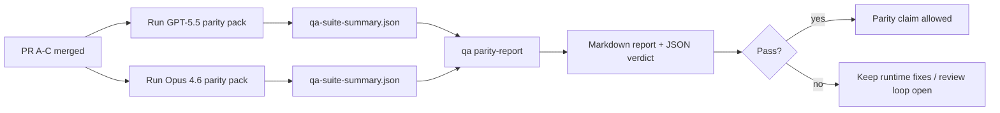

---
read_when:
    - Revisando a série de PRs de paridade GPT-5.5 / Codex
    - Mantendo a arquitetura agêntica de seis contratos por trás do programa de paridade
summary: Como revisar o programa de paridade GPT-5.5 / Codex como quatro unidades de merge
title: Notas do mantenedor sobre a paridade GPT-5.5 / Codex
x-i18n:
    generated_at: "2026-04-25T18:19:13Z"
    model: gpt-5.4
    provider: openai
    source_hash: 8de69081f5985954b88583880c36388dc47116c3351c15d135b8ab3a660058e3
    source_path: help/gpt55-codex-agentic-parity-maintainers.md
    workflow: 15
---

Esta nota explica como revisar o programa de paridade GPT-5.5 / Codex como quatro unidades de merge sem perder a arquitetura agêntica original de seis contratos.

## Unidades de merge

### PR A: execução agêntica estrita

É responsável por:

- `executionContract`
- continuidade na mesma rodada com GPT-5 em primeiro lugar
- `update_plan` como acompanhamento de progresso não terminal
- estados bloqueados explícitos em vez de paradas silenciosas apenas no plano

Não é responsável por:

- classificação de falhas de autenticação/runtime
- veracidade de permissões
- reformulação de replay/continuação
- benchmark de paridade

### PR B: veracidade de runtime

É responsável por:

- correção do escopo de OAuth do Codex
- classificação tipada de falhas de provedor/runtime
- disponibilidade verídica de `/elevated full` e motivos de bloqueio

Não é responsável por:

- normalização de schema de ferramenta
- estado de replay/liveness
- benchmark gating

### PR C: correção de execução

É responsável por:

- compatibilidade de ferramentas OpenAI/Codex sob responsabilidade do provedor
- tratamento estrito de schema sem parâmetros
- exposição de replay inválido
- visibilidade de estados de tarefa longa pausada, bloqueada e abandonada

Não é responsável por:

- continuação autoeleita
- comportamento genérico de dialeto Codex fora dos hooks do provedor
- benchmark gating

### PR D: harness de paridade

É responsável por:

- primeiro pacote de cenários GPT-5.5 vs Opus 4.6
- documentação de paridade
- relatório de paridade e mecânica de gate de release

Não é responsável por:

- mudanças de comportamento de runtime fora do qa-lab
- simulação de auth/proxy/DNS dentro do harness

## Mapeamento de volta para os seis contratos originais

| Contrato original                        | Unidade de merge |
| ---------------------------------------- | ---------------- |
| Correção de transporte/auth do provedor  | PR B             |
| Compatibilidade de contrato/schema de ferramenta | PR C       |
| Execução na mesma rodada                 | PR A             |
| Veracidade de permissões                 | PR B             |
| Correção de replay/continuação/liveness  | PR C             |
| Benchmark/gate de release                | PR D             |

## Ordem de revisão

1. PR A
2. PR B
3. PR C
4. PR D

A PR D é a camada de prova. Ela não deve ser o motivo para atrasar PRs de correção de runtime.

## O que observar

### PR A

- execuções com GPT-5 agem ou falham de forma fechada, em vez de parar em comentários
- `update_plan` não parece mais progresso por si só
- o comportamento continua com GPT-5 em primeiro lugar e restrito ao Pi embutido

### PR B

- falhas de auth/proxy/runtime deixam de colapsar em um tratamento genérico de “falha do modelo”
- `/elevated full` só é descrito como disponível quando realmente está disponível
- os motivos de bloqueio ficam visíveis tanto para o modelo quanto para o runtime voltado ao usuário

### PR C

- o registro estrito de ferramentas OpenAI/Codex se comporta de forma previsível
- ferramentas sem parâmetros não falham nas verificações estritas de schema
- os resultados de replay e Compaction preservam um estado de liveness verídico

### PR D

- o pacote de cenários é compreensível e reproduzível
- o pacote inclui uma lane mutável de segurança de replay, não apenas fluxos somente leitura
- os relatórios são legíveis por humanos e automação
- as alegações de paridade são sustentadas por evidências, não anedóticas

Artefatos esperados da PR D:

- `qa-suite-report.md` / `qa-suite-summary.json` para cada execução de modelo
- `qa-agentic-parity-report.md` com comparação agregada e por cenário
- `qa-agentic-parity-summary.json` com um veredito legível por máquina

## Gate de release

Não afirme paridade ou superioridade do GPT-5.5 sobre o Opus 4.6 até que:

- PR A, PR B e PR C tenham sido mergeadas
- PR D execute o primeiro pacote de paridade sem falhas
- as suítes de regressão de veracidade de runtime permaneçam verdes
- o relatório de paridade não mostre casos de falso sucesso nem regressão no comportamento de parada

O harness de paridade não é a única fonte de evidência. Mantenha essa divisão explícita na revisão:

- PR D é responsável pela comparação baseada em cenários entre GPT-5.5 e Opus 4.6
- as suítes determinísticas da PR B continuam sendo responsáveis pelas evidências de auth/proxy/DNS e veracidade de acesso total

## Fluxo rápido de merge para mantenedores

Use isto quando você estiver pronto para fazer o merge de uma PR de paridade e quiser uma sequência repetível e de baixo risco.

1. Confirme que o nível de evidência foi atingido antes do merge:
   - sintoma reproduzível ou teste com falha
   - causa raiz verificada no código alterado
   - correção no caminho implicado
   - teste de regressão ou nota explícita de verificação manual
2. Faça a triagem/rotulagem antes do merge:
   - aplique quaisquer rótulos `r:*` de fechamento automático quando a PR não deve ser mergeada
   - mantenha candidatas a merge sem threads bloqueadoras não resolvidas
3. Valide localmente na superfície alterada:
   - `pnpm check:changed`
   - `pnpm test:changed` quando testes mudaram ou a confiança na correção do bug depende da cobertura de testes
4. Faça o merge com o fluxo padrão de mantenedor (processo `/landpr`) e depois verifique:
   - comportamento de fechamento automático de issues vinculadas
   - CI e status pós-merge na `main`
5. Após o merge, execute a busca por duplicatas para PRs/issues abertas relacionadas e feche apenas com uma referência canônica.

Se qualquer um dos itens do nível de evidência estiver faltando, solicite mudanças em vez de fazer o merge.

## Mapa de objetivo para evidência

| Item do gate de conclusão                 | Responsável principal | Artefato de revisão                                                  |
| ----------------------------------------- | --------------------- | -------------------------------------------------------------------- |
| Sem travamentos apenas no plano           | PR A                  | testes de runtime agêntico estrito e `approval-turn-tool-followthrough` |
| Sem progresso falso nem conclusão falsa de ferramenta | PR A + PR D | contagem de falso sucesso na paridade mais detalhes do relatório por cenário |
| Sem orientação falsa de `/elevated full`  | PR B                  | suítes determinísticas de veracidade de runtime                      |
| Falhas de replay/liveness permanecem explícitas | PR C + PR D      | suítes de ciclo de vida/replay mais `compaction-retry-mutating-tool` |
| GPT-5.5 iguala ou supera Opus 4.6         | PR D                  | `qa-agentic-parity-report.md` e `qa-agentic-parity-summary.json`     |

## Atalho para revisores: antes vs depois

| Problema visível ao usuário antes                         | Sinal de revisão depois                                                                  |
| --------------------------------------------------------- | ---------------------------------------------------------------------------------------- |
| GPT-5.5 parava após planejar                              | A PR A mostra comportamento de agir-ou-bloquear em vez de conclusão apenas com comentário |
| O uso de ferramentas parecia frágil com schemas estritos de OpenAI/Codex | A PR C mantém previsíveis o registro de ferramentas e a invocação sem parâmetros |
| As dicas de `/elevated full` às vezes eram enganosas      | A PR B vincula a orientação à capacidade real de runtime e aos motivos de bloqueio      |
| Tarefas longas podiam desaparecer em ambiguidade de replay/Compaction | A PR C emite estado explícito de pausada, bloqueada, abandonada e replay inválido |
| As alegações de paridade eram anedóticas                  | A PR D produz um relatório e um veredito JSON com a mesma cobertura de cenários em ambos os modelos |

## Relacionado

- [GPT-5.5 / Codex agentic parity](/pt-BR/help/gpt55-codex-agentic-parity)
