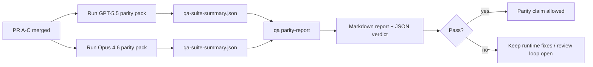

---
read_when:
    - Revisando a série de PRs de paridade GPT-5.5 / Codex
    - Mantendo a arquitetura agentiva de seis contratos que sustenta o programa de paridade
summary: Como revisar o programa de paridade GPT-5.5 / Codex como quatro unidades de merge
title: Notas de mantenedor sobre a paridade GPT-5.5 / Codex
x-i18n:
    generated_at: "2026-05-06T05:57:43Z"
    model: gpt-5.5
    provider: openai
    source_hash: 5752b4610f8b0d70b80d880ea10df75478b5f85ca431cdb73d3b61d745b23356
    source_path: help/gpt55-codex-agentic-parity-maintainers.md
    workflow: 16
---

Esta nota explica como revisar o programa de paridade GPT-5.5 / Codex como quatro unidades de merge sem perder a arquitetura original de seis contratos.

## Unidades de merge

### PR A: execução agêntica estrita

Responsável por:

- `executionContract`
- acompanhamento no mesmo turno priorizando GPT-5
- `update_plan` como acompanhamento de progresso não terminal
- estados bloqueados explícitos em vez de paradas silenciosas apenas com plano

Não é responsável por:

- classificação de falha de auth/runtime
- veracidade de permissões
- redesign de replay/continuação
- benchmarking de paridade

### PR B: veracidade de runtime

Responsável por:

- correção de escopo OAuth do Codex
- classificação tipada de falhas de provider/runtime
- disponibilidade verdadeira de `/elevated full` e motivos de bloqueio

Não é responsável por:

- normalização de schema de ferramentas
- estado de replay/liveness
- bloqueio por benchmark

### PR C: correção de execução

Responsável por:

- compatibilidade de ferramentas OpenAI/Codex de propriedade do provider
- tratamento de schema estrito sem parâmetros
- exposição de replay inválido
- visibilidade de estado de tarefa longa pausada, bloqueada e abandonada

Não é responsável por:

- continuação autoeleita
- comportamento genérico de dialeto Codex fora dos hooks do provider
- bloqueio por benchmark

### PR D: harness de paridade

Responsável por:

- pacote de cenários da primeira onda GPT-5.5 vs Opus 4.6
- documentação de paridade
- relatório de paridade e mecânica de gate de release

Não é responsável por:

- mudanças de comportamento de runtime fora do QA-lab
- simulação de auth/proxy/DNS dentro do harness

## Mapeamento de volta aos seis contratos originais

| Contrato original                        | Unidade de merge |
| ---------------------------------------- | ---------------- |
| Correção de transport/auth do provider   | PR B             |
| Compatibilidade de contrato/schema de ferramenta | PR C      |
| Execução no mesmo turno                  | PR A             |
| Veracidade de permissões                 | PR B             |
| Correção de replay/continuação/liveness  | PR C             |
| Gate de benchmark/release                | PR D             |

## Ordem de revisão

1. PR A
2. PR B
3. PR C
4. PR D

PR D é a camada de prova. Ela não deve ser o motivo para atrasar PRs de correção de runtime.

## O que procurar

### PR A

- execuções GPT-5 agem ou falham fechadas em vez de parar em comentários
- `update_plan` não parece mais progresso por si só
- o comportamento continua priorizando GPT-5 e com escopo de Pi embarcado

### PR B

- falhas de auth/proxy/runtime deixam de colapsar em tratamento genérico de "modelo falhou"
- `/elevated full` só é descrito como disponível quando realmente está disponível
- motivos de bloqueio ficam visíveis tanto para o modelo quanto para o runtime voltado ao usuário

### PR C

- registro estrito de ferramentas OpenAI/Codex se comporta de forma previsível
- ferramentas sem parâmetros não falham em verificações de schema estrito
- resultados de replay e Compaction preservam estado de liveness verdadeiro

### PR D

- o pacote de cenários é compreensível e reproduzível
- o pacote inclui uma lane mutante de segurança de replay, não apenas fluxos somente leitura
- relatórios são legíveis por humanos e automação
- alegações de paridade são respaldadas por evidências, não anedóticas

Artefatos esperados do PR D:

- `qa-suite-report.md` / `qa-suite-summary.json` para cada execução de modelo
- `qa-agentic-parity-report.md` com comparação agregada e por cenário
- `qa-agentic-parity-summary.json` com um veredito legível por máquina

## Gate de release

Não alegue paridade ou superioridade do GPT-5.5 sobre o Opus 4.6 até que:

- PR A, PR B e PR C estejam mesclados
- PR D execute o pacote de paridade da primeira onda sem falhas
- suítes de regressão de veracidade de runtime permaneçam verdes
- o relatório de paridade não mostre casos de falso sucesso nem regressão no comportamento de parada

O harness de paridade não é a única fonte de evidências. Mantenha esta divisão explícita na revisão:

- PR D é responsável pela comparação baseada em cenários GPT-5.5 vs Opus 4.6
- as suítes determinísticas do PR B ainda são responsáveis por evidências de auth/proxy/DNS e veracidade de acesso completo

## Fluxo rápido de merge para mantenedores

Use isto quando estiver pronto para fazer landing de um PR de paridade e quiser uma sequência repetível e de baixo risco.

1. Confirme que o nível de evidência foi atendido antes do merge:
   - sintoma reproduzível ou teste falhando
   - causa raiz verificada no código tocado
   - correção no caminho implicado
   - teste de regressão ou nota explícita de verificação manual
2. Faça triagem/rotulagem antes do merge:
   - aplique quaisquer labels de fechamento automático `r:*` quando o PR não deve fazer landing
   - mantenha candidatos a merge sem threads bloqueadoras não resolvidas
3. Valide localmente na superfície tocada:
   - `pnpm check:changed`
   - `pnpm test:changed` quando testes mudaram ou a confiança na correção de bug depende de cobertura de testes
4. Faça landing com o fluxo padrão de mantenedores (processo `/landpr`) e depois verifique:
   - comportamento de fechamento automático de issues vinculadas
   - CI e status pós-merge em `main`
5. Após o landing, execute busca de duplicados para PRs/issues abertos relacionados e feche apenas com uma referência canônica.

Se qualquer um dos itens do nível de evidência estiver faltando, solicite mudanças em vez de fazer merge.

## Mapa de objetivo para evidência

| Item do gate de conclusão                | Responsável primário | Artefato de revisão                                                   |
| ---------------------------------------- | -------------------- | --------------------------------------------------------------------- |
| Sem travamentos apenas em plano          | PR A                 | testes de runtime agêntico estrito e `approval-turn-tool-followthrough` |
| Sem progresso falso ou conclusão falsa de ferramenta | PR A + PR D | contagem de falso sucesso de paridade mais detalhes do relatório por cenário |
| Sem orientação falsa de `/elevated full` | PR B                 | suítes determinísticas de veracidade de runtime                       |
| Falhas de replay/liveness permanecem explícitas | PR C + PR D  | suítes de lifecycle/replay mais `compaction-retry-mutating-tool`      |
| GPT-5.5 iguala ou supera Opus 4.6        | PR D                 | `qa-agentic-parity-report.md` e `qa-agentic-parity-summary.json`      |

## Atalho para revisores: antes vs depois

| Problema visível ao usuário antes                         | Sinal de revisão depois                                                               |
| --------------------------------------------------------- | -------------------------------------------------------------------------------------- |
| GPT-5.5 parava depois do planejamento                     | PR A mostra comportamento de agir ou bloquear em vez de conclusão apenas com comentários |
| Uso de ferramentas parecia frágil com schemas estritos OpenAI/Codex | PR C mantém previsíveis o registro de ferramentas e a invocação sem parâmetros |
| Dicas de `/elevated full` às vezes eram enganosas         | PR B vincula a orientação à capacidade real de runtime e aos motivos de bloqueio       |
| Tarefas longas podiam desaparecer em ambiguidade de replay/Compaction | PR C emite estado explícito pausado, bloqueado, abandonado e de replay inválido |
| Alegações de paridade eram anedóticas                     | PR D produz um relatório mais veredito JSON com a mesma cobertura de cenários em ambos os modelos |

## Relacionado

- [Paridade agêntica GPT-5.5 / Codex](/pt-BR/help/gpt55-codex-agentic-parity)
