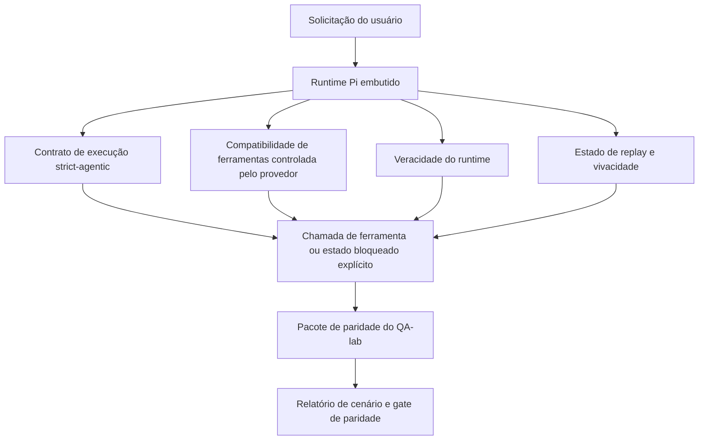
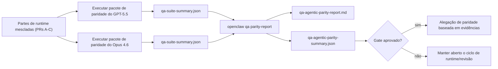

---
read_when:
    - Depuração do comportamento agentic do GPT-5.5 ou do Codex
    - Comparação do comportamento agentic do OpenClaw entre modelos de ponta
    - Revisão das correções de strict-agentic, schema de ferramentas, elevação e replay
summary: Como o OpenClaw fecha lacunas de execução agentic para GPT-5.5 e modelos no estilo Codex
title: Paridade agentic do GPT-5.5 / Codex
x-i18n:
    generated_at: "2026-04-25T18:19:35Z"
    model: gpt-5.4
    provider: openai
    source_hash: 8a3b9375cd9e9d95855c4a1135953e00fd7a939e52fb7b75342da3bde2d83fe1
    source_path: help/gpt55-codex-agentic-parity.md
    workflow: 15
---

# Paridade agentic de GPT-5.5 / Codex no OpenClaw

O OpenClaw já funcionava bem com modelos de ponta que usam ferramentas, mas os modelos GPT-5.5 e no estilo Codex ainda apresentavam desempenho inferior em alguns aspectos práticos:

- podiam parar depois de planejar em vez de fazer o trabalho
- podiam usar incorretamente schemas estritos de ferramentas do OpenAI/Codex
- podiam pedir `/elevated full` mesmo quando o acesso total era impossível
- podiam perder o estado de tarefas longas durante replay ou Compaction
- alegações de paridade em relação ao Claude Opus 4.6 se baseavam em relatos anedóticos, e não em cenários repetíveis

Este programa de paridade corrige essas lacunas em quatro partes revisáveis.

## O que mudou

### PR A: execução strict-agentic

Esta parte adiciona um contrato de execução `strict-agentic` opcional para execuções de GPT-5 embutido no Pi.

Quando ativado, o OpenClaw deixa de aceitar turnos apenas com plano como conclusão “boa o suficiente”. Se o modelo apenas disser o que pretende fazer e não usar ferramentas nem avançar de fato, o OpenClaw tenta novamente com uma orientação para agir agora e depois falha de forma fechada com um estado bloqueado explícito, em vez de encerrar a tarefa silenciosamente.

Isso melhora a experiência com GPT-5.5 principalmente em:

- respostas curtas do tipo “ok, faça isso”
- tarefas de código em que o primeiro passo é óbvio
- fluxos em que `update_plan` deve servir para acompanhamento de progresso, e não como texto de preenchimento

### PR B: veracidade do runtime

Esta parte faz o OpenClaw dizer a verdade sobre duas coisas:

- por que a chamada do provedor/runtime falhou
- se `/elevated full` está realmente disponível

Isso significa que o GPT-5.5 recebe sinais de runtime melhores para escopo ausente, falhas na renovação de autenticação, falhas de autenticação HTML 403, problemas de proxy, falhas de DNS ou timeout e modos de acesso total bloqueados. O modelo fica menos propenso a alucinar a correção errada ou continuar pedindo um modo de permissão que o runtime não consegue fornecer.

### PR C: correção da execução

Esta parte melhora dois tipos de correção:

- compatibilidade de schema de ferramentas OpenAI/Codex controlada pelo provedor
- visibilidade de replay e vivacidade de tarefas longas

O trabalho de compatibilidade de ferramentas reduz o atrito de schema para registro estrito de ferramentas OpenAI/Codex, especialmente em torno de ferramentas sem parâmetros e expectativas estritas de objeto na raiz. O trabalho de replay/vivacidade torna tarefas longas mais observáveis, de modo que estados pausado, bloqueado e abandonado ficam visíveis em vez de desaparecerem em texto genérico de falha.

### PR D: harness de paridade

Esta parte adiciona o primeiro pacote de paridade do QA-lab, para que GPT-5.5 e Opus 4.6 possam ser exercitados nos mesmos cenários e comparados usando evidências compartilhadas.

O pacote de paridade é a camada de prova. Ele não altera o comportamento do runtime por si só.

Depois de ter dois artefatos `qa-suite-summary.json`, gere a comparação de gate de release com:

```bash
pnpm openclaw qa parity-report \
  --repo-root . \
  --candidate-summary .artifacts/qa-e2e/gpt55/qa-suite-summary.json \
  --baseline-summary .artifacts/qa-e2e/opus46/qa-suite-summary.json \
  --output-dir .artifacts/qa-e2e/parity
```

Esse comando grava:

- um relatório Markdown legível por humanos
- um veredito JSON legível por máquina
- um resultado explícito de gate `pass` / `fail`

## Por que isso melhora o GPT-5.5 na prática

Antes desse trabalho, o GPT-5.5 no OpenClaw podia parecer menos agentic do que o Opus em sessões reais de coding porque o runtime tolerava comportamentos que são especialmente prejudiciais para modelos no estilo GPT-5:

- turnos apenas com comentários
- atrito de schema em torno de ferramentas
- feedback vago sobre permissões
- falhas silenciosas de replay ou Compaction

O objetivo não é fazer o GPT-5.5 imitar o Opus. O objetivo é dar ao GPT-5.5 um contrato de runtime que recompense progresso real, forneça semântica mais limpa para ferramentas e permissões e transforme modos de falha em estados explícitos legíveis por máquina e por humanos.

Isso muda a experiência do usuário de:

- “o modelo tinha um bom plano, mas parou”

para:

- “o modelo agiu, ou o OpenClaw mostrou o motivo exato pelo qual ele não pôde agir”

## Antes vs depois para usuários de GPT-5.5

| Antes deste programa                                                                          | Depois das PRs A-D                                                                       |
| --------------------------------------------------------------------------------------------- | ---------------------------------------------------------------------------------------- |
| O GPT-5.5 podia parar depois de um plano razoável sem executar o próximo passo com ferramenta | A PR A transforma “apenas plano” em “aja agora ou mostre um estado bloqueado”           |
| Schemas estritos de ferramentas podiam rejeitar ferramentas sem parâmetros ou no formato OpenAI/Codex de formas confusas | A PR C torna o registro e a invocação de ferramentas controlados pelo provedor mais previsíveis |
| A orientação de `/elevated full` podia ser vaga ou incorreta em runtimes bloqueados          | A PR B dá ao GPT-5.5 e ao usuário dicas verdadeiras de runtime e permissão               |
| Falhas de replay ou Compaction podiam dar a impressão de que a tarefa desapareceu silenciosamente | A PR C mostra explicitamente resultados pausados, bloqueados, abandonados e inválidos para replay |
| “O GPT-5.5 parece pior que o Opus” era basicamente anedótico                                 | A PR D transforma isso no mesmo pacote de cenários, nas mesmas métricas e em um gate rígido de pass/fail |

## Arquitetura



## Fluxo de release



## Pacote de cenários

A primeira onda do pacote de paridade cobre atualmente cinco cenários:

### `approval-turn-tool-followthrough`

Verifica se o modelo não para em “vou fazer isso” após uma aprovação curta. Ele deve executar a primeira ação concreta no mesmo turno.

### `model-switch-tool-continuity`

Verifica se o trabalho com uso de ferramentas permanece coerente ao atravessar limites de troca de modelo/runtime, em vez de reiniciar em comentários ou perder o contexto de execução.

### `source-docs-discovery-report`

Verifica se o modelo consegue ler código-fonte e documentação, sintetizar descobertas e continuar a tarefa de forma agentic, em vez de produzir um resumo superficial e parar cedo demais.

### `image-understanding-attachment`

Verifica se tarefas de modo misto envolvendo anexos continuam acionáveis e não colapsam em narração vaga.

### `compaction-retry-mutating-tool`

Verifica se uma tarefa com uma escrita mutável real mantém a insegurança de replay explícita, em vez de parecer silenciosamente segura para replay se a execução sofrer Compaction, retry ou perda do estado de resposta sob pressão.

## Matriz de cenários

| Cenário                            | O que testa                               | Bom comportamento do GPT-5.5                                                   | Sinal de falha                                                                  |
| ---------------------------------- | ----------------------------------------- | ------------------------------------------------------------------------------ | ------------------------------------------------------------------------------- |
| `approval-turn-tool-followthrough` | Turnos curtos de aprovação após um plano  | Inicia imediatamente a primeira ação concreta com ferramenta em vez de repetir a intenção | continuação apenas com plano, sem atividade de ferramenta, ou turno bloqueado sem bloqueador real |
| `model-switch-tool-continuity`     | Troca de runtime/modelo durante uso de ferramenta | Preserva o contexto da tarefa e continua agindo de forma coerente              | reinicia em comentários, perde o contexto da ferramenta ou para após a troca    |
| `source-docs-discovery-report`     | Leitura de código-fonte + síntese + ação  | Encontra fontes, usa ferramentas e produz um relatório útil sem travar         | resumo superficial, trabalho com ferramentas ausente ou parada em turno incompleto |
| `image-understanding-attachment`   | Trabalho agentic guiado por anexo         | Interpreta o anexo, conecta-o às ferramentas e continua a tarefa               | narração vaga, anexo ignorado ou nenhuma próxima ação concreta                  |
| `compaction-retry-mutating-tool`   | Trabalho mutável sob pressão de Compaction | Executa uma escrita real e mantém a insegurança de replay explícita após o efeito colateral | a escrita mutável acontece, mas a segurança de replay é sugerida, ausente ou contraditória |

## Gate de release

O GPT-5.5 só pode ser considerado em paridade ou melhor quando o runtime mesclado passa no pacote de paridade e, ao mesmo tempo, nas regressões de veracidade do runtime.

Resultados obrigatórios:

- nenhuma paralisação apenas por plano quando a próxima ação com ferramenta estiver clara
- nenhuma conclusão falsa sem execução real
- nenhuma orientação incorreta de `/elevated full`
- nenhum abandono silencioso de replay ou Compaction
- métricas do pacote de paridade pelo menos tão fortes quanto a baseline acordada do Opus 4.6

Para o harness da primeira onda, o gate compara:

- taxa de conclusão
- taxa de parada não intencional
- taxa de chamadas válidas de ferramenta
- contagem de sucesso falso

A evidência de paridade é intencionalmente dividida em duas camadas:

- a PR D prova o comportamento GPT-5.5 vs Opus 4.6 nos mesmos cenários com QA-lab
- os conjuntos determinísticos da PR B provam veracidade de autenticação, proxy, DNS e `/elevated full` fora do harness

## Matriz de objetivo para evidência

| Item do gate de conclusão                               | PR responsável | Fonte de evidência                                                | Sinal de aprovação                                                                      |
| ------------------------------------------------------- | -------------- | ----------------------------------------------------------------- | --------------------------------------------------------------------------------------- |
| O GPT-5.5 não trava mais após planejar                  | PR A           | `approval-turn-tool-followthrough` mais suítes de runtime da PR A | turnos de aprovação disparam trabalho real ou um estado bloqueado explícito             |
| O GPT-5.5 não finge mais progresso nem conclusão falsa de ferramenta | PR A + PR D    | resultados de cenários no relatório de paridade e contagem de sucesso falso | nenhum resultado suspeito de aprovação e nenhuma conclusão apenas com comentários        |
| O GPT-5.5 não fornece mais orientação falsa de `/elevated full` | PR B           | suítes determinísticas de veracidade                              | motivos de bloqueio e dicas de acesso total permanecem precisos em relação ao runtime   |
| Falhas de replay/vivacidade permanecem explícitas       | PR C + PR D    | suítes de ciclo de vida/replay da PR C mais `compaction-retry-mutating-tool` | trabalho mutável mantém a insegurança de replay explícita em vez de desaparecer silenciosamente |
| O GPT-5.5 iguala ou supera o Opus 4.6 nas métricas acordadas | PR D           | `qa-agentic-parity-report.md` e `qa-agentic-parity-summary.json` | mesma cobertura de cenários e nenhuma regressão em conclusão, comportamento de parada ou uso válido de ferramenta |

## Como ler o veredito de paridade

Use o veredito em `qa-agentic-parity-summary.json` como a decisão final legível por máquina para o pacote de paridade da primeira onda.

- `pass` significa que o GPT-5.5 cobriu os mesmos cenários que o Opus 4.6 e não regrediu nas métricas agregadas acordadas.
- `fail` significa que pelo menos um gate rígido disparou: conclusão mais fraca, paradas não intencionais piores, uso válido de ferramenta mais fraco, qualquer caso de sucesso falso ou cobertura de cenários incompatível.
- “problema compartilhado/base de CI” não é, por si só, um resultado de paridade. Se ruído de CI fora da PR D bloquear uma execução, o veredito deve aguardar uma execução limpa do runtime mesclado em vez de ser inferido a partir de logs da época da branch.
- A veracidade de autenticação, proxy, DNS e `/elevated full` continua vindo das suítes determinísticas da PR B, então a alegação final de release precisa de ambos: um veredito de paridade aprovado da PR D e cobertura de veracidade verde da PR B.

## Quem deve ativar `strict-agentic`

Use `strict-agentic` quando:

- espera-se que o agente aja imediatamente quando o próximo passo for óbvio
- modelos GPT-5.5 ou da família Codex são o runtime principal
- você prefere estados bloqueados explícitos a respostas apenas de recapitulação “úteis”

Mantenha o contrato padrão quando:

- você quer o comportamento atual mais flexível
- você não está usando modelos da família GPT-5
- você está testando prompts em vez de imposição no runtime

## Relacionado

- [Notas de manutenção sobre paridade GPT-5.5 / Codex](/pt-BR/help/gpt55-codex-agentic-parity-maintainers)
